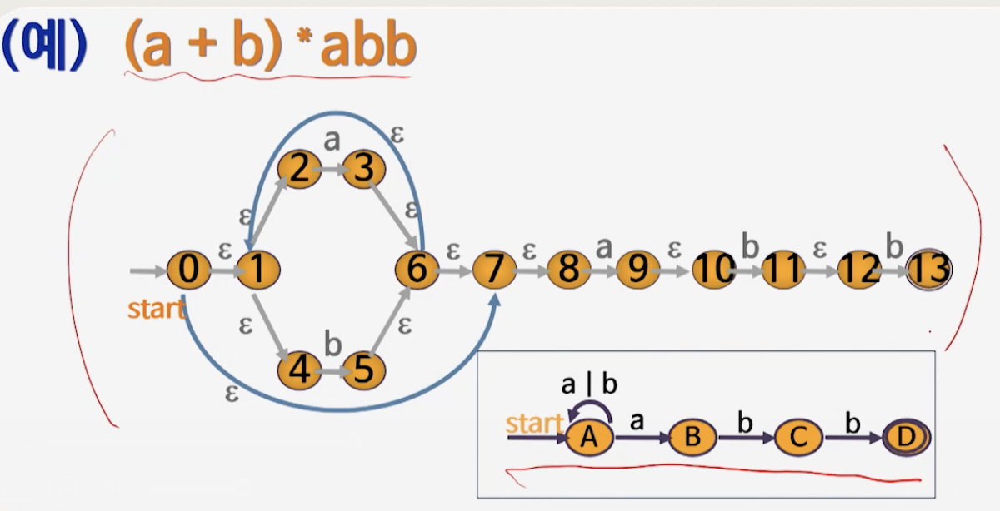

# 3강. 유한 오토마타

## 1. 유한 오토마타

### 유한 오토마타(Finite Automata)

- 프로그램 설계를 위한 수학적 모델
- 문자열이 언어의 올바른 어휘인지 판단하는 것

### 어휘분석 관련 오토마타: 유한 오토마타

식별자 `ABC := E * 3.14 + ABC / E;`

1. 첫자는 영자
2. 다음부터 영자와 숫자의 조합

### 상태전이도

- 그림 이용

  

- 형식적 표현

  

  

## 2. 정규표현과 유한오토마타

### 정규 표현 → 유한오토마타

### 예시

### 유한오토마타의 단순화

- 다른 점은, 엡실론

## 3. NFA와 DFA의 동치관계

### 결정적 유한오토마타(DFA)

- 하나의 입력기호에 대하여 한 개의 전이만 가능
- Deterministic Finite Automata
- 하나의 입력기호에 대해 한 개의 상태전이만 가능

### 비결정적 유한오토마타(NFA)

- Non Deterministic Finite Automata
- 구현이 복잡하고 성능 저하
- 하나의 입력기호에 대해 **두 개 이상의 상태 전이**, e-전이가 있다

###  DFA와 NFA의 동치관계

- DFA와 NFA는 서로가 동등하다
- DFA는 NFA에 포함되므로, NFA가 DFA에 속한다는 것을 증명해 주면 됨

1. **엡실론 전이가 있다**

   

2. **두 개 이상의 상태전이가 있다**

   - 하나의 입력기호에 대해 두 개 이상의 상태 전이가 있다

     

## 4. ε-전이 NFA (DFA 증명)

### ε-전이 NFA(ε-closure)

- ε-closure(0) = {0, 1, 2, 4, 7, 8}

  - ε으로 갈 수 있는 상태들의 집합

    

- ε-closure(1) = {1, 2, 4}

  

- ε-closure(3) = {1, 2, 3, 4, 6, 7, 8}

  

- ε-closure(5) = {5, 6, 7, 8, 1, 2, 4}

  

- ε-closure(9) = {9, 10}

  

- 합집합의 경우 아래와 같이 나타낼 수 있음
  - ε-closure(0, 9) = ε-closure(0)  ∪ ε-closure(9) 
    - {0, 1, 2, 4, 7, 8, 9, 10}

### ε-전이 NFA → DFA

- ε-closure(0) = {0, 1, 2, 4, 7, 8} = A

- ε-closure(3, 9) = {3, 6, 1, 2, 4, 7, 8, 9, 10} = B

- ε-closure(5) = {5, 6, 7, 8, 1, 2, 4} = C

  

  

## 5. 두 개 이상의 상태전이 NFA

