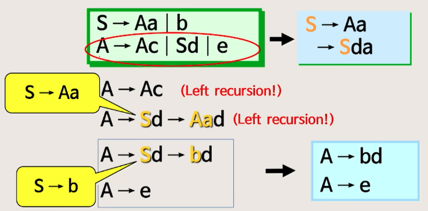
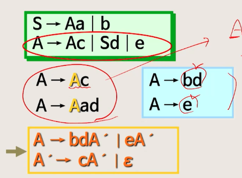
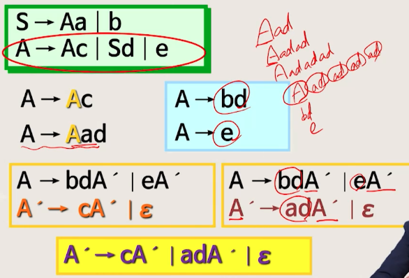
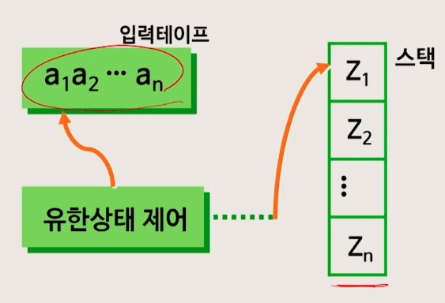
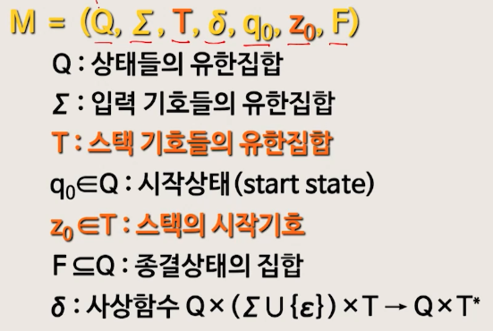

# 6강. Context-free 언어와 문법의 효율화

## 1. Context-free 언어

### 문법의 4종류(chomsky 계층구조)

- type3 정규 언어
  - 정규 문법, **어휘**분석
- type2 context-free
  - CFG, **구문**분석

### Context-Free 언어

`IF A=B THEN C:=D ELSE E:D`

- 정규언어: 어휘
  - IF, A, =, B, THEN, C, :=, D, ELSE, E, :=, D
- Context - Free 언어: 문장
  - IF - THEN - ELSE

## 2. 유도트리와 모호성

### 유도트리(derivation tree)

- 좌단유도, 우단유도
  - 앞에서부터, 뒤에서부터 유도

### 유도트리(좌단유도)

- 유도해주는 것

### 유도트리(우단유도)

- reduce 해주는 것

## 3. 불필요한 생성규칙 제거(모호성)

### 모호성

- 어떤 문장을 유도하는데 **한 가지 이상의 길**이 있는 것
- 위의 그림은 모호한 경우를 유도트리로 나타낸 것

### 모호하지 않은 문법

- 연산자 우선순위, 결합법칙을 사용해서 모호한 문법을 모호하지 않은 문법으로 변경

- 예제

  - 연산자 우선순위 

  

  - 결합법칙

    - 같은 순위의 연산자가 계속 나오면 왼쪽먼저..(좌단유도)

    

### 불필요한 생성규칙 제거(순서)

1. 터미널 기호를 생성할 수 없는 논터미널 기호

2. 시작 기호로부터 도달 불가능한 기호

## 4. ε-생성규칙 제거 / 단일 생성규칙 제거

### ε-생성규칙 제거

- S → ε 대체해서 생성될 수 있는 모든 생성규칙을 P'에 추가
- S' → S | ε

## 5. Left-factoring / Left-recursion 제거

### Backtracking

- compile 효율이 떨어진다. 따라서 이를 없애기 위한 left-factoring을 하자
  - 같은 prefix를 갖는 생성 규칙들이 존재  → backtracking 발생
- 공통된 prefix를 인수분해 한다(left-factoring)

- Left-factoring

  

  

  

### Left-Recursion 제거

- 생성 규칙이 반복적으로 적용
- 무한 루프에 빠지게 됨
  - right-recursino으로 변환

### Right-recursion

- Top-down 구문분석

### 간접 Left-recursion

- right-recursion 형태로 표현

- (예)

  

  

  

## 6. Push-down Automata

### CF 언어를 인식하는 오토마타

### PDA 정의(7개의 구성요소)

