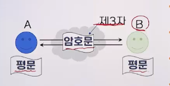

# 2강. 암호의 개념

## 1. 암호의 정의

- 두 사람이 안전하지 않은 채널을 통해 정보를 주고받더라도 제3자는 이 정보의 내용을 알 수 없도록 하는 것

- 평문(plaintext): 원래의 메시지

- 암호문(ciphertext: 코드화된 메시지
- 암호화(encryption): 평문 → 암호문
- 복호화(decryption): 암호문 → 평문 

- 키(KEY): 암호화와 복호화를 위한 가장 중요한 열쇠

## 2. 암호의 역사

### 개요

- 처음에는 주로 군사와 정치적인 목적
- 컴퓨터와 통신이 결합됨에 따라 불법 사용자의 봉쇄 또는 데이터의 위조 및 변조를 막는 수단으로 이용
- 최근에는 인터넷 뱅킹에 사용되는 공동인증서나 금융인증서, 보안키패드, 메신저의 비밀 채팅 등에 널리 이용

### 고대 암호

- 스테가노그래피(steganography)
  - 실제로 전달하고자 하는 정보 자체를 숨기는 것
  - 최초의 암호는 BC 480년경, 스파르타에서 추방되어 페르시아에 살던 데마라토스가 페르시아의 침략계획 소식을 나무판에 조각 후 밀랍을 발라 스파르타에 보낸 것
- 일반적인 암호의 요건(Kerckhoff의 원리)
  - 제3자에게 암호 알고리즘을 알려주더라도 제3자가 키를 모르면 암호를 풀 수 없다는 것을 가정
  - 스테가노그래피를 최초의 암호로 보기는 힘듦
- 두 가지 암호 방식
  - 전치법
  - 치환법

#### (1) 전치법(permutation 혹은 transposition cipher)

- 평문에 있는 문자들의 순서를 바꿈으로써 암호화하는 기법

  

- 가장 단순한 방식: 두 문자씩 앞뒤로 섞는 방법

  

- 스파르타의 봉 암호

  - 키: 봉의 굵기

  

#### (2) 치환법(substitution cipher)

- 평문의 문자들을 다른 문자로 치환함으로써 암호화하는 기법

  

- 치환 규칙에 따라 암호화 및 복호화

  

  

- 시저 암호: 평문 각 문자를 알파벳 순서상 세 문자 뒤에 위치하는 문자로 치환

  

- 시프트 암호: 평문의 각 문자를 알파벳 순서상 k번째 뒤 문자로 치환(0 <= k <= 25)

  

### 근대 암호

#### 비즈네르 암호(Vigenere cipher)

- 시프트 암호를 개선한 새로운 치환법

- 키: 여러 개의 정숫값

- 예

  

- 20세기 초반까지 플레이페어 암호, 힐 암호 등 다양한 암호방식 등장

- 20세기 들어 암호에 대한 연구가 활발하게 진행됨

  - 통신 기술의 발전, 기계식 계산기에 대한 연구
  - 두 차례의 세계대전을 통해 암호설께와 해독에 대한 필요성 증가

#### 1949 섀넌(Shannon)

- 일회성 암호체계(one-time pad)가 안전함을 증명
- 암호체계 설계의 두 가지 기본원칙 제시
  - 혼돈(confusion)
    - 평문과 암호문 사이의 상관관계를 숨김
  - 확산(diffusion)
    - 평문의 통계적 성격을 암호문 전반에 확산시켜 숨김

### 현대 암호

- 1970년대 두 가지 큰 변화 발생
  - 표준 암호 알고리즘의 등장
  - 공개키 암호 알고리즘의 등장

- 표준 암호 알고리즘의 등장
  - 컴퓨터가 점차 발전하면서 데이터 보호에 대한 필요성도 증가
  - 1977년 미국 NBS (현재 NIST)에서 표준 암호 알고리즘 공표
    - DES(Data Encryption Standard): 대칭기 암호 알고리즘
  - 2001년 새로운 표준 암호 알고리즘은 AES가 공표될 때 까지 널리 이용됨
- 공개키 암호 알고리즘의 등장
  - 1976년 디피(Diffie)와 헬먼(Hellman)이 공개키 암호의 개념을 제시
    - 공개키 암호: 암호화와 복호화에 서로 다른 키를 사용
  - 1978년 리베스트(Rivest), 샤미르(Shamir, 애들먼(Adleman)이 RSA 공개키 암호 알고리즘 개발
    - RSA: 소인수분해 문제에 기반을 둔 대표적인 공개키 암호 알고리즘

## 3.    암호의 개념

### 대칭키 암호

- 암호화와 복호화에 같은 키 하나를 사용하는 암호방식

  

- 장점

  - 암호화 복호화 속도가 빠름

- 단점

  - 키 분배 문제 존재
  - 암호화 하는 사람과 복호화 하는 사람이 둘다 키를 정해야 하는데 어떻게 나눠가질지 문제됨

- 대표적인 알고리즘: DES, AES, IDEA 등

### 대칭키 암호의 분류

#### (1) 블록 암호

- 평문을 고정된 크기의 블록으로 나누어 각 블록마다 암호화 과정을 수행하여 블록 단위로 암호문을 얻는 대칭키 암호 방식

#### (2) 스트림 암호

- 평문과 같은 길이의 키 스트림을 생성하여 평문과 키를 비트 단위로 XOR하여 암호문을 얻는 대칭키 암호 방식

  

## 4. 공개키 암호의 개념

### 공개키 암호

- 암호화와 복호화에 두 개의 서로 다른 키를 사용하는 암호방식

  

- 공개키
  - 누구나 공개키를 이용하여 암호화 가능
- 개인키
  - 오직 자신만 개인키를 이용하여 복호화 가능
- 장점
  - 키 관리 쉬움, 키 분배 문제 해결
- 단점
  - 대칭키 암호에 비해 속도가 느림
- 대표적인 알고리즘
  - RSA, ECC, ElGamal 등

