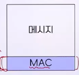
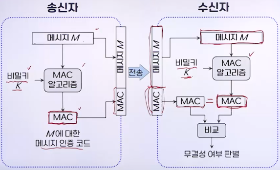
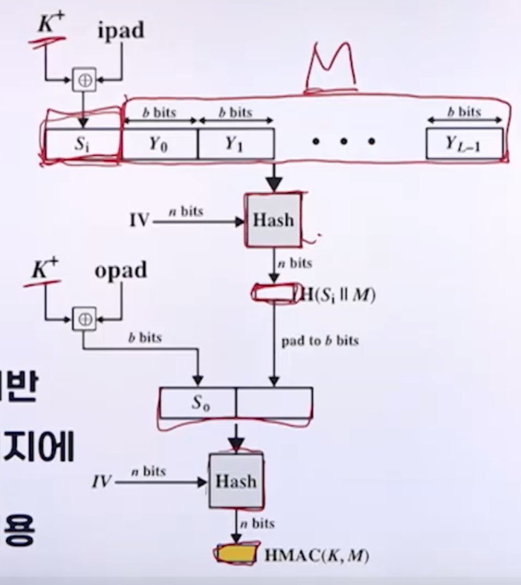
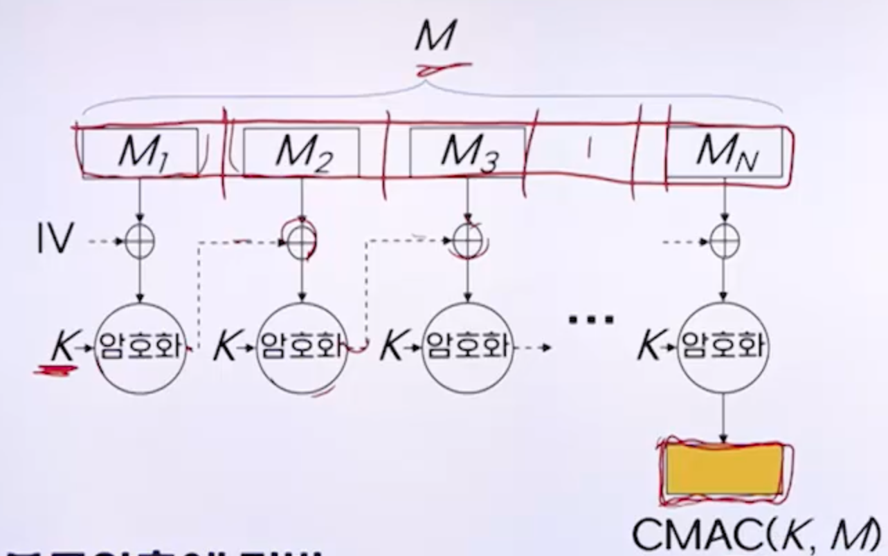

# 3강. 인증

## 1. 인증의 개념

### 인증의 개념

- 어떤 실체가 정말 그 실체가 맞는지 확인하는 과정
  - 실체: 메시지, 사용자, 출처, 장치 등

## 2. 메시지 인증

### 메시지 인증의 개념

- 수신된 메시지에 대한 인증
- 메시지의 내용이 **전송 도중 불법적으로 변경되지 않고** 정확하고 완전하게 수신되었는지 확인하는 것
- 메시지에 대한 **무결성** 확인

### 메시지 인증 코드(MAC)

- Message Authentication Code

- 메시지 인증을 위한 부가적인 정보

  

- 송신자는 메시지를 보낼 때 MAC을 함께 전송

- 수신자는 받은 메시지의 변조 여부를 MAC을 이용해 확인

### 메시지 인증 방법

### 메시지 인증 코드의 특징

- 비밀키 이용
  - 제3자가 메시지의 내용을 위, 변조할 수 없음
- **기밀성은 제공 안함**
  - MAC와 메시지는 독립적인 부분
- 작은 크기
  - 메시지 크기와는 무관(고정된 크기)

### 메시지 인증 알고리즘

- HMAC(Hash-based MAC)

  

  - 해시 함수에 기반
  - 비밀키를 메시지에 덧붙인 후 해시함수를 적용

- CMAC(Cipher-based MAC)

  

  - 블록 암호에 기반
  - CBC 모드를 메시지에 적용

## 3. 사용자 인증

### 사용자 인증의 개념

- 시스템에 접근하려는 사용자에 대한 인증
  - 시스템: 서버, PC, 스마트폰, 홈페이지, 건물이나 사무실의 전자식 잠금장치 등
- 해당 사용자가 정말 그 사용자가 맞는지 확인하는 과정
- 비밀번호 방식, 생체인식 방식, 토큰 방식, 2단계 인증 등

### 비밀번호 방식

- 가장 일반적인 방식의 사용자 인증

- 사용자가 입력하는 비밀번호가 시스템에 저장된 정보와 일치하는지 여부로 인증

- 사용자 ID와 비밀번호를 함께 이용하는 경우

  - 비밀번호로 인증하게 되는 사용자: 사용자ID
  - 사용자 ID와 비밀번호의 쌍을 시스템은 알고 있어야 함

- **비밀번호 저장 방법**

  

  - **비밀번호를 해시코드로 저장**
    - 시스템에 저장된 비밀번호가 유출되는 것을 대비

### 생체인식 방식

- 개개인의 고유한 정보인 특정 생체정보를 이용하는 사용자 인증
  - 생체정보: 지문, 홍채, 얼굴, 음성, 손등이나 손바닥 혈관 등
- 스마트폰, 노트북 등에 생체인식 모듈이 포함되어 장치에서의 사용자 인증 뿐만 아니라 결제나 앱 접속시에도 활용됨
- 사용자의 생체정보를 미리 시스템에 저장해 두어야 함

### 토큰 방식

- 사용자가 소유하고 있는 특정한 정보를 이용하는 사용자 인증
  - 토큰: 보안 토큰, 스마트 카드, 실물키, 휴대전화 등
- 토큰 안에 저장된 정보를 통해 얻을 수 있는 결괏값 이용
  - 예: 휴대전화로 일회용 인증 코드를 받아 이를 확인

### 2단계 인증(2FA) 방식

- **Two-Factor Authentication**
- 사용자가 **알고있는 정보와 소유하고 있는 정보를 모두 이용**하는 사용자 인증
  - 알고 있는 정보: 비밀번호 등
  - 소유하고 있는 정보: 토큰 등
- 서로 다른 성격의 정보를 혼합하여 이용함으로써 좀 더 엄밀한 사용자 인증 가능
- 다중요소 인증(MFA: Multi-Factor Authentication)
  - 알고 있는 정보, 소유하고 있는 정보, 고유한 속성 중 둘 이상 사용하여 사용자 인증