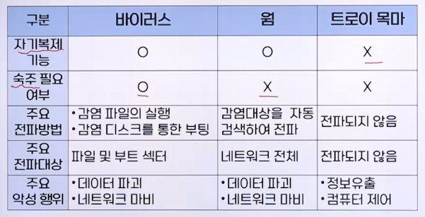

# 4강. 사이버 공격

## 1. 사이버 공격의 개요

### 사이버 공격

- 인터넷을 통해 다른 컴퓨터에 접속하여 상대방에게 손상을 입히려는 행동
  - 상대방: 국가, 기업, 개인 등
- 기본적인 사이버 공격 방식
  - 네트워크상이나 로컬호스트상에서 **시스템의 설정이 잘못된 것**을 이용해 관리자 권한 획득
- 기술의 발전에 따라 사이버 공격 방식도 다양화
  - 네트워크상의 패킷을 조작하는 공격
  - 상용 웹사이트의 취약점을 이용한 공격
  - 스마트폰의 보급에 따른 무선환경에서의 공격

## 2. 다양한 사이버 공격

### 다양한 사이버 공격

- 악성코드
- 네트워크 공격
- 스팸 메일
- 피싱

#### (1) 악성코드(Malicious Code, Malware)

- 악의적인 용도로 사용될 수 있는 코드가 심어진 유해 프로그램의 총칭
  - 악의적의 용도: 시스템 손상, 전파, 정보유출 등
- 악성코드 종류
  - 바이러스, 웜, 트로이 목마, 백도어, 스파이웨어, 랜섬웨어 등
- 무분별한 인터넷 사용으로 인한 감염이 많음
- 예방 방법
  - 의심스러운 웹사이트 방문 자제
  - 수상한 이메일 읽지 않기
  - 문자나 메신저로 오는 인터넷 주소 함부로 접속하지 않기
  - 이메일, 문자, 메신저로 받는 첨부 파일 함부로 열지 않기
  - 보안등급 설정, 불법복제 금지
  - 통합보안 프로그램 설치 및 최신 버전 유지, 실시간 감시기능 사용 등

#### (2) 바이러스(Virus, Computer Virus)

- 시스템이나 사용자의 파일에 자신을 복제하고 그 컴퓨터 시스템 내에서 증식하거나 시스템을 파괴하는 악성코드
- 일반적인 특성
  - 자기복제
  - 저수준 언어 사용
  - 다양한 변종
  - 지능화 및 악성화
- 동작원리
  - 감염된 프로그램을 사용자가 실행하면 바이러스 활동 시작
  - 실행된 바이러스는 감염시킬 대상 파일을 찾음
  - 찾은 대상 파일이 이미 감염된 파일인지 확인
  - 감염되지 않았다면 대상 파일 앞 혹은 뒷부분에 자신의 코드를 삽입하여 감염시킴
  - 바이러스로서의 코드 실행이 끝나면 원래 프로그램이 수행해야 할 작업을 수행
  - 메모리에 있는 바이러스는 다른 파일에 대한 감염을 계속 수행

#### (3) 웜(Worm)

- 컴퓨터의 취약점을 찾아 **네트워크**를 통해 **스스로 감염**되는 악성코드
- 빠른 전파력으로 인해 피해 시스템이 기하급수적으로 증가
- 대표적인 사례
  - 1988년 모리스 웜: sendmail의 보안 취약점 이용
  - 1999년 밀레니엄 인터넷 웜: 다양한 보안 취약점 이용

#### (4) 트로이 목마(Trojan Horse)

- 정상적인 기능을 하는 프로그램으로 가장하여 프로그램 내에 숨어서 의도하지 않은 기능을 수행하는 악성코드
- 사용자들이 거부감 없이 설치하도록 유도
- 실행 시 표면적으로 드러나는 기능과 함께 비인된 기능 수행
  - 개인정보 유출
  - 감염 대상 원격 조정 등

### 바이러스, 웜, 트로이 목마 비교

#### (5) 백도어(Backdoor)

- 공격자가 시스템에 침입한 후, 이후에도 손쉽게 피해 시스템에 대한 접근권한을 획득하기 위한 용도로 설치한 악성코드
- **시스템 설계자나 관리자에 의해 고의로 남겨진 시스템의 보안 허점**
  - 사용자 인증 등 정상적인 절차 회피
  - 디버깅 시 개발자에게 인증 및 셋업 시간 등을 단축
- 개발 완료 후 삭제되지 않은 백도어가 다른 사용자에게 발견되어 악용될 경우 대단히 위험

#### (6) 스파이웨어(Spyware)

- 다른 사람의 컴퓨터에 설치되어 개인정보를 빼 가는 악성코드
- 사용자가 특정 웹 페이지에 접속하거나 웹페이지와 관련된 소프트웨어를 임의로 혹은 사용자 동의로 설치할 때 함꼐 설치되는 경우가 많음
- 초기에는 정보수집을 위해 제작되었지만, 점차 정보유출 등의 악의적인 목적으로 사용
- **악성코드에 감염됐다는 허위 메시지**를 보여주고, **치료를 유도하는 허위 안티 스파이웨어**도 존재

#### (7) 랜섬웨어(Ransomware) 

- 사용자의 중요한 정보를 인질로 삼아 금전을 요구하는 악성코드
  - 사용자의 문서 파일이나 그림 파일 등을 암호화
  - 암호를 풀기 위해서는 비트코인 등으로 송금하도록 유도
- 2010년대 중반부터 유행
- 키를 모르면 쉽게 풀 수 없는 안전한 암호 알고리즘 이용

### 네트워크 공격

#### (1) 스캐닝(Scanning)

- 순수한 의미의 스캐닝은 그 자체로 공격으로 보기는 어려우나 실제적인 공격을 위한 사전 정보수집 활용의 요도로 악용
- 공격대상 호스트나 네트워크에 대한 취약점을 발견해 내기 위한 도구로 사용됨
- 스캐닝 도구: Nmap, Acunetix 등
- 예방
  - 시스템 관리자는 미리 자신의 시스템  네트워크의 보안 취약점을 점검
  - 발견된 취약점에 대한 조치를 취해야 함

#### (2) 스푸핑(Spoofing)

- 공격자의 제어하에 있는 호스트를 피해(victim)호스트가 신뢰하는 호스트로 가장
- 이를 이용하여 피해 호스트로부터 생성되는 정보를 수집하거나 가로채는 방식의 공격
- IP 스푸핑, DNS 스푸핑, web 스푸핑, ARP 스푸핑 등
  - ARP 프로토콜: IP와 MAC 주소를 매핑 시켜주는 프로토콜

#### (3) 스니핑(Sniffing)

- 네트워크상의 데이터를 도청하는 행위
- Passive 스니핑
  - 패킷 내의 정보를 **조작 없이 단순히 도청**
  - 무차별 모드(promiscuous mode) 이용
- Active 스니핑
  - 공격대상자들의 **패킷 방향을 조작**하여 내용을 도청하거나 변조하는 방식
  - ARP 스푸핑 이용

#### (4) 서비스 거부(Dos) 공격

- Denial of Service
- 특정 서비스나 자원의 **가용성을 떨어뜨리는** 결과를 초래하는 유형의 공격에 대한 통칭
- 대량의 데이터를 전송하거나 무수히 많은 네트워크 연결 요청을 하는 등의 방법 이용
- SYN 플러딩(flooding) 
  - 반열림(half-open) TCP 연결을 생성함으로써 시스템을 서비스 거부 상태로 만드는 공격

#### (5) 분산 서비스 거부(DDoS) 공격

- Distributed Denial of Service
- 공격 방법
  - **분산된 여러 호스트**를 미리 감염시켜 **공격 데몬** 설치
  - 공격자는 특정 목표에 대한 공격 명령을 원격에서 이들 데몬에 내림
  - **다수가 동시에 목표에 대한 서비스 거부 공격 수행**

### 기타

#### 스팸 메일(Spam Mail)

- 불특정 다수를 대상으로 일방적, 대량으로 전달되는 이메일
- 광고, 홍보, 비방 등의 목적으로 이용
- 탐지 방법
  - DNS를 이용한 방법
    - 송신자의 이메일 주소 도메인의 진위 확인
    - 정확도가 뛰어나지만, DNS 변경 및 이메일 송수신 절차 변경 필요
  - 통계 기법을 이용한 방법
    - 스팸 메일에 자주 포함되는 단어와 정상 메일에 자주 포함되는 단어를 분류하고 통계기법을 사용하여 가중치 부여

#### 피싱(Phishing)

- 유명한 금융기관이나 공신력 있는 업체의 이름을 사칭하여 이메일을 보내 수신자가 믿도록 하고, 수신자로부터 개인정보나 금융정보를 얻어 내 범죄수단으로 악용하는 행위
- 피싱 사이트 활용
  - 금융기관이나 공공기관 사이트처럼 만든 피싱 사이트로 수신자가 들어오게 함
  - 수신자는 자신이 접속한 사이트가 실제 사이트인지 제대로 확인하지 않은 상태에서 민감한 개인정보를 공격자에게 전달할 수 있음
- 예방
  - 이메일 내부에 존재하는 하이퍼링크 불허
- 파밍(pharming), 보이스 피싱, 스미싱(smishing) 등 다양한 형태의 피싱 공격
  - 파밍: **사용자 PC의 도메인 정보를 미리 조작**하여 사용자가 아무리 URL주소를 주의 깊게 살펴봐도 속게 됨

## 3. 최근의 사이버 공격 방법

### 최근의 사이버 공격 방법

- 효율적인 공격을 위해 에이전트화, 분산화, 자동화, 은닉화가 상호 의존적으로 발전
  - 대표적인 예: 분산 서비스 거부(DDoS) 공격
- APT(Advanced Persistent Threat)
  - 지능형 지속공격
  - 특정 대상을 목표로 다양한 공격기술을 이용해 은밀하게 **지속적**으로 공격하는 행위
  - 특징
    - 목적성
      - 목표로 삼은 공격 대상에 맞춰 여러가지 사이버 공격 방법을 적절히 활용
    - 지속성
      - 성공할 때까지 상당히 오랜 시간에 걸쳐 공격 시도(몇 달 또는 몇 년)
    - 은밀성
      - 오랜 기간 공격을 시도함에도 탐지되지 않기 위해 공격은 최대한 은밀하게 진행