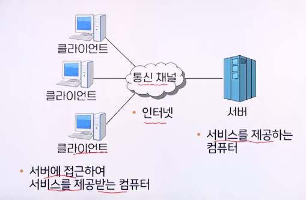
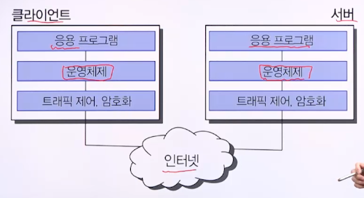

# 5강. 서버 보안

## 01. 서버 보안의 개요

### 일반적인 정보 시스템

### 서버/클라이언트 구조

### 인터넷을 통한 공격에 대한 방어지점

- 응용 프로그램 계층
  - 서버 프로그램은 종종 백도어나 버그 같은 취약성을 가짐
  - 이러한 보안취약성을 이용하여 운영체제에 대한 접근권한을 획득
- 운영체제 계층
  - 보안의 가장 근본적인 레벨로 컴퓨터의 모든 행위를 관장
  - 대부분의 공격목적은 운영체제의 제어권을 확보하는 것
  - 

## 02. 서버의 침입 및 정보유출 단계

## 03. 서버 공격의 유형

## 04. 서버 보안 대책

