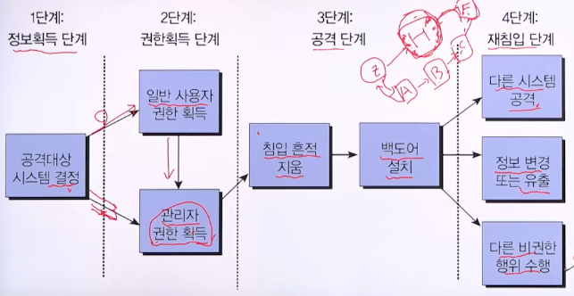

# 5강. 서버 보안

## 01. 서버 보안의 개요

### 일반적인 정보 시스템

### 서버/클라이언트 구조

### 인터넷을 통한 공격에 대한 방어지점

- 응용 프로그램 계층
  - 서버 프로그램은 종종 백도어나 버그 같은 취약성을 가짐
  - 이러한 보안취약성을 이용하여 운영체제에 대한 접근권한을 획득
- 운영체제 계층
  - 보안의 가장 근본적인 레벨로 컴퓨터의 모든 행위를 관장
  - 대부분의 공격목적은 운영체제의 제어권을 확보하는 것
- 네트워크 제어
  - 시스템의 in/out 트래픽을 제어하여 잠재적으로 유해한 네트워크 트래픽을 줄일 수 있음
  - 운영체제 내 또는 별도의 독립된 장비에서 수행될 수 있음
- 전송 데이터 제어
  - 인터넷을 통해 전송되는 정보는 누구나 열람 가능
  - 전송자는 정보를 암호화하여 전송한 뒤 수신자 쪽에서 복호화하여 확인하는 것이 바람직

## 02. 서버의 침입 및 정보유출 단계

### 서버의 침입 및 정보유출 단계

## 03. 서버 공격의 유형

### 계정 크랙 공격

- 공격자가 서버에 접속할 수 있는 계정의 ID와 패스워드를 알아내는 공격
- **전수 공격(Brute Force Attack)**
  - 계정의 ID, 패스워드를 자동 조합하여 크랙하는 공격
  - 사용할 수 있는 문자의 종류와 길이 제한에 맞게 시도
    - 숫자, 4글자 -> 0000부터 9999까지 자동조합
  - 많은 시간 소요
- **사전 공격(Dictionary Attack)**
  - ID와 패스워드가 될 가능성이 있는 단어를 사전 파일로 만들어 놓고 사전 파일의 단어를 대입하여 크랙하는 공격
  - 사전 파일: 서버를 이용하는 사람의 다양한 정보로 생성
    - 이름, 생년월일, 전화번호, 가족정보, 차량정보, 취미 등
  - 사전 파일의 단어를 다양하게 조합하여 시도
    - Kim, 010203 -> kim01, kim0203 등
  - 전수 공격보다는 공격시간이 훨씬 단축됨

### 네트워크 공격

- 스푸핑(Spoofing)
  - IP주소, MAC 주소 등의 정보를 속임으로써 권한을 획득하여 중요 정보를 가로채고 서비스 방해까지 행하는 공격
- 스니핑(Sniffing)
  - 네트워크 패킷으로 전달되는 중요 정보를 도청하는 공격
- 서비스 거부 공격(DoS)
  - 대량의 패킷을 이용하여 네트워크를 마비시키거나 특정 서비스의 수행을 방해하는 공격

### 시스템 취약점을 이용한 공격

- 버퍼 오버플로(Buffer overflow) 공격
  - 메모리에 할당된 버퍼의 양을 초과하는 데이터를 입력하여 프로그램의 복귀주소를 조작함으로써 공격자가 원하는 코드를 실행하는 공격
  - 종류: 스택 오버플로 공격, 힙 오버플로 공격
- 스택 오버플로(Stack overflow) 공격
  - 서브 프로그램이 호출될 때 복귀주소를 스택에 저장
  - 프로그램이 변수의 할당된 공간에 저장될 데이터의 크기를 검사하지 않고 제한을 두지 않는다면
    - 데이터의 길이와 내용을 적절히 조정하여 변수공간을 넘치게 함
    - 오버플로가 발생하면 저장된 데이터는 복귀주소 영역까지 침범
    - 공격자가 원하는 특정 코드가 실행되게 할 수 있음
- 힙 오버플로(Heap overflow) 공격
  - malloc이나 new 등 메모리를 동적 할당할 때 힙 영역을 사용
  - 프로그램이 변수의 할당된 공간에 저장될 데이터의 크기를 검사하지 않고 제한을 두지 않는다면
    - 데이터의 길이와 내용을 적절히 조정하여 변수공간을 넘치게 함
    - 오버플로가 발생하면 저장된 데이터는 복귀주소 영역까지 침범
    - 공격자가 원하는 특정 코드가 실행되게 할 수 있음
- 레이스 컨디션 공격
  - 두 프로세스가 동일한 자원을 사용하기 위해 경쟁하는 것을 이용한 공격
  - 시스템 프로그램과 공격 프로그램이 경쟁상태에 이르게 하여 시스템 프로그램의 권한을 획득해 공격 프로그램이 원하는 파일에 접근 가능하게 하는 방법
- 기본 설정 오류를 이용한 공격
  - 시스템을 활용하기 위한 다양한 설정 중 잘못된 설정에 대한 공격
  - 공유 폴더나 관리자 암호를 취약한 암호로 설정하여 사용하는 경우
    - 예: 0000, 1234 등
  - IIS 웹 서버 설정에서 쓰기 권한을 부여한 경우 등

### 사회공학적인 공격

- 사람을 속여서 민감한 정보를 유출하게 하는 기술
  - 설득, 회유를 통해 자신의 신분을 속이거나, 사람들을 교묘히 조종
- 내부자와의 결탁으로 인한 정보 유출
- 내부자의 부주의로 인한 정보유출
- 피싱, 파밍 등으로 인한 정보유출

## 04. 서버 보안 대책

### 계정과 패스워드 보호

- 계정관리
  - 사용자별 또는 그룹별 접근권한 부여
  - 루트(root) 권한에 대한 사용 제한
  - 불필요한 사용자 계정 삭제
  - guest, anonymous등 특정 공개용 계정 사용 제한
  - 새로운 사용자 추가 시 일관성 있는 정책 유지
  - 잘못된 비밀번호가 일정 횟수 시도된 계정은 잠그기
- 패스워드 관리
  - 유추 가능한 단어를 패스워드로 사용하지 않기
  - 문자, 숫자, 특수문자를 조합하여 사용
  - 패스워드 길이, 사용기간 등의 정책 강화
    - 다양한 문자 조합보다, 긴 패스워드 사용이 더 중요
  - 패스워드 파일을 해시함수로 일방향 암호화하여 보관
  - 섀도(shadow) 패스워드 시스템 사용

### 시스템 접근 제어

- 접근제어 정책
  - 임의적 접근제어(DAC)
    - Discretionary Access Control
    - 관리자, 혹은 자원 소유자가 보안 관리자의 개입 없이 자율적 판단에 따라 보유하고 있는 자원의 접근권한을 다른 사용자에게 부여
    - 자원의 공동 활용이 더 중요시되는 환경에 적합
    - 자원의 유출 가능성 내포
    - 접근제어 목록(ACL: Access Control List) 유지
      - 자원별로 어떤 사용자가 어떤 접근권한을 갖는지에 대한 정보 관리
  - 강제적 접근제어(MAC)
    - Mandatory Access Control
    - 각 객체에 비밀등급을, 각 사용자에 허가등급을 부여
    - 사용자가 객체에 접근할 때마다, 사전에 규정된 규칙에 근거하여 접근권한 부여
    - 규칙의 적용은 모든 사용자 및 객체에 대해 일정함
    - 객체의 소유자에 의해 접근제어 관계가 변경되지 않음
    - 정보의 기밀성이 매우 중요시되는 환경에 적합
  - 역할 기반 접근제어(RBAC)
    - Role-Based Access Control
    - 권한은 역할과 관련 있음
    - 사용자는 역할의 멤버가 됨으로써 권한을 배정받음
    - 예: 운영자 역할
      - 모든 자원에 접근 가능
      - 접근권한 변경 불가
- 최소 권한
  - Least Privilege
  - 사용자와 객체에 꼭 필요한 최소한의 권한만 부여
  - 보안에 대한 취약 요소를 줄이기 위함
  - 예: 스크립트나 바이너리
    - 주로 루트 계정만 사용하므로 기타 계정에는 권한 제거
  - 예: 리눅스의 apache 계정
    - 웹 서버만 실행하므로 다른 실행권한 제어
    - 원격 로그인 필요 없으므로 셀 사용권한 제거
- UNIX 계열의 접근제어
  - 명령어 chmod
    - 파일과 디렉터리에 대한 접근권한 변경
  - 명령어 chown
    - 파일과 디렉터리에 대한 소유자 및 소유 그룹 변경

### 파일 시스템 보호

- UNIX 계열
  - 접근 및 변경 권한을 루트로 설정
    - `~/.login`, `~/.profile`, crontab 등
  - 불필요한 파일에 설정된 SetUID, SetGID 비트 제거
  - umask 설정
- 윈도우
  - 보안 기능이 강화된 NTFS 파일 시스템 사용 권장
  - administrator 계정의 사용권한 관리

- 파일 시스템 보호 정책
  - 파일 시스템 백업 및 복구
  - 파일 시스템의 무결성 검사
    - UNIX용 tripwire등 무결성 점검도구 이용

### 시스템 파일 설정과 관리

- UNIX 계열
  - mount 테이블을 이용한 파일 시스템 관리
  - TCP-wrapper, xinetd 활용하여 호스트 접근제어 관리
  - telnet, rcp 대신 ssh, scp 사용 등
- 윈도우
  - NTFS에 대한 사용권한 설정
  - 레지스트리 원격 액세스 권한 제어 및 백업

### 운영체제의 취약점 관리

- 작업용도에 따른 시스템 파티션 분리
  - 루트 영역과 사용자 파일 시스템 분리
  - 예; /server -  웹 서버 관련 프로그램 설치 및 웹 서버 운용
  - 예: /DB - DB 파일 저장되는 디렉터리 만들어 관리
- 불필요한 서비스 중지 및 프로그램 제거
- 패치 관리

### 시스템 로그 설정과 관리

- UNIX 계열
  - syslog 통해 시스템 로그 설정
- 윈도우
  - 이벤트 뷰어 통해 시스템 로그, 응용 프로그램 로그, 보안 로그 등 관리
- 로그 파일 분석
  - 비정상적인 시간대의 접근, 실패한 로그인, 의심스러운 su 명령 등 확인

### 서버 관리자의 의무

- 시스템의 시작과 종료, 재시작 상황 이해
- 패스워드 파일 등 사용자 계정 관리 방법 이해
- 프로세스, 메모리, 디스크 등 자원 관리 방법 이해
- 네트워크 연결관리 및 상태관리 방법 이해