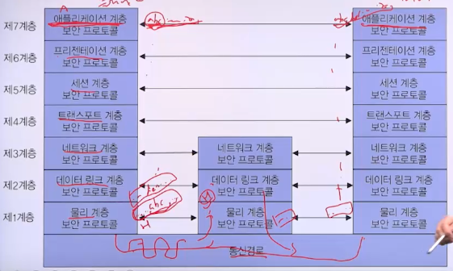
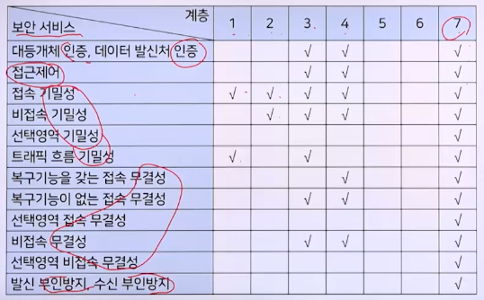

# 6강. 네트워크 보안

## 1. 네트워크 보안의 개요

### 네트워크 보안의 개요

- 컴퓨터 네트워크
  - 컴퓨터 시스템 간 상호 접속 및 정보교환의 편리한 창구
  - 컴퓨터 시슽메에 대한 불특정 다수의 접근이 가능하게 함
    - 침입자에의 한 보안사고의 위험 내포
- 네트워크 보안의 목적
  - 가정: 모든 통신회선상의 정보는 항상 획득 가능
  - 통신회선상의 정보를 보호할 수 있는 방법을 찾는 것

### 보안 위협요소

- 물리적 위협
  - 네트워크 시스템에 대한 직접적인 파괴나 손상, 도난
- 기술적 위협
  - 수동적 공격
    - 통신회선상의 정보를 무단으로 취득하는 행위
  - 능동적 공격
    - 통신회선상의 정보를 변조 및 위조하는 행위

### 네트워크 보안

- 수동적 공격과 능동적 공격에 대한 대응의 총칭
- 수동적 공격에 대한 방어
  - 통신회선에 대한 제3자의 접속시도 방지
  - 통신회선상의 데이터를 암호화

- 능동적 공격에 대한 방어
  - 통신회선상의 데이터를 암호화
  - 수신 측에서 데이터에 대한 무결성을 확인

## 2. 네트워크 보안의 목표

### 네트워크 보안의 목표

- 기밀성, 무결성, 가용성, 부인방지, 사용자의 신분확인 및 인증, 데이터 발신처 확인, 접근제어

## 3. 네트워크 보안 모델

### 네트워크 보안 모델

- 네트워크 보안 서비스
  - 네트워크 보안을 강화하기 위한 제반 서비스
  - 보안공격을 방어하기 위한 것
- 네트워크 보안 매커니즘
  - 네트워크 보안공격을 예방, 탐지, 복구하기 위한 제반 기법
  - 보안 서비스를 구성하는 기술

### OSI 7계층에서의 보안 프로토콜 구조

### 네트워크 보안 서비스

- 인증
  - 수신된 데이터의 실체가 원하는 실체라는 것을 확인
  - 대등개체 인증(peer entity authentication)
    - 통신 당사자 간의신분확인, 자격 유무 점검
    - 대등한 개체 간의 신뢰성 연결 확립 또는 전송과정에 적용
    - 패스워드 및 암호화 기법
  - 데이터 발신처 인증(data origin authentication)
    - 데이터 발신처를 확인한 후 해당 발신처의 자격 유무 제공
    - 송수신자 상호 간의 통신 없이 정보를 제공하는 네트워크(이메일)
    - 데이터 수정 등에 대한 보안은 제공 못함
- 접근제어
  - 비인가된 사용자의 위협으로부터 정보자원을 보호
  - 사용자의 시눕ㄴ이 확인된 이후에는 해당 사용자가 정보자원에 대해 어느 수준의 접근권한을 갖고 있는지 결정
  - 보호해야 할 정보자원에 대한 불법적인 접근이 이루어지지 못하게 함
- 기밀성
  - 네트워크를 통해 전달되는 정보의 내용이 노출되는 것을 방지
  - 네 가지 형태로 구분
    - 접속 기밀성(connection confidential)
    - 비접속 기밀성(connectionless confidential)
    - 선택영역 기밀성(selective field confidential)
    - 트래픽 흐름 기밀성(traffic flow confidential)
- 데이터 무결성
  - 데이터의 내용이 인가되지 않은 방식에 의해 변경 또는 삭제되는 것을 방지
  - 다섯가지 형태로 구분
    - 복구 기능을 갖는 접속 무결성(connection integrity with recovery)
    - 복구 기능이 없는 접속 무결성(connection integrity without recovery)
    - 선택영역 접속 무결성(selective field connection integrity)
    - 비접속 무결성(connectionless integrity)
    - 선택영역 비접속 무결성(selective field connectionless integrity)

## 4. TCP/IP 보안