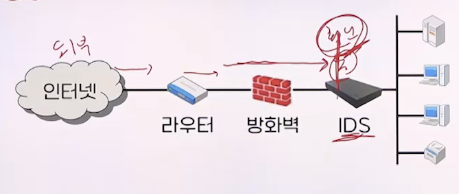
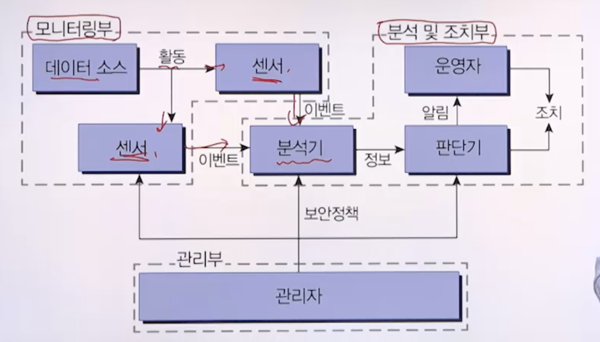

# 8강. 보안 시스템 II

## 01. 침입 탐지 시스템(IDS)

### Intrusion Detection System

- 컴퓨터가 사용하는 자원의 **기밀성, 무결성, 가용성**을 저해하는 행위를 **실시간**으로 탐지하는 시스템
- 허가받지 않은 접근이나 공격 시도를 감지하여 시스템 또는 네트워크 관리자에게 통보 

- 방화벽이 막을 수 없는 경우에도 공격을 탐지

  

- 서브넷의 시스템 해킹 시 탐지
- 해킹의 구체적 내용을 관리자에게 알려주고, 그에 따른 대응을 할 수 있도록 함

### IDS의 기능

- 사용자의 시스템 행동에 대한 모니터링 및 분석
- 시스템 설정과 취약성에 대한 감사기록
- 중요 시스템과 데이터 파일에 대한 무결성 평가
- **알려진 공격에 대한 행위 패턴 인식**
- 비정상적 행위 패턴에 대한 통계적 분석 등

### 구성

- 모니터링 부
  - 정보 수집
  - 호스트, 네트워크로부터 데이터 수집
  - 수집된 데이터는 특정 패턴 검출을 위해 다음 단계로 넘어감
- 분석 및 조치부
  - 정보가공 및 축약
  - 분석 및 침입탐지
  - 보고 및 조치
- 관리부
  - 모니터링부와 분석 및 조치부에 대한 통제 및 관리
  - 보안정책 제공

### 모니터링 방법

- 응용 기반(application-based)
  - 애플리케이션 계층에서의 정보 수집
  - DB 관리 소프트웨어, 웹 서버, 방화벽 등에 의해 생성된 로그 포함
  - 장점: 미세한 침입행위 탐지
  - 단점: 애플리케이션 계층의 취약성으로 인해 침입탐지 방법의 무결성 훼손 가능
- 호스트 기반(host-based)
  - 특정 **시스템**에서 발생하는 행위에 대한 정보 수집
  - 장점: 문제가 되는 행위를 지정한 사용자 아이디에 매핑 가능
  - 오용과 관련된 행동변경 추적 가능
  - 암호화된 환경에서 동작 가능
  - 단점: 네트워크 행위가 안보임
  - 운영체제 취약성은 에이전트와 분석도구에 대한 무결성 훼손 가능
- 목표 기반(target-based)
  - **목표 객체(데이터, 프로세스)에 대한 무결성** 분석
  - 장점
    - 다른 방법으로는 할 수 없는 침입탐지 가능
    - 시스템 변형 공격의 존재 유무에 대해 신뢰성 있는 탐지 가능
    - 시스템 복구를 위해 대체되어야 할 파일을 결정해 효율적으로 복구
  - 단점
    - 하위 단말 시스템의 프로세스에 많은 부하
    - 실시간 탐지 프로세스에는 부적합

- 네트워크 기반
  - 네트워크 정보 수집
    - 무차별 모드를 이용한 패킷 스니핑으로 수집
  - 장점
    - 특별한 요구사항 필요 없음
    - SYN flooding, 패킷 폭풍같은 네트워크 공격을 모니터링
  - 단점
    - 호스트상에서 수행되는 세부 행위 탐지 불가
    - 트래픽이 암호화되어 있으면 프로토콜이나 내용 스캔 불가
    - 고속 대규모 네트워크에서는 동작되지 않음
- 통합방식
  - 응용, 호스트, 네트워크 기반 센서 조합
  - 장점
    - 모든 레벨의 행위 모니터링 가능
    - 시공간 제약 없이 모니터링 가능
    - 사고분석, 합버적 처리(범죄고발) 수행에 도움
  - 단점
    - 구성요소 간 상호동작성을 위한 산업표준 부재
    - 통합된 시스템 관리 및 이행 어려움

### 정보수집과 분석시기

- **일괄처리 방식**
  - 일정한 시간 단위로 **배치 방식**에 의해 정보를 수집 및 분석
  - 장점
    - 보안위협 수준이 낮고, 단일 공격에 의한 시스템의 손상 가능성이 높을 경우 적합
    - 실시간 방식보다 시스템에 대한 프로세스 부하가 적음
    - 시스템과 인적 자원이 제한된 조직에 적합
  - 단점
    - 사건발생에 대한 즉각적 대응이 어려움
    - 수집된 정보집합은 분석 시스템상의 디스크 저장공간 많이 소비
- **실시간 방식**
  - 연속적인 정보수집, 보고기능 제공
  - 공격 방해하기 위해 탐지 프로세스가 빠른 응답 발생시킴
    - 이메일, SMS 등을 통한 오프사이트 경고 지원
  - 장점
    - 관리자가 공격을 저지할 수 있도록 충분히 빠른 공격탐지 가능
    - 관리자는 시스템 복구를 위한 사고처리를 빠르게 수행 가능
  - 단점
    - **많은 메모리와 프로세스 리소스 소비**
    - 설정값이 잘못되면 **허위경고**가 많이 발생할 수 있음

### 분석방법

- **시그니처 분석**
  - **알려진 공격**이나 시스템 오용과 관련된 것을 규정한 패턴과의 일치 여부 확인
    - 벤더가 공급하는 DB를 통해 알려진 공격에 대한 시그니처 분석
    - 고객에 의해 명시된 시그니처가 추가될 수 있음
    - 벤더는 주기적으로 시그니처 DB 업데이트 제공
  - 장점
    - 통계 분석보다는 효율적
  - 단점
    - 알려지지 않은 공격에 대해선 대처 불가
- 통계적 분석
  - 정상적인 행위 패턴으로부터 그 편차를 찾아냄
    - 해당 시스템의 정상적인 사용에 댛나 다양한 속성 판정
    - 관찰된 값이 정상적인 범위에 속하지 않을 경우 침입 가능성
  - 장점
    - 알려지지 않은 공격 검출 가능
    - 범위를 벗어나는 복잡한 공격 탐지에 도움
  - 단점
    - 잘못된 경고 신호 보낼 가능성 높음
    - 사용자 행위의 변형을 처리하지 못해 변동이 많은 조직에서는 문제

- 무결성 분석
  - 파일이나 객체의 어떤 측면에 변경되었는지 초점
    - 파일, 디렉토리 속성, 내용, 데이터 스트림 등
  - 해시 알고리즘 같은 강력한 암호 매커니즘 사용
  - 장점
    - 변조된 파일 혹은 네트워크 패킷 탈취기 설치 등의 보안공격 흔적 검출
  - 단점
    - 일괄처리 방식을 사용하므로 실시간 대응에 도움안됨

### IDS의 분류

- 침입 모델 기반 분류
  - 비정상 탐지 시스템(anomaly)
  - 오용 탐지 시스템(misuse)
- 데이터 소스 기반 분류
  - 호스트 기반 IDS
  - 네트워크 기반 IDS
  - 하이브리드 기반 IDS

### 데이터 소스 기반 

- 호스트 기반 침입탐지 시스템(HIDS)
  - 호스트상에서 발생하는 이벤트를 통해 침입 탐지
  - 사용자 명령어와 기본 로그 파일만 사용하는 것 ~ 시스템 콜 레벨의 감사자료까지 사용하는 것 까지 범위 다양
  - 장점: 정확한 탐지 가능, 다양한 대응책 수행 가능
    - 암호화 및 스위칭 환경에 적합
  - 단점
    - 다양한 운영체제 지원해야 함, 추가적인 시스템 부하
- 네트워크 기반 침입탐지 시스템(NDIS)
  - 네트워크 패킷을 분석해 침입탐지
  - 시그니처 기반의 오용탐지 및 통계적 분석 기반의 비정상탐지 활용
  - 장점
    - 초기 구축비용 저렴, 운영체제에 독립적
  - 단점
    - 암호화된 패킷 분석 불가, 고속 네트워크 환경에서는 패킷 손실이 많아 탐지율 떨어짐
- 하이브리드 기반
  - 두가지 적절히 잘 쓸 수 있다

### 개발 동향

- 비정상탐지 기법 자체가 가질 수 있는 높은 오류율을 낮추기 위한 노력
- 기계학습, 데이터 마이닝 등의 연구 분야에서 지속적으로 연구되고 있음
- 자동화된 대응이 가능한 침입방지 시스템에 대한 연구개발

## 02. 침입 방지 시스템(IPS)

### Intrusion Prevention System

- 공격탐지 시 자동으로 대응작업 수행해 행위 중지 시키는 시스템
- 수동적인 침입탐지 시스템과는 대비되어 능동적으로 동작

### 분류

- 호스트 기반 IPS(HIPS)
  - 소프트웨어 제품
  - 커널(운영체제)과 함께 동작하는 방식과, 독립적으로 동작하는 방식으로 구분됨
- 네트워크 기반 IPS(NIPS)
  - 네트워크 라인상에 위치
  - 악의적인 세션 차단
  - 수십 Gbps  이상의 초고속 환경에서 적용 가능하도록 성능 개선이 이루어지고있음

