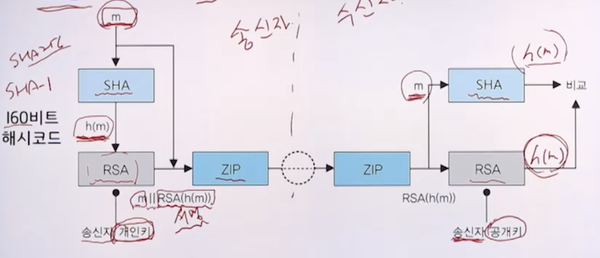
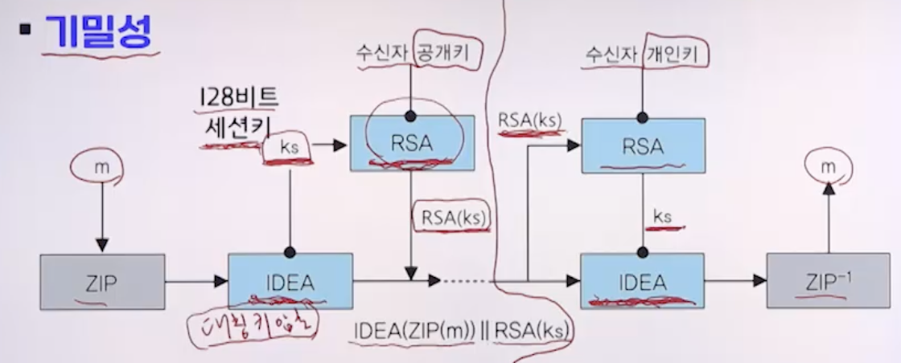
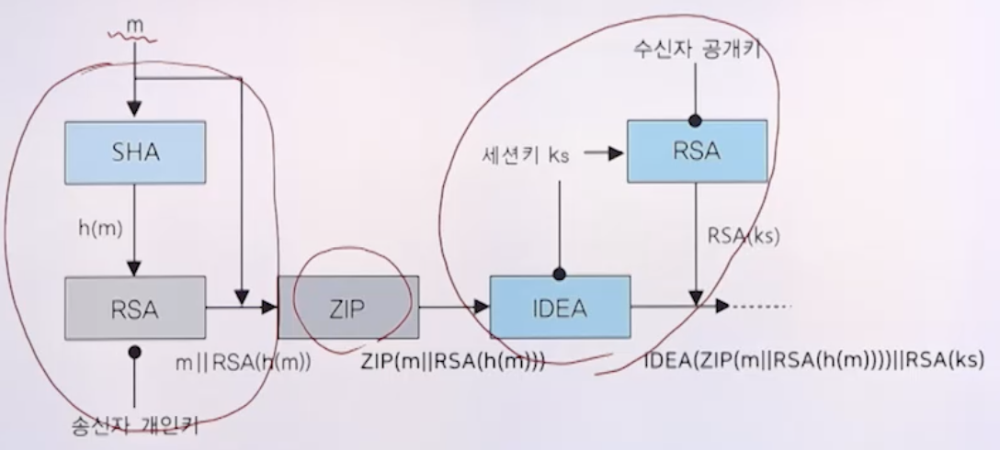
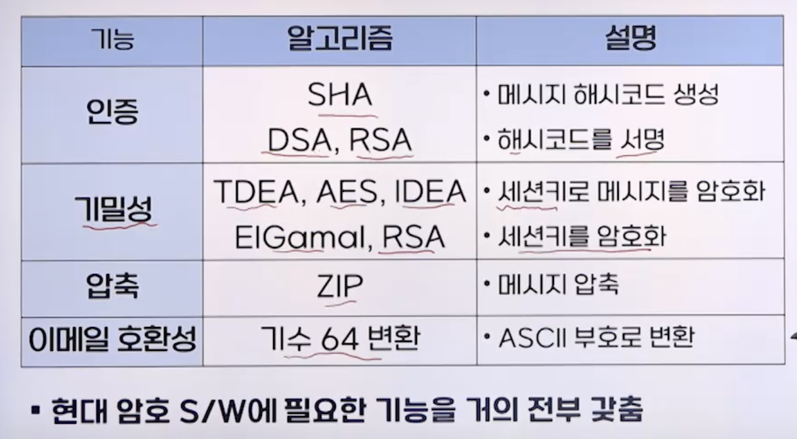
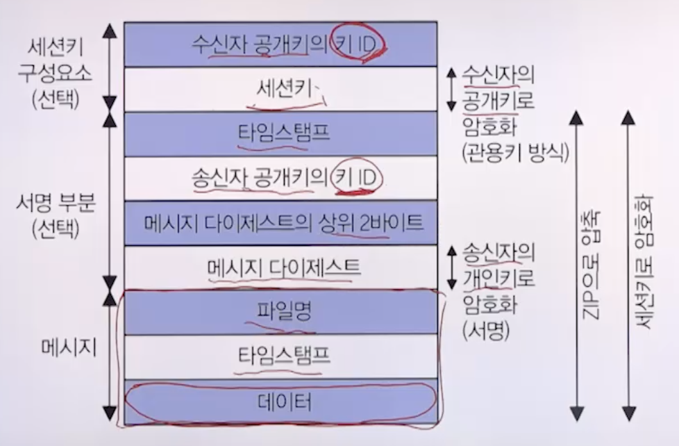
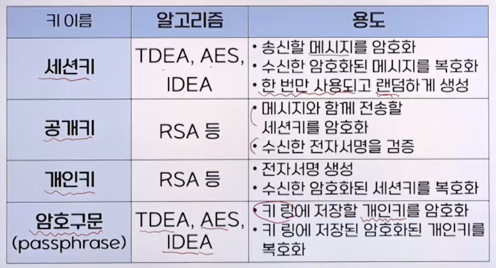
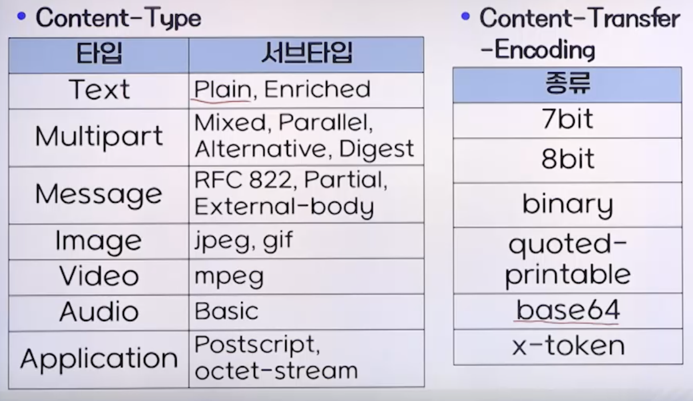
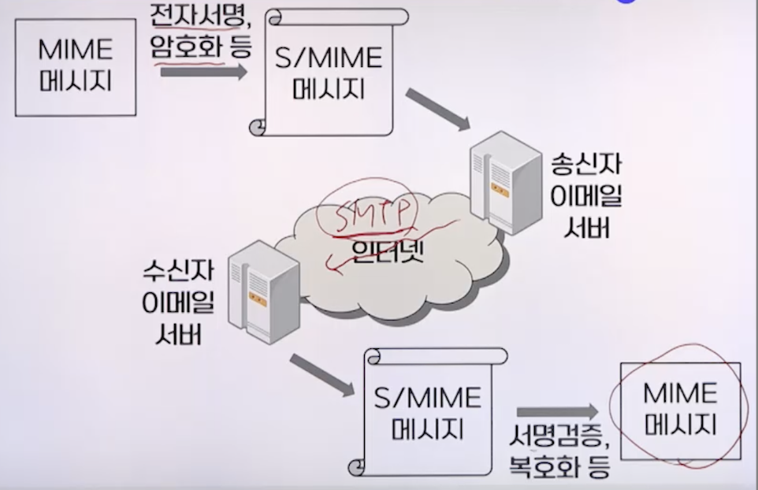

# 9강. 이메일 보안

## 01. 이메일 보안의 개요

### 이메일의 특성

- 수신자에 도달할 때 까지 여러 호스트 거침
  - 내용도 노출됨
  - 전송 도중 도청, 변조 가능성 있음

### 이메일 보안

- 이메일의 도청, 변조에 대한 문제 해결을 위한 보안
- 보안도구
  - PGP
  - S/MIME

## 02. PGP

### PGP(Pretty Good Privacy)

- 인터넷에서 사용하는 이메일 보안도구
- 보내려는 **내용을 암호화함**으로써 키가 있어야만 내용 확인 가능
- 기밀성, 인증, 무결성, 부인방지 

### 보안 서비스

- 인증

  - SHA, DSA 또는 RSA의 결합

  

- **기밀성**

  - 메시지 암호화를 위해 TDEA, AES 또는 IDEA 사용
  - 일회용 세션키를 사용
  - 세션키 분배를 위해 ElGamal 또는 RSA 사용

  

- 기밀성과 인증

  

- 압축

  - 파일 저장과 이메일 전송의 두 가지 경우에 대해 공간 절약
  - 압축 알고리즘은 ZIP 사용
  - 서명과 암호화 사이에 압축(서명 -> 압축 -> 암호화)
    - 서명 후 압축: 반대의 경우 검증이 요구될 때 압축이 필요
    - 암호화 전 압축: 암호학적 보안 강도 높이기 위함
      - 압축된 메시지가 원래 평문보다 더 작은 중복성 가짐

- 이메일 호환성

  - PGP가 사용되면 전송되는 블록의 일부는 암호화됨
    - 인증 서비스만 사용: 해시코드 암호화
    - 기밀성 서비스 사용: 메시지와 서명문이 암호화
  - 아스키 문자 블록만 사용하는 많은 이멩리 시스템과 호환하기 위해 암호화된 8비트 코드를 아스키 문자 흐름으로 변환
    - 기수 64(Radix-64) 변환
      - 데이터를 6비트 단위로 나눠서 각 6비트를 하나의 문자로 표현
      - 즉, 세 바이트가 네 문자로 변환됨
    - 기수 64로 변환된 결과 문자 64가지
      - A~Z, a~z, 0~9, +, /
      - 마지막 패드 문자: =
    - 기밀성 서비스를 사용하지 않아도 어느 정도의 기밀성 제공

### 보안 서비스

### 전송과정

- 송신자

  

  - 인증이 필요하면 평문의 해시코드를 사용해 서명 생성
  - 평문, 서명 모두를 압축
  - 기밀성이 요구되면 압축된 블록을 암호화하고, ElGamal이나 RSA로 암호화된 세션키 첨부
  - 최종적으로 전체 블록을 기수64 형식으로 변환

- 수신자

  - 전송받은 블록을 기수 64형식에서 2진 형식으로 변환
  - 블록이 암호화되어 있으면 세션키 복구해 블록 복호화
  - 압축 해제
  - 서명으로부터 해시코드 복구하고, 자기가계산한 해시코드와 비교해 인증

### PGP 메시지 형식

### PGP 에서 사용되는 키

### PGP의 키 링 구조

- 송수신자의 키 ID
  - 공개키마다 키 ID 연관
  - 기밀성, 인증 제공하는 모든 PGP 메시지에 포함
  - 키 ID와 연관된 키는 모든 사용자가 효율적으로 사용할 수 있도록 체계적으로 저장, 관리됨
- 개인키 링, 공개키 링 자료구조
  - 개인키 링: 사용자가 소유하는 공개키/개인키 쌍 저장
  - 공개키 링: 사용자에게 알려진 다른 사용자의 공개키를 저장

### 개인키 링

- 구성
  - 사용자 ID: 자신의 이메일
  - 키 ID: 자신의 공개키 하위 64비트
  - 공개키: 자신의 공개키
  - 암호화된 개인키
    - 암호쿠문의 해시코드를 키를 사용해 TDEA, AES 또는 IDEA로 개인키 암호화해서 저장

### 공개키 링

- 사용자 ID: 타인의 이메일
- 키 ID: 타인의 공개키 하위 64비트
- 공개키: 타인의 공개키
- 타임스탬프
- 소유자 신뢰: 공개키 소유자에 대한 신뢰
- 인증서
- 서명 신뢰 키 적법성: 인증서 서명자에 대한 신뢰
- 키 적법성: 유효한 공개키임을 신뢰하는 정보

### 공개키 관리

- 부정한 공개키가 공개키 링에 포함되는 경우의 위협
  - A의 공개키를 B의 공개키로 속임으로써 A가 B로 행세 가능
- 대책
  - 공개키 직접 전달(우편, 유에스비 등)
  - 이메일로 받고 전화로 확인
  - 신뢰할 수 있는 제3자나 인증기관 활용
  - 주로 **신뢰고리 이용**

### 신뢰고리

- 사람 사이의 신뢰를 공개키와 연관시킨 신뢰망 방식
  - A는 B의 공개키에 서명
  - A와 C, A와 D는 서로 잘 알고 공개키가 틀림없이 본인의 것으로 알고 있음
  - C와 D는 잘 모르는 B의 공개키를 처음 수신. 잘 아는 A 의 서명이 있어 이 공개키는 틀림없이 B의 것으로 판단

## 03. S/MIME

### 개요

- Secure/Multipurpose Internet Mail Extension
- 인터넷 이메일 표준인 MIME 보안 강화한 것
- 이메일 표준 변천
  - SMTP
  - MIME
  - S/MIME

### SMTP

-  텍스트 기반 이메일 전송 프로토콜
- 메시지는 봉투와 콘텐츠로 구성
  - 봉투(envelope) 배달을 위해 필요한 메시지
  - 콘텐츠(content) 수신자에게 전달될 객체
    - 헤더, 바디로 구성

- 제약사항
  - 실행파일이나 이전 파일 못보냄
  - 7비트 기반의 텍스트만 지원
  - 특정 크기 이상의 이메일은 거됨

### MIME

- 멀티미디어 이메일의 표현에 대한 표준
- 이메일에 의해 일어날 수 있는 콘텐트타입의 형식을 변형으로부터 보호하기 위한 형태로 바꾸어 주는 전달 부호화정의 

### S/MIME의 개요

- 네트워크를 통해 주고받는 메시지에 대해 보안 서비스 제공
- 암호화, 전자서명, 사용용이성, 융통성 상호운용성 등

#### 1. 전자서명

- 전자서명표준의 RSA, ECDSA 사용

#### 2. 세션키 분배

- RSA와 ECDH(Elliptic Curve Diffie-Hellman)

#### 3. 해시함수

- SHA-256, SHA512

#### 4. 메시지암호화

- AES-128, AES-256

### 동작

