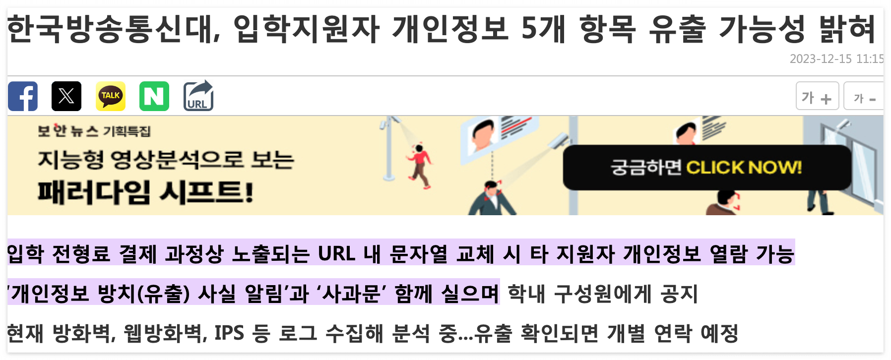

# 01. 웹해킹에 대한 이해

## **1. 웹 해킹 공격과 방어를 위한 기본적인 지식들**

### 1.1 웹 해킹이란 무엇인가?

책에서 알려주는 웹 애플리케이션 해킹에서 자주 볼 수 있는 해킹 예시로 **파라미터 변조 취약점(parameter tampering vulnerability)**을 가장 처음 알려주는데, 이거 묘하게 낯이 익다..?

*이런 불미스러운 예시에 모교를 들게 되다니. 2023년 12월 방송통신대학교*

나는 24년도 1학기 추가모집 시즌에 지원했기 때문에 내 개인정보는 유출대상에 해당하지는 않았지만 기억하기로는 이 사건을 계기로 아예 홈페이지 리뉴얼이 들어갔던 것 같음. 

웹해킹 발생 원인은 사용자 입력값에 대한 입력값 검증 미흡으로 발생하는데, 파라미터 변조 취약점 외에 **SQL 인젝션**에 대한 취약점도 발생 가능하다. 

 

### 1.2 해커들의 공격 맛집, 웹 서비스

기업 입장에서는 사용자들의 접속해야 하는 외부 서비스는 어쩔 수 없이 공격해야 하므로, 중요한 데이터를 다루는 내부 서비스의 보안을 방화벽 등을 이용하여 강화하였다. 방화벽은 미리 정의된 룰셋을 통해 **웹 서비스에 대한 외부 접근은 허용**하고, 그 외의 서비스는 차단하도록 설정이 가능하다.(SSH, FTP, SFTP, TELNET) 반면, 웹 서비스에서 접속할 경우에는 허용된 포트로 접근하는 것이므로 패킷이 정상적으로 전달된다. 결과적으로, 웹 서비스 이외의 내부 서비스에는 접근할 수 없게 되는 것이다 -- 따라서 외부에 공개된 웹 서비스를 중심으로 공격을 시도할 수 밖에 없다. 

또한, 웹 서비스의 성장 또한 이유이다. 웹 서비스는 기업들의 필수 요소가 되고, 웹 서비스의 수가 기하급수적으로 늘어나며 장녀스럽게 해커의 공격 대상도 웹 서비스가 되었다. 

대부분 해커들의 목적은 돈이 되는 정보들이며 주로 사이트를 이용하는 **사용자들의 개인 정보**를 목표로 한다. 그 외에도 기업 내 계약서등 기밀 문서까지 수집하게 될 수도 있다. 

**피해 사례**
**1. 파라미터 변조:** KT 개인 정보 유출(2014)
**2. SQL인젝션:** 뽐뿌 개인 정보 유출(2015)
**3. SQL인젝션 > 세션 변조:** 여기어때 개인 정보 유출(2017)
**4. 파일 업로드 취약점**

**웹 해킹 공격 프로세스**
**1. 공격 대상 지정**
**2. 정보 수집(discovery)** 공격에 필요한 정보 수집 단계 - 도메인, 계정 등 공개 정보 수집(OSINT: Open Source Intelligence)
**3. 취약점 분석(analysis) ⭐️** 취약점 분석 능력
**4. 공격(exploitation)** 취약 기능이라고 판단할 경우 공격을 진행하는 단계
**5. 결과 도출(validation + reporting)** 공격을 통해 얻은 정보들을 의미 있는 결과물의 형태로 만드는 단계

> 오 그러니깐 **XBOW**는 웹 해킹 공격 프로세스 전반을 다 커버하고 있으며, 여기서 인간 해커의 능력에 강하게 의존할 수 밖에 없는 3-4번에서 기술적 차별점이 있음. 
>
> **🚀 관련 XBOW 블로그
> **1. [AI 모의해킹 프레임워크의 핵심 구성 요소](https://xbow.com/blog/core-components-ai-pentesting-framework) 
>
> 2. [XBOW AI 기반 모의해킹 vs DAST 비교](https://xbow.com/blog/xbow-ai-pentesting-vs-dast)
>
>  \- 기존 도구가 취약점 “탐지”에 그친다면, XBOW는 공격→반응→다음 공격을 반복
>
> 3. [1,060번의 자율 공격을 실행해봤습니다](https://xbow.com/blog/we-ran-1060-autonomous-attacks)
>
>  \- 40시간 걸리던 작업을 28분으로 단축

 

### 1.3 웹 해킹과 업무

#### **기업들이 웹 해킹 진단을 하는 이유**

정상적인 사용자 뿐만 아니라 해커에 대한 대비도 해야 함

#### **웹 해킹 진단의 종류 2가지**

1. 취약점 진단
2. 모의 해킹

#### **견고한 웹 서비스 보안을 위한 방법**

- **정기적 웹 취약점 진단** - 웹 해킹 진단. 반기별 / 분기별, 지속적으로 기능이 추가 및 수정되며, 애플리케이션 내부 로직도 변함. 진단자에 따라 진단 결과 다르므로 진단자의 능력에 의존적.
- **개발자 보안 교육** - 시큐어 코딩 / 개발 단계에서부터 보안 고려해서 안전하게 개발 
- **보안 솔루션 도입** - 웹 방화벽
- **보안 인력 확보** 

#### **웹 해킹과 관련 있는 정보보안 업무**

| **업무**               | **웹 해킹 관련성** |
| ---------------------- | ------------------ |
| 보안 관제              | 낮음               |
| 보안 컨설팅 - 관리     | 낮음               |
| **보안 컨설팅 - 기술** | **메인**           |
| 악성 코드 분석         | 낮음 / 없음        |
| 침해 사고 분석         | 관련 있음          |
| 포렌식                 | 낮음 / 간접        |
| **모의 해킹**          | **메인**           |
| **취약점 진단**        | **메인**           |
| 인프라 진단            | 낮음               |

**(1) 취약점 진단(정기적 취약점 진단 기업에 적합)**

- 체크리스트 방식
- 단순히 취약점 유무만 판별하고, 메뉴별 취약 현황 파악 가능

**(2) 모의 해킹**

- 취약점 유무를 넘어 어떤 위협이 발생할 수 있는지 살펴보고, 취약점을 통해 발견할 수 있는 또 달느 취약점을 찾아 기업의 중요 정보에 도달할 수 있는지 내부 침투까지 시도
- 위협 시각화에 용이(내부 설득력 높아짐)

#### **모의 해킹 진단의 현실**

- 단순 취약점 유무 판별만 반복적으로 하는 것은 그렇게 많은 기술력을 요구하지 않고, 짧은 시간에 습득 가능하다
- 단, 발견한 취약점을 기반으로 다른 취약점까지 도출하는 시나리오 기반 공격과 내부 침투를 진행하는 모의 해킹은 많은 기술력 요구

 

### 1.4 웹 해킹 훈련장, 워게임

#### **워게임이란?**

워게임은 가상의 취약 환경. 사이트마다 시스템 해킹, 웹 해킹, 리버싱, 포렌식 등 다양한 분야의 문제들이 제공된다.

- Webhacking.kr
- Lord of SQLi
- SuNiNaTas
- dreamhack.io
- hackerfactory.co.kr

 

#### **워게임과 실환경**

- 실환경에서의 합법 공격 수행을 위한 방법으로는 버그바운티 프로그램에 참여하는 방법이 있다
- knvd.krcert.or.kr
- patchday.io
- bugbounty.kakao.com