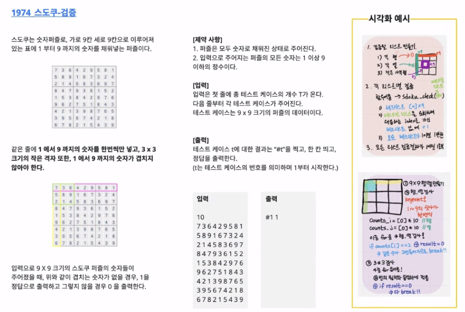

# Algorithm Array2

## :zero: OVERVIEW

* 배열: 2차원 배열
* 부분집합 생성
* 바이너리 서치
* 셀렉션 알고리즘
* 선택정렬


## :one: 2차원 배열

### 1. 2차원 배열의 선언

* 1차원 List를 묶어놓은 List

* 2차원 이상의 다차원 List는 차원에 따라 Index를 선언

* 2차원 List의 선언: 세로길이(행의 갯수), 가로길이(열의 갯수)를 필요로 함

* Python에서는 데이터 초기화를 통해 변수선언과 초기화가 가능함

* 예시

  ```python
  arr = [[0, 1, 2, 3][4, 5, 6, 7]]
  # 2행 4열의 2차원 List
  # 위에서 아래로
  ```

* 참고: 이차원 배열의 input

  ```python
  N  = int(input())
  arr2 = [list(map(int, input().split())) for _ in range(N)]
  
  # arr1 = [0] + list(map(int, input().split())) + [0]
  # 1차원 배열의 리스트에 0을 앞뒤로 집어넣을 수 있다
  ```

* :repeat_one: 0으로 둘러싼 배열을 채우고 싶은 경우

  

  ```python
  #2차원 배열에서 리스트에 0 집어넣기!
  # 맨 첫줄은 내가 가지고 있는 행보다 하나 더 많은 행을 필요로 함 따라서 N + 1
  arr2 = [[0]*(N+1)] + [[0]+list(map(int, input().split())) for _ in range(N)]
  # 0으로 둘러싸고 싶으면 
  arr2 = [[0]*(N+2)] + [[0]+list(map(int, input().split())) for _ in range(N)] +[[0]*(N+2)]
  
  ```

  


### 2.  2차원 배열의 접근

#### 1) 배열 순회

* nXm 배열의 n*m개의 모든 원소를 빠짐없이 조사하는 방법


#### 2) 행 우선 순회

* ```python
  # i 행(가로)의 좌표
  # j 열(세로)의 좌표
  for i in range(n):
      for j in range(m):
          Arr[i][j] # 필요한 연산 수행, 먼저 고정된 애가 행의 인덱스임
  ```

  * 안되는 경우!!!!! 이런식으로 받아내지 마세요!

  

  * 되는 경우

    ```python
    arr2 = [[0]*3 for _ in range(4)]
    # 0으로 채워진 2차원 배열
    # for 앞에 있는게 열의 갯수, 뒤의 숫자가 행
    ```

    

  

#### 3) 열 우선 순회

```python
# i 행(가로)의 좌표
# j 열(세로)의 좌표
for j in range(m):
    for i in range(n):
        Arr[i][j] # 필요한 연산 수행, 먼저 고정된 애가 열의 인덱스임 
```


#### 4) 지그재그 순회

* 어떻게 접근하는지를 배우자

```python
# i 행(가로)의 좌표
# j 열(세로)의 좌표
for i in range(n):
    for j in range(m):
        Arr[i][j + (m - 1 - 2 * j) * (i % 2)] # 필요한 연산 수행
        
# i % 2 가 0인 경우(즉 짝수 행일 경우), Arr[i][j]
# i % 2 가 0이 아닌 경우 ( 즉, 홀수 행일 경우), 
# 식이 하나씩 역으로 검색하려면 m-1-j 가 되면 되는데,
# 이걸 같은 식에다가 집어넣어주는 일환으로 저런 기괴한 식이 만들어짐 like 
# j + (m - 1 - 2 * j) == m - 1 - j
        
# 위의 코드를 풀어서 쓰면,
for i in range(n):
    if i % 2 == 0:  #짝수행
        arr[j][i]
    else:#홀수행
```


#### 5) 델타를 이용한 2차 배열 탐색

* 2차 배열의 한 좌표에서 4방향의 인접 배열 요소를 탐색하는 방법

  ```python
  arr[0...N-1][0...N-1] # NxN 배열
  dj[] <- [0, 0, -1, 1] # 상하좌우 (만약 ij기준이면 좌우상하)
  di[] <- [-1, 1, 0, 0]
  for i : 0 -> N-1
  	for j: 0 -> N-1
  		for k in range(4):
  			ni <- i + di[k]
  			nj <- j + dj[k]
  			if 0 <= ni<N and 0 <=nj<N # 유효한 인덱스면 test(arr[ni][nj])
  ```

  

* 예시

  ```python
  # 방향은 종이에다가 그려놓고 시작
  # 헷갈리지 않게 기준을 두자
  di = [0, 1, 0, -1]
  dj = [1, 0, -1, 0]
  
  # 내 현재의 위치가 ij일 때, 4 방향의 좌표
  # N * M 배열일 때, 모든 원소에 대해 주변(상하좌우)
  for k in range(4):
      ni = i + di[k]
      nj = j + dj[k]
      if 0 <= i < N and 0 <= nj < M: # 유효 인덱스
          arr[ni][nj]
  ```

  ```python
  #Exclusive for python
  arr = [[1,2,3],[4,5,6],[7,8,9]]
  N = 3
  for i in range(N):
      for j in range(N
          for di, dj in[(0,1), (1,0), (0,-1), (-1,0)]:
              ni = i + di
              nj = j + dj
              if 0 <= i < N and 0 <= nj < M: # 유효 인덱스
                  print(i, j, arr[ni][nj])
  		print()
  ```


### 3. 2차원 배열의 활용

#### 1) 전치 행렬(Transpose)

* 표의 행과 열을 바꾸는 것

  ```python
  for i in range(3):
      for j in range(3):
          if i < j:
              arr[i][j], arr[j][i] = arr[j][i], arr[i][j]
  ```

  

  ```python
  # 파란색 영역에 접근할 수 있는 다른 방법
  for i: 0-> 1
      for j : i + 1 ->2
  ```

  


### 4. 연습문제

* 큰 문제를 작은 문제로 쪼갤 수 있는 능력

* 단계적으로 접근할 수 있는 능력

* 5*5 2차 배열에 25개의 숫자로 초기화 한 후, 25개의 각 요소에 대해서 그 요소와 이웃한 요소와 차의 절대값을 구하시오.

* 예를 들어, 아래 그림에서 7 값의 이웃한 값은 2, 6, 8, 12이며, 차의 절대값의 합은 12이다. 

  * abs 쓰지마라
    * if, else
    * def
    * 삼항연산자

* 25개의 요소에 대하여 모두 조사하여 총합을 구하시오

* 벽에 있는 요소는 이웃한 요소가 없을 수 있음을 주의하시오.

  


## :two: 부분집합 합(Subset Sum) 문제

### 1. 문제

* 유한 개의 정수로 이루어진 집합이 있을 때, 이 집합의 부분집합 중에서 그 집합의 원소를 모두 더한 값이 0 이 되는 경우가 있는지를 알아내는 문제

* 예를 들어, [-7, -3, -2, 5, 8] 이라는 집합이 있을 때, [3, -2, 5]는 이 집합의 부분집합이면서 (-3)+(-2)+5=0 이므로 이 경우의 답은 참이 된다. 

  

### 2. 부분집합 생성하기

* 완전검색 기법으로 부분집합 합 문제를 풀기 위해서는, 우선 집합의 모든 부분집합을 생성한 후에 각 부분집합의 합을 계산해야 한다.

* 주어진 집합의 부분집합을 생성하는 방법에 대해서 생각해보자.

* **집합의 원소가 n개 일 때, 공집합을 포함한 부분집합의 수는 2^n개** 이다.
  * 이는 각 원소를 부분집합에 포함시키거나 포함시키지 않는 2가지 경우를 모든 원소에 적용한 경우의 수와 같다.
  
  * 원소 5개가 있다고 칠 때, 32개의 부분집합이 생성된다(2^5)
  
    

#### 1) 원소 갯수가 정해져 있는 경우, 각 원소가 부분집합에 포함되어있는지를 loop을 이용해서 확인 후 부분집합 생성하는 방법

````python
bit = [0, 0, 0, 0]
for i in range(2):
    bit[0] = i
    for j in range(2):
        bit[1] = j 
        for k in range(2):
            bit[2] = k
            for l in range(2):
                bit[3] = 1
                print_subset(bit)
                
# [0, 0, 0, 0]
# [1, 0, 0, 0]
# [0, 1, 0, 0]
# [0, 0, 1, 0] ....
````


#### 2) 원소 갯수가 바뀌는 경우 

```python
arr = [3, 6, 7, 1, 5, 4]

n = len(arr)						# 원소의 갯수 6개 > 부분집합 2^6 = 64개

for i in range(1<<n):				# 1<<n = 64, 64개의 숫자를 만든 담에
    for j in range(n):				# 각각의 숫자에 대해 6개씩의 비트를 읽자
        if i & (1<<j):				# i의 j번 비트가 1인경우
            print(arr[j], end=",")	# j 번 원소 출력
    print()
print()
```

* 비트

  * 메모리 안에서 상태를 구분할 수 있는 최소단위
  * 메모리에 접근할 수 있는 최소단위는 바이트

* 비트 연산자(같은 비트끼리 연산)	

  * `&` : 비트 단위로 AND 연산

    ```python
    print(0 & 1) # 0
    print(10 & 16) # 0
    
    print(0|1)
    print(10|16)
    ```

    * print(10&16) :question: 이진수로 어떻게 변환시키져?

      

    * print(10|16)

      

    

  * `|` : 비트 단위로 OR 연산

  * `<<` : 피연산자의 비트 열을 왼쪽으로 이동시킨다. (젤 오른쪽엔 0이 들어옴 )

  * `>>` : 피연산자의 비트 열을 오른쪽으로 이동시킨다. (맨 왼쪽엔 0이 들어옴)

  * `^` : exclusive or(XOR) 두 개가 다를 때 True

* `<<` 연산자

  * `a = 1 << 5` 

  * 5번 비트가 1인 값, 즉 2^5, 즉 원소가 5개인 경우 모든 부분집합의 수 

    * 1을 비트 연산으로 두칸 민다. 즉 1은 0001 이걸 두칸 밀면 0100

    * 몇번째 칸에 1이 들어갈것인가?

* `&` 연산자 

  * `i & ( 1 << j )`: i 의 j번째 비트가 1인지 아닌지를 검사한다.
  * `&` 는 0이 하나라도 있으면 결과가 0, 1이 두개 있어야 1
  * i의 j번 비트가 1이면, 결과는 0이 아닌 결과
  * i의 j번 비트가 0 이면, 결과는 0이 될 것


### 4. 연습문제


## :three: 검색

### 1. 개념

* 저장되어 있는 자료 중에서 원하는 항목을 찾는 작업
* 목적하는 탐색 키를 가진 항목을 찾는 것
  * 탐색 키(search key): 자료를 구별하여 인식할 수 있느 ㄴ키
* 검색의 종류
  * 순차검색(sequential)
  * 이진검색(binary)
  * 해쉬(hash)

### 2. 순차검색(sequential search)

#### 1) 개념

* 일렬로 되어 있는 자료를 순서대로 검색하는 방법
  * 가장 간단하고 직관적
  * 배열이나 연결 리스트 등 순차구조로 구현된 자료구조에서 원하는 항목을 찾을 때 유용
  * 알고리즘이 단순하여 구현이 쉽다. 그러나 검색 대상의 수가 많은 경우에는 수행시간이 급격히 증가하여 비효율적임
* 2가지 경우
  * 정렬되어 있지 않은 경우
  * 정렬되어 있는 경우

#### 2) 정렬되어 있지 않은 경우

* 첫 번째 원소부터 순서대로 검색 대상과 키 값이 같은 원소가 있는지 비교하면서 찾음

* 키 값이 동일한 원소를 찾으면, 그 원소의 인덱스를 반환

* 자료구조의 마지막에 이를 때까지 검색 대상을 찾지 못하면 검색 실패

* 찾고자 하는 원소의 순서에 따라 비교 회수가 결정된다

  * 첫번째 원소를 찾을 때는 1번 비교, 두 번째 원소를 찾을 때는 2번 비교
  * 정렬되지 않은 자료에서의 순차 검색의 평균 비교 횟수
    * (1/n)*(1+2+3+...+n) = (n+1)/2
    * 시간복잡도: O(n)

* 구현 예

  ```python
  def sequentialSearch(a, n, key)
  	i <- 0
      while i < n and a[i]! = key: 
          # 배열의 인덱스 and 배열의 값
          # and 앞의 값은 인덱스가 먼저 와야됨
          # 앞의 것이 참이면 뒤에것 검사 O, 앞의 것이 거짓이면 뒤에것 검사 X
          # 이렇게 되면 인덱스 에러가 난다 
          i <- i + 1
      if i < n: return i
      else: return -1
  ```

  

#### 3) 정렬되어 있는 경우

* 자료가 오름차순으로 정렬된 상태에서 검색을 실시한다고 가정

* 자료를 순차적으로 검색하면서 키 값을 비교하여, 원소의 키 값이 검색 대상의 키 값보다 크면 찾는 원소가 없다는 것이므로, 더 이상 검색하지 않고 검색을 종료

* 찾고자 하는 원소의 순서에 따라 비교회수가 결정됨

  * 정렬이 되어 있으므로, 검색 실패를 반환하는 경우 평균 비교 횟수가 반으로 줄어듬
  * 시간 복잡도: O(n)

* 구현 예

  ```python
  def sequentialSearch2(a, n, key)
  	i <- 0
      while i < n and a[i] < key:
          i <- i+1
      if i < n and a[i] == key:
          return i
      else:
          return -1
  ```

  

### 3. 이진검색(binary search)

#### 1) 개념 

* 자료의 가운데에 있는 항목의 키 값과 비교하여 다음 검색의 위치를 결정하고 검색을 계속 진행하는 방법
  * 목적 키를 찾을 때까지 이진 검색을 순환적으로 반복 수행함으로써 검색 범위를 반우로 줄여가면서 빠르게 검색을 수행한다
* 이진 검색을 하기 위해서는 자료가 정렬된 상태여야 한다.

#### 2) 과정

* 자료 중앙에 있는 원소를 고른다
* 중앙 원소의 값과 찾고자 하는 목표 값을 비교한다
* 목표 값이 중앙 원소의 값보다 작으면 자료의 왼쪽 반에 대해서 샐 검색을 수행하고, 크다면 자료의 오른쪽 반에 대해서 새로 검색을 수행한다.
* 찾고자 하는 값을 찾을 때까지 상기 과정을 반복한다
* 시간복잡도(logn)

#### 3) 구현

* 검색 범위의 시작점과 종료점을 이용하여 검색을 반복 수행
* 이진 검색의 경우, 자료에 삽입이나 삭제가 발생했을 때 배열의 상태를 항상 정렬 상태로 유지하는 추가 작업이 필요하다.

```python
def binarySearch(a, N, key):
	start = 0						# 구간의 시작 인덱스
    end = N - 1						# 구간의 끝 인덱스
    while start <= end:				# 스타트보다 엔드가 끝에 있어야
    	middle = (start + end)//2	# 중간 원소의 인덱스 
        if a[middle] == key:		# 검색 성공
            return true
        elif a[middle] > key:		# 위의 구간을 버림
            end = middle - 1
        else:
            start = middle + 1		# 아래 구간을 버림
    return false					# 검색 실패
```


#### 4) 재귀 함수 이용

* 재귀 함수 ( 그냥 읽어나보자 )

  

  

### 4. 인덱스

* Database에서 유래했으며, 테이블에 대한 동작 속도를 높여주는 자료 구조를 일컫는다. Database분야가 아닌 곳에서는 lookup table등의 용어를 사용하기도 한다.

* 인덱스를 저장하는데 필요한 디스크 공간은 보통 테이블을 저장하는데 필요한 디스크 공간보다 작다. 왜냐면 보통 인텍스는 키-필드만 갖고 있고, 테이블의 다른 세부 항목들은 갖고 있지 않기 때문이다. 

* 배열을 사용한 인덱스

  * 대량의 데이터를 매번 정렬하면, 프로그램은 느려질 수밖에 없다. 이러한 대량 데이터의 성능 저하 문제를 해결하기 위한 배열 인덱스를 사용할 수 있다. 

  


## :four: 선택 정렬(Selection Sort)

:star: 버블정렬과 선택정렬은 외워두자

### 1. 개념

* 주어진 자료들 중 가장 작은 값의 원소부터 차례대로 선택하여 위치를 교환하는 방식
* 저장되어 있는 자료로부터 k번째로 큰, 혹은 작은 원소를 찾는 방법
  * 최소, 최대 혹은 중간값을 찾는 알고리즘
* 선택과정
  * 정렬 알고리즘을 이용해 자료 정렬
  * 원하는 순서에 있는 원소 가져오기
* 정렬 과정
  * 주어진 리스트 중에서 최소값을 찾는다
  * 그 값을 리스트의 맨 앞에 위치한 값과 교환한다
  * 맨 처음 위치를 제외한 나머지 리스트를 대상으로 위의 과정을 반복한다.
* 시간 복잡도: O(n2)


### 2. 정렬 과정

* 과정

  

  

  

  

* 버블소트와 셀렉션 소트의 차이점 알아야 함

* 선택 정렬 

  ```python
  def selectionSort(a, N):
      for i in range(N-1):
          minIdx = i
          for j in range(i+1, N):
              if a [minIdx] > a[j]:
                  minIdx = j
          a[i], a[minIdx] = a[minIdx], a[i]
  ```


### 3. k번째로 작은 원소를 찾는 알고리즘

* 1번부터 k번째까지 작은 원소를 찾아 배열의 앞쪽으로 이동시키고, 배열의 k번째를 반환한다

* k가 비교적 작을 때 유용하며, 수행시간: O(kn)

  ```python
  def select(arr, k):
      for i in range(0, k):			# k번째로 작은 원소???? 
          							# 선택정렬이 필요한 위치까지만 
          minIndex = i
          for j in range (i+1, len(arr)):
              if arr[minIndex] > arr[j]:
                  minIndex = j
          arr[i], arr[minIndex] = arr[minIndex], arr[i]
      return arr[k-1]
  ```

  

## :five: 정렬 알고리즘 비교


* Bubble sort와 Selection sort 같은 경우, 손으로 그려서 차이점을 나타낼 수 있게 연습


<연습문제3>

* 델타를 이용해서 배열... 방향은 꺾는건데 더이상 갈곳이 없으면
* 인덱스의 갯수를 활용해서 꺾을때 꺾으라고 하기
* 


