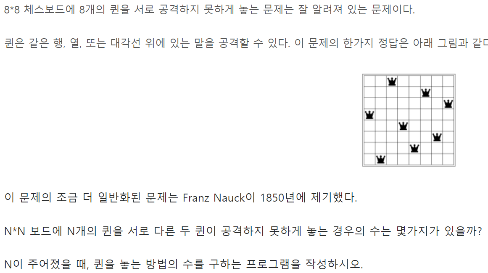
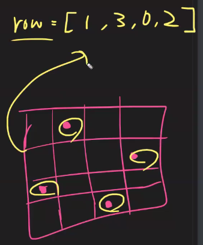
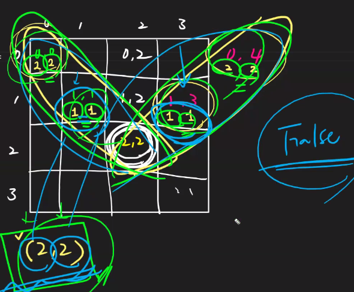
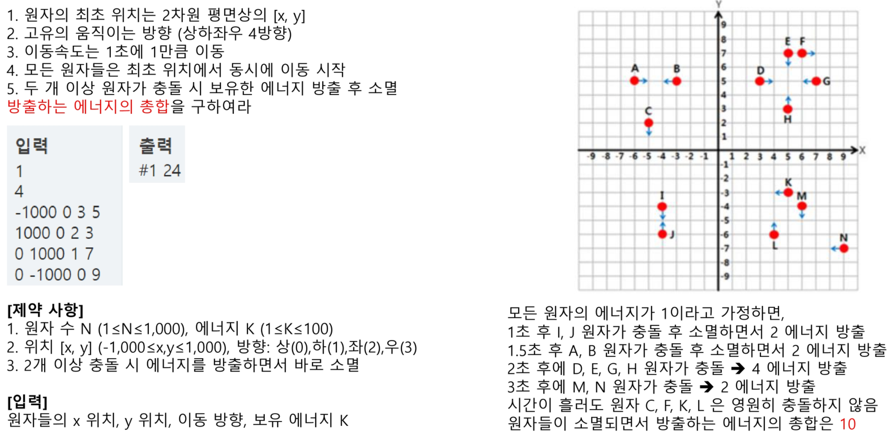

# BFS/백트래킹 템플릿

## :one: 1249. 보급로

### 1. 문제

[1249. 보급로](https://swexpertacademy.com/main/code/problem/problemDetail.do?contestProbId=AV15QRX6APsCFAYD)


### 2. 설계


* 중복 방문 허용하되 조건은 이전 결과보다 더 나은 결과


### 3. 코드

```python
def BFS(si, sj, ei, ej):
    # 1. q, visited 생성
    q = []
    visited = [[1000000] * N for _ in range(N)]
    
    # 2. q 초기데이터 삽입, visited 표시
    q = [(si, sj)]
    visited[si][sj] = arr[si][sj] # arr[si][sj] 대신 0 써줘도 됨(문제)
    
    while q:
        ci, cj = q.pop(0)
        
        # 4방향, 8방향, 숫자 차이가 일정값 이하...
        for di, dj in ((-1,0),(1,0),(0,-1),(0,1)):
            ni, nj = ci + di, cj + dj 
            if 0 <= ni < N and 0 <= nj < N and visited[ni][nj] > visited[ci][cj] + arr[ni][nj]:
                q.append((ni, nj))
                visited[ni][nj] = visited[ci][cj] + arr[ni][nj]
    return visited[ei][ej]
    
    
T = int(input())
for tc in range(1, T + 1):
    N = int(input())
    arr = [list(map(int, input())) for _ in range(N)]
    ans = BFS(0, 0, N-1, N-1)
    print(f'#{tc} {ans}')
```


## :two: 2806. N-Queen

### 1. 문제

[2806. N-Queen](https://swexpertacademy.com/main/code/problem/problemDetail.do?contestProbId=AV7GKs06AU0DFAXB)



### 2. 설계




* visited 배열의 의미: 각각의 row에 있는 Queen의 위치를 저장해주는 것 

* 나중에 0으로 다 초기화 해도 괜찮음 -> 왜냐하면 차례대로 row를 채울 것이기 때문. 이전 row에 위치한 Queen의 위치를 보면서 새로운 row를 채워나갈 것 + 다음 row에도 영향받지 않을 것

* 대각선 두 개를 한꺼번에 처리할 수 있는 알고리즘

  

  

### 3. 코드

#### 3-1) 유튜브 라이브

```python
def check(si, sj):
    #1. 위쪽 방향
    for i in range(si-1, -1, -1):
        # 퀸을 마주친다면 실패
        if visited[i][sj] == 1:
            return 0
    #2. 좌측 대각선 위
    i, j = si-1, sj-1
    while i >= 0 and j >= 0:
        if visited[i][j] == 1:
            return 0
        # 퀸을 마주치지 않았다면 상단으로 이동
        i, j = i-1, j-1
    
    #3. 우상단
    i, j = si-1, sj+1
    while i >= 0 and j < N:
        if visited[i][j] == 1:
            return 0
        i, j = i-1, j+1
        
    # 퀸을 마주치지 않았다면: 성공!
    return 1
        
        
        
def DFS(n):
    global ans
    if n == N:
        ans += 1
        return
    
    for j in range(N):
        if check(n,j):
            # n행 j열에 퀸을 배치
            visited[n][j] = 1
            DFS(n+1)
            visited[n][j] = 0
    
    
T = int(input())
for tc in range(1, T + 1):
    N = int(input())
    visited = [[0] * N for _ in range(N)]
    ans = 0
	DFS(0)
    print(f'#{tc} {ans}')
```

#### 3-2) 웹엑스

```python
# v 번째 row의 Queen들을 조사 
# 세로, 대각선 정도 확인해주면된다
# 왜냐면 가로는 이미 dfs에서 확인해주고 있다(row하나 당 퀸 하나)
def promising(v):
    
    ## 세로줄 확인
    # row 배열에서, 나보다 인덱스가 작은 키값들에 자기 자신과 같은 값이 있는지 확인
    # 즉, 나 자신의 세로줄 위쪽에 퀸이 있는지 확인
    for i in range(v):
        # 만약에 row배열의 앞쪽에 나랑 같은 값이 있다면, 
        # 즉 내가 위치한 위쪽(세로줄)에 퀸이 있다면
        if row[v] == row[i]:
            return False
        
    ## 대각선 확인
    # column은 내 위치를 기준으로 감소하기도하고 증가하기도 함
    # 따라서 음수(-)가 나올 가능성도 있음
    # 그러므로, 절댓값을 취해준다
    for i in range(v):
        # 우하향, 좌상향 그래프 둘 다 체크 가능한 조건임
        if row[v] == row[i] or abs(row[v] - row[i]) == v - i:
            return False
        
        
    
### 이게 트리...??

def dfs(v):
    # 종료조건
    if v == len(row): # v == N, 즉 N == len(row)
        #모든 퀸을 배치한 경우
        cnt += 1
        return
    
    else:
        for i in range(len(row)):
            # v번째 row에 i column에다 퀸을 두겠다는 것
            row[v] = i
            # 그런데 얘가 그 위치에 있을 수 있는 애인지 확인해줘야 함
            # 그 확인을 여기서 하면 조금 헷갈리니까, 따로 함수로 빼주자
            # 가지치기(pruning)
            if promising(v):
				# 조건을 만족한다면
            	# 두었으면 다음줄로 가서 비슷한거 해
            	dfs(v+1)
            
            
T = int(input())
for tc in range(1, T+1):
	N = int(input())

	cnt = 0
	row = [0] * N # 얘가 어떻게 쓰이는지 - visited 대신 row라고 둔 이유

	dfs(0)
	print(f'#{tc}, {cnt}')
```


### 4. REFACTORING

* 배열을 만들어서 체크 

  

```python
def DFS(n):
    global ans
    if n == N:
        ans += 1
        return
    
    for j in range(N):
        if v1[j] == v2[n+j] == v3[n-j] == 0:
            v1[j] = v2[n+j] = v3[n-j] = 1
            # n행 j열에 퀸을 배치
            DFS(n+1)
            v1[j] = v2[n+j] = v3[n-j] = 0
    
    
T = int(input())
for tc in range(1, T + 1):
    N = int(input())
    ans = 0
    v1, v2, v3 = [0] * 30, [0] * 30, [0] * 30
    DFS(0)
    print(f'#{tc} {ans}')
```


## :three: 2115. 벌꿀채취

### 1. 문제

[2115. 벌꿀채취](https://swexpertacademy.com/main/code/problem/problemDetail.do?contestProbId=AV5V4A46AdIDFAWu&)


### 2. 설계


### 3. 코드

```python
# 부분집합의 합

def DFS(n, cnt, ssum, lst):
    global sol
    if cnt > C: # 가지치기
        return
    
    # n이 모든 배열, 부분집합의 합들을 다 썼다면,
    if n == M:
        if cnt <= C and sol < ssum:
            sol = ssum
        return
    
    # 포함시키지 않는 경우
    DFS(n+1, cnt, ssum, lst)
    # 포함시키는 경우
    DFS(n+1, cnt+lst[n], ssum+lst[n]**2, lst)
    
T = int(input())
for tc in range(1, T + 1):
    # N = 벌통 크기, M = 벌통 갯수,  C = 꿀 최대 양
    N, M, C = map(int, input().split())
    arr = [list(map(int, input().split())) for _ in range(N)]
    visited = [0 * N for _ in range(N)]
    ans = 0
    
    # 일꾼 1(i1)
    for i1 in range(N):
        for j1 in range(N-M+1):
            sol = 0
            # 0번째 인덱스부터 시작, 카운트, 최대수익, 선택했으면 M개만큼을 보낸다
            # sol 최댓값을 구해놓고
            DFS(0, 0, 0, arr[i1][j1:j1+M])
            # 최댓값을 t1에 저장
            t1 = sol
            
            # 일꾼 2(i2)
            for i2 in range(i1, N):
                sj = 0
                if i1 == i2:
                    sj = j1 + M
                for j2 in range(sj, N-M+1):
                    sol = 0
                    DFS(0, 0, 0, arr[i2][j2:j2+M])
                    ans = max(ans, t1+sol)

    print(f'#{tc} {ans}')
```

### 4. REFACTORING

```python
# Memoization 

def DFS(n, cnt, ssum, lst):
    global sol
    if cnt > C: # 가지치기
        return
    
    # n이 모든 배열, 부분집합의 합들을 다 썼다면,
    if n == M:
        if cnt <= C and sol < ssum:
            sol = ssum
        return
    
    # 포함시키지 않는 경우
    DFS(n+1, cnt, ssum, lst)
    # 포함시키는 경우
    DFS(n+1, cnt+lst[n], ssum+lst[n]**2, lst)
    
T = int(input())
for tc in range(1, T + 1):
    # N = 벌통 크기, M = 벌통 갯수,  C = 꿀 최대 양
    N, M, C = map(int, input().split())
    arr = [list(map(int, input().split())) for _ in range(N)]
    ans = 0
    
    ###### MEMOIZATION ######
    mem = [[0] * N for _ in range(N)]
    for i in range(N):
        for j in range(N-M+1):
            sol = 0
            DFS(0, 0, 0, arr[i][j:j+M])
            mem[i][j] = sol
    
    # 일꾼 1(i1)
    for i1 in range(N):
        for j1 in range(N-M+1):
            # 일꾼2
            for i2 in range(i1, N):
                sj = 0
                if i1 == i2:
                    sj = j1 + M
                for j2 in range(sj, N-M+1):
                    ans = max(ans, mem[i1][j1] + mem[i2][j2])


    print(f'#{tc} {ans}')
```


## :four: 5648. 원자 소멸 시뮬레이션

### 1. 문제



### 2. 설계


### 3. 코드

```python
T = int(input())
di, dj = (1, -1, 0, 0), (0, 0, -1, 1)
for tc in range(1, T + 1):
    N = int(input())
    arr = [list(map(int, input().split())) for _ in range(N)]
    
    for i in range(len(arr)):
        arr[i][0] *= 2
        arr[i][1] *= 2
    
    ans = 0
    # 끝에서 끝: -2000 ~ 2000
    for _ in range(4002):  
        # 1. 좌표이동
        for i in range(len(arr)):
            arr[i][0] += dj[arr[i][2]]
            arr[i][1] += di[arr[i][2]]
            
        # 2. 중복되면 삭제
        # 지울 리스트 set으로 생성
        ddel, v = set(), set
        for i in range(len(arr)):
            cj, ci = arr[i][0], arr[i][1]
            if (cj, ci) in v:
                ddel.add((cj, ci))
            v.add((cj,ci))
            
        # 3. 삭제리스트에 있으면 삭제
        for i in range(len(arr)-1, -1, -1):
            if (arr[i][0], arr[i][1]) in ddel:
                ans += arr[i][3]
                arr.pop(i)
                
   
    print(f'#{tc} {ans}')
```


### 4. REFACTORING

```python
T = int(input())
di, dj = (1, -1, 0, 0), (0, 0, -1, 1)
for tc in range(1, T + 1):
    N = int(input())
    arr = [list(map(int, input().split())) for _ in range(N)]
    
    for i in range(len(arr)):
        arr[i][0] *= 2
        arr[i][1] *= 2
    
    ans = 0
    # 끝에서 끝: -2000 ~ 2000
    for _ in range(4002):  
        # 1. 좌표이동
        for i in range(len(arr)):
            arr[i][0] += dj[arr[i][2]]
            arr[i][1] += di[arr[i][2]]
            
        # 2. 중복되면 삭제
        # 지울 리스트 set으로 생성
        ddel, v = set(), set
        for i in range(len(arr)):
            cj, ci = arr[i][0], arr[i][1]
            if (cj, ci) in v:
                ddel.add((cj, ci))
            v.add((cj,ci))
            
        # 3. 삭제리스트에 있으면 삭제
        for i in range(len(arr)-1, -1, -1):
            if (arr[i][0], arr[i][1]) in ddel:
                ans += arr[i][3]
                arr.pop(i)
        
        if len(arr) < 2:
            break
   
    print(f'#{tc} {ans}')
```

