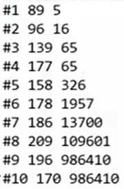
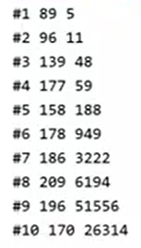
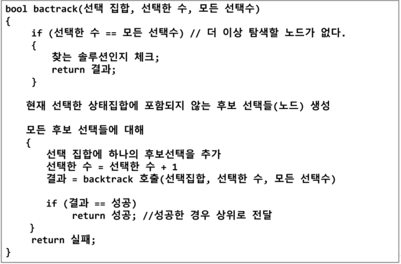
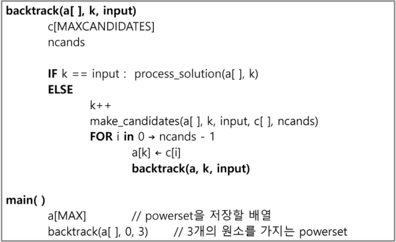
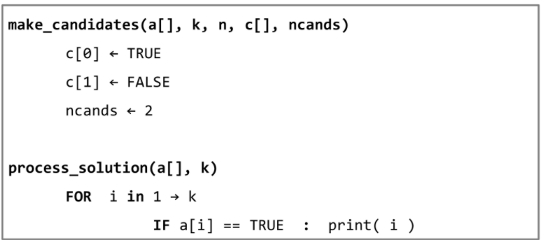
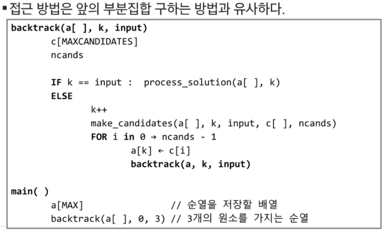
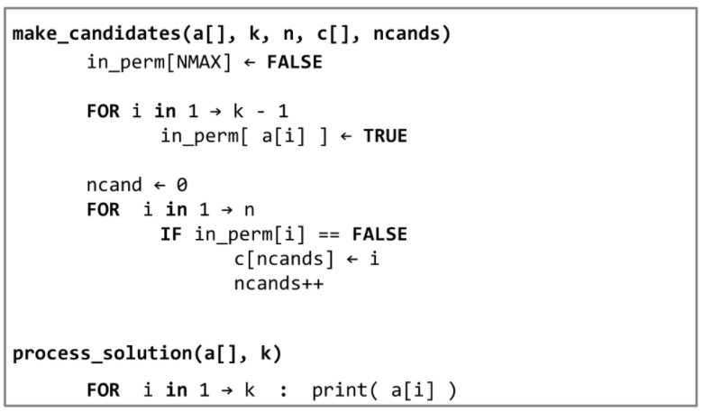

# Algorithm Backtracking

[TOC]


## :zero: Backtracking

### 1. 개념

#### 1) 기본개념

* 여러 가지 선택지(옵션)들이 존재하는 상황에서 한가지를 선택한다
* 선택이 이루어지면 새로운 선택지들의 집합이 생성된다
* 이런 선택이 반복하면서 최종 상태에 도달한다
  * 올바른 선택을 계속하면 목표 상태(goal state)에 도달


#### 2) :star: 백트래킹과 깊이 우선 탐색(DFS)과의 차이

* 어떤 노드에서 출발하는 경로가 해결책으로 이어질 것 같지 않으면, 더 이상 그 경로를 따라가지 않음으로써 시도의 횟수를 줄임(Prunning:가지치기)
* DFS이 모든 경로를 추적하는데 비해 백트래킹은 불필요한 경로를 조기에 차단
* DFS을 하기에는 경우의 수가 너무 많다. 즉, `N!`가지의 경우의 수를 가진 문제에 대해 깊이 우선 탐색을 가하면 당연히 처리 불가능
* 백트래킹 알고리즘을 적용하면, 일반적으로 경우의 수가 줄어들지만 이 역시 최악의 경우엔 여전히 지수함수 시간(Exponential Time)을 요하므로 처리가 불가능하다


#### 3) 당첨 리프 노드 찾기


### 2. 문제 제시: N-Queen 문제

#### 1) 기본 구조

* n*n 서양 장기판에서 배치한 Queen들이 서로 위협하지 않도록 n개의 Queen을 배치하는 문제
  * 어떤 두 Queen도 서로를 위협하지 않아야 한다

* Queen을 배치한 n개의 위치는?


#### 2) 8-Queens 문제

* 후보 해의 수

  

* 실제 해의 수

* 즉, 44억 개가 넘는 후보 해의 수 속에서 92개를 최대한 효율적으로 찾아내야 함


#### 3) 4-Queens 문제


* 루트 노드에서 리프(leaf)노드까지의 경로는 해답후보(candidate solution)가 되는데, DFS를 하여 그 해답후보 중에서 해답을 찾을 수 있다
* 그러나, 이 방법을 사용하면 해답이 될 가능성이 전혀 없는 노드의 후손 노드(descendant node)들도 모두 검색해야 하므로 **비효율적**이다
* 백트래킹
  * 어떤 노드의 유망성을 점검한 후에 유망(promising)하지 않다고 결정되면 그 노드의 부모로 되돌아가(backtracking) 다음 자식 노드로 간다.
  * 어떤 노드를 방문하였을 때 그 노드를 포함한 경로가 해답이 될 수 있으면 그 노드는 유망하지 않다고 하며, 반대로 해답의 가능성이 있으면 유망하다고 한다.
  * **가지치기(pruning)**: 유망하지 않는 노드가 포함되는 경로는 더 이상 고려하지 않는다.
  * 절차
    1. 상태 공간 트리의 깊이 우선 검색을 실시
    2. 각 노드가 유망한지를 점검한다
    3. 만일 그 노드가 유망하지 않으면, 그 노드의 부모 노드로 돌아가서 검색 계속


### 3. 일반 백트래킹 알고리즘

#### 1) Pseudo Code

```python
checknode (node v):
    IF promising(v)
    	IF there is a solution at v
        	write the solution
        ELSE
        	FOR each child u of v
            	checknode(u)
```


#### 2) 상태 공간 트리


#### 3) DFS vs 백트래킹

* DFS: 155노드

* 백트래킹: 27노드 :1st_place_medal:

* 예시: SWEA 5189. 전자카트

  * 경유지를 다 거친 다음에 전체비용 계산하는 방법

  ```python
  def nPr(i, N, s):
      global minV
  
      if i == N:
          s += arr[p[N-1]][0]
          if minV > s:
              minV = s
      elif s >= minV
          return
      else:
          for j in range(i, N):
              p[i], p[j] = p[j], p[i]
              nPr(i+1, N, s + arr[p[i-1]][p[i]])
              p[i], p[j] = p[j], p[i]
      return
  ```

  * 경유지가 결정이 될 때마다 비용을 계산하는 방법

  ```python
  # 2. 경유지가 결정이 될 때마다 비용을 계산하는 방법 ( = sol1 침고)
  def dfs(s, cnt, acc):
      global result
  
      if acc >= result:
          return
  
      if cnt == N - 1:
          acc += arr[s][0]
          result = min(result, acc)
  
      else:
          for w in range(1, N):
              if not visited[w]:
                  visited[w] = 1
                  dfs(w, cnt + 1, acc + arr[s][w])
                  visited[w] = 
      return
  ```

  * 재귀호출의 경우 (f'#{tc} {ans} {cnt}')

    * cnt: 정답 도출을 위해 몇 번 탐색했는지 나타냄

    

  * 백트래킹의 경우 (f'#{tc} {ans} {cnt}')

    

    


### 4. 


## :one: 상태공간트리

### 1. 개념


### 2. 구축 알고리즘

#### 1) 구축



#### 2) {1, 2, 3}의 powerset을 구하는 백트래킹 알고리즘

```python
backtrack(a[], k, input)
	c[MAXCANDIDATES]	# 후보군을 저장할 배열
    ncands # 후보의 수
    
```




 

make_candidates => bit배열을 만드는 것


#### 3) 백트래킹을 이용하여 순열 구하기





* 순열 순서
  * 자리교환
  * 사용한 숫자 표시
  * 사용하지 않은 목록 만들기


### 3. 연습문제

* {1, 2, 3, 4, 5, 6, 7, 8, 9, 10}의 powerset 중 원소의 합이 10인 부분집합을 모두 출력하시오


## :two: 트리

### 1. 개념

* 싸이클이 없는 **무향 연결** 그래프

  * 두 노드 사이에는 유일한 경로가 존재한다
  * 각 노드는 최대 하나의 부모 노드가 존재할 수 있다
  * 각 노드는 자식 노드가 없거나 하나 이상이 존재할 수 있다

* **비선형** 구조

  * 원소들 간 **1:n 관계**를 가지는 자료구조
  * 원소들 간에 계층관게를 가지는 **계층형** 자료구조

* 한 개 이상의 노드로 이루어진 유한 집합이며 다음 조건을 만족한다

  * 노드 중 부모가 없는 노드를 루트(root)라고 한다
  * 나머지 노드들은 n(>=0)개의 분리 집합 T1,...,TN으로 분리될 수 있다.

* 이들 T1, ... , TN은 각각 하나의 트리가 되며(재귀적 정의) 루트의 서브트리(subtree)라 한다.

  

* 하위개념

  * 노드(node): 트리의 원소. 정점(vertex)
  * 간선(edge): 노드를 연결하는 선
  * 루트노드(root node): 트리의 시작노드
  * 형제노드(sibling node): 같은 부모 노드의 자식 노드들
  * 조상노드: 간선을 따라 루트 노드까지 이르는 경로에 있는 모든 노드들
  * 서브트리: 부모 노드와 연결된 간선을 끊었을 때 생성되는 트리
  * 자손노드: 서브트리에 있는 하위 레벨의 노드들

  

  

  * 차수(degree)
    * 노드의 차수: 노드에 연결된 자식 노드의 수
      * B의 차수=2, C의 차수=1
    * 트리의 차수: 트리에 있는 노드의 차수 중 가장 큰 값
      * 트리의 차수: 3
    * 단말 노드(리프 노드): 차수가 0인 노드, 자식 노드가 없는 노드
  * 높이
    * 노드의 높이: 루트에서 노드에 이르는 간선 수. 노드의 레벨
      * B의 높이 = 1, F의 높이 = 2
    * 트리의 높이: 트리에 있는 노드의 높이 중 가장 큰 값, 최대 레벨
      * 트리의 높이: 3


### 2. 이진 트리(Binary Tree)

#### 1) 개념

* 모든 노드들이 최대 2개의 서브 트리를 갖는 특별한 형태의 트리

* 각 노드가 자식 노드를 최대한 2개 까지만 가질 수 있는 트리

  * 왼쪽 자식 노드(left child node)
  * 오른쪽 자식 노드(right child node)

* 예시

  


#### 2) 이진 트리 특성

* 레벨 i에서 노드의 최대 갯수는 `2^i`개
* 높이가 h인 이진 트리가 가질 수 있는 노드의 
  * 최소 갯수: `(h+1)`개
  * 최대 갯수: `(2^h+1 - 1)`개


#### 3) 이진 트리 종류

* 포화 이진 트리(Full Binary Tree)
  * 모든 레벨에 노드가 포화상태로 채워져 있는 이진 트리
* 완전 이진 트리(Complete Binary Tree)
  * 마지막 정점 번호 이전까지는 빈틈이 있으면 안됨
* 편향 이진 트리(Skewed Binary Tree)
  * 높이 h에 대한 최소 개수의 노드를 가지면서 한쪽 방향의 자식 노드만을 가진 이진트리


#### 4) 순회(traversal)

* 전위순회: VLR (왼쪽)
* 중위순회: LVR (가운데)
* 후위순회: LRV (오른쪽)


### 3. 트리의 표현

* 배열을 이용한 트리의 표현
* 단점


### 4. 이진 탐색 트리의 연산


## :three: 힙(heap)

### 1. 개념

* 


### 2. 힙 연산

#### 1) 삽입

#### 2) 삭제


### 3. 힙의 활용

