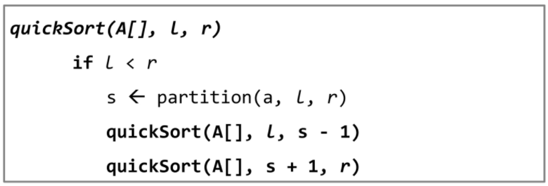
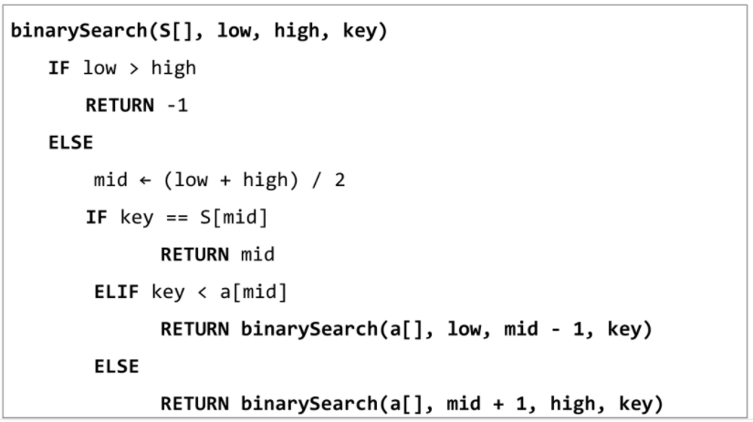

# Algorithm Divide and Conquer

[TOC]


## :zero: 분할 정복(Divide and Conquer)

### 1. 설계 전략


* 분할(Divide)
* 정복(Conquer)
* 통합(Combine)


```python
Iterative_Power(x, n)
	result <- 1
	
	for i in 1 -> n
		result <- result * x
	
	return result
```


### 2. 거듭 제곱 :question:


---


## :one: 병합 정렬(Merge Sort)

### 1. 개념

* 여러 개의 정렬된 자료의 집합을 병합하여 한 개의 정렬된 집합으로 만드는 방식
* 외부 정렬의 기본이 되는 정렬 알고리즘. 또한, 멀티 코어(Multi-Core) CPU나 다수의 프로세서에서 정렬 알고리즘을 병렬화하기 위해 병합 정렬 알고리즘이 활용됨
* 분할 정복 알고리즘 활용
  * 자료를 최소 단위의 문제까지 나눈 후에 차례대로 정렬하여 최종 결과를 얻어냄
  * top-down 방식
* 시간 복잡도 O(n log n)


### 2. 과정

* 병합 정렬 과정

  

  


* 알고리즘

  * 분할과정

    

  * 병합과정

    

    

    

### 3. 코드

* 분할과정

  ```python
  ```

  

* 병합과정

  ```python
  
  ```

  

## :two: 퀵정렬 (Quick Sort)

### 1. 개념

* 주어진 배열을 두 개로 분할하고, 각각을 정렬한다

* 퀵 정렬은 매우 큰 입력 데이터에 대해서 좋은 성능을 보이는 알고리즘

* 병합 정렬과 다른 점 2가지

  * 병합 정렬은 그냥 두 부분으로 나누는 반면에, 퀵 정렬은 분할할 때 기준 아이템(pivot item) 중심으로 이보다 작은 것은 왼편, 큰 것은 오른편에 위치시킨다
  * 각 부분 정렬이 끝난 후 병합정렬은 '병합'이라는 후처리가 필요하나, 퀵정렬은 필요로 하지 않는다

  

### 2. 과정

* 아이디어

  

* 알고리즘 :memo:

  

* Hoare-Partition 알고리즘

  * 단, 피봇의 위치를 어디로 하느냐에 따라 구현방법이 달라짐

  

* Lomuto-Partition 알고리즘

  

* 

### 3. 코드


## :three: 이진 검색(Binary Search)

### 1. 개념

* 자료의 가운데 있는 항목의 키 값과 비교하여 다음 검색의 위치를 결정하고 검색을 계속 진행
  * 목적 키를 찾을 때까지 이진 검색을 순환적으로 반복 수행함으로써 검색 범위를 반으로 줄여가면서 보다 빠르게 검색을 수행함
* 이진 검색을 하기 위해서는 자료가 정렬된 상태여야 한다.


### 2. 검색 과정

* 과정

  1. 자료의 중앙에 있는 원소를 고른다
  2. 중앙 원소의 값과 찾고자 하는 목표 값을 비교
  3. 목표 값이 중앙 원소의 값보다 작으면 자료의 왼쪽 반에 대해 새로 검색을 수행하고, 크다면 자료의 오른쪽 반에 대해 새로 검색을 수행
  4. 찾고자 하는 값을 찾을 대까지 1~3의 과정을 반복

* 예시

  * 이진 검색으로 7을 찾는 경우

    

  * 이진 검색으로 20을 찾는 경우

    


### 3. 알고리즘


* 반복구조

  

* 재귀구조

  


## :four: 분할 정복의 활용: 연습문제

* 배열의 데이터를 퀵 정렬하는 함수를 작성하고 테스트 해보시오

* 입력

  ```txt
  11, 45, 23, 81, 28, 34
  11, 45, 22, 81, 23, 34, 99, 22, 17, 8
  1, 1, 1, 1, 1, 0, 0, 0, 0, 0
  ```

* 예시코드

  * quicksort기본

    ```python
    def qsort(A,1, r):
        if 1 < r:
            s = hoare(A, 1, r)
            qsort(A, 1, s - 1)
            qsort(A, s + 1, r)
    # A = [7, 2, 5, 3, 1, 4, 1]
    # A = [1, 2, 3, 4, 5, 6, 7]
    # A = [7, 6, 5, 4, 3, 2, 1]
    A = [7, 1, 1, 1, 7]
    N = len(A)
    qsort(A, 0, N-1)
    print(A)
    ```

    

  * partition

    ```python
    def hoare(A, 1, r):
        P = A[1]
        i, j = 1, r
        while i <= j:
            while i <= j and A[i] <= p:
                i += 1
            while i <= j and A[i] >= p:
                j -= 1
            if i < j:
                A[i], A[j] = A[j], A[i]
        A[i], A[j] = A[j], A[1]
        return j
    ```

    