# Algorithm Graph

[TOC]

## :zero: 학습 목표

* 실 세계 문제를 그래프로 추상화해서 해결하는 방법 학습

* 그래프 탐색 기법인 DFS, BFS

* 상호배타집합(Disjoint-Sets)의 자료구조

* 최소 신장 트리(Minimum Spanning Tree)에 대한 이해 이해

  * 탐욕 기법을 이용해 그래프에서 최소 신장 트리를 찾는 알고리즘 학습

* 그래프의 두 정점 사이의 최단 경로 찾는 방법

  

## :one: 그래프 기본

### 1. 기본 개념

* 그래프는 아이템(사물 또는 추상적 개념)들과 이들 사이의 연결 관계 표현
* 그래프는 정점(Vertext)들의 집합과 이들을 연결하는 간선(Edge)들의 집합으로 구성된 자료구조
  * |V|: 정점의 개수
  * |E|: 그래프에 포함된 간선의 갯수
    * |V|개의 정점을 가지는 그래프는 최대 |V| (|V| - 1)/2 간선이 가능
    * 예) 5개 정점이 있는 그래프의 최대 간선 수는 10(=5*4/2)
* 선형 자료구조나 트리 자료구조로 표현하기 어려운 N: N 관계를 가지는 원소들을 표현하기에 용이하다


### 2. 그래프 유형

* 무향 그래프(Undirected Graph)

  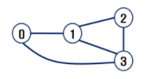

  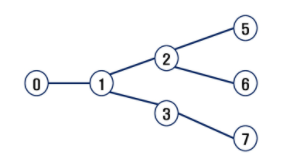

* 유향 그래프(Directed Graph)

  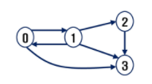

* 가중치 그래프(Weighted Graph)

  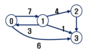

* 사이클 없는 방향 그래프(DAG, Directed Acyclic Graph)

  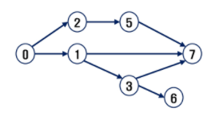

* 완전 그래프

  * 정점들에 대해 가능한 모든 간선들을 가진 그래프

    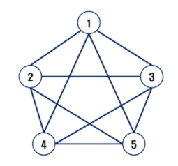

* 부분 그래프

  * 원래 그래프에서 일부의 정점이나 간선을 제외한 그래프


### 3. 하위 개념

* 인접(Adjacency)
  * 두 개의 정점에 간선이 존재(연결됨)하면 서로 인접해 있다고 한다
  * 완전 그래프에 속한 임의의 두 정점들은 모두 인접해 있다
  *  
* 그래프 경로
  * 경로란 간선들을 순서대로 나열한 것
  * 경로 중 한 정점을 최대한 한번만 지나는 경로를 **단순경로**라고 한다
  * 시작한 정점에서 끝나는 경로를 **사이클(Cycle)**이라고 한다.
* 그래프 표현
  * 간선의 정보를 저장하는 방식, 메모리나 성능을 고려해서 결정
* 인접 행렬
  * |V| x |V| 크기의 2차원 배열을 이용해서 간선 정보를 저장
  * 배열의 배열(포인터 배열)
  * 인접 행렬의 단점: 인접 관계를 파악하기 어려움 
* 인접 리스트
  * 각 정점마다 해당 정점으로 나가는 간선의 정보를 저장
  * 각 정점에 대한 인접 
* 간선의 배열
  * 간선(시작 정점, 끝 정점)을 배열 연속적으로 저장
  * 


### 4. 인접 행렬 연습

````python
# 양방향 그래프의 경우
```
# 6: 마지막 정점번호, 8: 간선 수
6 8
0 1 0 2 0 5 0 6 5 3 4 3 5 4 6 4
```
V, E = map(int, input().split())
arr = list(map(int, input().split()))

adjM = [[0] * (V+1) for _ in range(V+1)]
adjL = [[] for _ in range(V+1)]

for i in range(E):
    n1, n2 = arr[i*2], arr[i*2+1]
    adjM[n1][n2] = 1
    adjM[n2][n1] = 1 
    
    
````

```python
# 단방향 그래프의 경우
# 이 부분에서 결정되는 것

for i in range(E):
    n1, n2 = arr[i*2], arr[i*2+1]
    adjM[n1][n2] = 1
	# 무향 그래프인 경우 adjM[n2][n1] = 1 
    
```


### 5. 인접 리스트 연습

```python
for i in range(E):
    n1, n2 = arr[i*2], arr[i*2+1]
    adjL[n1].append(n1)
    adjL[n2].append(n2) # 무향 그래프의 경우
```

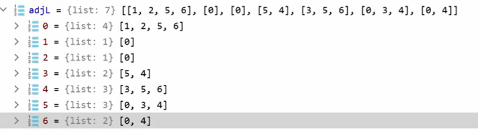

* 0은 [1, 2, 5, 6]과 연결된다
* 1은 [0]과 연결...


## :two: 그래프 탐색(그래프 순회)

### 1. DFS(Depth First Search)

#### 1) 특성

* 시작 정점의 한 방향으로 갈 수 있는 경로가 있는 곳까지 깊이 탐색하다, 더 이상 갈 곳이 없게 되면 가장 마지막에 만났던 갈림길 간선이 있는 정점으로 되돌아와서 다른 방향의 정점으로 탐색을 계쏙 반복하여 결국 모든 정점을 방문하는 순회법
* 후입선출(Last in First out: LIFO)
* 재귀


#### 2) DFS 알고리즘

* 재귀

  * 경로의 갯수를 세려면, 한 번 센 이후에 다시 0으로 갱신해야 한다
  * 

  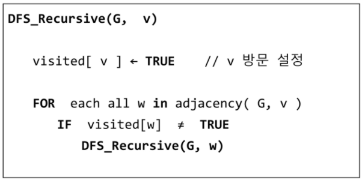

* stack

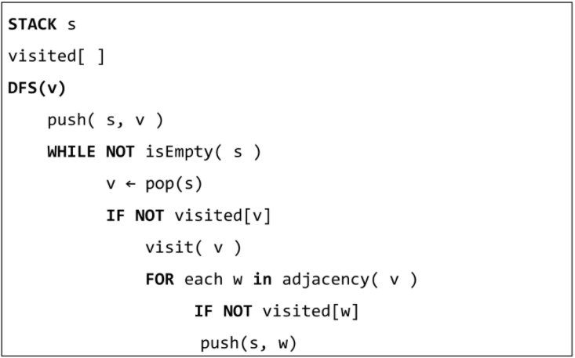

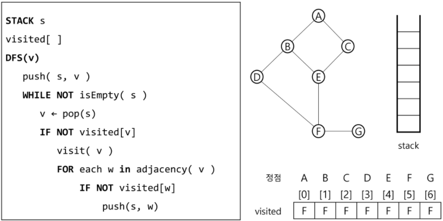

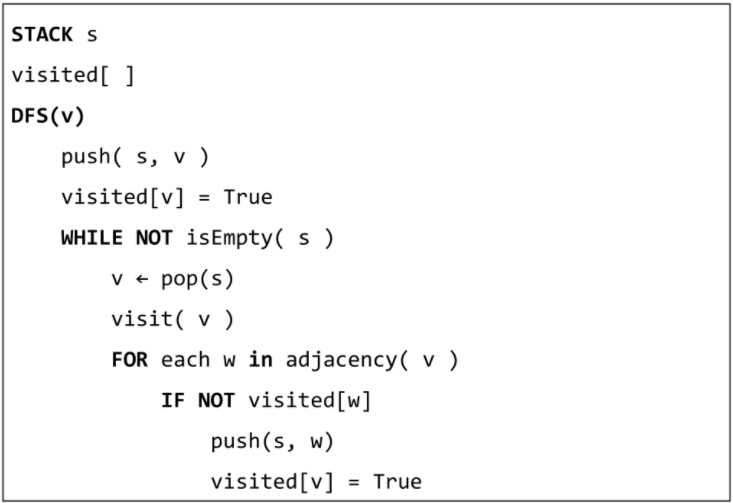


#### 2) 스택(stack)

* 물건을 쌓아 올리듯 자료를 쌓아 올린 형태의 자료구조
* 선형구조
  * 자료간의 관계가 1대 1의 관계를 갖는다
* 비선형구조
  * 자료간 관계가 1대 N의 관계를 갖는다(예:트리)
* 후입선출(LIFO)


#### 3)  스택의 구현


#### 4) 연습문제

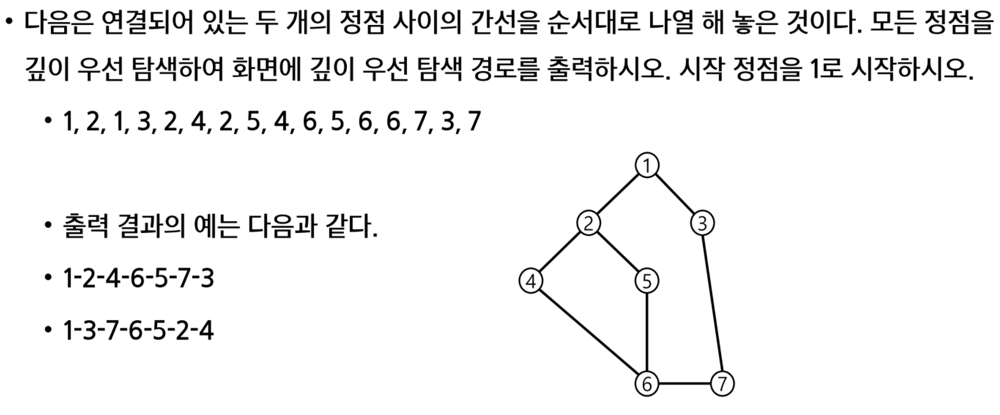


### 2. BFS(Breadth First Search)

#### 1) 개념

* 탐색 시작점의 인접한 정점들을 먼저 모두 차례로 방문한 후에, 방문했던 정점을 시작점으로 하여 다시 인접한 정점들을 차례로 방문하는 방식
* 인접한 정점들에 대해 탐색한 후, 차례로 다시 BFS를 진행해야 하므로 선입선출 형태의 자료구조인 큐를 활용

#### 2) 큐(Queue)

* 스택과 마찬가지로 삽입과 삭제의 위치가 제한적인 자료구조

  * 큐의 뒤에서는 삽입만 하고, 큐의 앞에서는 삭제만 이루어지는 구조

* 큐에 삽입한 순서대로 원소가 저장되어, 가장 먼저 삽입된 원소는 가장 먼저 삭제된다

  * 선입선출구조(FIFO: First In First Out)

    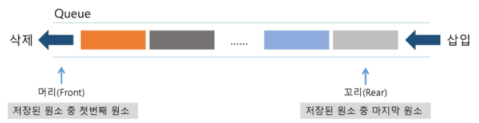

* 기본 연산

  * 삽입(enQueue)

  * 삭제(deQueue)

    

* 큐의 연산과정

  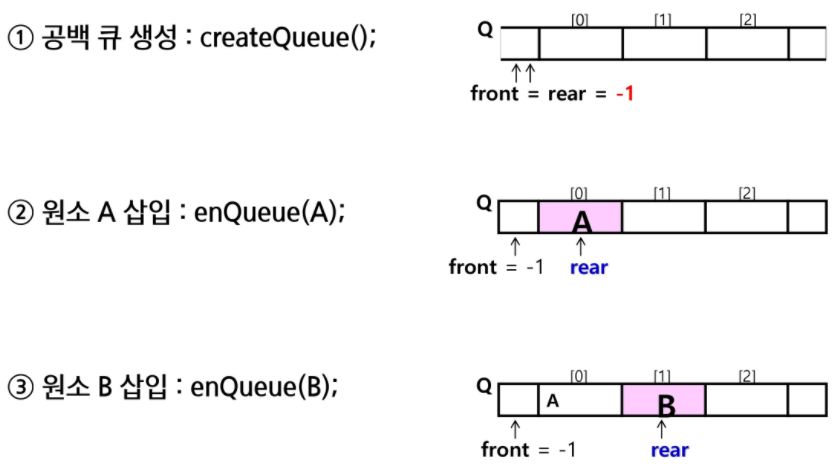

  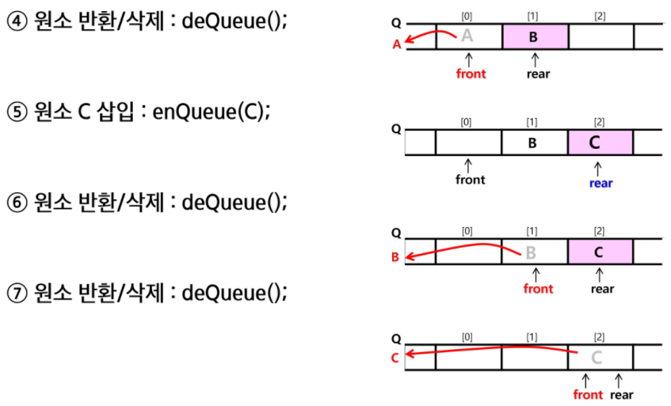

  

#### 3) 큐의 구현

* 삽입: enQueue(item)

  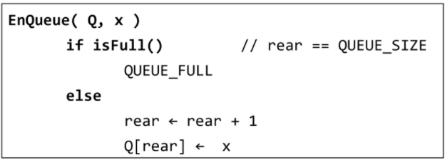

  * 마지막 원소 뒤에 새로운 원소를 삽입하기 위해 
    * rear 값을 하나 증가시켜 새로운 원소를 삽입할 자리를 마련
    * 그 인덱스에 해당하는 배열원소 Q[rear]에 item을 저장

* 삭제: deQueue(item)

  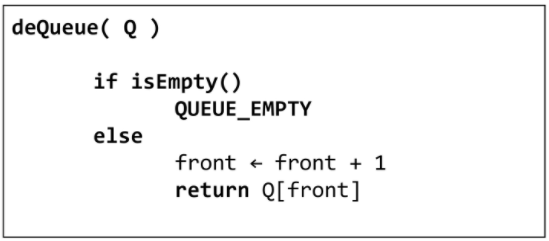

  * 가장 앞에 있는 원소를 삭제하기 위해
    * front 값을 하나 증가시켜 큐에 남아있게 될 첫번째 원소 이동
    * 새로운 첫번째 원소를 리턴함으로써 삭제와 동일한 기능

* 공백상태 및 포화상태 검사: isEmpty().isFull()

  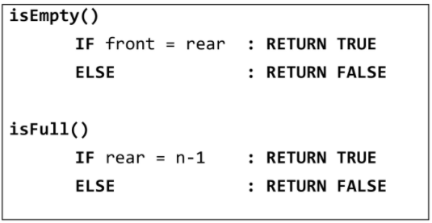

  * 공백상태: front = rear
  * 포화상태: rear = n-1 (n: 배열의 크기, n-1: 배열의 마지막 인덱스)


#### 4) 연습

* 세 개의 데이터 1, 2, 3을 차례로 큐에 삽입하고, 큐에서 세 개의 데이터를 차례로 꺼내서 출력한다.
  * 1, 2, 3이 입력
  * 1, 2, 3이 출력


## :three: 서로소 집합들


## :four: 최소 비용 신장 트리(MST)

### 1. 개념

* 그래프에서 최소 비용 문제
  * 모든 정점을 연결하는 간선들의 가중치의 합이 최소가 되는 트리
  * 두 정점 사이의 초소 비용의 경로 찾기
* 신장 트리
  * n개의 정점으로 이루어진 무방향 그래프에서 n개의 정점과 n-1개의 간선으로 이루어진 트리
* 최소 신장 트리(Minimum Spanning Tree)
  * 무방향 가중치 그래프에서 신장 트리를 구성하는 간선들의 가중치의 합이 최소인 신장 트리
* MST를 찾는 알고리즘
  * Prim 알고리즘
  * Kruskal 알고리즘 


### 2. Prim 알고리즘

* 하나의 정점에서 연결된 간선들 중에서 하나씩 선택하면서 MST를 만들어 가는 방식

  * 임의 정점을 하나 선택해서 시작
  * 선택한 정점과 인접하는 정점들 중의 최소 비용의 간선이 존재하는 정점을 선택
  * 모든 정점이 선택될 때까지 1, 2 과정을 반복

* 서로소인 2개의 집합(2 disjoint-sets) 정보를 유지

  * 트리 정점들(tree vertices) - MST를 만들기 위해 선택된 정점들
  * 비트리 정점들(nontree vertices) - 선택 되지 않은 정점들

* 알고리즘

  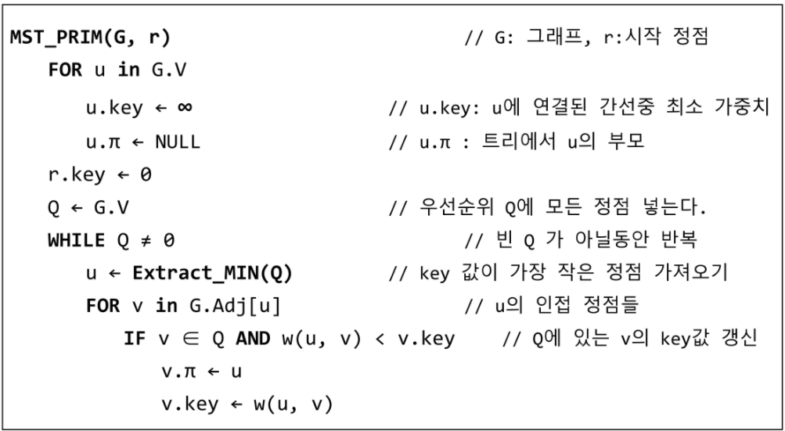

* 코드

  ````python
  ```
  6 11
  0 1 32
  0 2 31
  0 5 60
  0 6 51
  1 2 21
  2 4 46
  2 6 25
  3 4 34
  3 5 18
  4 5 40
  4 6 51
  ```
  
  def prim1(r, V):
      MST = [0] * (V+1)		# MST 포함여부
      key = [10000] * (V+1)
      key[r] = 0
      for _ in range(V):
          u = 0
          minV = 10000			# 큰 값으로 설정
          for i in range(V+1):	
              if MST[i] == 0 and key[i] < minV:
                  u = i
                  minV = key[i]
          MST[u] = 1	# 정점 u를 MST에 추가
          # u에 
       
  V, E = map(int, input().split()) 
  adjM = [[0] * (V+1) for _ in range(V+1)]
  # adjL = [[] for _ in range(V+1)]
  
  for _ in range(E):
      u, v, w = map(int, input().split())
      adjM[u][v] = w
      adjL[v][u] = w
      adjL[u].append((v, w))
      adjL[v].append((u, w))
      
  print(prim1(0, V))
  ````

  


### 3. KRUSKAL 알고리즘

* 간선을 하나씩 선택해서 MST를 찾는 알고리즘

  1. 최초, 모든 간선을 가중치에 따라 오름차순으로 정렬
  2. 가중치가 가장 낮은 간선부터 선택하면서 트리를 증가
     - 사이클이 존재하면 다음으로 가중치가 낮은 간선 선택
  3. n-1개의 간선이 선택될 때까지 2를 반복

* 알고리즘

  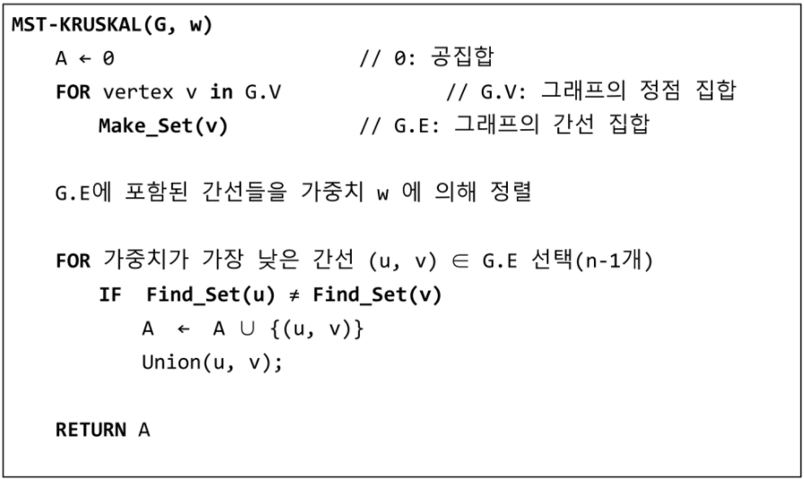

* 코드

  ```python
  ```

  


## :five: 최단 경로

### 1. 개념

* 최단 경로 정의
  * 간선의 가중치가 있는 그래프에서 두 정점 사이의 경로들 중에서 간선의 가중치의 합이 최소인 경로
* 하나의 시작 정점에서 끝 정점까지의 최단경로
  * 다익스트라(dijkstra)알고리즘
    * 음(-)의 가중치를 허용하지 않음
  * 벨만-포드(Bellman-Ford) 알고리즘
    * 음의 가중치 허용
* 모든 정점들에 대한 최단 경로
  * 플로이드-워셜(Floyd-Warshall) 알고리즘


### 2. 다익스트라(Dijkstra) 알고리즘

#### 1) 기본개념

* 시작 정점에서 거리가 최소인 정점을 선택해 나가면서 최단 경로를 구하는 방식
* 시작정점(s)에서 끝정점(t)까지의 최단 경로에 정점 x가 존재한다
* 이 때, 최단 경로는 s에서 x까지의 최단 경로와 x에서 t까지의 최단경로로 구성된다
* 탐욕 기법을 사용한 알고리즘으로 MST의 프림 알고리즘과 유사하다


#### 2) 알고리즘

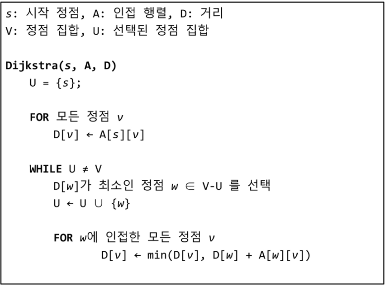


### 3. 벨만-포드(Bellman-Ford) 알고리즘

* 

### 4. 


제가 월요일 월말평가 1번 문제를 못 풀어서 아무런 희망 없이 과락이 예상되는데 나머지 월말평가에 따른 결과들이 너무 걱정스럽고 제 자신에게 너무 실망스럽습니다 ㅠㅠ 기본 소양이라는 알고리즘을 이렇게나 못하는데 애초에 개발자로서의 취업을 희망하는 게 맞는지 하는 근본적인 의문도 많이 들구요. 이왕 새로운 것을 시작한거 개발자로 커리어를 시작하고 싶은데, 사실 현재로써는 sw 직군 지원조차 어렵고(전공 제한), IM도 겨우 통과한 저로서는 코테 역시 너무 막막합니다. 그리고 솔직히 말씀드리자면, 비전 없는 중소기업에 QA같은 직무로 가고 싶지는 않아요ㅠㅠ 저도 제 개발을 하고 싶고 발전할 수 있는 곳으로 취업하고 싶은데 일단 그러기 위한 제 역량이 너무 바닥을 치는 게 눈에 보여서 슬픕니다ㅠㅠ 제 목표와 현실의 괴리가 절 힘들게해요... 나름대로 비장한 각오로 싸피를 시작했다고 생각했는데, 지금 돌이켜보면 정말 무지에서 오는 근거 없는 자신감이었던 것 같습니다. 저 취업도 취업인데 무엇보다 싸피 2학기 갈 수 있을까요 교수님...ㅠㅠ 이런 페이스로 제가 진짜 개발자가 될 수 있긴 한가요? 문제를 더 풀고 싶지만 제 시간에 숙제도 다 못 끝내는데 이게 의미가 있나 싶고.. 싸피 진도 말고 내 페이스로 천천히 해나가자니 월말평가와 과목평가를 무시할 수는 없고 중간에서 이도저도 못하고 있는 애매한 느낌이 듭니다. 


문제를 많이 보고 익숙해져야 한다는 것 이해하고 공감합니다. 그리고 문제 푸는데 시간을 지나치게 많이 들이지 않아야 한다는 조언도 새겨듣고 다른 사람들의 코드를 많이 참고하고 있는데, 일단 그 사람들의 코드 자체를 놓고 이해하는데도 아주 오랜 시간이 걸립니다 파이썬 튜터 켜놓고 혼자 배열 그리고 코드 따라 움직이는거 그리면서 앉아있으면 두세시간이 훌쩍 지나가구요 

