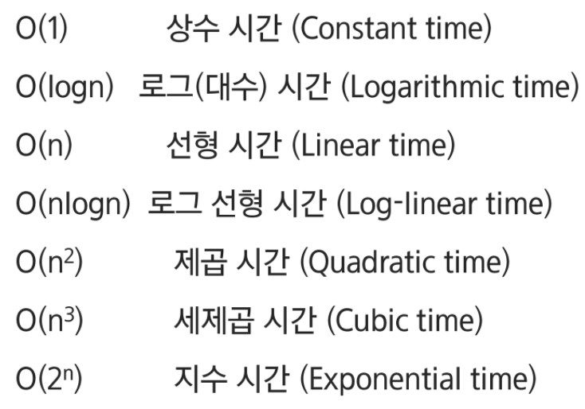

# Algorithm Start

[TOC]

## :one: SW 문제 해결

## :two: :star: 복잡도 분석

### 1. 

### 2.

### Big-Oh 표기

* 복잡도의 점근적 상한을 나타냄

### Big-Omega 표기

* 복잡도의 점근적 하한을 나타냄
* 최소 이만한 시간은 걸린다

## :three: 표준 입출력 방법

### 1. Python3 표준입출력

#### 1) 입력

* Raw 값의 입력: input()
  * 문자열로 취급
* Evaluated 값 입력: eval(input())
  * 

#### 2) 출력

### 2. 

## :four: 비트연산

## :five: 진수 

## :six: 실수

