# Computational Thinking

## :zero: OVERVIEW

## :one: 논리

### 1. 논리연산자

* 부정(not): ~

* 논리합(or): V

* 논리곱(and): ^

* 배타적논리합(exclusive or): ㊉
  * p, q 중 하나만 참일 때 참이 되는 명제

* 조건(condition): ->

* 쌍방조건(bicondition): <->

* 기타: nand, nor

### 2. 진리표(truth table)

* 모든 명제들의 진릿값이 가능한 경우를 모두 나열한 표

### 3. 증명(proof)

* 연역법
* 귀납법
* 수학적귀납법
  * basis
    * n0 성립함을 보이고
  * hypothesis
    * n=k 성립한다고 가정하고
  * step
    * n = k+1 성립하는지 보이면 성립된다.
* 모순증명법

### 4. 수와표현

* 어떤 값 n 을 표현하기 위해서는 몇 개의 비트가 필요할까?

* 2^k - 1 >= n이 성립해야 한다

  * 즉, 2^k >= n +1

* k >= log(n+1)

  * x = logn 

    * x와 n을 비교하면 x가 더 작고, n이 커질수록 엄청나게 달라진다
    * 100자리로 표현할 수 있는 10진수 값은 읽을 수도 없을 정도로 큰 값이다
    * 컴퓨터 분야에서 로그의 밑은 항상 2

  * 2^x = n 은 같은 말

    

* 2진수 표현에서 logn 비트로 표현할 수 있는 숫자 범위는?
  * k = log n 비트
  * 2^k = n
  * 
  * 

등비수열의 합

2를 몇번 곱해야 K가 되는건지!

'

조합의 재귀적 정의

'

6C3 = 6장 중에 3장을 골라

13장씩 무늬 4종류 숫자 같은거 4종류

나중에 중복되는 카드를 삭제해주세요!

## :three:  순열과 조합

### 1. 순열

* 순서가 있는 것
* 예시: 5명의 사람들이 있다고 가정할 때, 각각 다른 순서로 설 수 있는 경우의 수를 구하여라(5!)

### 2. 조합

* 순서가 없는 것
* 예시: 

### 3. 역함수

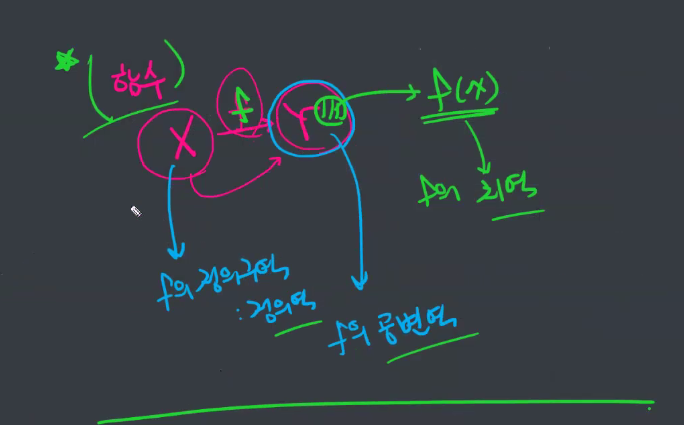

일대일함수

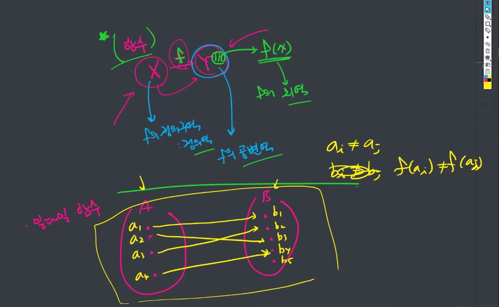

전사함수: f의 치역이 b와 일치하는 것을 말함

f(a)가 모든 B에 대해 일치하는가?

전사함수가 아니면 역함수를 만들수가 없다. 일단 다 일치해야됨.

즉, a의 갯수랑 b의 갯수가 같아야 된다는 것

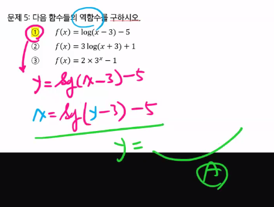

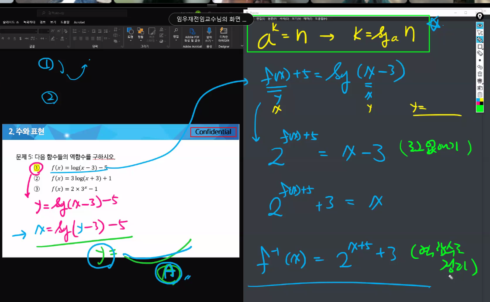

## :100: Big O Notation

### 1. 기본 계산 순서

1. 최고차항이 아닌 애들을 무시하라
   - 예시: `f(x) = 3x^2 + fx + 1` 에서 `3x^2`만 고려
2. 상수를 배제하라
   * `x^2`

3. O에다가 넣어줍니당
   * `O(x^2)`

### 2. :100: 연습문제

`T(n) = T(n-1) + 1`

1. T(n)에 관한 식을 정리해서, 일반화된 식으로 만듦(k)
2. T(x)에 대한 식이 n, k에 관한 식으로 바뀐다
   - k = 각각의 시도
3. 여기에서, 빅오 표기법으로 바꾸기 위한 과정을 진행
   1. 최고차항만 남기고
   2. 상수 날리고
4. k에 관해서 일반화된 식에 적용해서, 정리한 다음 그걸 O()를 씌우고 n에 관한 식으로 표기

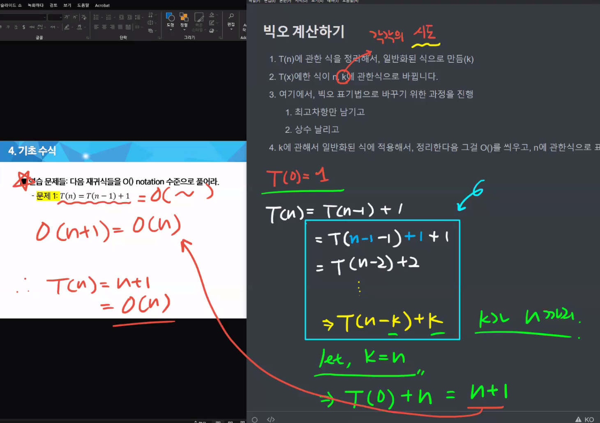

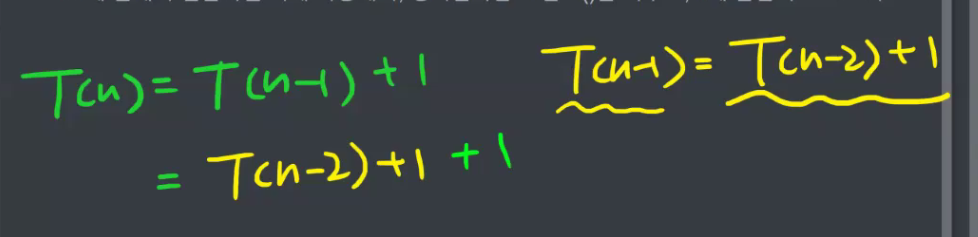

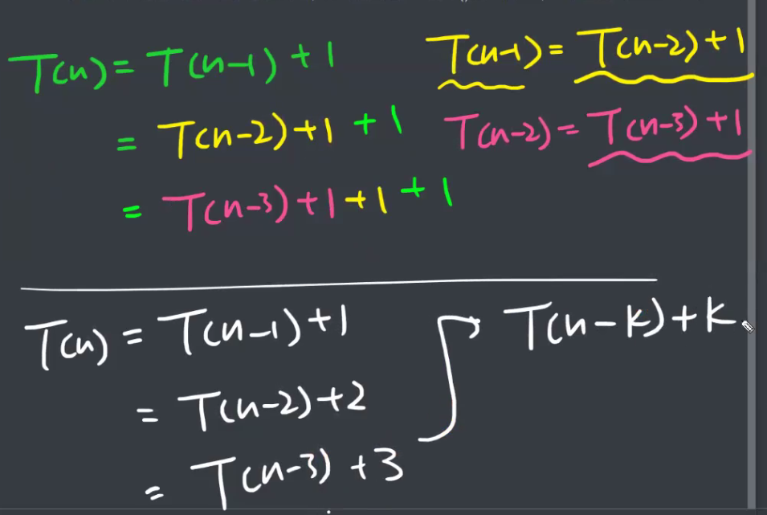

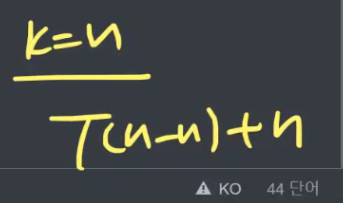

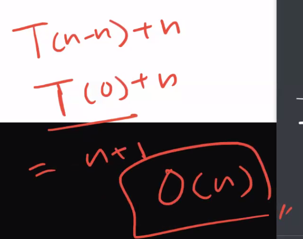

## Memoization과 DP 차이

* Memoization은 따로 저장해서 꺼내쓰고있음
* DP는 그냥 들어왔을 때 첫번째부터 다시 계산 후 반환

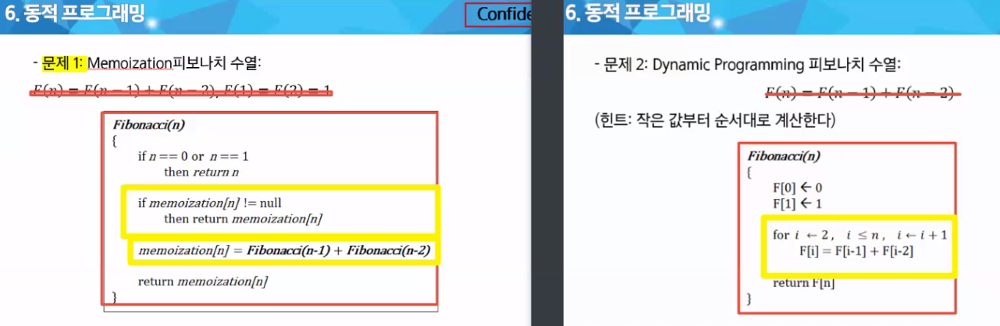

* Memoization

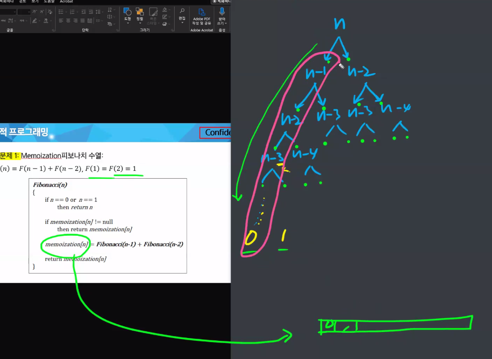

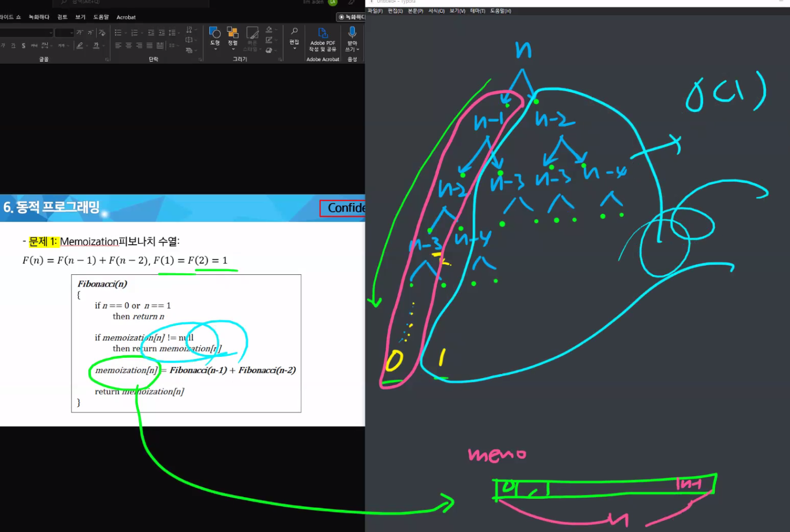

메뉴 배열이 다 차면, 더이상 넣지 않고 바로 반환하므로 n번 까지만 보면된다. 

O(n)

* DP

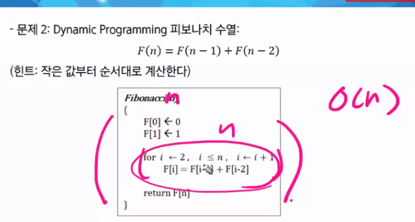

반복문이 n번 돌기 때문

n자리에 10 넣어본 후 for 문 찾아보세요

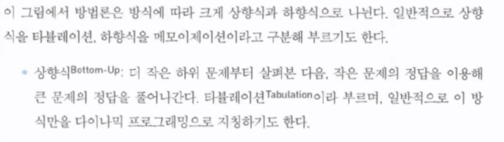

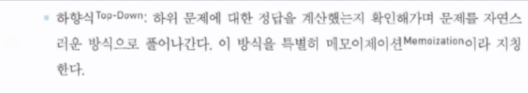

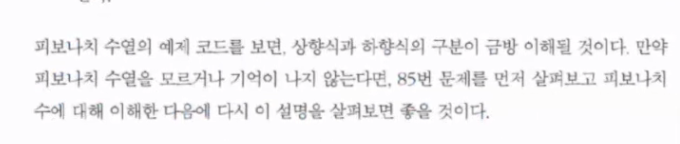

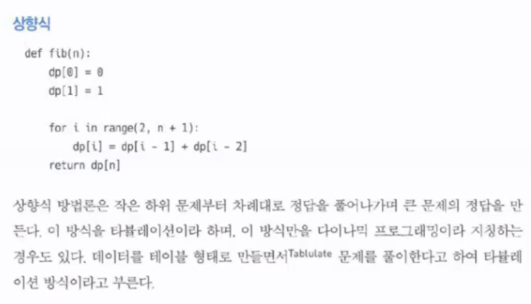

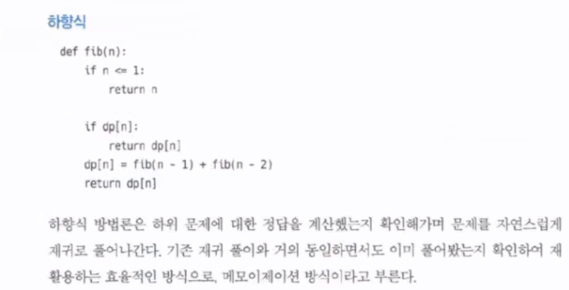

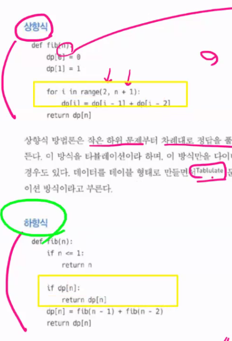

* 재귀는 안 푸셔도 괜ㅊ낳습ㅈ니다

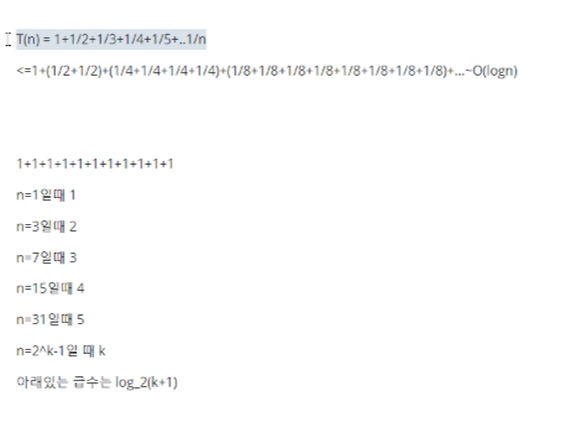

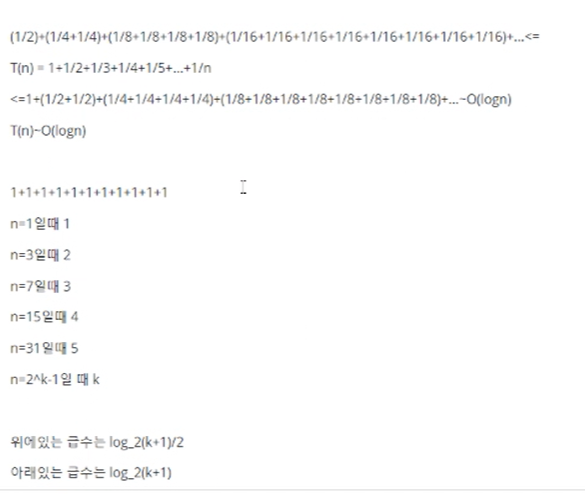

