# DB N:M

[TOC]

## :one: Intro

### 1. 병원 진료 기록 시스템을 통한 M:N 학습

* 환자와 의사가 사용하는 병원 진료 기록 시스템 구축

  * 객체: 환자와 의사
  * 관계 표현?

* 시작하기 전

  * 모델링은 현실 세계를 최대한 유사하게 반영하기 위한 것

  * 우리 일상에 가까운 예시를 통해 DB를 모델링하고, 그 내부에서 일어나는 데이터의 흐름을 어떻게 제어할 수 있을지 고민해보기 

  * 기본 세팅

    ```shell
    $ python -m venv venv
    $ source venv/Scripts/activate
    $ python managae.py makemigrations
    $ python manage.py migrate
    $ python manage.py shell_plus
    # cls 하면 shell_plus에서 screen clear 됨
    ```

    

### 2. 1:N의 한계

* 1:N 모델 관계 설정

  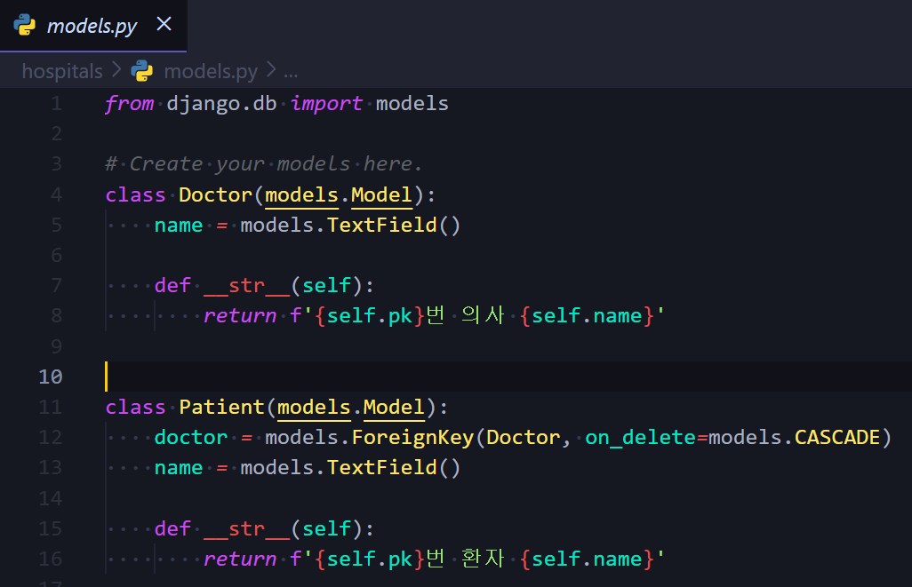

* migration 후 `shell_plus` 실행

  * `sample_code/ex_1.py`에서 code 한줄씩 복사해서 shell_plus에 입력

    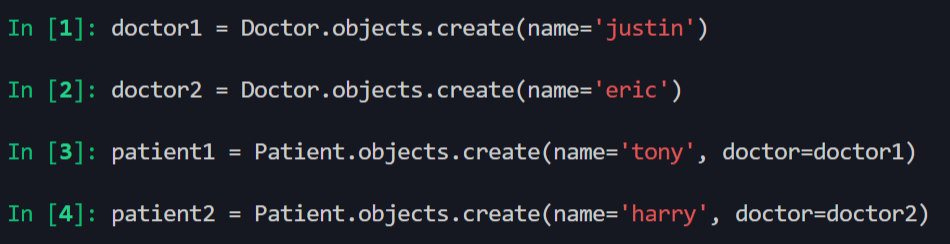

  * 저장된 인스턴스 확인

    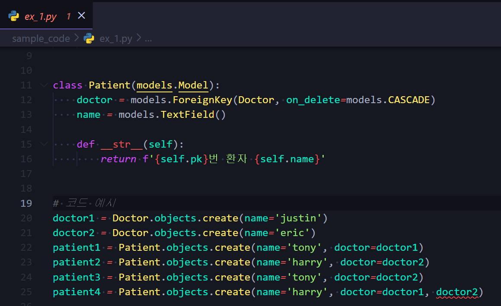

    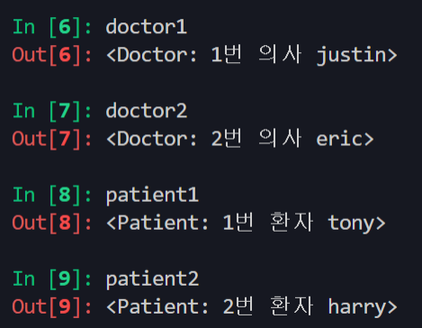

* 한계:

  * 1번 환자(tony)가 1번 의사의 진료를 마치고, **2번 의사에게도 방문**하려고 한다면 **새로운 예약**을 생성해야 한다

  * 기존을 예약을 유지한 상태로 새로운 예약을 생성

  * 새로 생성한 3번 환자(tony)는 1번 환자(tony)와 다름 :heavy_check_mark: 여기까진 OK

  * 이렇게 두 줄 쓰기 싫어서, harry가 한번에 두 의사에게 진료를 받고자 함

  * 하나의 외래 키에 2개의 의사 데이터를 넣을 수 없음

    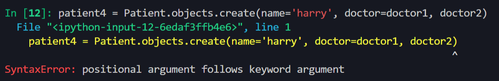

    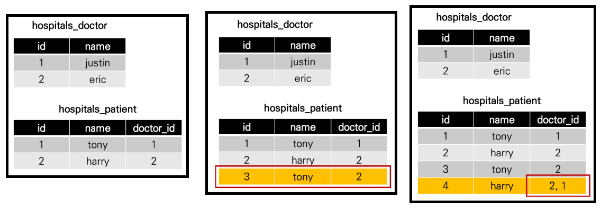

  * 새로운 예약을 생성하는 것이 불가능

    * 새로운 **객체**를 생성해야 한다

  * 여러 의사에게 진료 받은 기록을 환자 한 명에 저장할 수 없음

    * 외래 키에 '1, 2' 형식의 데이터를 사용할 수 없음


### 3. 중개 모델(Associative Model)

* 중개 모델(또는 중개 테이블, Associative Table) 작성

  * 1:N 모델과는 달리, class `Doctor`, `Patient` 에 외래키(Foreign Key)가 설정되어 있지 않음
  * 대신, `Reservation`이라는 model class에 doctor와 patient 에 대한 외래키 설정됨
    * 즉, doctor와도 1:N의 관계, patient와도 1:N의 관계
    * 각각의 모델에 대한 외래키 2개를 가지고 있는 중개 테이블

  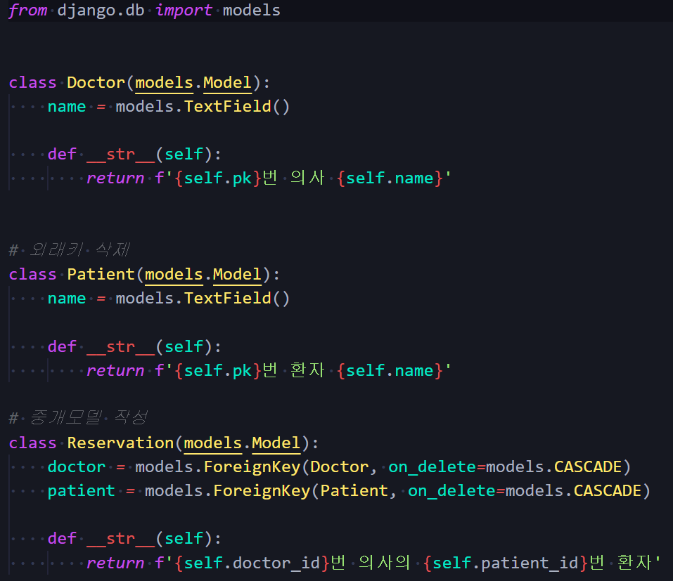

* 중개 테이블 생성됨

  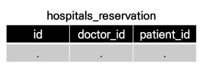

  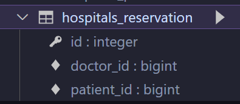

* 중개 모델과의 모델 관계 확인

  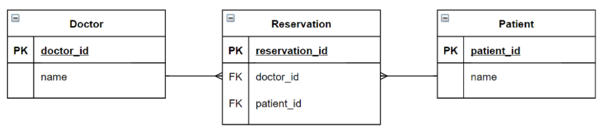

  * 데이터베이스 초기화/마이그레이션 및 shell_plus 실행

    * 초기화: migrations/숫자 있는 파일 지워주기 + db.sqlite3 지우기
    * 새로운 models.py (중개테이블) 를 만들어주기 (`sample_code/ex_2.py`내 models 복사붙여넣기)
    * makemigrations, migrate 해주고 shell_plus 켜주기

  * 중개 모델의 입장에서 예약을 잡으려면, 두 개의 외래키가 필요함

  * 해당 테이블을 통해서 예약 상황을 확인하려면

    * 인스턴스 생성

    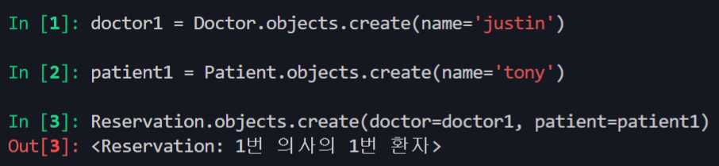

    * Reservation(외래키 O, N) - Doctor(외래키 X, 1) 

    * Reservation(외래키 O, N) - Patient(외래키 X, 1)

    * 따라서 외래키가 없는 대상(Doctor, Patient)이 외래키가 있는 대상(Reservation)을 참조 하는 것

      * **역참조**

        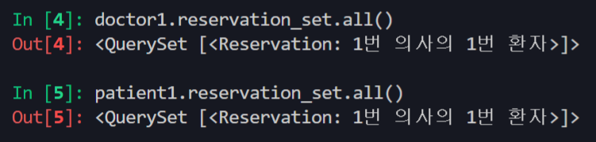

      * `_set` 이라는 related manager를 장고가 만들어 줌

      * `reservation_set` 이라는 매니저가 만들어 짐

  * 예약 추가

    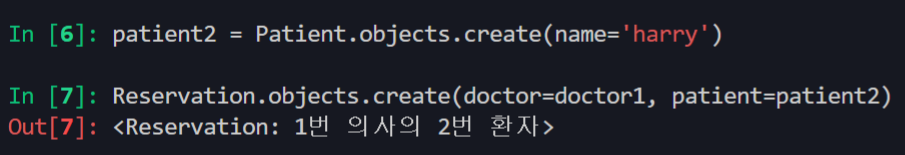

    * 의사 입장에서 조회시(역참조)

      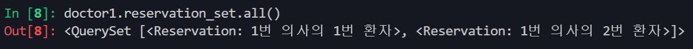

    * 환자 입장에서 조회시(역참조)

      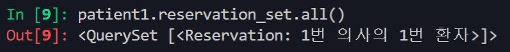

    * DB 상황( 실제 중개 테이블 )

      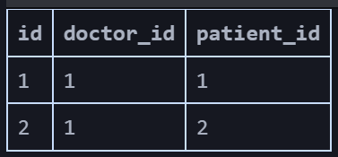

      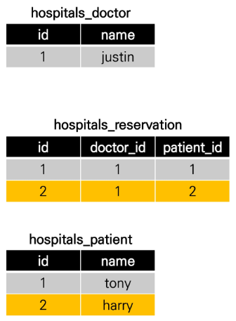

  * 의사의 예약 환자 조회: 출력하려면

    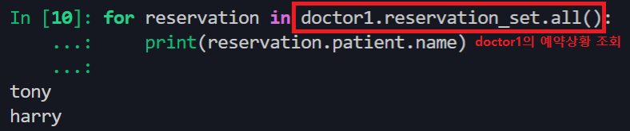

  

### 4. ManyToManyField

#### 1) 개념

* 다대다(M:N, many-to-many) 관계 설정 시 사용하는 모델 필드
* 하나의 필수 위치인자(M:N 관계로 설정할 모델 클래스)가 필요
* `ManyToManyField` 사용시 중개 모델이 필요 없어진다 > 삭제!


#### 2) `ManyToManyField` 작성 

* 중개 모델 삭제 및 새로운 모델 작성 (`sample_code/ex_3.py`)

  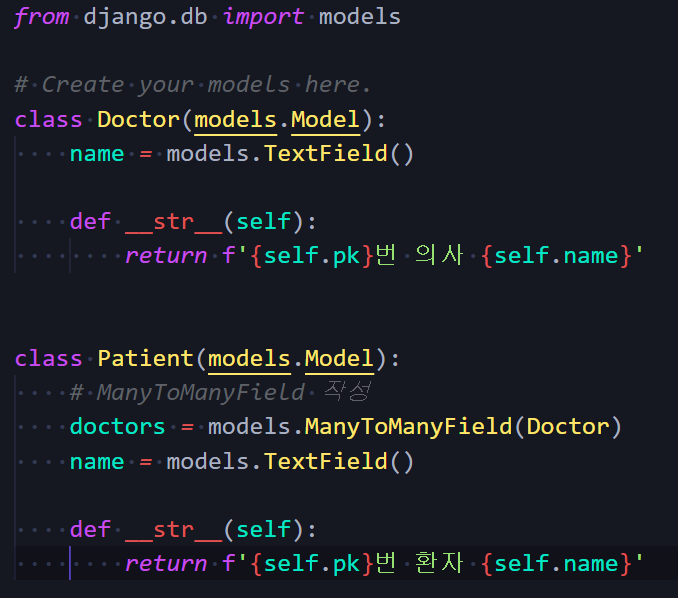

  * 필드 작성 위치는 Doctor 또는  Patient 모두 작성 가능
  * 변수가 **복수**형!! (doctors)
    * unlike 1:N (여기서는 변수를 단수형으로 썼다)
  * 데이터베이스 초기화 / 마이그레이션 / shell_plus

* `ManyToManyField`로 인해 생성된 중개 테이블 확인

  * 중개 테이블과 구조는 동일하지만, 이름만 달라짐  

  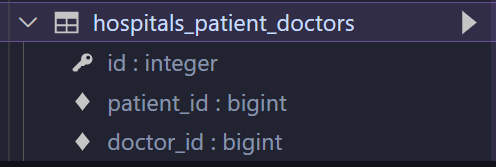

  * `hospitals_doctor` 이나 `hospitals_patient` 테이블에는 외래키가 발견되지 않음
  * 아까랑 완전히 동일한 상황 + reservation 만 사라짐 - 따라서 클래스 추가할 필요없이 쓸 수 있어 편리
  * 만약 class Doctor에 외래키를 생성한다면?
    * 아무런 차이 없음. 
    * 테이블 이름만 doctors_patient 이렇게 바뀌든지 + 컬럼 순서 바뀌든지 정도만 변경 > 기능상 차이 X

* 의사 1명과 환자 2명 생성

  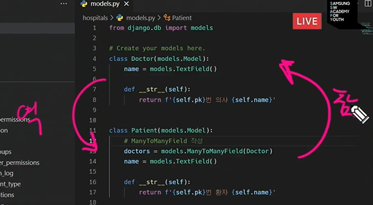

* 예약 생성: Patient에서 Doctor 를 **(참조)** - 왜냐햐면, Patient가 ManyToManyField를 가지고 있으므로 

  * patient1(tony)이 doctor1(justin)에게 예약

    ```shell
    In [1]: patient1.doctors.add(doctor1)
    ```

  * patient1이 예약한 의사 목록 확인

    ```shell
    In [2]: patient1.doctors.all()
    Out[2]: <QuerySet [<Doctor: 1번 의사 justin>]>
    ```

  * doctor1에게 예약된 환자 목록 확인

    ```shell
    In [3]: doctor1.patient_set.all()
    Out[3]: <QuerySet [<Patient: 1번 환자 tony>]>
    ```

* 예약 생성: Doctor 에서 Patient를 **(역참조)** - `patient_set` 이라는 manager 사용해야 함

  * doctor1(justin)이 patient2(harry)를 예약

    ```shell
    In [1]: doctor1.patient_set.add(patient2)
    ```

  * doctor1에게 예약된 환자 목록 확인

    ```shell
    In [2]: doctor1.patient_set.all()
    Out[2]: <QuerySet [<Patient: 1번 환자 tony>, <Patient: 2번 환자 harry>]>
    ```

  * patient2, patient1이 각각 예약한 의사 목록 확인

    ```shell
    In [3]: patient2.doctors.all()
    Out[3]: <QuerySet [<Doctor: 1번 의사 justin>]>
    
    In [4]: patient1.doctors.all()
    Out[4]: <QuerySet [<Doctor: 1번 의사 justin>]
    ```

  * 중개 테이블 데이터 확인

    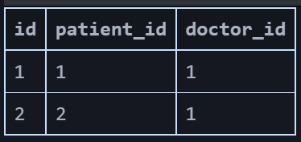

* 예약 삭제(역참조)

  * doctor1(justin)이 patient1(tony) 진료 예약 취소

    ```shell
    In [5]: doctor1.patient_set.remove(patient1)
    ```

  * doctor1에게 예약된 환자 목록 확인

    ```shell
    In [6]: patient2.doctors.remove(doctor1)
    ```

  * patient1이 예약한 의사 목록 확인

    ```shell
    In [7]: patient1.doctors.all()
    Out[7]: <QuerySet []>
    ```

  * 중개 테이블 데이터 확인

    * 데이터 없음

* (예약 생성 다시 해서 데이터를 만들어 준 다음) 예약 삭제(참조)

  * patient2(harry)가 doctor1(justin) 진료 예약 취소

    ```
    In [5]: patient2.patient_set.remove(doctor1)
    ```

  * patient2가 예약한 의사 목록 확인

    ```shell
    In [6]: patient2.doctors.all()
    Out[6]: <QuerySet []>
    ```

  * doctor1에게 예약된 환자 목록 확인

    ```shell
    In [7]: doctor1.patient_set.all()
    Out[7]: <QuerySet []>
    ```

  * 중개 테이블 데이터 확인

    * 데이터 없음


#### 3) 만약 `ManyToManyField`가 Patient 모델 클래스에 있었다면

* doctor1이 보는 환자 목록 조회시

  ```shell
  doctor1.patients.all()
  ```

* patient1이 보게 될 의사 목록 조회시

  ```shell
  patient1.doctor_set.all()
  ```

  

### 5. `related_name`

* 개념

  * 다대다 관계에서 역참조시 생성되는 `_set` 매니저 이름을 `related_name`을 이용해 새로 설정해 주는 경우

  * **target model(관계 필드를 가지지 않은 모델)**이 **source model(관계 필드를 가진 모델)**을 참조할 때 사용할 manager의 이름을 설정 

  * 즉, **역참조**시에 사용하는 manager의 이름을 설정

  * ForeignKey의 related_name과 동일하다(단 ForeignKey에서는 잘 사용하지 않는다)

* 예시

  * `model.py` 에 `related_name` 설정해주기

  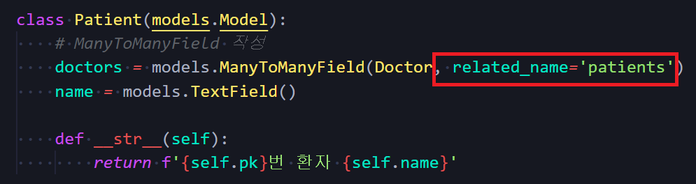

  * migration / migrate

  * doctor1에 의사 정보 불러오기

    ```shell
    In [1]: doctor1 = Doctor.objects.get(pk=1)
    
    In [2]: doctor1
    Out[2]: <Doctor: 1번 의사 justin>
    ```

  * doctor1이 봐야하는 환자 수를 `patient_set` 매니저 사용해 조회하기

    ```shell
    In [3]: doctor1.patient_set.all()
    ---------------------------------------------------------------------------
    AttributeError                            Traceback (most recent call last)
    <ipython-input-5-e81b89c43a95> in <module>
    ----> 1 doctor1.patient_set.all()
    
    AttributeError: 'Doctor' object has no attribute 'patient_set'
    ```

  * 에러 없이 제대로 조회하려면 아까 related_name으로 재설정 된 매니저로 조회해야 한다.

    ```노디ㅣ
    In [4]: doctor1.patients.all()
    Out[4]: <QuerySet []>
    ```

    


### 6. 중개 모델(테이블) in Django

* 개념
  * django는 ManyToManyField를 통해 중개 테이블을 자동으로 생성
* 한계
  * 예약 관계 자체는 확인이 가능한데, 구체적인 정보는 더 알 수 없음
  * 외래키 컬럼 두개로밖에 안 만들어지기 때문
* 그렇다면 중개 테이블을 직접 작성하는 경우는 없을까?
  * 중개 테이블을 수동으로 지정하려는 경우, `through` 옵션을 사용하여 중개 테이블을 나타내는 Django 모델을 지정할 수 있음
  * 가장 일반적인 용도는 중개 테이블에 추가 데이터를 사용해 다대다 관계로 연결하려는 경우에 사용


### 7. 요약

* 실제 Doctor와 Patient 테이블이 변하는 것은 없음
* 1:N 관계는 완전한 종속의 관계이지만, M:N 관계는 의사에게 진찰받는 환자, 환자를 진찰하는 의사의 두가지 형태로 모두 표현이 가능한 것


## :two: ManyToManyField

### 1. `ManyToManyField`'s 개념 및 특징

* 다대다(M:N, many-to-many) 관계 설정 시 사용하는 모델 필드
* 하나의 필수 위치인자(M:N 관계로 설정할 모델 클래스)가 필요
* 모델 필드의 RelatedManager를 사용하여 관련 개체를 추가, 제거 또는 만들 수 있음
  *  `add()`, `remove()`, ~~`create()`, `clear()`, `set` 등~~ 
* [참고] RelatedManager
  * 일대다 또는 다대다 관련 컨텍스트에서 사용되는 manager


### 2. `ManyToManyField`의 Arguments

#### 1) `related_name`

* 개념:

  * **target model(관계 필드를 가지지 않은 모델)**이 **source model(관계 필드를 가진 모델)**을 참조할 때 사용할 manager의 이름을 설정 
  * ForeignKey의 related_name과 동일
  * 1:N 또는 M:N 관련 컨텍스트에서 사용되는 매니저
  * 같은 이름의 메서드여도 각 관계(1:N, M:N)에 따라 다르게 사용 및 동작
    * 1:N 에서는 target 모델 인스턴스만 사용 가능
    * M:N 관계에서는 관련된 두 객체에서 모두 사용 가능
  * 메서드 종류
    *  `add()`, `remove()`, ~~`create()`, `clear()`, `set` 등~~ 

* **`add()`**

  * 지정된 객체를 관련 객체 집합에 추가

  * 이미 존재하는 관계에 사용하면 관계가 복제되지 않는다

    * 1번 환자가 1번 의사에게 예약 
    * 이후에 1번환자가 또 1번 의사에게 예약한다고 해도, 해당 관계가 복제되지 않는다.

  * 모델 인스턴스, 필드값(PK)을 인자로 허용

    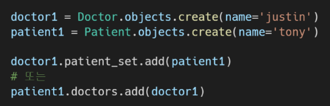

    

* **`remove()`**

  * "관련 객체 집합에서 지정된 모델 객체를 제거"

  * 내부적으로 QuerySet.delete()를 사용하여 관계가 삭제됨

    * remove()를 쓰지만, '내부적'으로는 queryset.delete()가 호출됨

  * 모델 인스턴스, 필드 값(PK)을 인자로 허용

    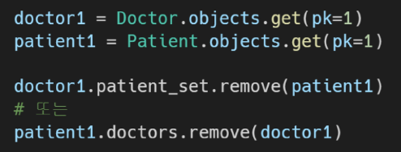

    

#### 2) `through`

* 개념

  * **중개 테이블을 직접 작성**하는 경우, through 옵션을 사용하여 중개 테이블을 나타내는 Django 모델을 지정할 수 있음

  * 일반적으로 중개 테이블에 **추가 데이터**를 사용하는 다대다 관계와 연결하려는 경우(extra data with a many-to-many relationship)에 주로 사용됨

  * 실제로 중개 테이블을 직접 구현할때 사용한다

  * 좋아요, follow 기능에는 쓰지 않는다

  * 데이터베이스 테이블

    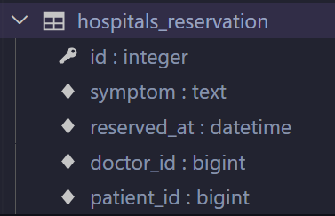

    

* 작성예시

  * 모델 관계 설정

  * migration, migrate

    * 중개 테이블 확인

  * 의사 1명과 환자 2명 생성

    ```shell
    In [1]: doctor1 = Doctor.objects.create(name='justin')
    
    In [2]: patient1 = Patient.objects.create(name='tony')
    
    In [3]: patient2 = Patient.objects.create(name='harry')
    ```

  * 예약 생성 1: 예약이 예약을 만듦

    ```shell
    In [4]: reservation1 = Reservation(doctor=doctor1, patient=patient1, symptom='headache')
    
    In [5]: reservation1
    Out[5]: <Reservation: 1번 의사의 1번 환자>
    
    # 이 상태로는 DB 반영이 안된다. save() 반드시!!
    
    In [6]: reservation1.save()
    
    In [7]: reservation1
    Out[7]: <Reservation: 1번 의사의 1번 환자>
    ```

    * 중개 테이블 확인

      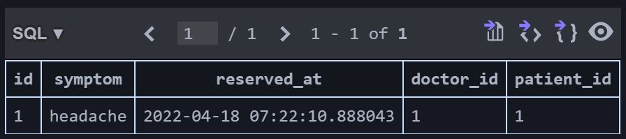

  * 예약 생성 2: 의사나 환자가 예약을 만듦

    * 2번 환자가 의사에게 예약을 만듦, 대신 증상(데이터)이 필요함

    ```shell
    In [8]: patient2.doctors.add(doctor1, through_defaults={'symptom': 'flu'})
    
    In [9]: doctor1.patient_set.all()
    Out[9]: <QuerySet [<Patient: 1번 환자 tony>, <Patient: 2번 환자 harry>]>
    
    In [10]: patient1.doctors.all()
    Out[10]: <QuerySet [<Doctor: 1번 의사 justin>]>
    ```

    * 중개 테이블 확인

      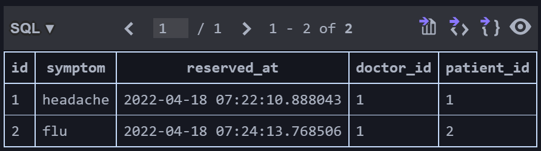

  * 예약 삭제

    ```shell
    In [11]: doctor1.patient_set.remove(patient1)
    
    In [12]: patient2.doctors.remove(doctor1)
    
    In [13]: doctor1.patient_set.all()
    Out[13]: <QuerySet []>
    
    In [14]: patient1.doctors.all()
    Out[14]: <QuerySet []>
    ```

    * 중개 테이블 확인
      * 데이터 없음


#### 3) `symmetrical`

* 개념
  * ManyToManyField가 동일한 모델(on self)을 가리키는 정의에서만 사용
  * symmetrical=True(기본값)일 경우, Django는 person_set 매니저를 추가하지 않음
  * source 모델의 인스턴스가 target 모델의 인스턴스를 참조하면, target모델 인스턴스도 source 모델 인스턴스를 자동으로 참조하도록 함
    * 즉, 내가 당신의 친구라면 당신도 내 친구가 되는 것
    * 대칭을 원하지 않는 경우 False로 설정
    * Follow 기능 구현에서 다시 확인할 것


### 3. 데이터베이스에서의 표현

* 개념
  * Django는 다대다 관계를 나타내는 중개 테이블을 만듦
  * 테이블 이름은 다대다 필드의 이름과 이를 포함하는 모델의 테이블 이름을 조합하여 생성됨
* 중개 테이블의 필드 생성 규칙
  * source model 및 target model이 다른 경우
    * `id`
    * `<containing_model>_id`
    * `<other_model>_id`
  * ManyToManyField가 동일한 모델을 가리키는 경우
    * `id`
    * `from_<model>_id`
    * `to_<model>_id`


## :three: LIKE

### 1. Like 구현

* `ManyToManyField`작성 후 마이그레이션

  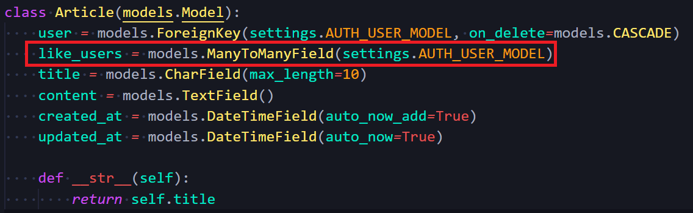

  * makemigrations시 에러 발생

    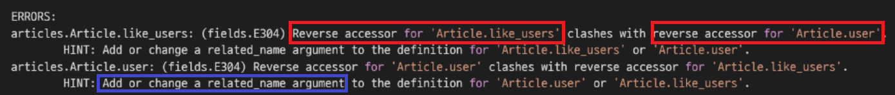

    * 역참조 하는 Article.like_users와 Articlce.user 간 충돌: 이름이 겹침!

    * `like_users` 필드 생성 시 자동으로 역참조는 `.article_set`매니저를 생성

    * 그러나 이전 1:N(User:Article) 관계에서 이미 해당 매니저 이름을 사용 중이기 때문에, User와 관계된 `ForeignKey` 또는 `ManyToManyField`중 하나에 `related_name` 추가 필요

      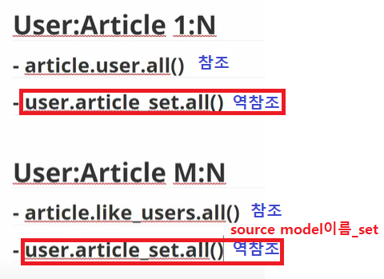

    * 해결방법: `related_name`을 사용해서 `article_set`이라는 매니저 이름을 `like_articles`로 변환

      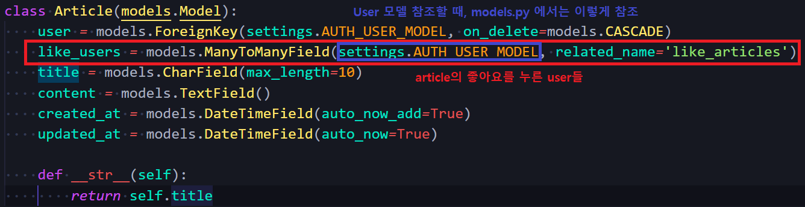

  * 생성된 중개 테이블 확인

    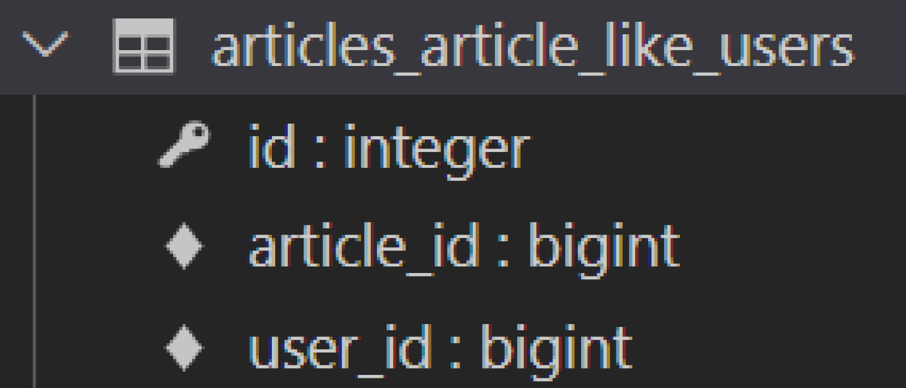

* **`articles/urls.py` 작성**

  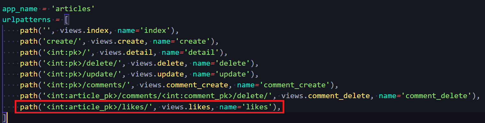

* **`articles/views.py` 작성**

### 2. 현재 User-Article 간 사용 가능한 DB API

* **참조**일 때 manager 두 개 
  * `article.user`
    * 게시글을 작성한 유저 - 1:N
  * `article.like_users`
    * 게시글을 좋아요한 유저 - M:N
  * `user.article_set`
* **역참조**일 때 manager 두 개 
  * 유저가 작성한 게시글 (역참조) - 1:N
  * `user.like_articles`
    * 유저가 좋아요한 게시글 (역참조) - M:N


### 3. QuerySet API `exists()`

* QuerySet 에 결과가 포함되어 있으면 True를 반환하고, 그렇지 않으면 False를 반환
* 특히 규모가 큰 QuerySet의 컨텍스트에서 특정 개체 존재 여부와 관련된 검색에 유용
* 고유한 필드(ex. Primary Key)가 있는 모델이 QuerySet의 구성원인지 여부를 찾는 가장 효율적인 방법
* 


## :four: Profile Page

### 1. Profile Page 작성

* 자연스러운 follow 흐름을 위한 회원 프로필 페이지 작성하기
* 

### 2.

### 3.


## :five: 팔로우 기능(Follow) 구현

### 1. Follow 구현

* `ManyToManyField` 작성 후 마이그레이션
* 생성된 중개 테이블 확인
* `urls.py`작성
* `views.py` 작성
* profile 페이지에 팔로우와 언팔로우 버튼 작성
  * 팔로잉 수/ 팔로워 수 출력
  * 자기 자신을 팔로우할 수 없음
  * 팔로우 버튼 클릭 후 테이블 확인


