# Django Authentication System

[TOC]


## :one: Authentication System I

### 1. The Django Authentication System

#### 1) 기본 개념

* Django 인증 시스템은 django.contrib.auth에 Django contrib module로 제공

* 필수 구성은 settings.py에 이미 포함되어 있으며, INSTALLED_APPS 설정에 나열된 아래 두 항목으로 구성됨

  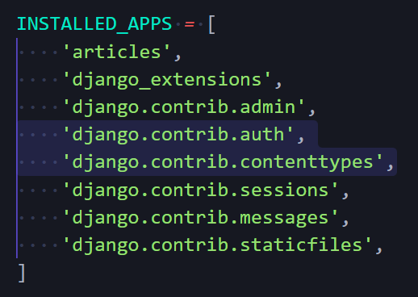

  * django.contrib.auth
    * 인증 프레임워크의 핵심과 기본 모델을 포함
  * django.contrib.contenttypes
    * 사용자가 생성한 모델과 권한을 연결할 수 있음

* Django 인증 시스템은 인증(Authentication)과 권한(Authorization)부여를 함께 제공(처리)하며, 이러한 기능이 어느 정도 결합되어 일반적으로 **인증 시스템**이라고 함


#### 2) Authentication & Authorization

* Authentication(인증)
  * 신원 확인
  * 사용자가 자신이 누구인지 확인하는 것
* Authorization(권한, 허가)
  * 권한 부여
  * 인증된 사용자가 수행할 수 있는 작업을 결정


#### 3) 순서

* 두번째 앱(accounts) 생성하기

  * app 이름이 반드시 accounts일 필요 없음
  * 단,  auth와 관련해 Django 내부적으로 accounts라는 이름으로 사용되고 있기 때문에 되도록 accounts로 지정하는 것을 권장

  ```bash
  $ python manage.py accounts
  # setings.py > INSTALLED APPS 에 등록
  
  ```

  ```python
  # project/urls.py
  urlpatterns = [
      path('accounts/', include('accounts.urls')),
  ]
  ```

  ```python
  # accounts.urls.py
  from django.urls import path
  from . import views
  
  
  app_name = 'accounts'
  urlpatterns = [
      
  ]
  ```


### 2. 쿠키와 세션

상태를 유지하기 위해 사용 - 반복적인 요청을 줄이기 위해서

#### 1) HTTP

* Hyper Text Transfer Protocol
  * HTML  문서와 같은 리소스(자원, 데이터)들을 가져올 수 있또록 해주는 프로토콜(규칙, 규약)
  * 웹에서 이루어지는 모든 데이터 교환의 기초
  * 클라이언트 - 서버 프로토콜이기도 함
  * HTTPS = Secure
* 특징
  * 비연결지향(connectionless)
    * 서버는 요청에 대한 응답을 보낸 후 연결을 끊음
  * 무상태(stateless)
    * 연결을 끊는 순간 클라이언트와 서버 간의 통신이 끝나며 상태 정보가 유지되지 않음
    * 클라이언트와 서버가 주고 받는 메시지들은 서로 완전히 독립적임
  * 클라이언트와 서버의 지속적인 관계를 유지하기 위해 쿠키와 세션이 존재
    * 상태가 유지되는 경우: 로그인 상태

#### 2) 쿠키


* 개념

  * 서버가 사용자의 웹 브라우저(클라이언트)에 전송하는 작은 데이터 조각
  * 사용자가 웹사이트를 방문할 경우 해당 웹사이트의 서버를 통해 사용자의 컴퓨터에 설치(placed-on)되는 **작은 기록 정보 파일**
    * 브라우저(클라이언트)는 쿠키를 로컬에 KEY-VALUE의 데이터 형식으로 저장
    * 이렇게 쿠키를 저장해 놓았다가, 동일한 서버에 재 요청 시 저장된 쿠키를 함께 전송
    * 쿠키 안에 session id가 저장되어 있다
  * [참고] 소프트웨어가 아니기 때문에 프로그램처럼 실행될 수 없으며 악성코드를 설치할 수 없지만, 사용자의 행동을 추적하거나 쿠키를 훔쳐서 해당 사용자의 계정 접근 권한을 획득할 수 있음
  * HTTP 쿠키는 상태가 있는 세션을 만들어 줌
  * 쿠키는 두 요청이 동일한 브라우저에서 들어왔는지 아닌지를 판단할 때 주로 사용
    * 이를 이용해 사용자의 로그인 상태를 유지할 수 있음
    * 상태가 없는(stateless) HTTP 프로토콜에서 상태 정보를 기억시켜주기 때문
  * 웹 페이지에 접속하면 요청한 웹 페이지를 받으며 쿠키를 저장하고, 클라이언트가 같은 서버에 재요청시 요청과 함께 쿠키도 함께 전송

* 사용 목적

  * 세션 관리(Session management)
    * 로그인, 아이디 자동 완성, 공지 하루 안보기, 팝업 체크, 장바구니 등의 정보 관리
  * 개인화(Personalization)
    * 사용자 선호, 테마 등의 설정
  * 트래킹(Tracking)
    * 사용자 행동을 기록 및 분석
    * 트래킹을 허용하지 않는 브라우저(incognito 모드)

* 예시(쿠팡 장바구니)

  1. 장바구니에 담고 > 개발자 도구 > cartView

     * 개발자 도구 - Network 탭 - cartView.pang 확인
       * 서버는 응답과 함께 Set-Cookie 응답 헤더를 브라우저에 전송
       * 이 헤더는 클라이언트에게 쿠키를 저장하라고 전달

     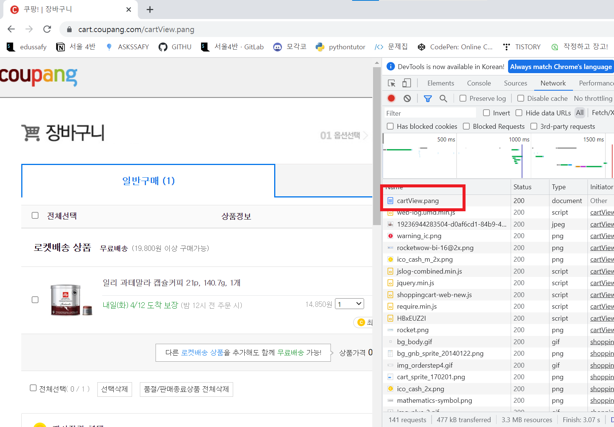

  2. Headers > Set-cookie 라는 것들이 많은 것들 확인 가능

     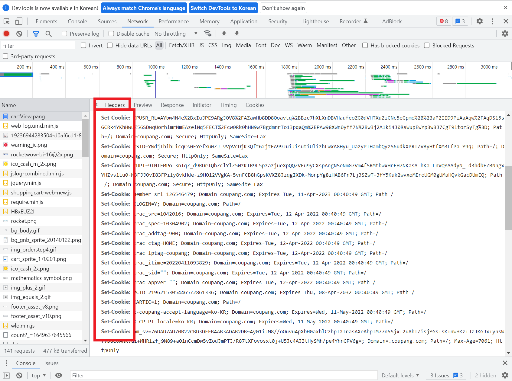

  3. cookies 탭 > 쿠키가 key = value 형태로 저장되어 있는 것을 볼 수 있음

     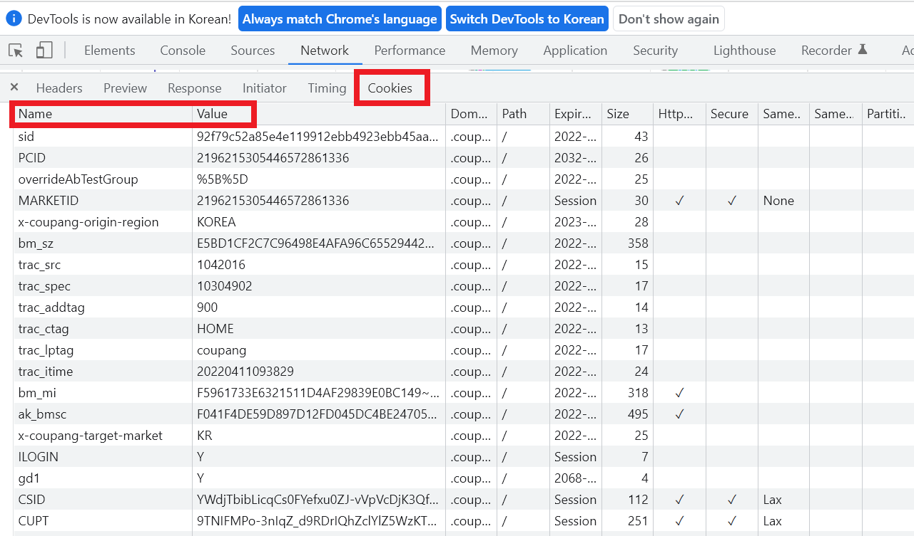

  4. 쿠팡 메인 페이지로 이동 > `www.coupang.com` 클릭 > header 누르면 request header에서 cookie 확인가능

     * 메인 페이지 이동 - 장바구나 유지 상태 확인
       * 이제 서버로 전송되는 모든 요청과 함께, 브라우저는 Cookie HTTP 헤도를 사용해 서버로 이전에 저장했던 모든 쿠키들을 함께 전송

     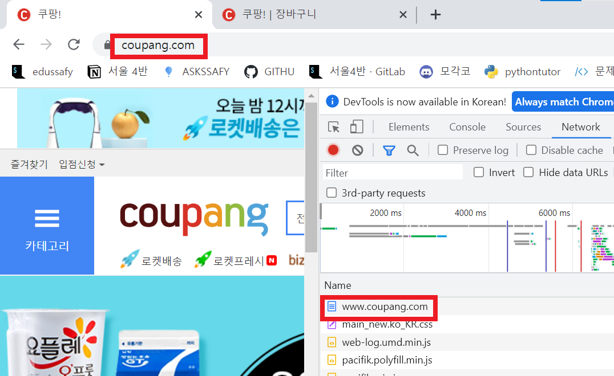

     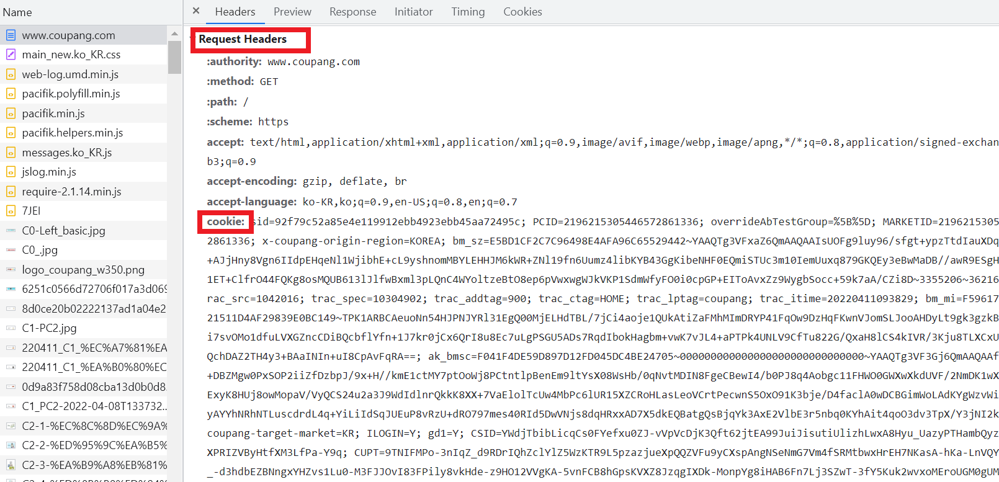

  5. Application에 들어가면, 아까 저장된 쿠키가 어디에 저장되어 있는지 알 수 있다

     * 따라서 해당 쿠키를 기반으로 유사 상품에 대한 추천을 하는 것
     * 쿠키 추적을 허용하지 않으면 랜덤으로 광고 뜸
     * 

     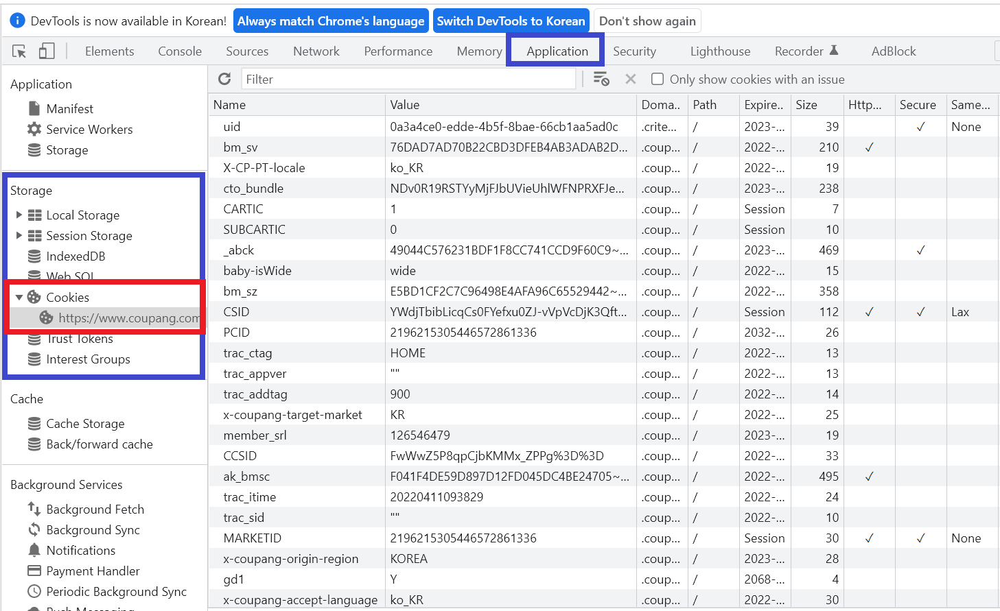

  6. 쿠키를 삭제하면, 장바구니가 비게 되는 것을 확인할 수 있다

     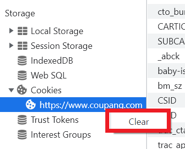

     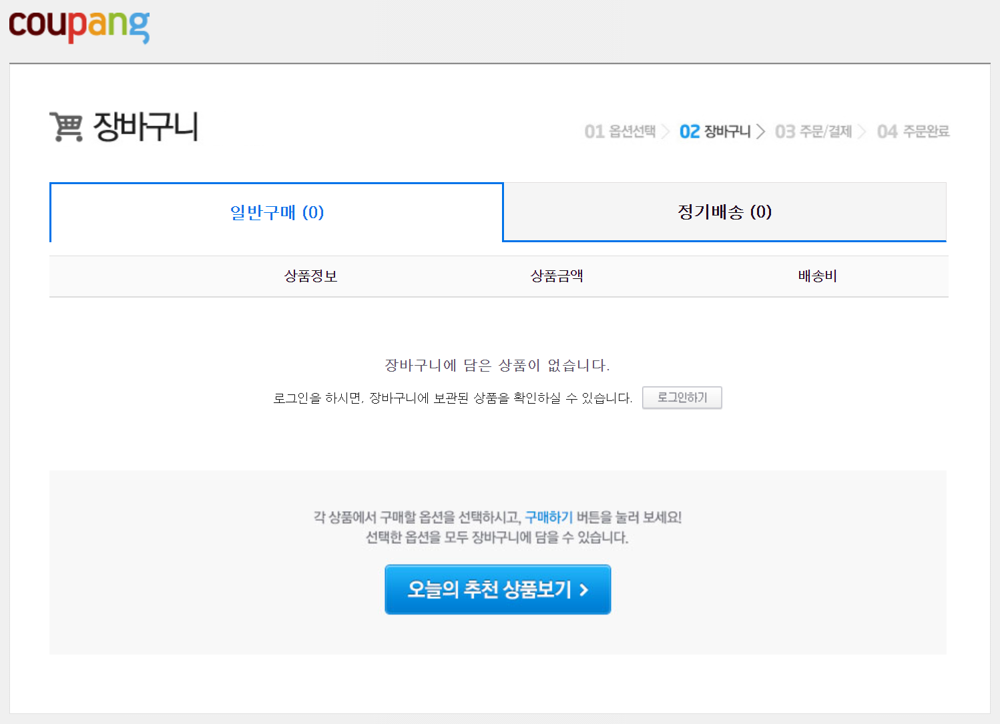


#### 3) 세션(session)

* 개념
  * 사이트와 특정 브라우저 사이의 "**상태(state)**"를 유지시키는 것
  * 어떠한 상태를 저장하는 것
  * 클라이언트가 서버에 접속하면 서버가 특정 **session id**를 발급하고, 클라이언트는 발급 받은 session id를 쿠키에 저장
  * 클라이언트가 다시 서버에 접속하면 요청과 함께 쿠키(session id가 저장된)를 서버에 전달
  * 쿠키는 요청 때마다 서버에 함께 전송되므로, 서버에서 session id를 확인해 알맞은 로직을 처리
  * ID는 세션을 **구별**하기 위해 필요하며, 쿠키에는 ID만 저장함
    * ID에 대한 값은 서버가 제공
* 쿠키 lifetime(수명)
  * Session cookies
    * 현재 세션이 종료되면 삭제됨
    * 브라우저가 "현재 세션(current session)"이 종료되는 시기를 정의
      * [참고] 일부 브라우저는 다시 시작할 때 세션 복원(session restoring)을 사용해 세션 쿠키가 오래 지속될 수 있도록 함
  * Persistent cookies
    * Expires 속성에 지정된 날짜 혹은 Max-Age 속성에 지정된 기간이 지나면 삭제

* 예시(깃랩)

  1. 로그인 후 개발자도구 > 쿠키 확인

     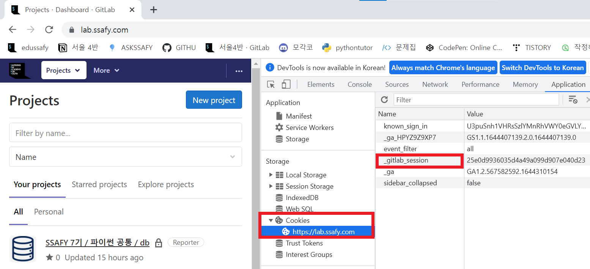

     * 로그인 역할을 하는 것은 "session"임을 알 수 있음
     * 로그아웃 과정은 세션을 삭제하는 과정

  2. 쿠키의 유효기간 확인

     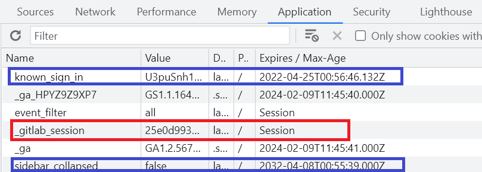

     * 유효기간이 없는 것들? session cookies
     * 유효기간이 없는 것들: Persistent cookies


#### 4) Session in Django

* Django는 세션은 미들웨어를 통해 구현됨
* Django는 database-backed sessions 저장 방식을 기본 값으로 사용
  * [참고] 설정을 통해 cached, file-based, cookie-based 방식으로 변경 가능
* Django는 특정 session id를 포함하는 쿠키를 사용해서 각각의 브라우저와 사이트가 연결된 세션을 알아냄
  * 세션 정보는 Django DB의 django_session 테이블에 저장됨
* 모든 것을 세션으로 사용하려면, 사용자가 많을 때 서버에 부하가 걸릴 가능성 높음


#### 5) Authentication System in MIDDLEWARE(settings.py)

* SessionMiddleware
  * 요청 전반에 걸쳐 세션을 관리
* AuthenticationMiddleware
  * 세션을 사용하여 사용자를 요청과 연결
* 참고: MIDDLEWARE
  * HTTP 요청과 응답 처리 중간에서 작동하는 시스템(hooks)
  * Django는 HTTP 요청이 들어오면 미들웨어를 거쳐 해당 URL에 등록되어 있는 view로 연결해주고, HTTP 응답 역시 미들웨어를 거쳐서 내보냄
  * 주로 데이터 관리, 애플리케이션 서비스, 메시징, 인증 및 API 관리를 담당


### 3. 로그인

#### 1) 개념

* 로그인은 session을 CREATE 하는 로직과 같은

* Django는 우리가 session의 메커니즘에 생각하지 않게끔 도움을 줌
* 이를 위해 인증에 관한 built-in form를 제공


#### 2) AuthenticationForm

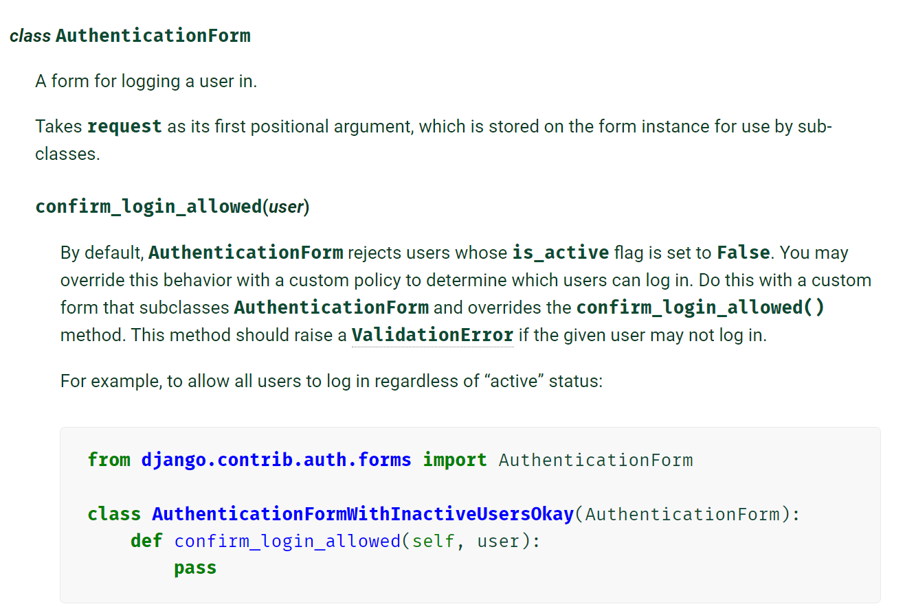

* 사용자 로그인을 위한 form
* request를 첫번재 인자로 취함
* [장고 공식문서](https://docs.djangoproject.com/en/4.0/topics/auth/default/) > Built-in forms 


#### 3) login 페이지 생성

1. `urls.py` 작성

   * `crud/urls.py`

   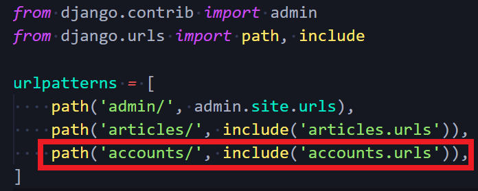

   * `accounts/urls.py`

   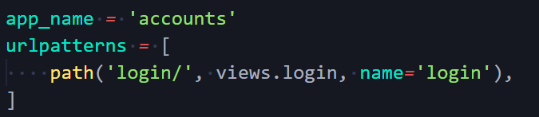

2. views.py 작성

   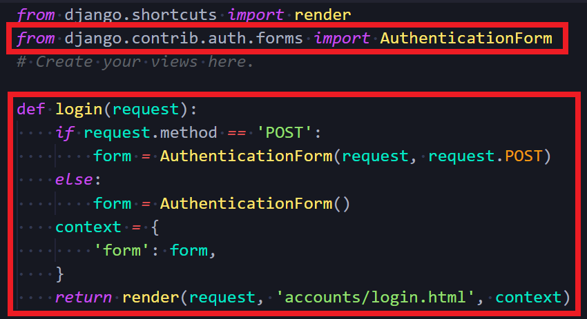

3. `login.html`(create.html과 유사)

   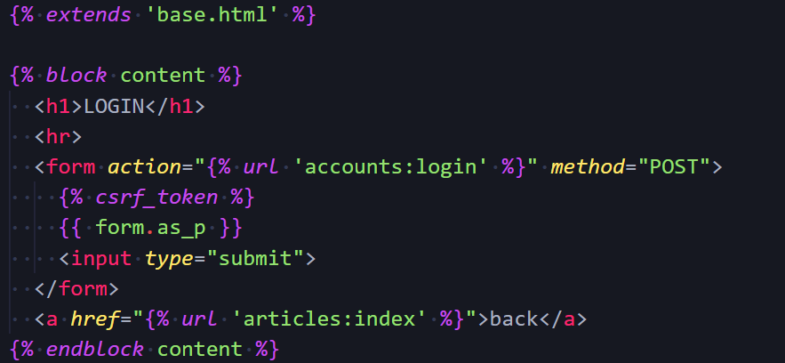


#### 4) `accouts/views.py` vs `articles/views.py` 비교


* Authentication Form vs Model Form
  * username과 password를 DB에 저장하는 것이 아니므로 모델폼을 쓸 필요가 없다
  * 회원가입시에는 Model Form 필요( DB에 저장해야 하므로 )
  * Auth 는 로그인을 위한 사전 인증 절차일 뿐


#### 5) login 함수 사용


* login(request, user, backend=None)

  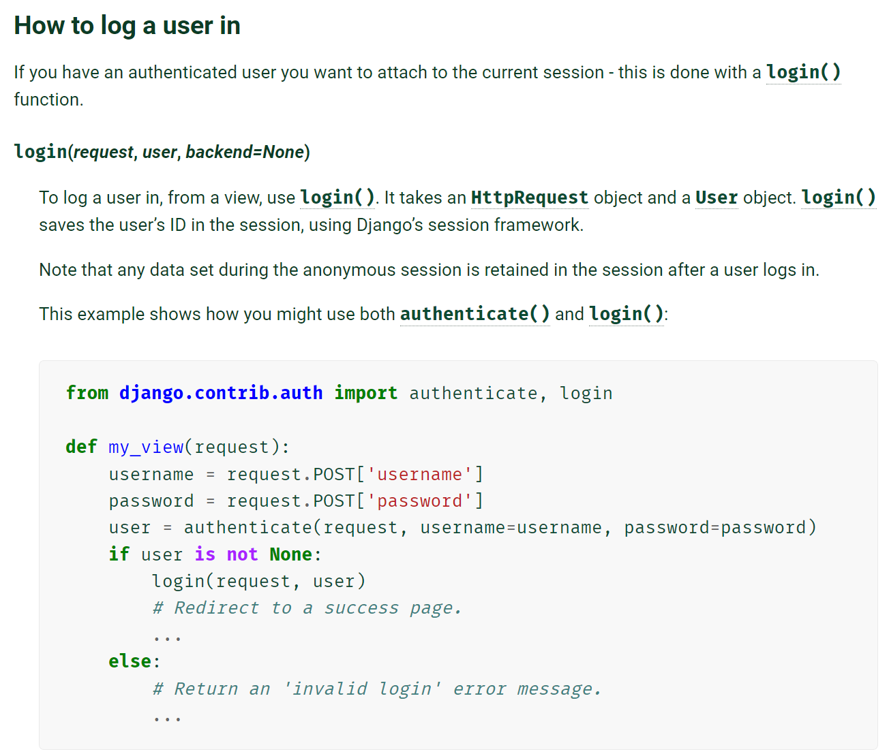

  * 현재 세션에 연결하려는 인증 된 사용자가 있는 경우 login() 함수가 필요
    * is_valid() 함수를 통과한 사용자 == 인증된 사용자
    * 사용자를 로그인하며 view 함수에서 사용됨
  * HttpRequest 객체와 User 객체가 필요
  * Django의 sessino framework를 사용하여 세션에 user의 ID를 저장 ( == 로그인)

* `views.py`

  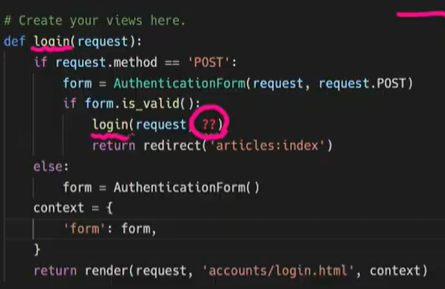

  * 이 상태로는 login 안만들어짐

    * user 정보가 더 필요

      \-  `form.get.user()`사용 : 인증된 사용자는 form 객체에 들어있음. 

      \- 인증된 user객체가 반환됨

    * import 함수인 login 함수와 def login 이름이 같음 -> 이름을 바꿔줌

    * 해결!

      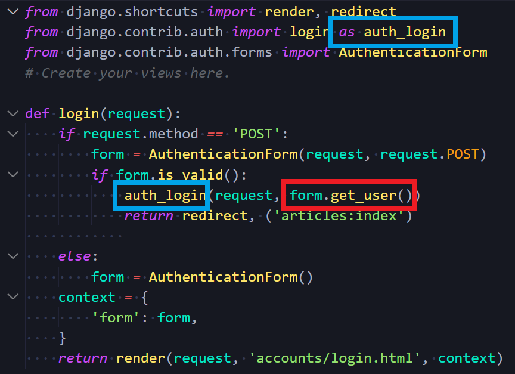

  * `auth_login(request, form.get_user())`

    * 이 부분에서 session 만들어 질 것 

* database 확인

  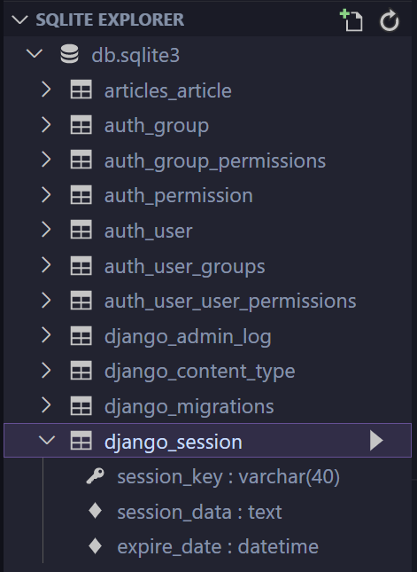

  * 비어있음


#### 6) get_user() 함수


* [공식문서](https://github.com/django/django/blob/main/django/contrib/auth/forms.py#L163)

* [User model](https://docs.djangoproject.com/en/4.0/ref/contrib/auth/)

* AuthenticationForm의 인스턴스 메서드

* user_cache는 인스턴스 생성 시에 None으로 할당되며, 유효성 검사를 통과했을 경우 로그인 한 사용자 객체로 할당됨

* 인스턴스의 유효성을 먼저 확인하고, 인스턴스가 유효할 때만 user를 제공하려는 구조

  

#### 7) 로그인 실행

* 관리자 계정 생성

  * `python manage.py createsupersuer`

    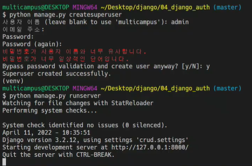

  * 제출

    * 개발자 도구

      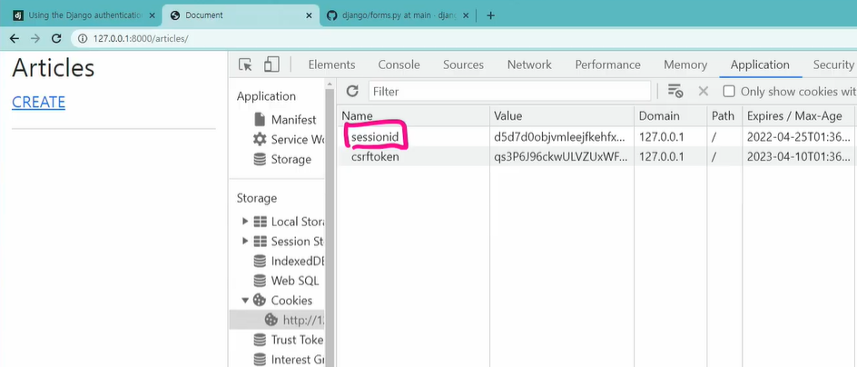

    * sqlite

      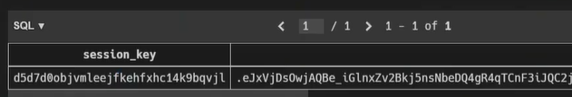

    * **개발자 도구의 session id의 value 값과 sqlite의 session_key가 일치함을 알 수 있다**

      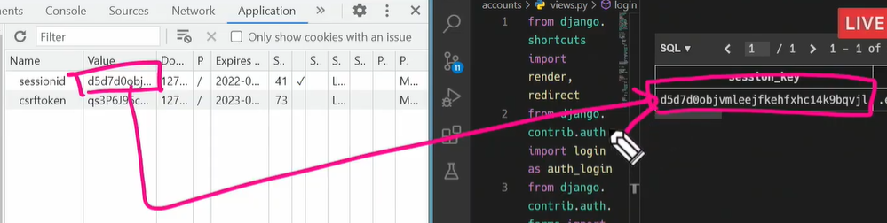

  

#### 8) Authentication data in templates

* `base.html`

  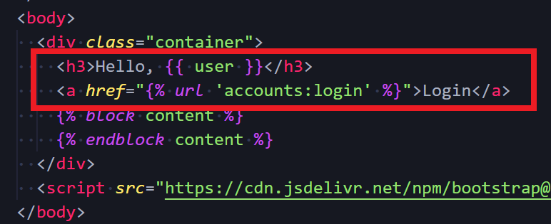

  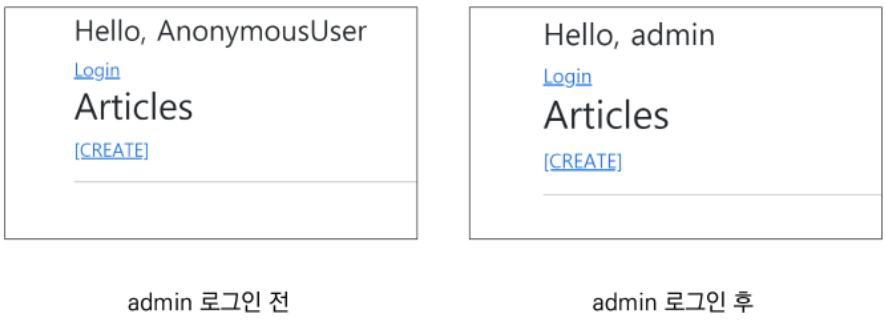

* context로 아무것도 넘겨주지 않았는데, user라는 변수를 쓸 수 있는 이유

  * context processors

    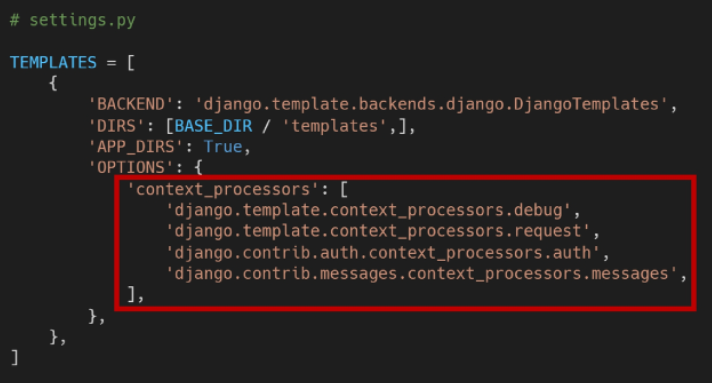 

    * 템플릿이 렌더링 될 때 자동으로 호출 가능한 컨텍스트 데이터 목록
    * 작성된 프로서세는 RequestContext에서 사용 가능한 변수로 포함됨

  * Users

    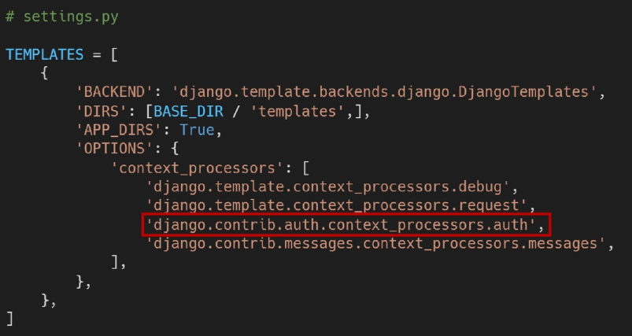

    * 템플릿 ReuqestContext를 렌더링 할 때, 현재 로그인한 사용자를 나타내는 auth.User 인스턴스(또는 클라이언트가 로그인하지 않은 경우 AnonymousUser 인스턴스)는 템플릿 변수 {{ user }}에 저장됨

      

      


### 4. 로그아웃

#### 1) 개념

* 로그아웃은 session을 Delete 하는 로직과 같음


#### 2) logout 함수

* **logout(request)**

  * HttpRequest 객체를 인자로 받고 반환 값이 없음
  * 사용자가 로그인하지 않은 경우, 오류를 발생시키지 않음
  * 현재 요청에 대한 session date를 DB에서 완전히 삭제하고, 클라이언트의 쿠키에서도 session id가 삭제됨
  * 이는 다른 사람이 동일한 웹 브라우저를 사용하여 로그인하고, **이전 사용자의 세션 데이터에 엑세스하는 것을 방지하기 위함**

  

#### 3) 로그아웃 실행

* `accounts/urls.py`

  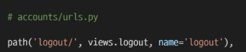

* `base.html`

  * POST 뒤 csrf 토큰 잊지 말기

  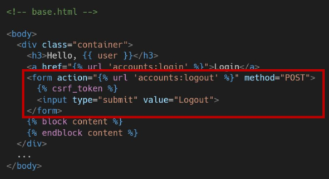

* `accounts/views.py`

  * `as auth_logout`
  * 데코레이터 지금은 신경 안 써도 됨

  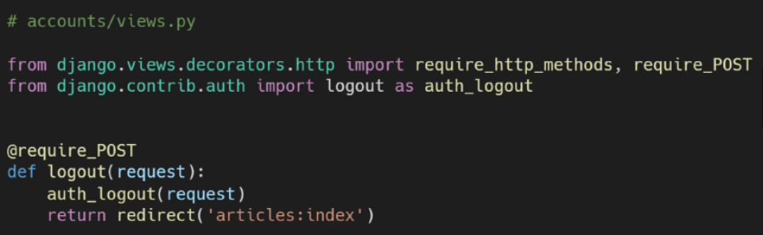


#### 4) 데코레이터 decorator

* import

  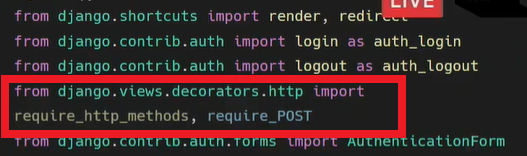

* def 함수에 decorator 추가

  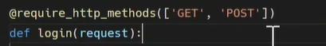

  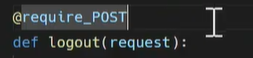

  


### 5. 로그인 사용자에 대한 접근 제한

#### 1) Limiting access to logged-in users

1. The raw way
   * **`is_authenticated`** attribute
2. The **`login_required`** decorator

#### 2) is_authenticated 속성

* 개념

  * User model의 속성(attributes)중 하나

  * 모든 User 인스턴스에 대해 항상 True 인 읽기 전용 속성(AnonymousUser에 대해서는 항상 False)

  * 사용자가 인증되었는지 여부를 알 수 있는 방법

  * 일반적으로 request.user에서 이 속성을 사용하며, 미들웨어의 'django.contrib.auth.middleware.AuthenticationMiddleware'를 통과했는지 확인

  * 단, 권한(permission)과는 관련이 없으며, 사용자가 활성화 상태(active)이거나, 유효한 세션(valid session)을 가지고 있는지도 확인하지 않음

* 적용

  * 로그인과 비로그인 상태에서 출력되는 링크를 다르게 설정

    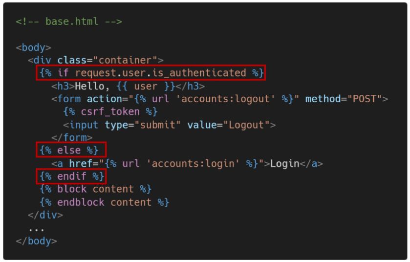

    * 첫 if 문에서 `request` 쓰이는 것... 아까 `users` 그냥 쓴거랑 비슷함

      *  `settings.py`의 `TEMPLATES=[]` 에서 미리 지정되어 있음

        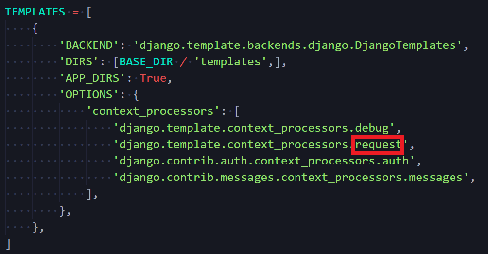

  * 인증된 사용자(로그인 상태)만 로그아웃 로직을 수행할 수 있도록 처리

    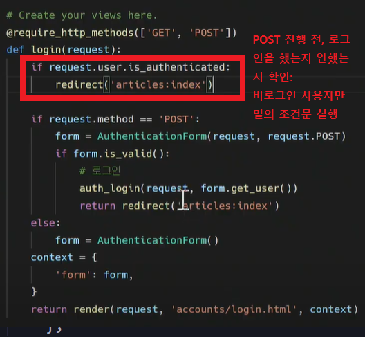

    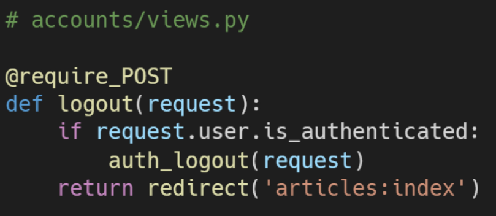

  * 인증된 사용자(로그인 상태)만 게시글 작성 링크를 볼 수 있도록 처리

    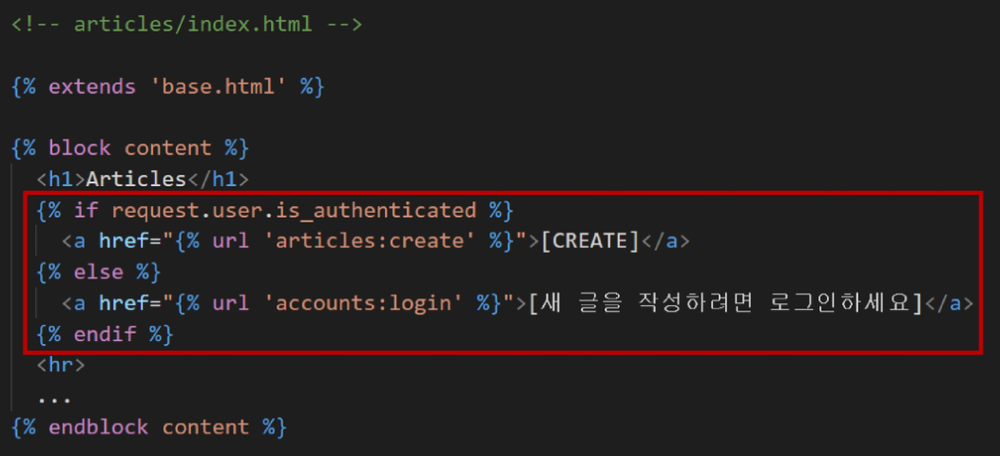


#### 3) login_required decorator(데코레이터)

* 개념

  * 사용자가 **로그인되어있지 않으면**, settings.LOGIN_URL에 설정된 문자열 기반 절대 경로로 redirect함
    * LOGIN_URL의 기본 값은 '/accounts/login/'
    * 두번째 app 이름을 accounts로 했던 이유 중 하나
  * 사용자가 로그인되어 있으면 정상적으로 view 함수 실행
  * 인증 성공 시 사용자가 redirect되어야 하는 경로는 "next"라는 쿼리 문자열 매개 변수에 저장됨
    * 예시) `/accounts/login/?next=/articles/create/`

* 작성

  * login_required decorator : 작성 , 수정, 삭제 에 쓸 수 있을 듯

    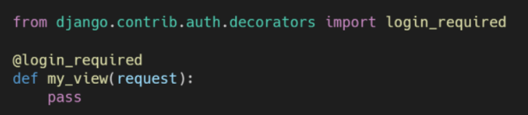

  * create, update, delete

    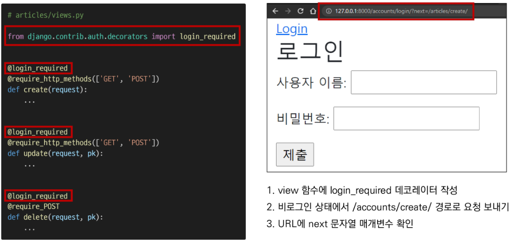

  * decorator 붙인 이후 로그인 없이 새 글을 쓰려고 하면 (create 주소로 들어가려고 하면) 로그인 화면으로 redirect 되고, url도 next 쿼리스트링을 포함한 채로 나타남

    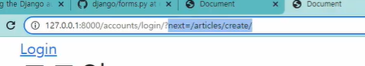

    

#### 4) :question: "next" query string parameter

* 개념

  * 로그인이 정상적으로 진행되면 기존에 요청했던 주소로 redirect하기 위해 마치 주소를 keep해주는 것
  * 단, 별도로 처리해주지 않으면 우리가 view에 설정한 redirect 경로로 이동하게 됨

* 적용

  * redirect

    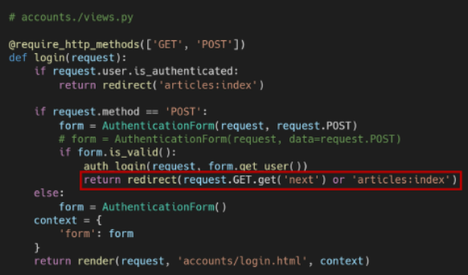

    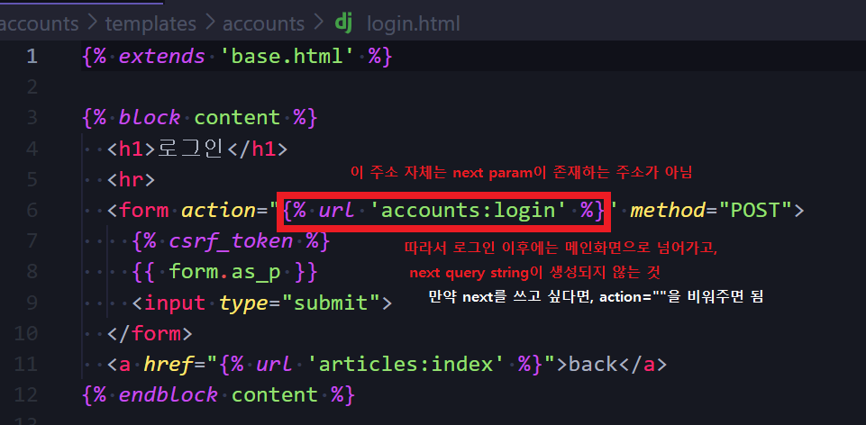

  * 현재 url(next paramter가 있는)로 요청을 보내기 위해 action 값 비우기

    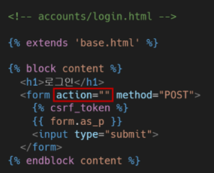

  * next값이 들어있는 곳

    ```python
    # views.py 의 login함수
    
    data = request.GET.get('next') #'/articles/create/'
    ```

    * 이 주소로는 로그인 하고 나서 redirect가 되어야 한다

    * new param 이 없는 경우, 원래대로 index로 갈 수 있게 하려면

      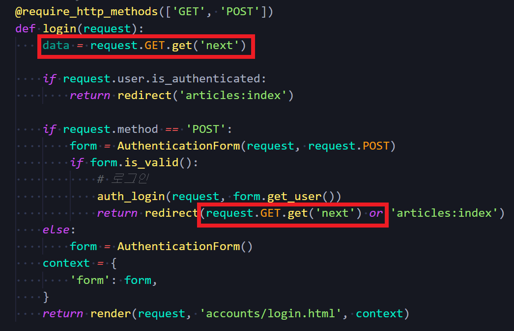

      

#### 5) 두 데코레이터로 인해 발생하는 구조적 문제와 해결

* 비로그인 상태에서 게시삭제 시도

  *  @require.POST 작성된 함수에 @login_required를 함께 사용하는 경우 에러 발생
  * 로그인 이후 "next" 매개변수를 따라 해당 함수로 다시 redirect 되는데, 이 때 @require_POST 때문에 405 에러가 발생하게 됨

* 두 가지 문제 발생

  * redirect 과정에서 POST 데이터 손실

    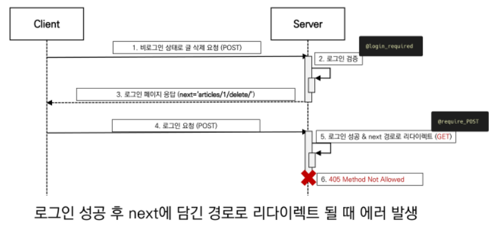

  * redirect 요청은 POST 방식이 불가능하기 때문에 GET 방식으로 요청됨

    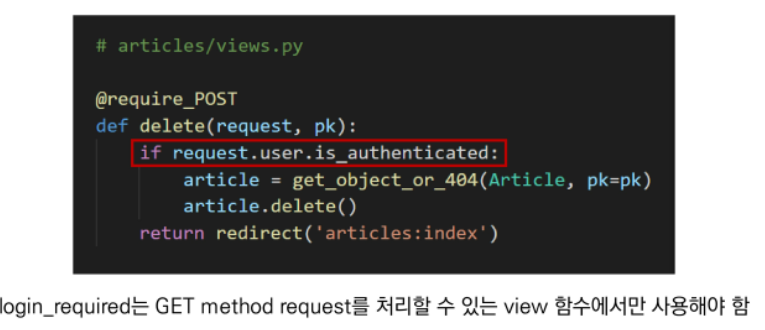

  


## :two: Authentication System II

### 1. 회원가입

#### 1) UserCreationForm

* 주어진 username과 password로 권한이 없는 새 user를 생성하는 ModelForm
* 3개의 필드를 가짐
  * username(from the user model)
  * password1
  * password2

#### 2) 회원가입 페이지

#### 3) 회원가입 후 자동으로 로그인 진행하기

#### 4) 회원가입 링크 작성


### 2. 회원탈퇴

#### 1) 개념

* 회원탈퇴는 DB에서 사용자를 삭제하는 것

#### 2)  회원탈퇴 실행

* 회원탈퇴 진행 후 SQLite 확장 프로그램이나 admin 페이지에서 유저가 삭제되었는지 확인
* 탈퇴하면서 해당 유저의 세션 데이터도 함께 지울 경우(단, 반드시 탈퇴 후 로그아웃 순으로 처리해야 함)


### 3. 회원정보 수정

#### 1) UserChangeForm

* 사용자의 정보 및 권한을 변경하기 위해 admin 인터페이스에서 사용되는 ModelForm

#### 2) UserChangeForm 작성

#### 3) UserChangeForm 사용 시 문제점

* 일반 사용자가 접근해서는 안될 정보들(fields)까지 모두 수정이 가능해짐
* 따라서 UserChangeForm을 상속받아 CustomUserChangeForm이라는 서브클래스를 작성해 접근 가능한 필드를 조정해야 함

#### 4) CustomUserChangeForm 작성

* `get_user_model()`
  * 현재 프로젝트에서 활성화된 사용자 모델(active user model)을 반환
  * Django는 User 클래스를 직접 참조하는 대신 `django.contrib.auth.get_user_model()`을 사용해서 참조해야 한다고 강조
  * User model 참조에 대한 자세한 내용은 추후 모델 관계 수업에서 다룸
* User모델의 fields


#### 5) User 클래스 상속 구조 살펴보기

* UserChangeForm 클래스 구조 확인
* User 클래스 구조 확인
* AbstractUser 클래스 구조 확인
* 공식문서의 User모델 Fields 확인


#### 6)

* 수정시 필요한 필드만 선택해서 작성
* CustomUserChangeForm으로 변경
* 회원정보 수정 페이지 확인
* 


### 4. 비밀번호 변경

#### 1) `PasswordChangeForm`

* 개념
  * 사용자가 비밀번호를 변경할 수 있도록 하는 Form
  * 이전 비밀번호를 입력하여 비밀번호를 변경할 수 있도록 함
  * 이전 비밀번호를 입력하지 않고 비밀번호를 설정할 수 있는 SetPasswordForm을 상속받는 서브 클래스

* 작성
  * 

#### 2) `SetPasswordForm`

#### 3) 암호 변경 시 세션 무효화 방지

* `update_sessino_auth_has(request, user)`
  * 현재 요청(current request)과 새 session hash 가 파생될 업데이트 된 사용자 객체를 가져오고, session hash를 적절하게 업데이트
  * 비밀번호가 변경되면 기존 세션과의 회원 인증 정보가 일치하지 않게 되어 로그인 상태를 유지할 수 없기 때문
  * 암호가 변경되어도 로그아웃되지 않도록 새로운 password hash로 session을 업데이트함


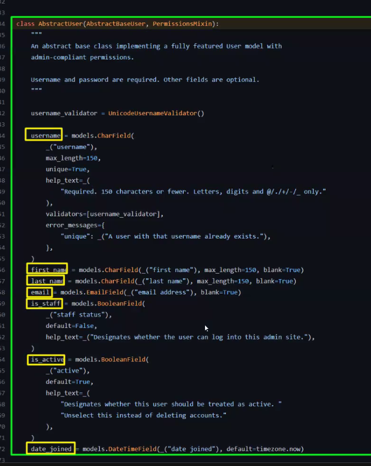


* 비밀번호는 암호화 해서 데이터베이스에 저장

  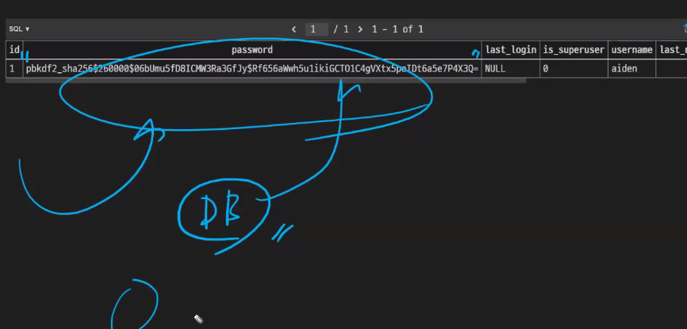

  