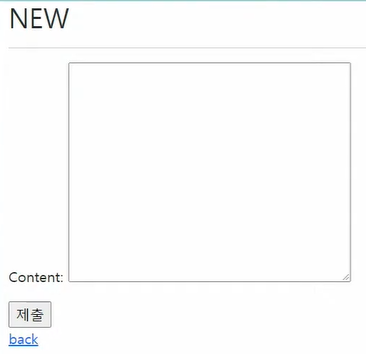
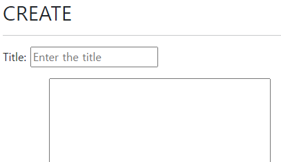

# Django Form Class

[TOC]

## :one: Django Form Class

### 1. Intro

* HTML, input을 통해서 사용자로부터 데이터를 받았음 
  * 이렇게 사용자의 데이터를 받으면, 입력된 데이터의 유효성을 검증하고, 필요시에 입력된 데이터를 검증 결과와 함께 다시 표시해야 함
    * 사용자가 입력한 데이터는 개발자가 요구한 형식이 아닐 수 있음
* 사용자가 입력한 데이터를 검증하는 것을 유효성 검증이라고 함
  * 이 과정을 코드로 모두 구현하는 것은 많은 노력이 필요
* 이러한 **과중한 작업과 반복 코드를 줄여줌으로써 이 작업을 쉽게 만들어 줌** with Django Form

### 2. Django's forms

* Django의 유효성 검사 도구 중 하나

* 외부의 악의적 공격 및 데이터 손상에 대한 중요한 방어 수단

* Form과 관련한 유효성 검사를 단순화 하고 자동화 할 수 있는 기능 제공

  * 개발자로 하여금 직접 작성하는 코드보다 더 안전하고 빠르게 수행하는 코드를 작성할 수 있게 함

* Django는 form에 관련된 작업의 아래 **세 부분**을 처리

  1. :star: **렌더링을 위한 데이터 준비 및 재구성**
  2. 데이터에 대한 HTML forms 생성
  3. 클라이언트로부터 받은 데이터 수신 및 처리

  

### 3. The Django 'Form Class'

* Django Form 관리 시스템의 핵심
* Form내 field, field 배치, 디스플레이 widget, label, 초기값, 유혀하지 않는 field에 관련된 에러 메세지를 결정
* Django는 사용자의 데이터를 받을 때 해야 할 과중한 작업 ( 데이터 유효성 검증, 필요시 입력된 데이터 검증 결과 재출력, 유효한 데이터에 대해 요구되는 동작 수행 등 ) 과 반복 코드를 줄여 줌

### 4. Form 선언하기

#### 1) Form 선언하기

1. `python -m venv venv`

2. 가상환경을 휴지통을 꺼주고, 다시 함 ( vs 코드에서 가상환경 전체를 만들어야 함)

   * `ctrl + shift +P` > `Python: Select Interpreter` > `Python 3.9.9('venv': venv)` 클릭

3. 다시 터미널 켜주면 `$source` 가 나오면서 가상환경이 activate됨

   

4. 필요한 패키지들 설치 

   * `pip install -r requirements.txt`

5. `articles/` 안에 `form.py` 만들어 주기

   

6. `forms.py` 작성해주기

   

   * Model을 선언하는 것과 유사하며, 같은 필드타입을 사용한다
   * 또한, 일부 매개변수도 유사한 것을 알 수 있다
   * 단, forms 라이브러리에서 파생된 Form 클래스를 상속받는다

#### 2) Form 사용하기

* 기존에는 form 태그와 input 태그로 사용자 입력 받았음
  * `new.html` 및 `edit.html`에서 입력 받음

1. `views.py` 에서 `ArticleForm` 클래스 불러옴

   

   `from .forms import ArticleForm` 

   - 현재 디렉토리에서 `forms.py`이라는 파일에서 `ArticleForm`이라는 클래스를 불러온다
   - 명시적 상대경로

2. `views.py` 에서 `new`함수 수정

   

   * `ArticleForm` 클래스를 이용해서 `form`인스턴스를 만들어준다
   * `form` 이 `context` 에 들어갈 경우,  해당 `form`을 `templates`, 즉 `html`파일로 보내주겠다는 의미

3. `templates` > `new.html` 수정

   

   * input 과 text area를 설정해 줬던 것을 Django Form으로 대체해 볼 것 

   * 원래 페이지 vs 변경 이후 페이지

     

   * 변경 이후 작업관리자 페이지 `<form>` 보면 input type, name 까지 모두 지정되어 있는 것을 볼 수 있음

   

   * `forms.py` 에서 만들어진 instance, 즉 `title` and `content`가 `new.html` 파일에서 출력이 되는 것
     * `title`, `content` 라는 클래스 변수와 `Field`만 지정했을 뿐임 - 아주 간편!
     * `model.py`에서 `max_length=10` 해도, title에 10자 이상으로 써 줄수 있었음( 써 주는 거랑, 10자 이상 받아 오는 거랑은 다름)
     * `form.py`에서는 `max_length=10`하면 10자 이상 써지지도 않음

4. **Form rendering options**: 디테일한 부분 수정

   * content 부분에서 `TextField`를 지원하지 않는다는 점(Text area 지정을 못함)

     * widget을 사용하여 만들어 줄 수 있음

     * `form.py` 의 `Field` 안에 `Textarea` widget을 할당해줌

       

     * 적용 후

       

       * 태그가 <textarea> 로 변환된 것을 확인할 수 있다

   * Title과 Content가 나란히 출력된다는 점

     * Input tag가 inline 속성을 가지고 있기 때문

     * form에 속성값을 제공해준다: `{{ form.as_p }}`

       

     * 적용 후

       

       

#### 3) `models.py` 와 비교

* `content` 부분에서 `TextField()` 필드 지정 불가능
* `CharField` 가져오는 곳은 각각 `forms`와 `models`로 다름. 따라서 이름만 같고 다른 필드.
* `forms.py` 의 `CharField`에서 `max_length=`가 없음을 알 수 있다 -> 필수 아님!

### 5. Form rendering options

* \<label> & \<input> 쌍에 대한 3가지 출력 옵션

  * **as_p**

    * 각 필드가 단락(
 태그)으로 감싸져서 렌더링 됨

  * **as_ul**

    * 각 필드가 목록 항목(<li> 태그)으로 감싸져서 렌더링 됨
    * \<ul>태그는 직접 작성해야 함

  * **as_table**

    * 각 필드가 테이블(<tr> 태그)행으로 감싸져서 렌더링 됨

    * \<table> 태그는 직접 작성해야 함

      

### 6. Django의 HTML input 요소 표현 방법 2가지

* 필드(Form fields)

  * input에 대한 유효성 검사 로직을 처리하며 템플릿에서 직접 사용 됨

* 위젯(Widgets)

  * [장고 위젯 공식문서](https://docs.djangoproject.com/en/4.0/ref/forms/widgets/)

  * 웹 페이지의 HTML input 요소 렌더링

    * 단독적으로 사용 불가능
    * FormField 안에서 사용 가능(widget은 반드시 Form fields에 할당 됨)
    * GET/POST 딕셔너리에서 데이터 추출

  * Widgets handling input of text (대소문자 주의)

    * `Textarea`

    * `EmailInput`

    * `PasswordInput`

      * `content = forms.CharField(widget=forms.PasswordInput)`으로 설정시

        

  

### 7. 위젯(widget)

* Django의 HTML input element 표현
* HTML 렌더링 처리
* 주의사항
  * Form Fields와 혼동되어서는 안됨
  * Form Fields는 input 유효성 검사를 처리
  * Widgets은 웹페이지에서 input element의 단순 raw한 렌더링 처리

### 8. Form field 및 widget 응용

#### 1) drop down menu 생성

* `forms.py` 수정

  * `ChoiceField`

    * `ChoiceField`의 default widget은 `Select`이므로 따로 명시하지 않아도 됨
    * Either an iterable of 2-tuples to use as choices for this field, enumeration choices, or a callable that returns such an iterable. This argument accepts the same formats as the choices argument to a model field. 

  * `widget=forms.Select`

    

  * drop down menu의 값을 튜플로 지정해준다

    

    * `REGION_A` 식으로 대문자 쓰는 것은 장고가 권장하는 스타일 가이드
      * Django Coding Style 로 검색하면 스타일 가이드 나옴
    * "sl", "dj", "gj"는 장고가 받는 value

    * 수정 후 

      

* 일반적인 경우와 비교

  * 일반적인 경우: `select` 태그 쓴 후 `option` 태그로 값 정해줌

    

#### 2) 체크박스(check box) 생성

* `forms.py`의 `FormField` > widget에 `CheckboxSelectMultiple` 지정

  

* 수정 후

  

## :two: Model Form

### 1. Intro

* Django Form을 사용하다 보면, Model에 정의한 필드를 유저로부터 입력받기 위해 Form에서 Model 필드를 재정의하는 행위가 중복될 수 있음

* 그래서 Django는 Model을 통해 Form Class를 만들 수 있는 Model Form이라는 Helper를 제공

  * 이미 만들어진 모델 구조에 맞춰서 Form Class를 만들어 보는 것이 Model Form

    

### 2. Model Form Class

#### 1)  개요

* Model을 통해 Form class를 만들 수 있는 Helper
* 일반 Form Class와 완전히 같은 방식(객체 생성)으로 view에서 사용 가능
* `FormClass`와 사용방식은 동일하지만, 작성하는 방식이 조금 다름
* Form과 DB는 밀접한 관련이 있는데, Form을 통해 받은 입력이 DB에 저장될 때 사용

#### 2) `ModelForm` vs `FormClass` : 역할이 다르다

* `ModelForm`

  * Django가 해당 model에서 양식에 필요한 대부분의 정보를 이미 정의
  * 어떤 레코드를 만들어야 할지 알고 있으므로, 바로 `.save()` 호출 가능
  * 데이터베이스의 구조가 DB에 **저장**이 되는 경우 사용한다
    * 회원가입 
  * 모델로 만들어진 테이블 필드 속성에 맞는 html element를 만들어주고
  * 이를 통해 받은 데이터를 view함수에서 유효성 검사를 할 수 있도록 함

* `FormClass`

  * 어떤 Model에 저장해야 하는지 알 수 없으므로, 유효성 검사 이후 `cleaned_data` 딕셔너리를 생성

  * cleaned_data 딕셔너리에서 데이터를 가져온 후, `.save()` 호출해야 함

  * Model에 연관되지 않은 데이터를 받을 때 사용

  * 사용자로부터 요청 받을 때, 모든 데이터를 DB에 저장할 필요는 없음

  * 사용자로부터 받은 데이터를 DB에 저장할 필요가 없을 때 사용(데이터베이스와 연관 X)

    * 단순히 데이터로서만 사용할 때

    * 로그인  

### 3. `ModelForm` 선언하기

#### 1) Model Form 선언

* `ModelForm`을 만들려면, 이미 만들어 놓은 `FormClass`를 주석처리해 놓는 것이 필요

* forms 라이브러리에서 파생된 `ModelForm` 클래스를 상속받음

* 정의한 클래스 안에 Meta 클래스를 선언하고, **어떤 모델을 기반으로** Form을 작성할 것인지에 대한 정보를 Meta 클래스에 지정 (주의: 클래스 변수 fields와 exclude는 동시에 사용할 수 없음)

  

  * class Meta: Article Model Form에 대한 data를 작성해주는 곳

    * model: 무슨 모델을 기반으로 만들 건지 작성

    * fields: 모델의 필드 중에 어떤 필드를 출력할것인지를 결정

      * 변수명을 리스트로 지정 가능

      *  변수가 너무 많을 경우 `__all__` : 해당 ArticleModel이 가지고 있는 모든 필드 출력

        

* 따로 ClassForm으로 변수를 일일히 지정해 주지 않고 Model만 지정해 주어도 title, content 모두 출력

  * 모델 구조를 바탕으로 자동적으로 해석해서 변환해주는 것 

  

#### 2) exclude 사용하기

* class 변수 fields와 exclude는 동시에 사용할 수 없음

* 만약 모든 필드를 출력하되, 한 두가지만 제외하고 출력하고 싶다면 사용가능

  

  

  * title이 사라진 것을 볼 수 있음

#### 3) create view 수정

* ModelForm 사용시 간단하게 줄일 수 있음

  

* `is_valid()` 및 `save()`

  

  * `form.save()`를 통해 저장하면서 우리에게 객체 하나를 반환 -> 이를 articles에 할당

* 유효성 검사가 잘 되는지 확인해보기

  * 먼저 개발자도구에 들어가서 <input maxlength="10">  부분을 지워줌

    

    * 지워주면 아래와 같이 됨. 그리고 10자 이상 쓸 수 있음

    

    * 이렇게 한다고 해도, 10자 이상의 제목이 들어온다면 유효성 검사 조건에 걸리지 않게 되므로 NEW 페이지로 redirect 된다. ( if 조건문을 돌지 못한 것 )

#### 3) `create`, `new` view함수 합치기

* 시작하기 전에 합치는 이유

  * 왜 애초에 나눠서 만들었나?

    

  * input을 받기 위해 몇 개의 view 함수 쓰고 있는가? 

    * `new` & `create` 

  * 메서드

    * `GET` : 데이터베이스의 데이터를 조회할 때 사용
    * `POST` : 데이터베이스에 뭔가 조작을 가할 때 사용 
    * `new` view 함수가 호출될 때는 `GET` method를 쓰고 있음
    * `create` view 함수가 호출될 때는 `POST` method를 쓰고 있음
    * 차이를 알았으니, 조건문으로 나눠주고, 하나로 합쳐보자

* new 함수를 create 함수로 넣어주자

  

  * 이 때, AttributeError가 날 것

    

    * `url.py`의 line8에서 에러 나고 있다고 친절히 알려줌

    * new라는 view함수가 없어져서 에러 나는 것이므로 path를 지워주면 해결된다

      

    * url 하나로 두 가지의 요청을 처리하게 됨(GET/POST)

  * `new` 흔적 다 지워주기 -> `create`로 바꿔주기

    * `views.py`

      * create 함수의 return render 부분

    * `new.html` 

      * 템플릿 이름도 `create.html`로 바꿔줌
      * 내부의 NEW도 다 create로 바꿔줌

    * `index.html`

      * 해당 템플릿의 `url`에 문제가 생기면 `NoReverseMatch`에러 나옴

        

      * `` 부분을 `new` > `create`로 

  * 마지막으로 구조를 손봐준다

    

    * 만약 context 부분이 else 내부에 들어 있었다면, 주황색 조건에 걸리지 않은 요청들은 마지막 return으로 반환된다. 그러나 해당 return에는 context가 있어야 하는데,  context가 else 안쪽에 있다면 해당 경우에는 context를 거치지 못하고 return되게 되므로 오류가 남. 따라서 context를 else 밖으로 빼 주어야 함

      

      * 이렇게 돼야 두 가지 종류가 context를 거쳐갑니다

      * 유효성 검사를 통과하지 못한 form은, 그냥 넘어오는 것이 아니라 error 메시지를 가지고 넘어옴

      * 따라서 '유효성 검사를 통과하지 못한 form'을 만들고, 이를 웹에서 확인해보면

        

        * 가지고 내려온 error 메시지를 출력한다
        * title은 10자 이상, content는 빈 칸 제출시 error message ( 장고가 기본적으로 설정한 에러메시지임. widget으로 에러메시지의 내용을 바꿀 수도 있음 )

  * `create.html`에서 `<action>`이 지정되지 않아도  요청 보내짐

    

    * html form 태그의 특징임
    * html <form> 태그 <action>에 값이 없다면 현재 그 위치의 url로 요청을 보낸다
    * 단 권장하지는 않습니다. 귀찮지만 명시적으로 써주자

#### 4) `edit`, `update` view 함수 합치기

* `view.py`에서 edit, update 는 거의 같은 역할

  * `edit` 은 조회 > `GET`
  * `update` 은 조작 > `POST`

* **CREATE와의 차이점**

  1. 데이터를 조회해준다
     * `article = Article.objects.get(pk=pk)`
  2. Model Form에 instance라는 키워드 인자를 추가해준다
     * `form = ArticleForm(instance=article)` 
     * instance 키워드 인자가 article이라는 객체를 받아줌

* `edit`을 `update`로 합쳐준다

  * 원래 `edit`

    

  * 합친 이후 `update`

    

  * `edit.html` 이름을 `update.html`로 바꿔주기

  * `url.py` 에서 edit 관련한 path 지워주기

    

  * `detail.html` 

    

    * `` 고쳐주기 ( `NoReverseMatch` 에러 날 것임 ) 
    * `{{ form.as_p }}` 넣어주기 - 주석처리된 부분을 한번에 처리해주는 것

  * 이대로 서버를 실행하면, 원래 edit 페이지에서 보여줬던 기존 데이터가 없이 빈 칸으로 나타남

    

  * 내용을 나타나게 해 주기 위해서는 `view.py` 조작 필요

    

    

  * 유효성 검사 해주기

    

    * 그런데 이렇게 되면, 업데이트가 되는 것이 아니라 `save()` 구간에서 새로운 글이 생성됨
    * 이때 키워드 인자 `instance = article`을 할당해주면 이 전 데이터 내용까지 출력됨

    

    * 만약 저 부분을 빼면, UPDATE가 아니라 CREATE 기능을 하게 됨(새로운 글이 생성됨)

  * 중복되는 코드 위쪽으로 빼주기

    

### 4. Meta Class

* Model의 정보를 작성하는 곳
* ModelForm 을 사용할 경우, 사용할 모델에 있어야 하는데 Meta Class가 이를 구성함
  * 해당 Model에 정의한 field 정보를 Form에 적용하기 위함
* [참고] Inner Class(Nested Class)
  * 클래스 내에 선언된 다른 클래스
  * 관련 클래스를 함께 그룹화 하여 가독성 및 프로그램 유지 관리를 지원(논리적으로 묶어서 표현)
  * 외부에서 내부 클래스에 접근할 수 없으므로 코드의 복잡성을 줄일 수 있음
* [참고] Meta data
  * 데이터에 대한 데이터
  * ex) 사진 촬영 - 사진 데이터 - 사진의 메타 데이터(촬영 시각, 렌즈, 조리개 값 등)

### 5. Methods

#### 1) `is valid()`

* 유효성 검사를 실행하고, 데이터가 유효한지 여부를 boolean으로 반환
  * method 이름이 is로 시작한다면 -> return이 boolean이라는 것을 유추할 수 있다 (T/F)
* 데이터 유효성 검사를 보장하기 위한 많은 테스트에 대해 Django는 `is_valid()`제공
  * True가 나오면 모델의 field조건을 통과한 것
  * 유효성 검증에 대해 개발자가 따로 복잡한 별도의 코드를 작성하지 않아도 됨
* 유효성검사란?
  * 요청한 데이터가 특정 조건에 충족하는지 확인하는 작업
  * 데이터페이스 각 필드 조건에 올바르지 않은 데이터가 서버로 전송되거나 저장되지 않도록 하는 것

#### 2) `save()` 

* Form에 바인딩 된(저장된) 데이터에서 데이터베이스 객체를 만들고 저장 -> 반환

* ModelForm의 하위(sub)클래스는 기존 모델 인스턴스를 키워드 인자 instance로 받아들일 수 있음

  * 이것이 제공되면 `save()`는 해당 인스턴스를 수정(UPDATE)
  * 제공되지 않는 경우, `save()`는 지정된 모델의 새 인스턴스를 만듦(CREATE)

* Form의 유효성이 확인되지 않은 경우(hasn't been validated), `save()`를 호출하면 `form.errors`를 확인하여 에러 확인이 가능. errors 라는 속성값에서 에러의 목록을 확인할 수 있다.

  * 로그를 확인하면 error 메세지가 뜬 것 확인 가능

    

    

* CREATE, UPDATE

  

  

### 6. 위젯(widget)

#### 1) widget이 하는 일

* Django의 HTML input element 표현(유효성 검사와는 관련 X)
* HTML 렌더링을 처리

#### 2)  Widgets 활용 - 1

#### 3) :star: Widgets 활용 - 2 (권장)

* `forms.py` 에서 widget 설정

  

  

* Title area 안쪽에 내용을 쓰고 싶다면 input tag에 속성값 지정 by `attrs={}`

  

  

  * `attrs`의 딕셔너리 `{}` 안에 위치시켜준다

* 에러메시지 커스터마이징

  * `error_messages`는 `widget`과 같이 `Core Field arguments`이므로 같은 위치에 써준다

    

    * indentation 제대로 맞춰주세요

    

  

### 7. forms.py 파일 위치

* Form class는 `forms.py` 뿐만 아니라 다른 어느 위치에 두어도 상관없음
  * `models.py` 안에 Form Class가 작성되는 경우도 있음
* 하지만 되도록 `app폴더/forms.py`에 작성하는 것이 일반적인 구조

### 8. Form & Model Form비교

* `ModelForm`
  * Django가 해당 model에서 양식에 필요한 대부분의 정보를 이미 정의
  * 어떤 레코드를 만들어야 할지 알고 있으므로, 바로 `.save()` 호출 가능
  * form으로 간단해지긴 헀지만, styling은 widget을 사용해야 하는 등 번거로움
* `Form`
  * 어떤 Model에 저장해야 하는지 알 수 없으므로, 유효성 검사 이후 `cleaned_data` 딕셔너리를 생성
  * cleaned_data 딕셔너리에서 데이터를 가져온 후, `.save()` 호출해야 함
  * Model에 연관되지 않은 데이터를 받을 때 사용

### 9. [참고] cleaned_data 구조 예시

## :three: Rendering fields manually

### 1. 수동으로 Form 작성하기

#### 1) Rendering fields manually

* [Django Official Documentation](https://docs.djangoproject.com/en/4.0/topics/forms/)

  

  

#### 2) Looping over the form's fields

* Field가 너무 많으면 for tag를 이용 가능

  

### 2. Bootstrap과 함께 사용하기

#### 1) Bootstrap class with widgets

* Bootstrap class를 widget에 직접 넣기

  

  

  

* Bootstrap 사용하여 에러 메시지 빨간 색으로 띄우기

  

  

  

#### 2) Django Bootstrap 5 Library

* 외부 라이브러리(third party library)의 힘을 빌리기
  * django-bootstrap v5
  * class에 bootstrap을 적용시켜주는 라이브러리
* 설치
  * 구글에 django-bootstrap v5 검색해서 설치
    1. `$ pip install django-bootstrap-v5`
    2. `$ pip freeze > requirements.txt`
    3. `settings.py`에 `INSTALLED_APPS` 

HTML Form, 장고의  Form class, Model Form 세개 파트로 나누어서 정리

NoReverseMatch 에러가 나면

`url.py`만 확인하면 됨 > 요청한 template의 url을 보면 됨

# tip

form 만들기 전 교수님 막간 git branch 수업

