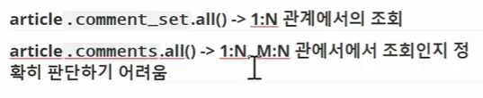
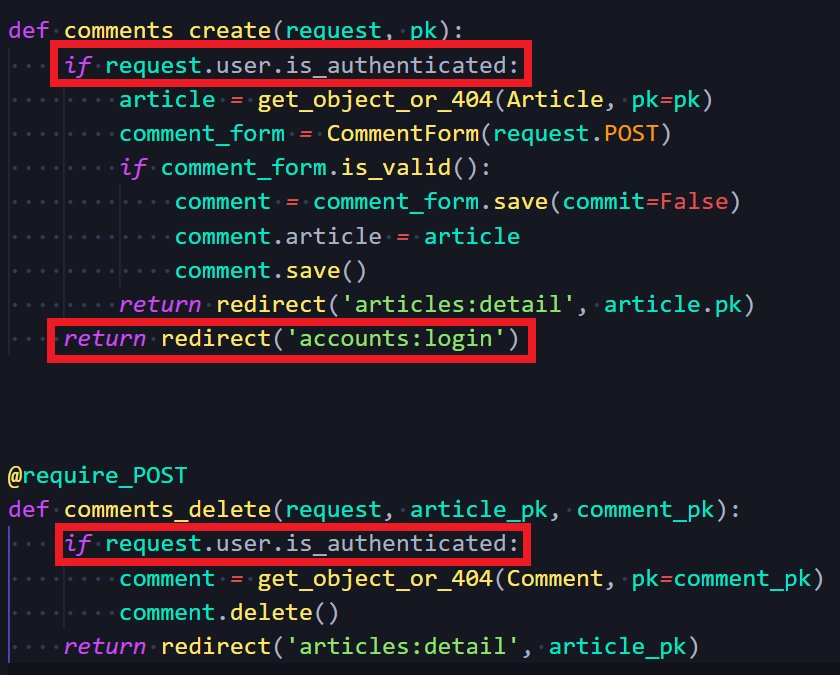
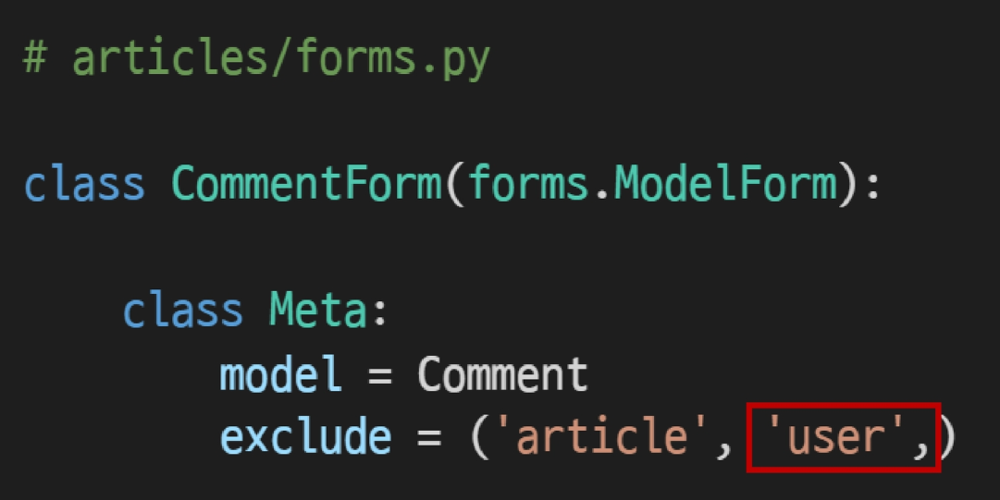

# Django Model Relationship I

[TOC]


## :one: Foreign Key(외래키) - 댓글 구현

### 1. 개념

#### 1) Foreign Key 개념

* 외래 키 (외부 키)
* 관계형 데이터베이스에서 한 테이블의 필드 중 다른 테이블의 행을 식별할 수 있는 키
* 참조하는 테이블에서 속성(필드)에 해당하고, 이는 참조되는 테이블의 기본 키(Primary Key)를 가리킴
* 참조하는 테이블의 외래 키는 참조되는 테이블 행 1개에 대응됨
  * 이 때문에 참조하는 테이블에서 참조되는 테이블의 존재하는 행을 참조할 수 없음
* 참조하는 테이블의 행 여러 개가 참조되는 테이블의 동일한 행을 참조할 수 없음


#### 2) Foreign Key 예시

* **게시글(Article)과 댓글(Comment)간의 모델 관계 설정**
  * Article = 참조되는 역할, Comment = 참조하는 역할
  * 1:N 관계에서, 외래키는 N의 역할을 하는 모델 즉 Comment가 가지고 있다.

* 예시

  * Comment에서 외래키(Foreign Key)는 Article의 기본키(Primary Key)를 가리킴

  


#### 3) Foreign Key 특징

* 키를 사용하여 부모 테이블의 유일한 값을 참조(참조 무결성)
  * 참조 무결성
    * 데이터베이스 관계 모델에서 관련된 2개의 테이블 간의 일관성을 말함
    * 외래 키가 선언된 테이블의 외래 키 속성(열)의 값은 그 테이블의 부모가 되는 테이블의 기본 키 값으로 존재해야 함
* 외래 키의 값이 반드시 부모 테이블의 기본 키일 필요는 없지만, 유일한 값이어야 함 


#### 4) `ForeignKey` field

* A many-to-one relationship\

* 2개의 위치 인자가 반드시 필요

  1. 참조하는 model class
  2. `on_delete` 옵션

* migrate 작업 시 필드 이름에 `_id` 추가하여 데이터베이스 열 이름 만듦

* [참고] 재귀 관계(자신과 1:N)

  * 자기가 자기자신을 참조하는 것

  ```python
  models.ForeignKey('self', on_delete=models.CASCADE)
  ```


### 2. `ForeignKey` 작성

#### 1) comment 모델 정의하기

* articles app에서 정의: 덧글은 게시판의 요소니까

  

  * 첫번째 위치 인자: 참조하는 모델 클래스(Article)
  * 두번째 위치 인자: on_delete 옵션
    * CASCADE: on_delete 옵션에 사용가능한 값 중 하나. 

```python
# articles/models.py

참조하는 테이블의 소문자 단수형으로 쓰는 이유
article_id
외래키 필드명을 봤을 때, 누구를 참조하는지 정확히 알아야 함 (1:N관계에서)
1. 누구를 참조하는지 모델명 알 수 있음
2. 다른 모델 관계와 헷갈리지 않을 수 있음(M:N 과 구분될 수 있게)
```

* 주의사항: "Comment 모델은 외래키 article_id를 포함합니다"라는 문장을 보고 클래스 변수명에다가 article_id 쓰면 안 됨. 

  * migrate 이후 데이터베이스 내 articles_comment 테이블의 외래 키 컬럼 확인시 필드 이름에 _id가 자동으로 추가 되는 것을 볼 수 있음

    

    

#### 1-1) `on_delete`옵션

* 외래 키가 참조하는 객체가 사라졌을 때(댓글이 삭제되었을 때), 외래 키를 가진 객체를 어떻게 처리할 지를 정의
* Database Integrity(데이터 무결성)을 위해서 매우 중요한 설정
  * 데이터무결성: 데이터의 정확성과 일관성을 유지하고 보증하는 것을 가리키며, 데이터베이스나 RDBMS 시스템의 중요한 기능
  * 유형
    * 개체 무결성(Entity integrity)
      * PK의 개념과 관련
      * 모든 테이블이 PK를 가져야 하며, PK로 선택된 열은 고유한 값이어야 하고 빈 값은 허용치 않음을 규정
    * **참조 무결성(Referential integrity)**
      * FK 개념과 관련
      * FK 값이 데이터베이스의 특정 테이블의 PK값을 참조하는 것
    * 범위(도메인) 무결성(Domain integrity)
      * 정의된 형식(범위)에서 관계형 데이터베이스의 모든 컬럼이 선언되도록 규정
* `on_delete` 옵션에 사용 가능한 값들
  * **CASCADE: 부모 객체(참조된 객체)가 삭제됐을 때 이를 참조하는 객체도 삭제**
    * 
  * PROTECT
    * 댓글이 달려있으면 게시물을 못 지우게
  * SET_NULL
  * SET_DEFAULT
  * SET()
  * DO_NOTHING
  * RESTRICT
  * 

#### 2) migration

1. `Makemigrations`
2. `migrate`

* `models.py`와 `0003_comment.py` 보면, 외래키가 `models.py` 어디에 정의되어 있든지, migration에는 뒤에 쌓이게 되는 것을 볼 수 있다.


#### 3) 데이터베이스의 `ForeignKey` 표현

* 만약 ForeignKey 인스턴스를 abcd로 생성했다면, abcd_id로 만들어짐 
* 하지만 명시적인 모델 관계 파악을 위해 참조하는 클래스 이름의 소문자(단수형)로 작성하는 것이 바람직함(1:N)


### 1. Comment CREATE 

```bash
$ python manage.py shell_plus
```

```shell
In [1]: comment = Comment()
In [2]: comment
Out[2]: <Comment: >

# comment안에는 1. 댓글의 내용, 2. 어떤 게시글에 달린건지, 두 가지 내용이 필요하다
# 만약 값이 하나만 추가되고 저장을 하려고 하면,
# IntegrityError: NOT NULL constraint failed: articles_comment.article_id 이 나옴

In [6]: article = Article.objects.create(title='title', content='content')

In [7]: article.pk
Out[7]: 1

In [8]: comment.content
Out[8]: 'first comment'

In [9]: comment.article = article

In [10]: comment.save()

In [11]: comment
Out[11]: <Comment: first comment>

In [12]: comment.pk
Out[12]: 1
```


밑에 방법을 장고가 더 권장함


```shell
# 만든 코멘트 확인
In [14]: comment.pk
Out[14]: 1

In [15]: comment.content
Out[15]: 'first comment'

In [16]: comment.article
Out[16]: <Article: title>

In [17]: comment.article.pk
Out[17]: 1

In [18]: comment.article.content
Out[18]: 'content'
```


```shell
# 두번째 댓글 생성 및 확인
In [19]: comment = Comment(content='second comment', article=article)

In [20]: comment.save()

In [21]: comment.pk
Out[21]: 2

In [22]: comment.article.pk
Out[22]: 1

In [23]: comment.article_id
Out[23]: 1
```


* 관리자 페이지에의 등록

  ```python
  # articels/admin.py
  ```

  

* admin 계정 만들어주기

  ```
  # shell plus에서 나오려면 exit
  create superuser
  ```

  

  


#### 1) 1:N 관계 related manager


* 역참조('comment_set')
  * Article(1) -> Comment(N)
  * `article.comment_set` manager가 생성됨 (문법파괴)
  * 게시글에 몇 개의 댓글이 작성 되었는지 Django ORM이 보장할 수 없기 때문
    * article은 comment가 있을 수도, 없을 수도 있음
    * 실제로 Article 클래스에는 Comment와의 어떠한 관계도 작성되어 있지 않음
  * 댓글을 보여줄 때 사용
* 참조('article')
  * Comment(N)->Article(1)
  * 댓글의 경우 어떠한 댓글이든 반드시 자신이 참조하고 있는 게시글이 있으므로, `comment.article`로 접근 가능
  * 실제 `ForeignKeyField` 또한 Comment 클래스에서 작성됨

#### 2)  1:N related manage 연습


```shell
# 1번 게시글 조회
In [1]: article = Article.objects.get(pk=1)

In [2]: article
Out[2]: <Article: title>

# article입장에서 여기서 작성된 모든 댓글 조회하기(역참조 1 -> N)
In [3]: article.comment_set.all()
Out[3]: <QuerySet [<Comment: first comment>, <Comment: second comment>]>

# 방금 조회한 쿼리셋을 comments 변수에 할당
In [4]: comments = article.comment_set.all()

# 조회한 댓글 for문으로 출력
In [5]: for comment in comments:
   ...:     print(comment.content)
   ...: 
first comment
second comment

```

```shell
# 그냥 참조 (comment의 입장에서 참조)
# comment 변수에 1번 댓글 

In [6]: comment = Comment.objects.get(pk=1)

In [7]: comment
Out[7]: <Comment: first comment>

In [8]: comment.article
Out[8]: <Article: title>

In [9]: comment.article.content
Out[9]: 'content'

In [10]: comment.article_id
Out[10]: 1
```


* 역참조시 사용할 이름(`comment_set`을 변경할 수도 있다(권장하지는 않음)

  

  

  

  


### 1. Comment CREATE 

#### 1) CommentForm 작성

* `articles/forms.py`


* 보통 댓글 작성은 게시글의 상세페이지에서 보이게 되니까 detail view함수 조작

* `views.py` > `detail view`

  

* `detail.html`

  

* 웹페이지 출력

   

  

  2번째 글 detail 페이지에서 1번글에 대한 코멘트를 쓸 수 있다 > 수정 필요함!

* 수정

  * `forms.py` 에서 field를 content만 출력하게 바꿔줌

    

  * `urls.py`

    

  * `detail.html` 에서 action값 바꿔주기

    

  * `views.py`

    

    * method에 따른 분기처리 필요한가요? (if request.method =="POST: , else) 아니요

      왜냐면 댓글 출력은 단독 페이지가 아닌 기존 detail 페이지에서 처리되고 있다

       즉, POST에 관련된것만 처리하면 됨

  

* 댓글 저장시

  

  * 값을 하나만 보내고 있따 - 어느 게시글에 대한 댓글인지 물어보는 에러

  * 어떻게 값을 추가할 수 있을까?

  * save()는 인자를 하나 반환함. 따라서 

    

  * 댓글 작성 됐는지 확인하려면 DB확인 ( 아직 출력 코드 작성 안함 )

    

  * 

#### 2) The `save()` method

* `save(commit=False)`
  * Create, but don't save the new instance
  * 아직 데이터베이스에 저장되지 않은 인스턴스를 반환
  * 저장하기 전에 객체에 대한 사용자 지정 처리를 수행할 때 유용하게 사용
* django.contrib.auth에서 forms.py

 


### 2. Comment READ(댓글 출력)

#### 1) `articles/views.py`

* 특정 article에 있는 모든 댓글을 가져온 후 context에 추가

  

#### 2) `detail.html`

* detail 페이지에서 댓글 출력

  


### 3. Comment DELETE

#### 1) 순서

* `urls.py` 

  

* `detail.html`

  

* `views.py`

  * 모델 임포트

    

  * 1번째 방법

    

  * 2번째 방법

    * 이걸 사용

      

    * 왜냐면 url의 통일성과 일관성 때문

    * `url.py`  업데이트 해주기

      

* 데코레이터 추가

  

  * 이렇게 데코레이터 두 개 쓰면 에러난다
  * 왜? :question:
  * 그래서 require_POST만 써줌

  

  

* 


#### 2) 인증된 사용자의 경우만 댓글 작성 및 삭제



#### 3) comment 추가사항

* 댓글 갯수 출력하기

  

* 댓글 없는 경우 대체 컨텐츠 출력(DTL의 for-empty 태그 활용)

  


:question: 웹엑스에서 교수님이 따로말씀해주신거

장고에서 다루는 form은 두가지

```python
comment_form = CommentForm() # 언바운드 폼
comment_form = CommentForm(request.POST) # 바운드 폼

Django는 바운드 된 폼에 의해서만 유효성 검사를 하고
Form이 이미 작성된 이후에는 수정이 불가능하다

comment = comment_form.save(commit=False) # database에 저장을 안 했다

```


## :two: :star: Customizing authentication in Django

### 1. Substituting a custom User model

#### 1) User 모델 대체하기

* 일부 프로젝트에서는 Django의 **내장 User 모델이 제공하는 인증 요구사항이 적절하지 않을 수 있음**
  * ex) username 대신 email을 식별 토큰으로 사용하는 것이 더 적합한 사이트
* Django는 User를 참조하는데 사용하는 AUTH_USER_MODEL 값을 제공하여, default user model을 **재정의(override)**할 수 있도록 함
* Django는 새 프로젝트를 시작하는 경우, 기본 사용자 모델이 충분하더라도 **커스텀 유저 모델을 설정하는 것을 강력하게 권장(highly recommended)**
  * 단, 프로젝트의 모든 migrations 혹은 첫 migrate을 실행하기 전에 이 작업을 마쳐야 함
  * 이미 User 모델과 다른 모델들과의 관계가 다 설정이 되어버렸기 때문
  * 만약 굳이굳이 대체해야한다면 **초기화** 해야함


#### 2) `AUTH_USER_MODEL`

* User를 나타내는데 사용하는 모델

* 프로젝트가 진행되는 동안 변경 불가능

  * 프로젝트 중간에(mid-project) AUTH_USER_MODEL 변경하기
    * 모델 관계 전체에 영향을 미치기 때문에 훨씬 더 어려운 작업 필요
    * 즉, 중간 변경은 권장하지 않으므로 초기에 설정하는 것을 권장

* 프로젝트 시작 시 설정하기 위한 것이며, 참조하는 모델은 첫번째 마이그레이션에서 사용할 수 있어야 함

* 기본 값: `auth.User` (auth 앱의 User모델)

  * 기본값은 `settings.py` > `INSTALLED_APPS =[]` 에서 확인할 수 있음. 이게 밑에꺼로대체된다는 것

  * `AUTH_USER_MODEL = 'auth.User'`

    

  

#### 3) Custom User 모델 정의하기

* 관리자 권한과 함께 완전한 기능을 갖춘 User 모델을 구현하는 기본 클래스인 `AbstractUser`를 상속받아 새로운 User 모델 작성

  * `accounts/models.py`

    ```python
    from django.db import models
    from django.contrib.auth.models import AbstractUser
    
    # Create your models here.
    class User(AbstractUser):
        pass
    
    # 모든 속성들이 AbstractUser 하위에 있었음
    # settings.py의 auth.User를 accounts.User 클래스로 바꿈
    # 이 프로젝트에서 사용하는 기본 User 모델을 AbstractUser로 대체하는 것
    # 이걸 첫 migrations 전에 해야한다.
    ```

    

* 기존 Django가 사용하는 User 모델이었던 auth 앱의 User모델을 accounts 앱의 User 모델을 사용하도록 변경: 이걸 첫 migrations 전에 해야한다.

  * `settings.py`

    

* admin site에 Custom User 모델 등록

  * `accounts/admin.py`

    

* 프로젝트 중간에 진행했기 때문에, 데이터베이스를 초기화 한 후 마이그레이션 진행

* **초기화 방법**

  * db.sqlite3파일 삭제

  * migrations 파일 모두 삭제(파일명에 숫자가 붙은 **파일**만 삭제 - 폴더, `__init__`파일은 그대로 두기)

  * `python manage.py makemigrations`

    * articles, accounts 폴더 내 migrations 폴더 둘 다에 수정 생김
    * db.sqlite3 파일 생성됨

  * `python manage.py migrate`

    * db.sqlite3에서 `auth_user` 테이블 이름이 `accounts_user`로 바뀜

  * 초기화 후에는 admin user도 다 초기화 되었으므로, 진행하려면 `createsuperuser`다시해야함

    * 인증 및 권한 테이블 내 사용자 리스트 사라짐

      

      * 이유: built-in User model에서는 admin이 등록이 되어있는데, 이 모델을 우리가 새로 대체해버렸으므로 없어진 것. 이걸 새로 만들어줘야함

  *  사용자 목록 재생성하기

    * customizing authentication in Django

      * Substituting a custom User model에서 순서대로 변경 후 migrate

      

    * `accounts/admin.py`

      ```python
      # accounts/admin.py
      from django.contrib import admin
      from django.contrib.auth.admin import UserAdmin
      from .models import User
      
      admin.site.register(User, UserAdmin)
      ```

      

    * 출력

      


### 2. Custom user & Built-in auth forms

#### 1) 회원가입 시도 후 아래와 같은 에러 발생

* 에러 페이지

  * Model이 변경되면서 생기는 에러 

  

  

* 해결방법

  * `UserCreationForm`과 `UserChangeForm`은 기존 내장 User모델을 사용한 Model Form이기 때문에 커스텀 User 모델로 대체해야 함

    

    

#### 2) Custom Built-in Auth Forms

*  기존 User 모델을 사용하기 때문에 커스텀 User 모델로 다시 작성하거나 확장해야 하는 forms

  * `UserCreationForm`

    * `accounts/forms.py`

      

    * `accounts/views.py`

      

  * `UserChangeForm`

* 커스텀 User 모델이 `AbstractUser`의 하위 클래스인 경우, 다음과 같은 방식으로 form을 확장

  * `UserCreationForm` 확장

  

​    *# User Model을 간접적으로 참조(함수호출을 통해서)하고 있다 -> 이걸 CustomUser로 바꾸려고*

​    *# 우리는 User 모델을 쓰고 있지만, 직접 참조하고 있지는 않다*

​    *# 간점적으로 함수호출을 통해서 프로젝트에서 사용하는 UserModel을 return 받을 수 있다*

​    *# get_user_model : 현재 장고 프로젝트에서 활성화된 User Model을 return해준다*

​    *# UserModel 활성화 된거? accounts 에 있는 User*

  *# 단순 유저 모델 주는게 아니라, 현재 우리 장고 프로젝트에서 메인으로 활성화되어 있는 유저 객체를 리턴*


#### 3) signup view 함수 코드 수정

*  수정 후 회원가입 재시도
* 

#### 4) `get_user_model()`

* **현재 프로젝트**에서 활성화된 사용자 모델(active user model)을 반환
  * User 모델을 커스터마이징한 상황에서는 Custom User 모델을 반환
* 이 때문에 Django는 User 클래스를 직접 참조하는 대신
  * `django.contrib.auth.get_user_model()`을 사용해 참조해야 한다고 강조 (간접 참조)
  * 직접 참조 하면 - User 대체시 바로 문제 생김


# Model Relationship II

 ## :one: 1:N 관계 설정

### 1. User - Article

* 사용자는 여러 개의 게시글을 작성할 수 있음
* N 키는 Article이 가지고 있음

#### 1) User 모델 참조하기


* `settings.AUTH_USER_MODEL`

  * User 모델에 대한 외래 키 또는 다대다 관계를 정의할 때 사용
  * `models.py`에서 User 모델을 참조할 때 사용

* `get_user_model()`

  * 현재 활성화(active)된 User 모델을 반환
    * 커스터마이징한 User 모델이 있을 경우 Custom User 모델, 그렇지 않으면 User를 반환
    * User를 직접 참조하지 않는 이유
  * `models.py`가 아닌 다른 모든 곳에서 유저 모델을 참조할 때 사용

* `articles/models.py` : 쓰든 안쓰든, 이걸 먼저 세팅해주는것이 좋다

  

* 왜 문자열로 참조?

  * 장고에서 app이 실행되는 순서

  

  * 따라서 `models.py`에서 django에서 user모델을 참조할 때, 

    ```python
    user = models.ForeignKey(get_user_model(), on_delete=models.CASADE)
    ```

    이래도 괜찮지만, 장고에서 권장하지는 않음

    ```python
    # 권장
     user = models.ForeignKey(settings.AUTH_USER_MODEL, on_delete=models.CASCADE)
    ```

    

#### 2) User와 Article 간 모델 관계 정의 후 migration 


* null 값이 허용되지 않는 user_id 필드가 별도의 값 없이 article에 추가되려 하기 때문
* 1을 입력 후 enter
  * 현재 화면에서 기본값을 설정하겠다는 의미
* 1을 입력 후 enter
  * 기존 테이블에 추가되는 user_id 필드 값을 1로 설정하겠다는 의미
* 마무리


#### 3) 게시글 출력 필드 수정

* 게시글 작성 페이지에서 불필요한 필드가 출력되는 것을 확인

  

* `articles/forms.py` 

  * ArticleForm의 출력 필드 수정 후 게시글 작성 재시도 (둘 다 똑같음)

    

    

    

    

    

* 에러 발생: 누가 작성하는데?

  

  * 게시글 작성 시 NOT NULL constraint failed: articles_article.user_id 에러 발생

  * 게시글 작성 시 작성자 정보(article.user)가 누락되었기 때문

    


#### 4) CREATE

* 게시글 작성 시 작성자 정보(article.user) 추가 후 게시글 작성 재시도

  * `views.py`

  

  

#### 5) DELETE

* 자신이 작성한 글만 삭제 가능하도록 설정

  * 캡쳐본 `authenticated` 스펠링 틀림

  


#### 6) UPDATE

* 자신이 작성한 글만 수정 가능하도록 설정

* 자신이 작성한 글이 아니면, 수정 페이지도 들어가면 안됨

  

  

#### 7) READ

* 게시글 작성 user가 누구인지 `index.html`에서 출력

  

* 해당 게시글 작성자가 아니라면, 수정/삭제 버튼을 출력하지 못하도록 처리

  


### 2. User - Comment

* 한명의 유저는 여러개의 댓글 달 수 있음

* 외래키는 Comment가 가지고 있음

  

  * 댓글을 ForeignKey를 두 개 가지고 있다

    * 댓글은 article하고도 1:N, user하고도 1:N 이므로

    

#### 1) User와 Comment 간 모델 관계 정의 후 migration

* `makemigrations`


* null 값이 허용되지 않는 user_id 필드가 별도의 값 없이 comment에 추가되려 하기 때문

* 1을 입력 후 enter

  * 현재 화면에서 기본값을 설정하겠다는 의미

* 1을 입력 후 enter

  * 기존 테이블에 추가되는 user_id 필드 값을 1로 설정하겠다는 의미(기존 댓글의 작성자가 모두 1번 user가 됨)

* 마무리

  `migrate`


#### 2) 댓글 출력 필드 설정

* 게시글 작성 페이지에서 불필요한 필드가 출력되는 것을 확인

  

* 댓글 작성 시 user `ForeignKeyField` 를 출력하지 않도록 설정 (아래 그림 둘 다 가능)

  

  

  

* 에러 발생

  * 댓글 작성 시 NOT NULL constraint failed: articles_comment.user_id 에러 발생

  * 댓글 작성 시 작성자 정보(comment.user)가 누락되었기 때문

    

#### 3) CREATE

* 댓글 작성 시 작성자 정보(request.user) 추가 후 댓글 작성 재시도

  * `articles.views.py`

    

  


#### 4) READ

* 비로그인 유저에게는 댓글 form 출력 숨기기

  * `detail.html`

    

* 댓글 작성자 출력하기

  * `detail.html`

    


#### 5) DELETE

* 자신이 작성한 댓글만 삭제 버튼을 볼 수 있도록 수정

  * `detail.html`

    

* 자신이 작성한 댓글만 삭제할 수 있도록 수정

  * `views.py`

    

  


## :two: M:N 관계 설정

### 1. User - Article

#### 1)

#### 2)

#### 3)


### 2. User - Comment

#### 1)

#### 2)

#### 3)