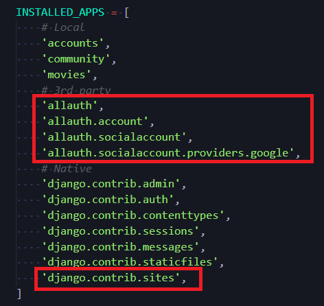
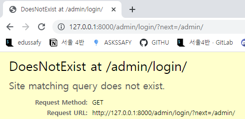
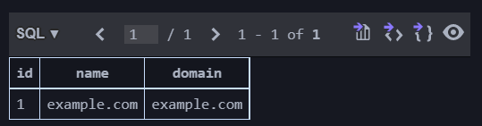
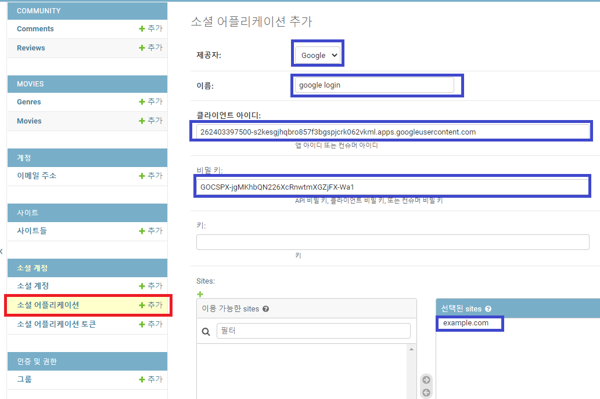
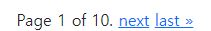
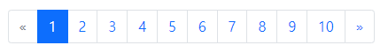

# Django PJT


## :one: Social Login

### 1. Django allauth

* django allauth [문서](https://django-allauth.readthedocs.io/en/latest/installation.html)

  ```bash
  $ pip install django-allauth
  ```

* `settings.py`

  * `AUTHENTICATION_BACKEDNS = []` 넣어주기

  ```python
  # INSTALLED APPS 아래에 위치(위치는 상관없음)
  
  AUTHENTICATION_BACKENDS = [
      # Needed to login by username in Django admin, regardless of `allauth`
      'django.contrib.auth.backends.ModelBackend',
  
      # `allauth` specific authentication methods, such as login by e-mail
      'allauth.account.auth_backends.AuthenticationBackend',
  ]
  ```

  * `INSTALLED_APPS =[]` 업데이트

  

  ```python
  INSTALLED_APPS = [
      # Local
      'accounts',
      'community',
      'movies',
      # 3rd party
      'allauth',
      'allauth.account',
      'allauth.socialaccount',
      'allauth.socialaccount.providers.google',
      # Native
      'django.contrib.admin',
      'django.contrib.auth',
      'django.contrib.contenttypes',
      'django.contrib.sessions',
      'django.contrib.messages',
      'django.contrib.staticfiles',
      'django.contrib.sites',
  ]
  ```

* migrations

  ```bash
  $ python manage.py migrate
  ```

* Login 설정

  ```bash
  $ python manage.py createsuperuser
  # id: admin
  # password: admin123
  $ python manage.py runserver
  ```

* admin 들어가려고 하면 에러 메시지 나옴

  

  * 이유: `settings.py` > `INSTALLED_APPS` > `django.contrib.sites` 

    * 하나의 장고 서버에서 여러개의 url을 관리할 때 사용하는 것

    * sites라는 애를 썼으면 site id를 써줘야 함

    * sqlite3 > django_site 내 데이터 베이스를 확인해보면 아래와 같이 나옴

      

    * 따라서 어떤 도메인과 이름을 쓰는지 지정을 해줘야 함 -> SITE ID 지정해주기

* `settings.py`에 SITE ID 지정해주기

  * INSTALLED_APPS 하단에

  ```python
  SITE_ID = 1
  ```


### 2. Google Cloud Platform

* console창 들어오기

* New Project > my-django-login project 생성

* APIs & Services

* OAuth Consent Screen

  * OAuth consent screen
    * External
    * 앱이름
    * 이메일주소
    * 개발자연락처정보
  * Scopes
    * Add or Remove Scopes
    * email주소까지 범위설정
  * Test Users
    * 나의 계정, 함께 프로젝트 하는 팀원 계정 이메일 주소 추가
    * 대시보드로 돌아가기

* Credentials

  * create credentials

  * OAuth client ID

  * Application type

    * Web application

  * Authorized redirect URIs

    * [django-allauth 공식문서](https://django-allauth.readthedocs.io/en/latest/providers.html) 참조

      ```text
      http://127.0.0.1:8000/accounts/google/login/callback/
      ```

  * 제공된 client ID, client secret 을 장고와 연결시켜주면 됨

    ```text
    # Client ID
    262403397500-s2kesgjhqbro857f3bgspjcrk062vkml.apps.googleusercontent.com
    # Client Secret
    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
    ```


### 3. 장고와 연결시켜주기

* `localhost:8000/admin/`가서 로그인 하면

* 소셜 계정 > 소셜 어플리케이션 > 소셜 어플리케이션 추가

  

* 제공자, 이름, 클라이언트 아이디, 비밀키, Sites까지 적어주기(Sites의 경우, 추후 도메인이 생긴다거나 하면 그 주소를 써주면 됨)

* `urls.py`에 추가

  ```python
  path('accounts/', include('allauth.urls')),
  ```

* 구글 로그인 폼을 html에서 나타나게 해주기 - `login.html`

  * [Social Account Tags-문서](https://django-allauth.readthedocs.io/en/latest/templates.html#social-account-tags)

  ```html
  
  <div>
    <a href="">[Google Login]</a>
  </div>
  ```

  * 출력 확인

  

* 중간 화면 안보고 싶다면 [공식문서참조](https://django-allauth.readthedocs.io/en/latest/configuration.html)

  * `SOCIALACCOUNT_LOGIN_ON_GET(=False)`를 True로 바꿔주면 됨

  * `settings.py` 

    ```python
    # SITE_ID 밑에 넣어주기
    SOCIALACCOUNT_LOGIN_ON_GET = True
    ```

* DB 확인하기

  * `db.sqlite3` > `accounts_user` 테이블은 구글에서 전달받은 정보로 채워짐


## :two: Pagination

### 1. `views.py`

* movies에 데이터 불러오기

  * `movies/views.py`

    ```python
    from .models import Movie
    
    @require_safe
    def index(request):
        movies = Movie.objects.all()
        context = {
            'movies': movies,
        }
        return render(request, 'movies/index.html', context)
    ```

  * `index.html`

    ```html
    <div>
        
        <div>
            <h2>{{ movie.title }}</h2>
            <p>{{ movie.overview }}</p>
            <a href="">[DETAIL]</a>
            <hr>
        </div>
        
    </div>
    ```

* 모든 데이터가 페이지 1에 다 출력되므로 가독성 떨어짐 - 장고 제공 Paginator로 고치자

  * [Paginator-Django문서](https://docs.djangoproject.com/en/4.0/topics/pagination/#using-paginator-in-a-view-function)

  * `views.py`

    ```python
    from django.core.paginator import Paginator
    
    @require_safe
    def index(request):
        movies = Movie.objects.all()
        paginator = Paginator(movies, 10)
        
        page_number = request.GET.get('page')
        page_obj = paginator.get_page(page_number)
    
        context = {
            'movies': page_obj,
        }
        return render(request, 'movies/index.html', context)
    
    ```

  * page 넘버 선택해서 페이지 이동 가능하게 해주기 위해 `index.html` 수정

    ```html
    <div class="pagination">
        <span class="step-links">
            
                <a href="?page=1">&laquo; first</a>
                <a href="?page={{ movies.previous_page_number }}">previous</a>
            
    
            <span class="current">
                Page {{ movies.number }} of {{ movies.paginator.num_pages }}.
            </span>
    
            
                <a href="?page={{ movies.next_page_number }}">next</a>
                <a href="?page={{ movies.paginator.num_pages }}">last &raquo;</a>
            
        </span>
    </div>
    ```

    

  * Bootstrap 입혀주기 [django-bootstrap문서](https://django-bootstrap-v5.readthedocs.io/en/latest/templatetags.html#bootstrap-pagination)

    ```bash
    $ pip install django-bootstrap-v5
    ```

    ```python
    # settings.py 
    INSTALLED_APPS = [
        # 3rd party
        'bootstrap5',
    ]
    ```

    ```html
    
      <div class="d-flex justify-content-center">
        
      </div>
    ```

    


## :three: Infinite Scroll

* 하고자 하는 것

  * scroll이 바닥언저리에 도달했을 때 > document / eventListener
  * 추가 데이터 10개를 불러온다(AJAX) > axios
  * 응답 JSON 데이터 10개를 화면에 붙임 > DRF

* `base.html`

  * axios CDN 불러오기

  ```html
  <script src="https://unpkg.com/axios/dist/axios.min.js"></script>
  ```

  * block 생성

  ```html
  
  ```

* DRF 설치

  ```bash
  $ pip install djangorestframework
  ```

  ```python
  # settings.py
  INSTALLED_APPS = [
      'rest_framework',
  ]
  ```

* JS 쓰기: 1. scroll이 바닥언저리에 도달했을 때

  * mdn에서 스크롤이 하단을 터치할 때 알 수 있는 방법 검색
  * mdn scrollheight [scrollHeight 문서](https://developer.mozilla.org/en-US/docs/Web/API/Element/scrollHeight#determine_if_an_element_has_been_totally_scrolled)
  * 완전 바닥에 도달했을 때 scroll 을 extend하기 위해 쓸 수 있는 것

  ```javascript
  document.addEventListener('scroll', function (event) {
      const { scrollTop, clientHeight, scrollHeight } =  document.documentElement.scrollTop
      if ( scrollHeight - scrollTop === clientHeight) {
          console.log('BOTTOM!')
      }
  })
  ```

  * 스크롤이 **바닥 언저리**에 도달했을 때 

  ```javascript
  document.addEventListener('scroll', function (event) {
      const { scrollTop, clientHeight, scrollHeight } =  document.documentElement.scrollTop
      if ( scrollTop + clientHeight >= scrollHeight - 5) {
          console.log('BOTTOM!')
      }
  })
  ```

* 2. 추가 데이터 10개를 불러온다(AJAX)

  ```html
  <script>
    document.addEventListener('scroll', function (event) {
      const { scrollTop, clientHeight, scrollHeight } =  document.documentElement.scrollTop
      if ( scrollTop + clientHeight >= scrollHeight - 5) {
        axios({
          method: 'get',
          url: '/movies/?page=2/'
        })
          .then(res => console.log(res.data))
          .catch(err => console.error(err))
      }
    })
  </script>
  ```

* 3. 응답 JSON 데이터

  * `movies/serializers.py`생성

  ```python
  from rest_framework import serializers
  from .models import Movie
  
  class MovieSerializer(serializers.ModelSerializer):
  
      class Meta:
          model = Movie
          fields = '__all__'
  ```

  * `views.py`

  ```python
  # ajax_index 함수 만들어주기
  # is_json 쓰지 말라고 했음
  
  ```

  * `urls.py`

  ```python
  urlpatterns = [
      path('ajax/', views.ajax_index, name='ajax'),
  ]
  ```

  


## OAuth의 개념


* Login 과 다른 개념
  * OAuth는 방문증, Login은 사원증

* OAuth 인증프로세스 자료 따로 찾아보기