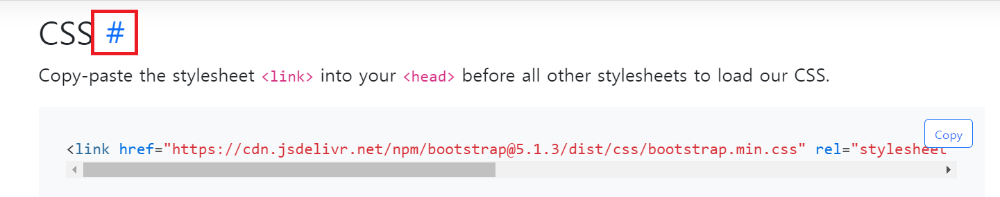

# Django REST API


## :one: HTTP

### 1. 개념

* HyperText Transfer Protocol
* 웹 상에서 컨텐츠를 전송하기 위한 약속
* HTML 문서와 같은 리소스를 가져올 수 있도록 하는 프로토콜(규약, 약속)
* 웹에서 이루어지는 모든 데이터 교환의 기초
  * 요청(request)
    * 클라이언트에 의해 전송되는 메세지
  * 응답(response)
    * 서버에서 응답이 전송되는 메시지
* 기본특성
  * Stateless(무상태)
  * Connectionless(비연결성)
* 쿠키와 세션을 통해 서버 상태를 요청과 연결하도록 함


### 2. HTTP 메시지


### 3. HTTP request methods

* 자원에 대한 행위(수행하고자 하는 동작)을 정의
* 주어진 리소스(자원)에 수행하길 원하는 행동을 나타냄
* HTTP Method 예시
  * GET, POST, PUT, DELETE
    * GET: READ
    * POST: CREATE
    * PUT: UPDATE
    * DELETE: DELETE


### 4. HTTP response status codes

* 특정 HTTP 요청이 성공적으로 완료되었는지 여부를 나타냄
* 5개 그룹
  * (1xx) Informational responses
  * (2xx) Successful responses
  * (3xx) Redirection messages
  * (4xx) Client error responses
  * (5xx) Server error responses


### 5. 웹에서의 리소스 식별

* HTTP 요청의 대상을 리소스(resource, 자원)라고 함
* 리소스는 문서, 사진 또는 기타 언떤 것이든 될 수 있음
* 각 리소스는 리소스 식별을 위해 HTTP 전체에서 사용되는 URI(Uniform Resource Identifier)로 식별됨


### 6. URL, URN

* URL(Uniform Resource Locator)

  * 통합 자원 위치
  * 네트워크 상에 자원이 어디 있는지 알려주기 위한 약속
  * 과거에는 실제 자원의 위치를 나타냈지만, 현재는 추상화된 의밀몬적인 구성
  * '웹 주소', '링크' 라고도 불림

* URN(Uniform Resource Name)

  * 통합 자원 이름
  * URL과 달리 자원의 위치에 영향을 받지 않는 유일한 이름 역할을 함
  * 예시
    * ISBM(국제표준도서번호) : 책들에 대한 고유한 번호

  

### 7. URI

#### 1) 개념

* Uniform Resource Identifier
  * 통합 자원 식별자
  * 인터넷의 자원을 식별하는 유일한 주소(정보의 자원을 표현)
  * 인터넷에서 자원을 식별하거나 이름을 지정하는데 사용되는 간단한 문자열
  * 하위 개념
    * URL, URN
* URI는 크게 URL, URN으로 나눌 수 있지만, URN을 사용하는 비중이 매우 적기 때문에 일반적으로 URL는 URI와 같은 의미처럼 사용하기도 함


#### 2) :star: URI의 구조

* **Scheme(protocol)**
  * 브라우저가 사용해야 하는 프로토콜
  * http(s), data, file, ftp, mailto
  * `https://`www.example.com:80/path/to/myfile.html/?key=value#quick-start

* **Host(Domain name)**

  * 요청을 받는 웹 서버의 이름
  * IP address를 직접 사용할 수도 있지만, 실 사용시 불편하므로 웹에서 자주 사용되지는 않음
    * google의 IP address - 142.251.42.142
  * https://`www.example.com`:80/path/to/myfile.html/?key=value#quick-start

* **PORT**

  * 웹 서버 상의 리소스에 접근하는데 사용되는 기술적인 '문(gate)'
  * 로컬에서 작업할때 자주본다
  * HTTP 프로토콜의 표준 포트
    * HTTP 80 
    * HTTPS 443
  * https://www.example.com`:443`/path/to/myfile.html/?key=value#quick-start

* **Path**

  * 웹 서버 상의 리소스 경로
  * 초기에는 실제 파일이 위치한 물리적 위치를 나타냈지만, 오늘날은 물리적인 실제 위치가 아닌 추상화 형태의 구조로 표현
    * `/articles/1/` 과 같이 url 설정하듯.. 그냥 지도 역할
  * https://www.example.com:80`/path/to/myfile.html`/?key=value#quick-start

* **Query(Identifier)**

  * Query String Parameters
  * 웹서버에 제공되는 추가적인 매개변수
  * &로 구분되는 key-value 목록
  * https://www.example.com:80/path/to/myfile.html/`?key=value`#quick-start

* **Fragment**

  * Anchor

  * 자원 안에서의 **북마크**의 한 종류를 나타냄

    

    

  * 브라우저에게 **해당 문서(HTML)의 특정 부분**을 보여주기 위한 방법

  * 브라우저에게 알려주는 요소이기 때문에 fragment identifier(부분 식별자)라고 부르며, '#' 뒤의 부분은 요청이 서버에 보내지지 않음

  * 데이터로서 서버에 전달되는 것은 아니다

  * https://www.example.com:80/path/to/myfile.html/?key=value`#quick-start`


## :two: RESTful API

### 1. 개념

* Application Prograamming Interface
* 프로그래밍 언어가 제공하는 기능을 수행할 수 있게 만든 인터페이스
  * 애플리케이션과 프로그래밍으로 소통하는 방법
  * CLI(명령어:Command Line Interfacae)는 명령줄, GUI(Graphical User Interface)는 그래픽(아이콘), API는 프로그래밍을 통해 특정한 기능 수행
* Web API
  * 웹 애플리케이션 개발에서 다른 서비스에 요청을 보내고 응답을 받기 위해 정의된 명세
  * 현재 웹 개발은 모든 것을 직접 개발하기보다 여러 OPEN API를 활용하는 추세
    * OPEN API에서 주는 응답을 가지고 가공하는 것
* 응답 데이터 타입
  * HTML, XML, JSON 등
* 대표적인 API 서비스 목록
  * Youtube API, Naver Papago API, Kakao Map API


### 2. REST

#### 1) 개념

* **RE**presentational **S**tate **T**ransfer
* API Server를 개발하기 위한 일종의 소프트웨어 설계 방법론(규약이나 약속 X)
  * 2000년 로이 필딩의 박사학위 논문에서 처음으로 소개된 후 네트워킹 문화에 널리 퍼짐
* 네트워크 구조(Network Architecture)원리의 모음
  * 웹상에서 자원을 정의하고 자원에 대한 주소를 지정하는 전반적인 방법
  * URI를 어떤 구조로 정의할건지, 방법을 제시하는 방법론
* REST 원리를 따르는 시스템을 RESTful 이라는 용어로 지칭함
*  자원을 정의하는 방법에 대한 고민
  * ex) 정의된 자원을 어디에 위치 시킬 것인가와 같은 규칙 제정 필요성


#### 2) :star: REST 의 자원과 주소의 지정 방법

1. **자원**
   * URI ('=. URL)
2. **행위**
   * HTTP Method
3. **표현**
   * 자원과 행위를 통해 궁극적으로 표현되는 (추상화된) 결과물
   * JSON으로 표현된 데이터를 제공


#### 3) JSON

* JSON(JavaScript Object **Notation**)

  * JSON is a lightweight data-interchange format
  * JavaScript의 표기법을 따른 **단순 문자열**

* 특징

  * 사람이 읽거나 쓰기 쉽고, 기계가 파싱(해석, 분석)하고 만들어내기 쉬움

  * 파이썬의 dictionary, 자바스크립트의 object 처럼 C 계열의 언어가 가지고 있는 자료구조로 쉽게 변화할 수 있는 **key-value 형태의 구조**를 가지고 있음

    * 이를 우리가 쓸 수 있도록 파싱하는 과정이 필요하다

      


#### 4) REST의 핵심 규칙

* 설계 방법론은 지키지 않았을 때 잃는 것보다 지켰을 때 얻는 것이 훨씬 많음
  * 단, 설계 방법론을 지키지 않더라도 동작 여부에는 큰 영향을 미치지는 않음
* 규칙
  1. '정보'는 URI로 표현
  2. 자원에 대한 '행위'는 HTTP Method로 표현(GET(C), POST(R), PUT(U), DELETE(D))


### 3. RESTful API

* REST 원리를 따라 설계한 API (REST API = RESTful API)
  * REST 원리를 따라 설계했으므로, 구조가 어느정도 예상이 된다는 장점
* RESTful services, 혹은 simply REST services라고도 부름
* 프로그래밍을 통해 클라이언트의 요청에 JSON을 응답하는 서버를 구성
  * 지금까지 사용자의 입장에서 썼던 API를 제공자의 입장이 되어 개발해보기
* 예
  * 회원가입시 `카카오로 로그인` 또는 `구글로 계속하기` 등 다른 계정으로 홈페이지 가입이 용이 (소셜로그인)
  * 이는 각 회사에서 API를 제공해 주는 것
  * 따라서 해당 버튼을 누르면, 카카오로 요청을 보내고, 카카오에서 응답을 주게 된다.
  * 소셜로그인 버튼이 너무 많으면 어떤걸로 가입했는지 잘 모를 수 있다는 단점도 있다


## :three: Response

### 1. 구현: `07_DRF/00_json_response`

#### 1) Init Project

1. bash 설정

```bash
$ python -m venv venv
$ source/venv/Scripts/activate
$ pip install -r requirements.txt
$ python manage.py migrate
```

2. application 등록 확인

   

3. 작성된 url 확인

   

4. 작성된 model 확인

   

#### 2) Create Dummy Data

* 'django_seed'라는 앱에서 가지고 올 수 있음
  * [django seed: Seed your Django database with fake data](https://github.com/Brobin/django-seed)
* 20개의 랜덤한 데이터 생성

``` bash
# article 모델을 참조해서 20개의 랜덤한 데이터를 유형에 맞게 생성해줘
$ python manage.py seed articles --number=20
```


#### 3) Response - HTML

* HTML을 응답하는 서버

  

  

  

  

#### 4) Response - JsonResponse

* JsonResponse 객체를 활용한 JSON 데이터 응답

* `Content-Type` entity header 방식

  

  

  

* `JsonResponse` objects


#### 5) Response - Django Serializer

* Django의 내장 `HttpResponse`를 활용한 JSON 응답 객체

  * `urls.py`

    

  * `views.py`

    * article = 쿼리셋
    * data = serialized된 (직렬화된) 객체

    ```python
    from django.core import serializers
    
    def article_json_2(request):
        articles = Article.objects.all()
        data = serializers.serialize('json', articles)
        return HttpResponse(data, content_type='application/json')
    ```

  * 주어진 모델 정보를 활용하기 때문에 이전과 달리 필드를 개별적으로 직접 만들어 줄 필요 없음
    * `json-1`과 비슷해 보이지만, 구성이 다르다
      * `model`, `pk`, `fields` 라는 key값이 생김

* Django의 내장 HttpResponse를 활용한 JSON 응답 확인

  


#### 6) Response - Django REST Framework

* Django REST framework(DRF) 라이브러리르 사용한 JSON 응답 [django REST](https://www.django-rest-framework.org/)

* 설치 (requirements.txt 에 포함되어 있음)

  ```bash
  $ pip install djangorestframework
  ```

  

* `urls.py`

  

* `views.py`

  * 직렬화된 객체(=serializer) 를 response 한다
  * ArticleSerializer: 

  ```python
  from rest_framework.decorators import api_view
  from rest_framework.response import Response
  from .serializers import ArticleSerializer
  # serializers.py가 있다
  
  @api_view()
  def article_json_3(request):
      articles = Article.objects.all()
      serializer = ArticleSerializer(articles, many=True)
      return Response(serializer.data)
  ```

  ```python
  # serializers.py
  # 구조가 모델폼과 유사
  
  from rest_framework import serializers
  from .models import Article
  
  # 게시글에 대한 정보(쿼리셋)를 serialize 해주는 도구
  # 나중에 json으로 바뀔 수 있도록 데이터 타입을 변경해주는 class
  class ArticleSerializer(serializers.ModelSerializer):
  
      class Meta:
          model = Article
          fields = '__all__'
  ```

* 출력 화면

  

* python 파일을 통해 직접 요청 보낸 후 응답 확인해보기(requests 라이브러리 활용)

  * 폴더 안에 요청 보낼 파일 생성(`aaa.py`) 

    ```python
    import requests
    from pprint import pprint
    
    response = requests.get('http://127.0.0.1:8000/api/v1/json-3/')
    pprint(response)
    ```

  * terminal에서 requests 라이브러리 install

    ```bash
    $ pip install requests
    ```

  * 새로운 터미널 열어서 `00_json_response`에서 runserver  해줌

  * aaa.py를 열어주면 응답 오는 것을 확인할 수 있음

    

    * response 객체에서 사용할 수 있는 메서드 검색 `dir(response)`

    * **json메서드** 사용시 json viewer로 봤던 파일이 그대로 변환되어 응답오는 것을 확인할 수 있음 

      * `views.py`

        * :star: json()

        ```python
        import requests
        from pprint import pprint
        
        response = requests.get('http://127.0.0.1:8000/api/v1/json-3/')
        pprint(response.json())
        ```

        

      * type 확인

        ```python
        pprint(type(response.json()))
        ```

        

      * 이게 가능한 이유는, 이미 serialized 되어있기 때문 ( `ArticleSerializer` 를 통해서)

  * 이렇게 불러온 데이터를 조작해보기

    * `views.py`

      ```python
      import requests
      from pprint import pprint
      
      response = requests.get('http://127.0.0.1:8000/api/v1/json-3/')
      # pprint(response.json())
      pprint(type(response.json()))
      
      articles_list = response.json()
      
      for article in articles_list:
          print(article.get('title'))
      ```

      

      

### 2.  JsonResponse

* `Content-Type` entity header

  * 데이터의 media type(MIME type, content type)을 나타내기 위해 사용됨
  * 응답 내에 있는 컨텐츠의 컨텐츠 유형이 실제로 무엇인지 클라이언트에게 알려줌

* `JsonResponse` objects

  * **JSON-encoded response를 만드는** HttpResponse의 서브 클래스
  * `safe` parameter
    * TRUE(default)
    * dict 이외의 객체를 직렬화(Serialization)하려면 False로 설정해야 함
    * 앞에 들어오는 첫번째 인자가 딕셔너리가 아니라면  `safe=False`를 해야 JSON으로 변환이 된다

* **:star: Serialization**

  * 직렬화

  * 데이터 구조나 객체 상태를 동일하거나 다른 컴퓨터 환경에 저장하고, 나중에 재구성할 수 있는 포맷으로 변환하는 과정

  * Serializers in Django

    * Queryset 및 Model Instance와 같은 복잡한 데이터를 JSON, XML등의 유형으로 쉽게 변환할 수 있는 **Python 데이터 타입**으로 만들어줌

    * serialization을 통해서 serializer라고 하는 객체를 만들고, 얘를 어떤 것이든 유연하게 데이터 타입을 변경할 수 있게 해준다

    * Queryset을 Json으로 변환하는 과정 중 중간 과정의 데이터타입으로 변경해주는 것이라고 생각

      


### 3. Django REST Framework(DRF)

* Web API 구축을 위한 강력한 Toolkit을 제공하는 라이브러리

* DRF의 Serializer는 Django의 Form 및 ModelForm 클래스와 매우 유사하게 구성되고 작동함

* Web API

  * 웹 어플리케이션 개발에서 다른 서비스에 요청을 보내고 응답을 받기 위해 정의된 명세
  * 이를 개발하기 위해 도움을 주는 tool의 모음을 DRF라고 이해하면 쉽다

* Django ModelForm vs. DRF Serializer

  

### 


## :four: Single Model

### 1. DRF with Single Model

* 단일 모델의 data를 직렬화(serialization)하여 JSON으로 변환하는 방법에 대한 학습
* 단일 모델을 두고 CRUD 로직을 수행 가능하도록 설계
* API 개발을 위한 핵심 기능을 제공하는 도구 활용
  * DRF built-in form
  * [Postman](https://www.postman.com/)
    * API를 구축하고 사용하기 위해 여러 도구를 제공하는 API 플랫폼
    * 설계, 테스트, 문서화 등의 도구를 제공함으로써 API를 더 빠르고 개발 및 생성할 수 있도록 도움

### 2. 구현: `01_drf`

#### 1) Init Project

1. bash 설정

```bash
$ python -m venv venv
$ source/venv/Scripts/activate
$ pip install -r requirements.txt
$ python manage.py migrate
```

2. application 등록 확인

3. 작성된 url 확인

   

4. 작성된 model 확인

   

   

#### 2) Create Dummy Data

* 'django_seed'라는 앱에서 가지고 올 수 있음
  * [django seed: Seed your Django database with fake data](https://github.com/Brobin/django-seed)
* 20개의 랜덤한 데이터 생성

``` bash
$ python manage.py seed articles --number=20
```


#### 3) Model Serializer

* 모델 필드에 해당하는 필드가 있는 Serializer 클래스를 자동으로 만들 수 있는 shortcut
* 아래 핵심 기능을 제공
  * 모델 정보에 맞춰 자동으로 필드 생성
  * serializer에 대한 유효성 검사기를 자동 생성
  * `.create() & .update()`의 간단한 기본 구현이 포함됨 :question:
* Model의 필드를 어떻게 '직렬화'할 건지 설정하는 것이 핵심
* 이 과정은 Django에서 Model의 필드를 설정하는 것과 동일함


#### 4) Serializer in Shell 

* shell_plus 에서 serializer 사용해보기

  * `serializers.py` 작성

    ```python
    from rest_framework import serializers
    from .models import Article
    
    # 전체 쿼리셋을 serializing해주는 Model serializer를 만들어 줄 것 
    class ArticleListSerializer(serializers.ModelSerializer):
        
        class Meta:
            model = Article
            fields = '__all__'
    ```

  * 작성한 `serializers.py`를 shell_plus에서 작동

    ```shell
    # shell_plus 실행
    $ python manage.py shell_plus 
    
    # 작성한 Serializer import
    In [1]: from articles.serializers import ArticleListSerializer
    
    # 기본 인스턴스 구조 확인
    In [2]: serializer = ArticleListSerializer()
    
    In [3]: serializer
    Out[3]: 
    ArticleListSerializer():
        id = IntegerField(label='ID', read_only=True)
        title = CharField(max_length=100)
        content = CharField(style={'base_template': 'textarea.html'})
        created_at = DateTimeField(read_only=True)
        updated_at = DateTimeField(read_only=True)
    ```

  * 단일 객체에 serialize 진행

    ```shell
    # 따라할 때 dummy data create 안해줬더니 비어있었음.. 일단 하나 임의로 넣었다
    In [4]: Article.objects.create(title="게시글 제목", content="게시글 내용")
    Out[4]: <Article: Article object (1)>
    
    # article 변수에 1번 게시글 넣어주기
    In [5]: article = Article.objects.get(pk=1)
    
    In [6]: article
    Out[6]: <Article: Article object (1)>
    
    # serializer 객체 만들기 
    # ArticlelistSerializer() 의 인자로 article 넣어주기
    In [7]: serializer = ArticleListSerializer(article)
    
    # ArticleListSerializer에 <Article: Article object (1)>이 인자로 들어옴
    # serialize가 된 객체 생성 완료!
    In [8]: serializer
    Out[8]: 
    ArticleListSerializer(<Article: Article object (1)>):
        id = IntegerField(label='ID', read_only=True)
        title = CharField(max_length=100)
        content = CharField(style={'base_template': 'textarea.html'})
        created_at = DateTimeField(read_only=True)
        updated_at = DateTimeField(read_only=True)
    
    # json data 불러오기
    In [17]: serializer.data
    Out[17]: {'id': 1, 'title': '게시글 제목', 'content': '게시글 내용', 'created_at': '2022-04-20T02:38:10.499589Z', 'updated_at': '2022-04-20T02:38:10.500588Z'}
    
    # 데이터 타입 조회
    In [19]: type(serializer.data)
    Out[19]: rest_framework.utils.serializer_helpers.ReturnDict
    ```

    * 이 데이터를 사용자에게 응답 해 주는 것(서버의 역할은 여기까지!)

  * 쿼리셋에 serialize 진행

    

    ```bash
    # Error 
    In [1]: from articles.serializers import ArticlelistSerializer
    
    In [2]: articles = Article.objects.all()
    
    In [3]: serializer = ArticlelistSerializer(articles)
    
    In [4]: serializer.data
    Out[4]: ERROR
    ```

    ```shell
    # many=True
    In [1]: from articles.serializers import ArticlelistSerializer
    
    In [2]: articles = Article.objects.all()
    
    # 단일 인스턴스 대신 QuerySet 등 객체가 여러 개인 경우에는, 두번째 인자로 many=True
    # many 의 default 값은 False
    In [3]: serializer = ArticlelistSerializer(articles, many=True)
    
    In [4]: serializer.data
    Out[4]: [OrderedDict([('id', 1), ('title', '게시글 제목'), ('content', '게시글 내용'), ('created_at', '2022-04-20T02:38:10.499589Z'), ('updated_at', '2022-04-20T02:38:10.500588Z')]), OrderedDict([('id', 2), ('title', 'Market development ability different high trouble oil.'), ....]
    ```

    

### 3. `many` argument

* `many=True`

  * serializing multiple objects
  * 단일 인스턴스 대신 QuerySet등을 직렬화하기 위해서는, serializer를 인스턴스화 할 때 many=True를 키워드 인자로 전달해야 함

  


### 4. Build RESTful API


#### 1) GET - Article List

* url 및 view 함수 작성

  * `urls.py`: html 없어서 name 이 불필요하므로 안써줘도 괜찮음

  

  * `views.py` 

    * `api_view` decorator: DRF 사용은 필수
    * 해당 데코레이터 사용하지 않으면 `500` 에러 뜬다

    

    * 500 에러 말고, 404 raise 하고 싶다면: `get_list_or_404`

      

* http://127.0.1:8000/api/v1/articles/ 로 GET 요청 후 응답 확인

  


#### 2) GET - Article Detail

* Article List 와 Article Detail을 구분하기 위해 추가 Serializer 정의

  * 응답 출력을 봤을 때, 전체를 했을때는 id, title 컬럼만 조회 해준다
  * 하나(단일 객체)에 대해서만 할 때는 (게시글 1개) 더 많은 정보를 출력하게 하고 싶기 때문

* 모든 필드를 직렬화히기 위해 fields 옵션을 `'__all__'` 로 설정

  

* `urls.py`

  

* `views.py`

  

* GET 요청 후 응답 확인

  * http://127.0.0.1:8000/api/v1/articles/3/

  

  


#### 3) POST - Create Article

* `views.py` 의 article_list 뷰함수 수정

  ```python
  @api_view(['GET'])
  def article_list(request):
      if request.method == 'GET':
          articles = get_list_or_404(Article)
          serializer = ArticleListSerializer(articles, many=True)
          return Response(serializer.data)
      
      elif request.method == 'POST':
          serializer = ArticleSerializer(data=request.data)
          if serializer.is_valid():
              serializer.save()
              return Response(serializer.data)
          return Response(serializer.errors)
  ```

* 왜 if, else가 아닌지?

  * Django REST framework의 Official document를 보면 권장 표기법을 명시해놓음. 이를 따른 것 ( 뷰 함수의 직관성을 중시한 구조)

  * 즉, method가 무엇이 들어오는지 한 눈에 볼 수 있게 하기 위함

    

* HTTP body 에 form-data로 title과 content 데이터 작성

  

* http://127.0.0.1:8000/api/v1/articles/ 로 POST 요청 후 응답 확인 (status 몸듈 import 적용 후)

  * `views.py`

    ```python
    from rest_framework import status
    
    @api_view(['GET'])
    def article_list(request):
        if request.method == 'GET':
            articles = get_list_or_404(Article)
            serializer = ArticleListSerializer(articles, many=True)
            return Response(serializer.data)
        
        elif request.method == 'POST':
            serializer = ArticleSerializer(data=request.data)
            if serializer.is_valid():
                serializer.save()
                return Response(serializer.data, status=status.HTTP_201_CREATED)
            return Response(serializer.errors, status=status.HTTP_400_BAD_REQUEST)
    ```

    

  

* `is_valid()` 함수의 인자로 `raise_exception` 작성

  * `return Response(serializer.errors, status=status.HTTP_400_BAD_REQUEST)` 이부분이 필요없어짐

  

  

#### 4) DELETE - Delete Article

* 204 No Content 상태 코드 및 메시지 응답

* `article_detail` 함수로 상세 게시글을 조회하거나 삭제하는 행위 모두 처리 가능

  * `views.py` 수정

    

  * http://127.0.0.1:8000/api/v1/articles/1/ 로 DELETE 요청 후 응답 확인

    

    


#### 5) PUT - Update Article

* `article_detail` 함수로 상세 게시글을 조회하거나 삭제, 수정하는 행위 모두 처리가능

  * `views.py` 수정

    

    ```python
    # 둘 다 사용해도 상관없음
    serializer = ArticleSerializer(article, request.data)
    serializer = ArticleSerializer(article, data=request.data)
    ```

* HTTP body에 form-data로 title과 content 수정 데이터 작성

* http://127.0.0.1:8000/api/v1/articles/2/ 로 PUT 요청 후 응답 확인

  

  

  * 저 빈칸에 써서 수정해도 되지만, json 파일 형식에 맞춰서 넣어줘야 함


### 5. GET - Article List

* **`@api_view` decorator**

  

  * 기본적으로 GET 메서드만 허용되며, 다른 메서드 요청에 대해서는 405 Method Not Allowed 로 응답
  * View 함수가 응답해야 하는 HTTP 메서드의 목록을 리스트의 인자로 받음
  * **DRF에서는 선택이 아닌 필수적**으로 작성해야 해당 view 함수가 정상적으로 동작함


### 6. POST - Create Article

* 201 Created 상태 코드 및 메시지 응답
  * 작성이 완료되었따
* RESTful 구조에 맞게 작성
  1. URI는 자원을 표현
  2. 자원을 조작하는 행위는 HTTP Method
* article_list 함수로 게시글을 조회하거나 생성하는 행위를 모두 처리 가능


### 7. `raise_exception` argument

* "Raising an exception on invalid data"
* `is_valid()`는 유효성 검사 오류가 있는 경우 serializers.ValidationError 예외를 발생시키는 선택적 `raise_exception` 인자를 사용할 수 있음
* DRF에서 제공하는 기본 예외 처리기에 의해 자동으로 처리되며, 기본적으로 HTTP status code 400을 응답으로 반환함
  * 데이터가 invalid할 때 400을 일으킴


### 8. `.data`

* `.data`의 뜻

  * Django 공식문서

    

    * 파싱된 데이터가 리턴됨
    * POST외에 PUT, PATCH 메서드도 지원함

  * 코드에서 request.data 찍어보면 쿼리딕형태로 나온다

  

  


## :five: 1:N Relation

### 1. DRF with 1:N Relation

* 1:N 관계에서의 모델 data를 직렬화(serialization)하여 JSON 으로 변환하는 방법에 대한 학습
* 2개 이상의 1:N 관계를 맺는 모델을 두고 CRUD 로직을 수행 가능하도록 설계하기

### 2. 구현

#### 1) DRF with 1:N Relation

* 데이터베이스 초기화 후 Comment 모델 작성

  * `db.sqlite3`만 지워준다. migration은 가만히 둬도 됨

  

* 마이그레이션 작업 후 data seed 진행

  ```bash
  $ python manage.py makemigrations
  $ python manage.py migrate
  
  $ python manage.py seed articles --number=20
  ```

  

#### 2) GET - Comment List (댓글 여러개 조회)

* CommentSerializer 작성

  * Comment는 전체 조회가 필요없으므로, LIst만들지 않는다

  

* url 작성 및 comment_list 함수 정의

  ```python
  # urls.py
  
  urlpatterns = [
      path('comments/', views.comment_list),
  ]
  ```

  ```python
  # views.py: comment_list 함수 정의
  
  from rest_framework import status
  from rest_framework.response import Response
  from rest_framework.decorators import api_view
  
  from django.shortcuts import render, get_list_or_404, get_object_or_404
  
  from .models import Article, Comment
  from .serializers import ArticleListSerializer, ArticleSerializer, CommentSerializer
  
  
  @api_view(['GET'])
  def comment_list(request):
      comments = get_list_or_404(Comment)
      serializer = CommentSerializer(comments, many=True)
      return Response(serializer.data)
  ```

* http://127.0.0.1:8000/api/v1/comments/로 GET 요청 후 응답 확인

  * :question: 여기서부터 ERROR 남 Attribute Error..... 500 error raised

    


#### 3) GET - Comment Detail (단일 댓글 조회)

* url 작성 및 comment_detail 함수 정의

  * `urls.py`

    

  * `views.py`

    

* http://127.0.0.1:8000/api/v1/comments/1/로 GET 요청 후 응답 확인

  

  

#### 4) POST - Create Comment

* url 작성 및 comment_create 함수 정의
* http://127.0.0.1:8000/api/v1/articles/1/comments/로 POST 요청시도
* Integrity Error
  * Article 생성과 달리 Comment 생성은 생성 시에 참조하는 모델의 객체 정보가 필요하다
    * 1:N 관계에서 N은 어떤 1을 참조하는지에 따른 정보가 필요하다(외래 키)
* 해결: `.save()` 메서드 사용
* http://127.0.0.1:8000/api/v1/articles/1/comments/로 POST 요청 재시도
  * article 필드에 대해 " 이 필드는 필수 항목입니다. " 라는 응답을 수신
* 읽기 전용 필드
* http://127.0.0.1:8000/api/v1/articles/1/comments/로 POST 요청 재시도


#### 5) DELETE & PUT - delete, update Comment

* Article 생성 로직에서와 마찬가지로 comment_detail 함수가 모두 처리할 수 있도록 작성
* http://127.0.0.1:8000/api/v1/comments/2/ 로 DELETE 요청 후 응답 확인
* http://127.0.0.1:8000/api/v1/comments/3/ 로 PUT 요청 후 응답 확인


### 3. Passing Additional attributes to `.save()`

* `.save()` 메서드는 특정 Serializer 인스턴스를 저장하는 과정에서 추가적인 데이터를 받을 수 있음
  * 인스턴스를 저장하는 시점에 추가 데이터 삽입이 필요한 경우


### 4. Read Only Field(읽기 전용 필드)

* 어떤 게시글에 작성하는 댓글인지에 대한 정보를 form-data로 넘겨주지 않았기 때문에 직렬화하는 과정에서 article 필드가 유효성 검사(is_valid)를 통과하지 못함
  * CommentSerializer에서 article field에 해당하는 데이터 또한 요청으로부터 받아서 직렬화하는 것으로 설정되었기 때문
* 이때는 읽기 전용 필드(read_only_fields) 설정을 통해 직렬화하지 않고 반환 값에만 해당 필드가 포함되도록 설정할 수 있음


### 5. 1:N Seralizer

* 특정 게시글에 작성된 댓글 목록 출력하기
  * 기존 필드 override
* 특정 게시글에 작성된 댓글 갯수 구하기
  * 새로운 필드 추가