# Git Branch

[TOC]

## :zero: end-to-end

* collaborator 추가 해서 같은 repository 셰어하며 git 업데이트

## :one: 개요

### 1. 개념

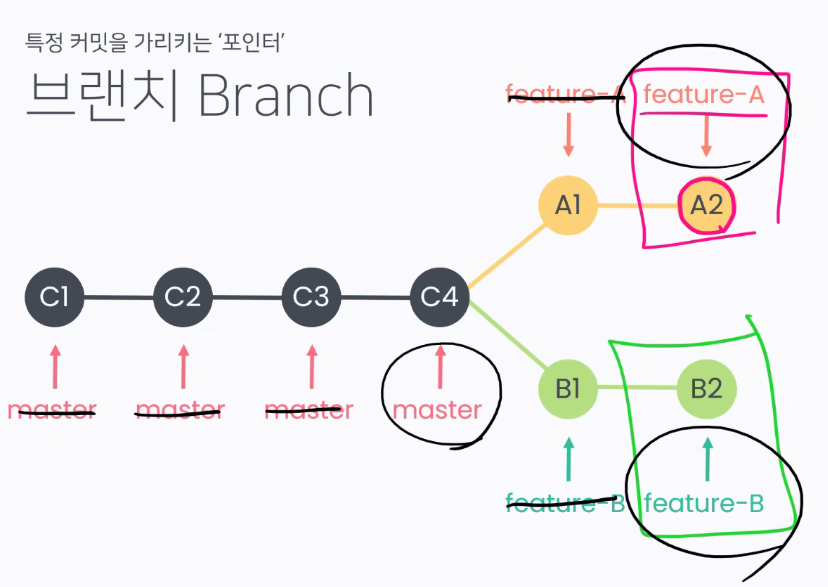

* 특정 커밋을 가리키는 '포인터'

* 새로운 가지를 만든다

  * 브랜치를 딴다고 표현
  * 새로운 브랜치를 가리키는 손가락(포인터)를 만듣나

* commit은 그대로 있고, '포인터'만 변경되는 것

  * commit 들은 단 한개씩만 존재하고 있다

* C4가 유일한 master branch - user들에게 보여지는 곳

* A2, B2가 새로 추가할 기능 - 개발자들만

  * feature-B를 완성헀다면, B2 커밋을 가리키도록 해주세요

  * 즉, feature-B commit을 master branch 로 merge 해달라는 request 할 수 있음

  * merge해서 반영이 된다면 아래처럼 나타날 수 있다

    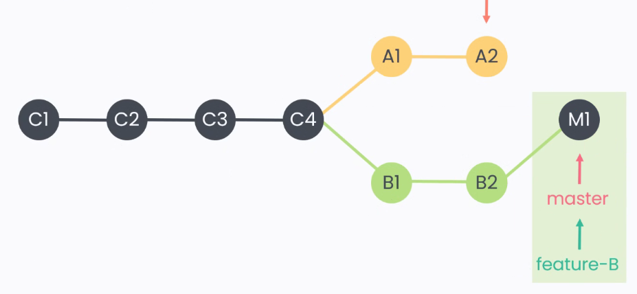

    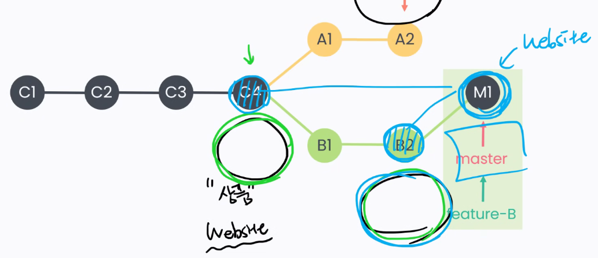

  * 만약 feature-A 완성시, 또 merge한다면

    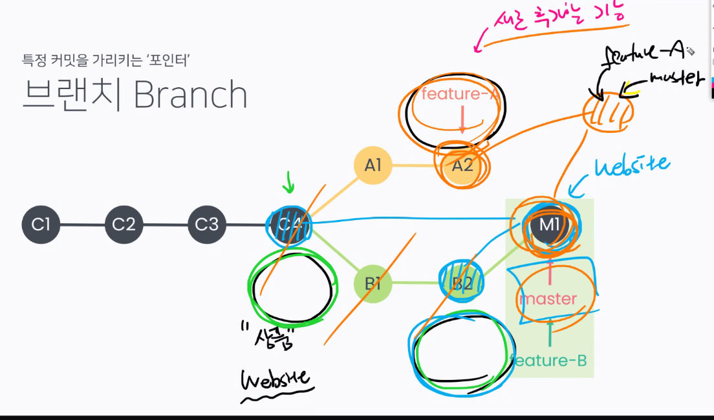

* commands

  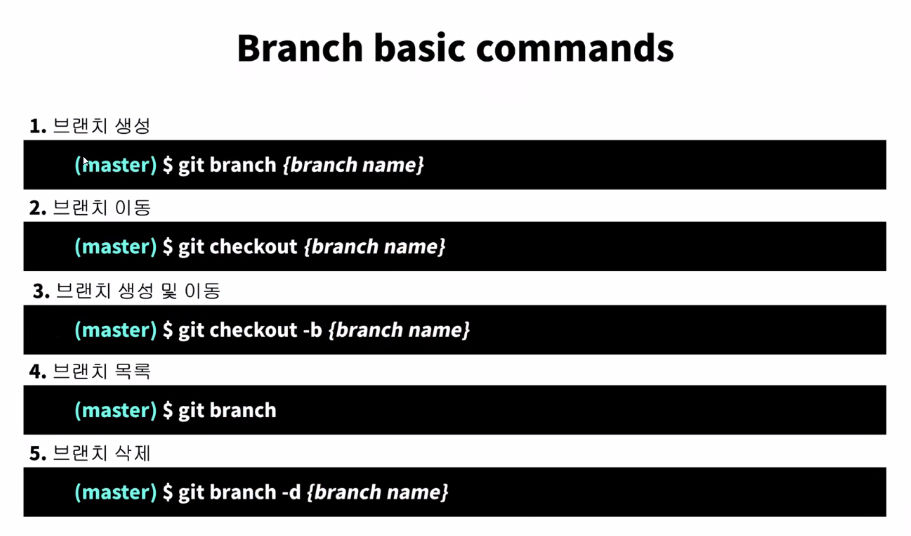

## :two: Branch 생성

### 1. branch 만들기

### 

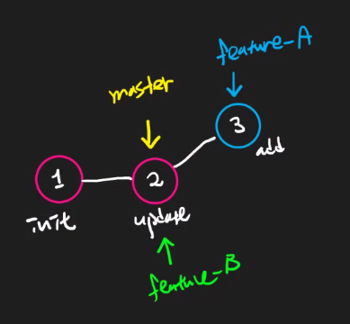

* 두번째(뉴치케)까지만 했을 때

* branch feature-b로 checkout한 후 변경사항 저장했을 때

  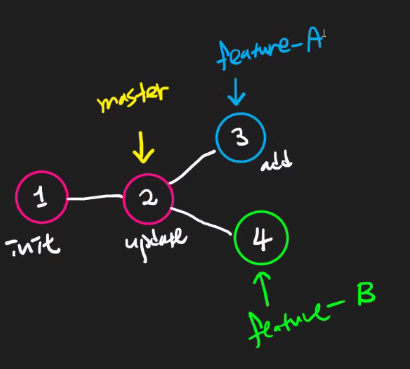

* 이때 git checkout feature-a 한다면, vscode에서는

  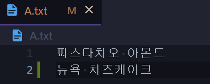

* feature-b로 간다면

* 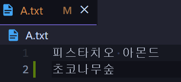

* 요ㅕ기서 feature-b를 지우면

  * 아무일도 일어나지 않고 commit도 남아있다

  * 단지 pointer만 사라질 뿐

    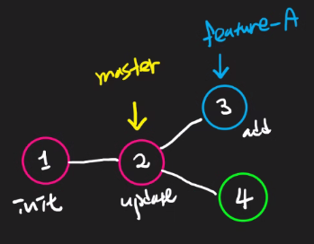

## :three: Branch merge

### 1.  개념

* 각 branch에서 작업을 한 후 이력을 합치기 위해서는 일반적으로 merge 명령어를 사용
* 병합을 진행할 때, 만약 서로 다른 이력(commit)에서 동일한 파일을 수정한 경우, 충돌 발생 가능
  * 충돌시 반드시 직접 수정을 진행해야 한다
  * 충돌은 오류가 발생한 것이 아니라, 이력이 변경되는 과정에서 반드시 발생할 수 있는 것
* merge를 할 때 보고 있어야 되는 곳은
  * merge를 당할 커밋, 즉 master로 가야 함
  * 
* merge 방법은 크게 두 가지가 있다
  * fast-forward
  * merge commit case

### 2. Merge

#### 1) fast-forward merge

* 가리키던 브랜치를 당겨오는 것

  * `(master)` 에서 `git merge feature-a` 한다면 이런식으로 변경됨. 

  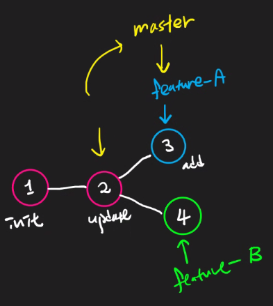

  

  

#### 2) merge commit case

* 기존 master 브랜치에 변경 사항이 있어 병합 커밋이 발생

* 만약 위에서 feature-a merge 후 상황에서 feature-b도 master로 merge하고 싶어서 똑같이 merge한다면

  * git bash에서는 이런 에러 문구가 나오고 

    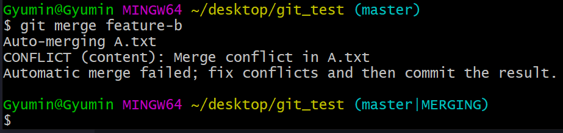

  * VS code에서는 conflict되는 부분이 highlight된 메시지를 띄워줌

    

    * VS 코드에서 제공해주는 버튼

      * Accept Current Change

      * Accept Incoming Change

      * Accept Both Changes

        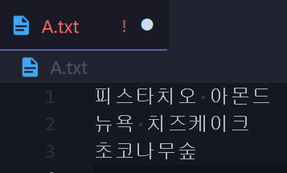

      * Compare Changes

  * merge conflict를 해결 한 후 add, commit 하면

    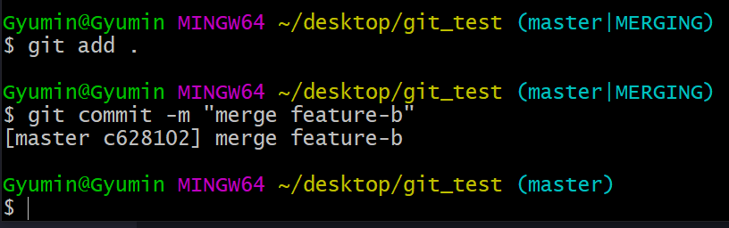

    

### 3. 삭제

* feature A 를 삭제: `git branch -d feature-a`

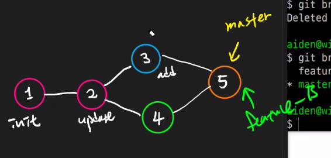

* feature B 를 삭제: `git branch -d feature-b`

  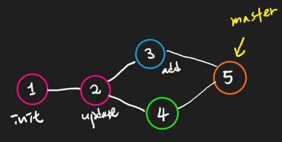

## :four: 협업의 시작 with PR

### 1. 개념

* Pull request
* branch에 merge할 때 보내는 것(pull request)

### 2. 실습

* branch 생성

  * `git branch {branch_name}`

* 있는 branch 확인하기

  * `git branch`

* branch로 포인터 갖다대기

  * `git checkout {branch_name}`

* branch 상에서 수정 가한 후 

  * `git add` >  `git commit` >  `git push`

* 그러면 github에서 이런 페이지가 나타나는데

  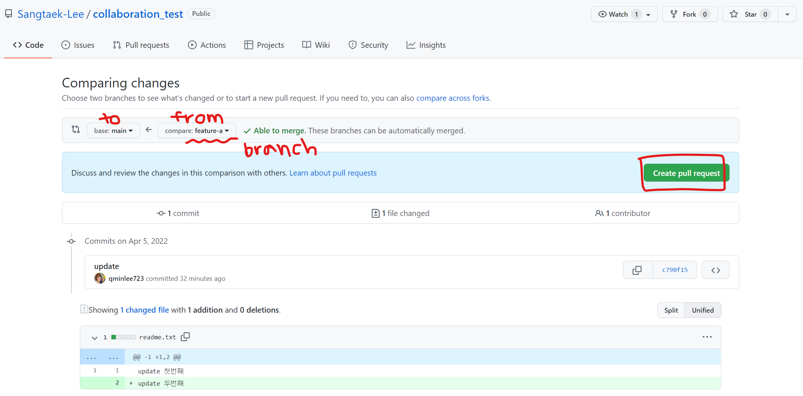

  * compare을 main 에서 새로운 branch 이름으로 바꿔준다(여기선 `feature-a`)
  * create pull request 하면 PR이 생김

  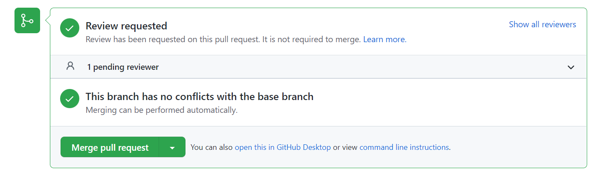

  * reviewer가 Merge pull request를 해주면, main branch로 merge 됨

  

  * 상기 이미지에서 `Delete branch` 누르면 branch(즉, 포인터)가 지워짐

* merge된 상황 및 commit history 확인하기 위해서는 아래의 시계 모양 버튼(`3 commits`)을 눌러준다

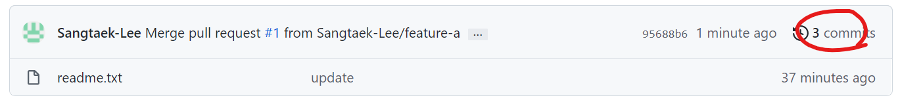

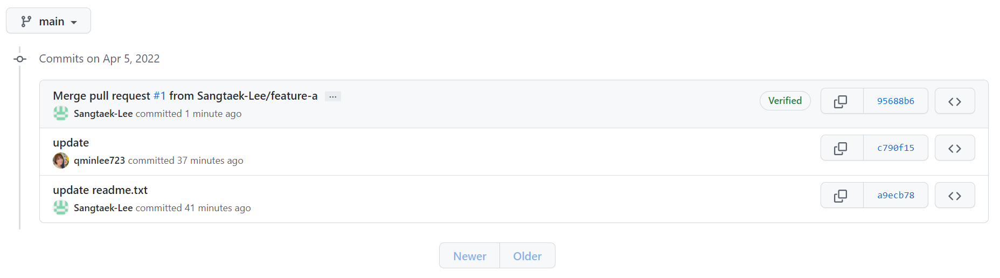

* 완료!

## :five: github오픈소스(Open Source)

### 1. 오픈소스 (Open Source)

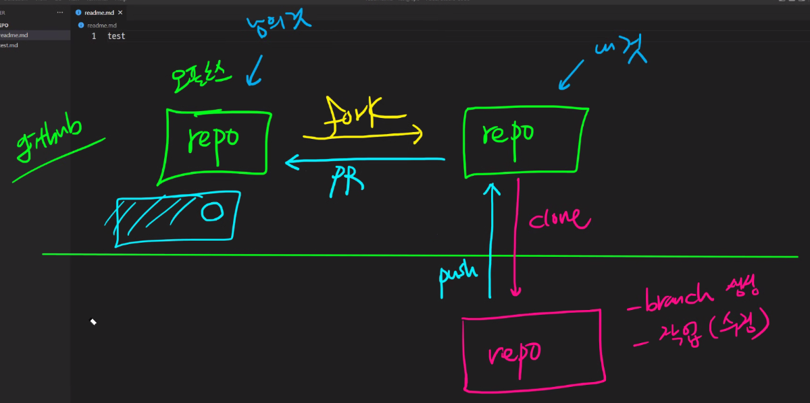

* 오픈소스의 경우, reviewer를 하나하나 assign 할 수 없기 때문에 다른 방법을 찾아야 함
* repository를 fork 하면 내 github에 새로운 repository를 만들 수 있다
* 이를 내 local 로 clone
* branch를 딴 다음에(branch 생성)
* 작업(수정)
* 새로 만든 브랜치 repository로 올리기 > fork 떠온 내 repository에 push
* 이걸 original repository 에다가 pull request 보냄
* reviewer가 승인을 하면 collaborator로 등록 가능

### 2. 실습

* 새로운 repository 생성
* `fork`해서 가져가기
  * 그러면 내 github에 fork 떠진 repository가 생성된다
* fork 떠진 repository에서 수정 가한 후 
  * `add` > `commit` > `push`

* `pull request` 한 후, reviewer가 merge 해주면 오픈소스에 기여자로 이름 올릴 수 있다!

  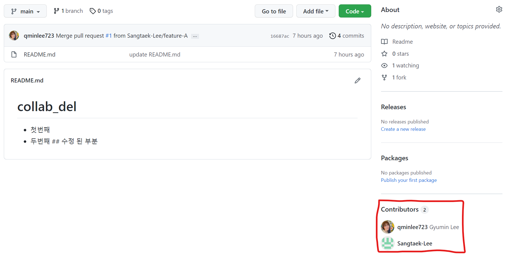

  

## :six: Branch 정리 - 실습

1. `git branch`: 브랜치 목록 확인

2. `git branch 브랜치이름`: 새로운 브랜치 생성

3. `git branch -d 브랜치이름`: 특정 브랜치 삭제(merged 된 브랜치만 삭제)

4. `git branch -D 브랜치이름`: 강제 삭제

5. `git switch 브랜치이름`: 해당 브랜치로 이동

6. `git switch -c 브랜치이름`: 브랜치를 새로 생성과 동시에 이동

   * git switch 전에 고려해야될 사항:

     * working directory file이 모두 깃에 버전관리가 되고 있는지 확인

     * 만약 버전 관리가 안 되어있다면? - 독립된 작업공간 성립하지 않음

       

1. ㅇ

text 수정후

Login은 master-3

HEAD는 mater-4

현재 test.txt 상태

login 쪽을 개발해보려고 한다면,

다시 master로 가고자 한다면,

이처럼 브랜치는 완전히 독립된 환경!

git log --oneline

git log--oneline --all

test_login.txt를 생성 후 add, commit

다시 마스터로 가서 지워보자

안되네!

**깃 병합하기**

7. `git merge 병합할 브랜치 이름`
   * 단, merge하기 전에 다른 브랜치르 합치려고 하는, 즉 메인 브랜치로 swtich 해야 함
8. 

**fast-forward**

최신 커밋으로 나갔을 뿐

git_merge란 폴더에 test.txt만들고 add commit 한 상태

* fast-forward 통해 login branch를 만들면서 이동

* login.txt 파ㅇ리 생성 후 add commit, log 확인

  

* merge를 하려면, main 브랜치로 이동 한 후에 머지해야

* 따라서 switch 명령어를 통해 master로 돌아가준다

  

  

이 때 login.txt 파일이 사라진 것을 볼 수 있음

* merge해 줌

  

  

  Fast-forward라고 적힌 것을 볼 수 있음

  HEAD를 앞으로 빼 주는 것일 뿐

  merge가 된 브랜치는 그 역할이 끝난 것 -- 따라서 머지된 브랜치는  삭제를 해 주면 됨

  

* merge된 브랜치 삭제

  

* 

**3-way merge(merge commit)**

* signout branch

* signout.txt 생성 후 add, commit

  

* 아까 fastforward 상황과 동일한 상황

* 마스터로 이동

  

* 또다른 branch 생성 후  master.txt add, commit

  

* 현재 상황

  

* signout.txt 생성, add commit

* `git merge signout` (왜인지 모르게 새로운 창이 떠서 ..  일단 유튜브 화면 캡쳐)

  

* merge 됐으니 signout branch도 삭제해준다

  `git branch -d signout`

**merge conflict**

* merge하는 두 브랜치에서 같은 파일의 같은 부분을 동시에 수정하고 merge 하면, git은 해당 부분을 자동으로 merge해주지 못함
* 반면, 동일 파일이더라도 서로 다른 부분을 수정했다면 conflict없이 자동으로 merge commit된다.
* hotfix branch만듦 ==> test.txt에 수정 후 add commit
* 
* 

* master로 switch -> hotfix에서 작성한 문장이 사라진 걸 볼 수 있음

  

* master branch인 상태로 ,text.txt 같은 라인에 수정을 해 주고 add commit

  

* `git merge` 하면, conflict 남

* 

* status로도 conflict 확인가능

  

  

* 2번째, 6번째, 4번째 줄 수정해줌

  * 둘 중 비교해서 최종 완성본 니가 만들어
  * conflict 나는 부분을 시각적으로 보여주는 거임
  * 해결하고 커밋하렴

* conflict난 부분(2번째~6번째) 다 지우고 새로 파일을 수정해줌 > add > commit

  

* `git commit`하면 아래처럼 VIM 화면이 뜸

  

  `:`, `wq` 로 빠져나온다

  

* 머지 끝나면 hotfix branch 삭제해주기

  ` git branch -d hotfix`