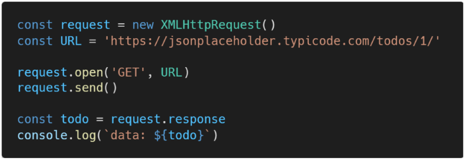
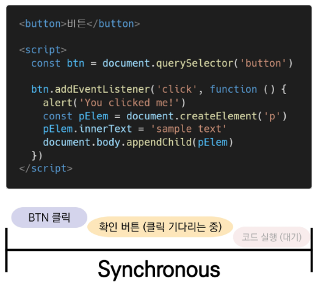
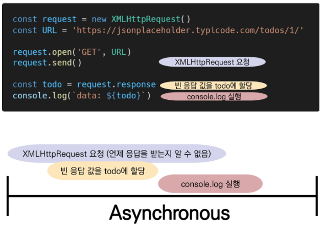
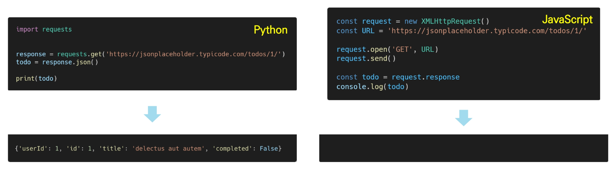

# JavaScript AJAX

## :one: AJAX

### 1. AJAX란?

* Asynchronous JavaScript And XML(비동기식 JavaScript와 XML)
* 서버와 통신하기 위해 `XMLHttpRequest` 객체를 활용
* JSON, XML, HTML 그리고 일반 텍스트 형식 등을 포함한 다양한 포맷을 주고 받을 수 있음
  * 참고) AJAX의 X가 XML을 의미하긴 하지만, 요즘은 더 가벼운 용량과 JavaScript의 일부라는 장점 때문에 JSON 을 더 많이 사용함
* 비동기 통신을 하는 방법 중 하나

### 2. AJAX 특징

* 페이지 전체를 reload(새로 고침)를 하지 않고서도 수행되는 '**비동기성**'
  * 서버의 응답에 따라 전체 페이지가 아닌 일부분만을 업데이트 할 수 있음
* AJAX의 주요 두가지 특징은 아래의 작업을 할 수 있게 해줌
  * 페이지 새로 고침 없이 서버에 요청
  * 서버로부터 데이터를 받고 작업을 수행

### 3. AJAX 배경

* 2005년 Google Maps & Gmail등에 활용되는 기술을 설명하기 위해 AJAX라는 용어를 최초로 사용
* AJAX는 특정 기술이 아닌 기존의 여러 기술을 사용하는 새로운 접근법을 서명하는 용어
* Google 사용 예시
  * Gmail
    * 메일 전송 요청이 모두 처리 되기 전 다른 페이지로 넘어가더라도 메일은 전송 됨
  * Google Maps
    * 스크롤 행위 하나하나가 모두 요청이지만 페이지는 갱신되지 않음?

### 4. XMLHttpRequest객체 ( 역사와 전통의 객체이므로 몰라도 됨 )

#### 1) XMLHttpRequest 객체 개념

* 서버와 상호작용하기 위해 사용되며 전체 페이지의 새로 고침 없이 데이터를 받아올 수 있음
* 사용자의 작업을 방해하지 않으면서 페이지 일부를 업데이트 할 수 있음
* 주로 AJAX 프로그래밍에 사용
* 이름과 달리 XML 뿐만 아니라 모든 종류의 데이터를 받아올 수 있음
* 생성자
  * `XMLHttpRequest()`

#### 2) XMLHttpRequest 예시

* console에 todo 데이터가 출력되지 않음

* 데이터 응답을 기다리지 않고 console.log()를 먼저 실행했기 때문

  

## :two: Asynchronous JavaScript

### 1. 동기식(Synchronous)

* 순차적, 직렬적 Task 수행
* 요청을 보낸 후 응답을 받아야만 다음 동작이 이루어짐(blocking)
* 버튼 클릭 후 alert 메시지의 확인 버튼을 누를 때까지 문장이 만들어지지 않음
* 즉, alert이후의 코드는 alert의 처리가 끝날 때까지 실행되지 않음
* 왜 이런 현상이 발생할까?
  * JavaScript는 single threaded

### 2. 비동기식(Asynchronous)

* 병렬적 Task 수행 (멀티 X )
  * 쭉 작업을 하다가, 오래걸리는건 뒤에 미뤄두고 빠른거 먼저 처리 후 느린것 처리하는것
* 요청을 보낸 후 응답을 기다리지 않고 다음 동작이 이루어짐(non-blocking)
* 요청을 보내고 **응답을 기다리지 않고** 다음 코드가 실행됨
* 결과적으로 변수 todo에는 응답 데이터가 할당되지 않고 빈 문자열이 출력
* 그렇다면 JS는 왜 기다려주지 않는 방식으로 동작하는가?
  * JavaScript는 single threaded

### 3. 왜 비동기(Asynchronous)를 사용하는가?

* **"사용자 경험"**

  * 매우 큰 데이터를 동반하는 앱이 있다고 가정
  * 동기식 코드라면 데이터를 모두 불러온 뒤 앱이 실행됨
    * 즉, 데이터를 모두 불러올 때까지는 앱이 모두 멈춘 것처럼 보임
    * 코드 실행을 차단하여 화면이 멈추고 응답하지 않는 것 같은 사용자 경험을 제공
  * 비동기식 코드라면 데이터를 요청하고 응답 받는 동안, 앱 실행을 함께 진행함
    * 데이터를 불러오는 동안 지속적으로 응답하는 화면을 보여줌으로써 더욱 쾌적한 사용자 경험을 제공
  * 때문에 많은 웹 API 기능은 현재 비동기 코드를 사용하여 실행됨

  

### 4. JavaScript는 single threaded이다

#### 1) [참고] Threads

* thread = 작업할 수 있는 손
* core = 작업할 수 있는 사람
* 프로그램이 작업을 완료하기 위해 사용할 수 있는 단일 프로세스
* 각 thread(스레드)는 한 번에 하나의 작업만 수행할 수 있음
* 예시) Task A > Task B > Task C
  * 다음 작업을 시작하려면 반드시 앞의 작업이 완료되어야 함
  * 컴퓨터 CPU는 여러 코어를 가지고 있기 때문에 한 번에 여러 가지 일을 처리할 수 있음

#### 2) JS는 single threaded

* 컴퓨터가 여러개의 CPU를 가지고 있어도, main thread라 불리는 단일 스레드에서만 작업 수행
* 즉 이벤트를 처리하는 **Call Stack** 이 하나인 언어라는 의미
* 이 문제를 해결하기 위해 JS는:
  1. 즉시 처리하지 못하는 이벤트들을 다른 곳(**Web API**)으로 보내서 처리하도록 하고, 
  2. 처리된 이벤트들은 처리된 순서대로 대기실(**Task queue**)에 줄을 세워 놓고
  3. Call Stack이 비면 담당자(**Event Loop**)가 대기 줄에서 가장 오래된(제일 앞의)이벤트를 Call Stack으로 보냄

### 5. Blocking vs. Non-Blocking

### 6. 

### 7. Zero delays

* 실제로 

### 8. 순차적인 비동기 처리하기

* Web API로 들어오는 순서는 중요하지 않고, 어떤 이벤트가 먼저 처리되느냐가 중요(즉, 실행 순서 불명확)
* 이를 해결하기 위해 순차적인 비동기 처리를 위한 2가지 작성 방식
  * Async callbacks
    * 백그라운드에서 실행을 시작할 함수를 호출할 때 인자로 지정된 함수
    * 예시) addEventListener()의 두 번째 인자
  * :star: promise-style
    * Modern  Web APIs에서의 새로운 코드 스타일
    * XMLHttpRequest 객체를 사용하는 구조보다 조금 더 현대적인 버전

## :three: Callback function

### 1. Callback Function

* 다른 함수에 인자로 전달된 함수
* 외부 함수 내에서 호출되어 일종의 루틴 또는 작업을 완료함
* 동기식, 비동기식 모두 사용됨
  * 그러나 비동기 작업이 완료된 후 코드 실행을 계속하는 데 주로 사용됨
* 비동기 작업이 완료된 후 코드 실행을 계속하는데 사용되는 경우를 비동기 콜백이라고 함(asynchronous callback)이라고 함

### 2. Callback Hell

#### 1)

#### 2) callback Hell 해결하기

*  Keep your code shallow(코드의 깊이를 얕게 유지)
* Modularize(모듈화)
* Handle every single error(모든 단일 오류 처리)
* **Promise callbacks**(Promise 콜백 방식 사용)

#### 3)

## :four: promise

### 1. Promise object

* 비동기 작업의 최종 완료 또는 실패를 나타내는 **객체**
  * 미래의 완료 또는 실패와 그 결과 값을 나타냄
  * 미래의 어떤 상황에 대한 약속
* 성공(이행)에 대한 약속
  * `.then()`
* 실패(거절)에 대한 약속
  * `.catch()`

### 2. Promise methods

#### 1) `.then(callback)`

* 이전 작업(promise)이 성공했을 때(이행했을 때 )수행할 작업을 나타내는 callback 함수
* 그리고 각 callback 함수는 이전 작업의 성공 결과를 인자로 전달받음
* 따라서 성공했을때의 코드를 callback 함수 안에 작성

#### 2) `.catch(callback)`

* `.then`이 하나라도 실패하면(거부되면) 동작(동기식의 'try-except' 구문과 유사)
* 이전 작업의 실패로 인해 생성된 error 객체는 catch 블록 안에서 사용할 수 있음

* 각각의 `.then()` 블록은 서로 다른 promise를 반환
  * 즉, `.then()`을 여러 개 사용(chaining)하여 연쇄적인 작업을 수행할 수 있음
  * 결국 여러 비동기 작업을 차례대로 수행할 수 있다는 뜻
* `.then()`과 `.catch()` 메서드는 모두 promise를 반환하기 때문에 chaining 가능
* 주의
  * 반환 값이 반드시 있어야 함
  * 없다면 callback 함수가 이전의 promise 결과를 받을 수 없음

#### 3) `.finally(callback)`

* Promise 객체를 반환
* 결과와 상관없이 무조건 지정된 callback 함수가 실행
* 어떠한 인자도 전달받지 않음
  * Promise가 성공되었는지, 거절되었는지 판단할 수 없기 때문
* 무조건 실행되어야 하는 절에서 활용
  * `.then()`과 `.catch()` 블록에서의 코드 중복을 방지

## :five: