​                                           

# JavaScript Basic

[TOC]


## :one: Intro

### 1. Intro

#### 1) 동작 방식

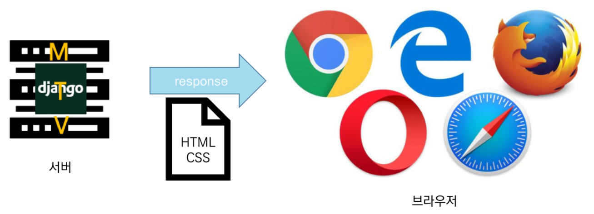

 

#### 2) 브라우저(browser)

* URL로 웹(WWW)을 탐색하며 서버와 통신하고, HTML 문서나 파일을 출력하는 GUI 기반의 소프트웨어
* 인터넷 컨텐츠를 검색 및 열람하도록 함
* "웹 브라우저"라고도 합
* 주요 브라우저
  * Google Chrome, Mozilla Firefox, Microsoft Edge, Opera, Safari


#### 3)  JavaScript의 필요성

* 브라우저 화면을 '동적'으로 만들기 위함
* :star: **브라우저를 조작할 수 있는 유일한 언어**
* 얘가 어떻게 브라우저를 벗어날 수 있게 되었나? 
  * node.js 사용 
* Most popular programming language in 2021... 


## :two: 브라우저

### 1. 브라우저에서 JS가 할 수 있는 일

* DOM(Document Object Model) 조작
  * 문서(HTML) 조작
* BOM(Browser Object Model) 조작
  * navigator, screen, location, frames, history, XHR
  * 뒤로가기, 앞으로 가기 등
* JavaScript Core(ECMAScript)
  * Data Structure(Object, Array), Conditional Expression, Iteration
  * ECMA라는 집단에서 규칙을 정한 것 - ECMA란 곳에서 규약을 관리


### 2. DOM이란?

#### 1) 개념

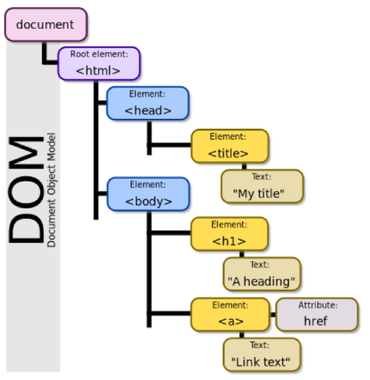

* Document Object Model
* **웹 페이지에 나타나있는 HTML 문서 전체를 각각에 대해서 객체로 나타낸 것**
* HTML, XML과 같은 문서를 다루기 위한 프로그래밍 인터페이스
* 문서를 구조화하고, 구조화된 구성 요소를 하나의 객체로 취급하여 다루는 논리적 트리 모델
* 문서가 **객체(object)**로 구조화되어있으며 key로 접근 가능
* 단순한 속성 접근, 메서드 활용 뿐만 아니라 프로그래밍 언어적 특성을 활용한 조작 가능
* 주요 객체
  * window: DOM을 표현하는 창(브라우저 탭), 최상위 객체(작성시 생략 가능)
  * document:  페이지 컨텐츠의 Entry Point 역할을 하며, <head>, <body> 등과 같은 수많은 다른 요소들을 포함
  * navigator, location, history, screen
* **문서(HTML)를 프로그램으로 조작할 수 있는 것**


#### 2) DOM 해석

* 파싱(Parsing)
  *  구문 분석, 해석
  *  **브라우저가 문자열을 해석하여 DOM Tree로 만드는 과정**
     *  분석하는 엔진이 달라서, 브라우저별 DOM Tree 만드는 속도가 다름 
     *  Chrome은 V8을 사용(빠름)
     *  이 엔진을 개발 영역에서 써보자 한 것이 **Node.js**


#### 3) DOM 조작

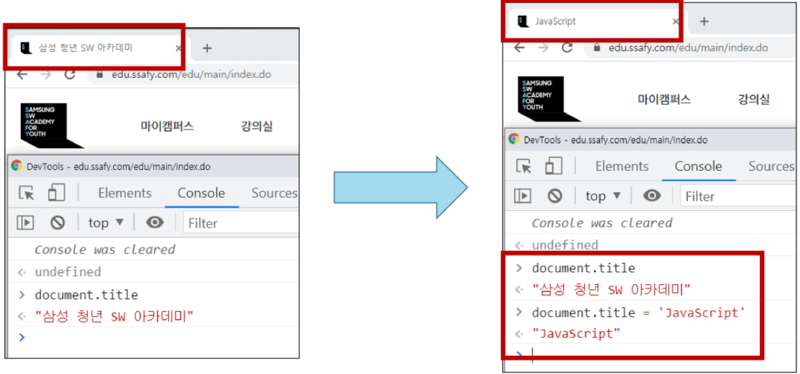


### 3. BOM이란?

 #### 1) 개념

* Browser Object Model
* 자바스크립트가 브라우저와 소통하기 위한 모델
* 브라우저의 창이나 프레임을 추상화해서 프로그래밍적으로 제어할 수 있도록 제공하는 수단
  * 버튼, URL입력창, 타이틀 바 등 브라우저 윈도우 및 웹 페이지 일부분을 제어 가능
* window 객체는 모든 브라우저로부터 지원받으며 브라우저의 창(window)을 지칭


#### 2) BOM 조작

* 브라우저를 조작해야 하는 순간이 온다.. 그때마다 official document 보고 알아가는 것


* window를 콘솔에 찍어보면, window의 구성요소가 보인다 

  * `alert`.. 와 같은 메서드들도 있고
  * `cookieStore`인것도 알 수 있고
  * `document` 도 window 내부에 위치한 것을 알 수 있따

  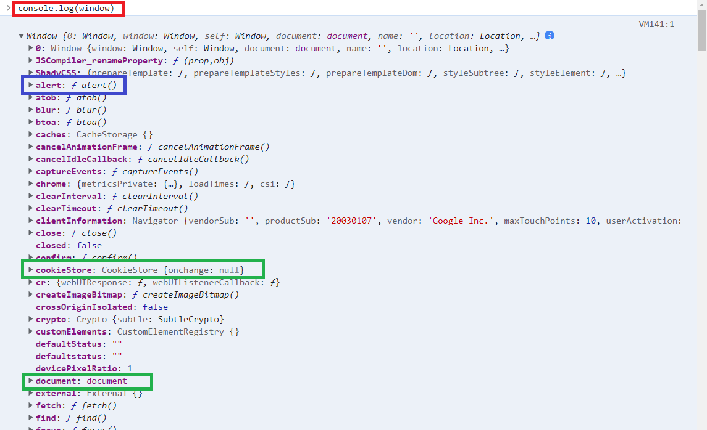

  

  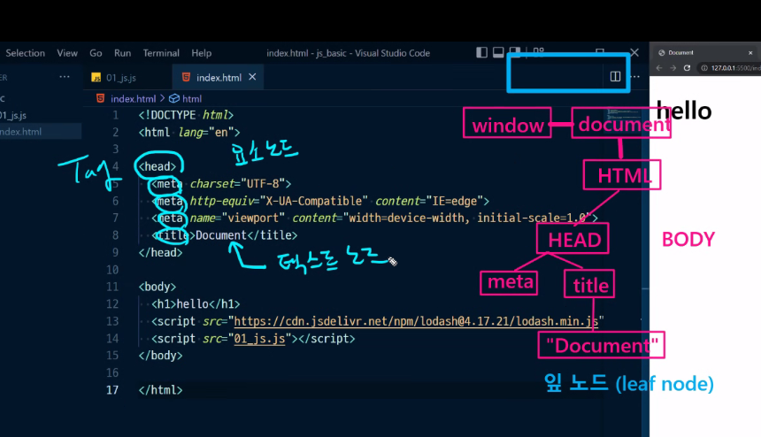

	* `querySelectorAll`로 가지고 오게 되면, 항상 유사배열로 반환
	* 리스트가 아닌 단일 텍스트 배열로 반환한다(리스트 형태)


### 4. JavaScript Core

* 브라우저(DOM & BOM)을 조작하기 위한 명령어 약속(언어)
* 브라우저(BOM)과 그 내부의 문서(DOM)를 조작하기 위해 ECMAScript(JS)를 학습


### 5. ECMA

* ECMA (ECMA International)
  * 정보 통신에 대한 표준을 제정하는 비영리 표준화 기구
* ECMAScript는 ECMA에서 ECMA-262* 규격에 따라 정의한 언어
  * ECMA-262*: 범용적인 목적의 프로그래밍 언어에 대한 명세
* **ECMAScript6**는 ECMA에서 제안하는 6번째 표준 명세를 말함
  * (참고) ECMAScript6의 발표 연도에 따라 ECMAScript2015라고도 말함
* 6버전 이상에 대해 다룰 것(구버전, 신버전 가르는 기준)


### 6. 세미콜론(semicolon)

* JS는 세미콜론을 선택적으로 사용 가능
* 세미콜론이 없으면 ASI에 의해 자동으로 세미콜론이 삽입됨
  * ASI(Automatic Semicolon Insertion): 자동 세미콜론 삽입 규칙
* 본 수업에서는 자바스크립트 문법 및 개념적 측면에 집중하기 위해 세미콜론을 사용하지 않고 진행!


### 7. 코딩 스타일 가이드

* 코딩 스타일의 핵심은 합의된 원칙과 일관성
  * 절대적인 하나의 정답은 없고, 상황에 맞게 원칙을 정하고 일관성 있게 사용하는 것이 중요
* 코딩 스타일은 코드의 품질에 직결되는 중요한 요소
  * 코드의 가독성, 유지보수 또는 팀원과의 커뮤니케이션 등 개발 과정 전체에 영향을 끼침
* (참고) 다양한 자바스크립트 코딩 스타일 가이드(github)
  * **Airbnb Javascript Style Guide** :star: 본 수업에서 중심적으로 진행할 가이드
    * 단, 가이드의 일부 항목은 문법 및 개념적 측면에 집중하기 위해 변형해서 사용
  * Google Javascript Sytle Guide
  * standardjs

 

## :three: 변수와 식별자

### 1. 식별자 정의와 특징

* 식별자(identifier)는 변수를 구분할 수 있는 **변수명**을 말함
* 식별자는 반드시 문자, 달러($) 또는 밑줄(_)로 시작
* 대소문자를 구분하며, 클래스명 외에는 모두 소문자로 시작
* 예약어 사용 불가능
  * 예약어: for, if, function


### 2. 식별자 작성 스타일

* **카멜 케이스(camelCase, lower-camel-case)**

  * 변수, 객체, 함수에 사용

    ```javascript
    // 변수
    let dodg
    let variableName
    
    // 객체
    const userInfo = { name:'Tom', age:20 }
    
    // 함수
    function add()
    function getName() {}
    ```

* 파스칼 케이스(PascalCase, upper-camel-case)

  * 클래스, 생성자에 사용

    ```javascript
    // 클래스
    class User {
        constructor(options) {
            this.name = options.name
        }
    }
    
    // 생성자 함수
    function User(options) {
        this.name = options.name
    }
    ```

* **대문자** 스네이크 케이스(SNAKE_CASE)

  * 상수(constants)에 사용

    * 상수: 개발자의 의도와 상관없이 변경될 가능성이 없는 값을 의미
    * 소문자 스네이크 케이스는 거의 쓰지 않음

    ```javascript
    // 값이 바뀌지 않을 상수
    const API_KEY = 'my-key'
    const PI = Math.PI
    
    // 재할당이 일어나지 않는 변수
    const numbers = [1, 2, 3]
    ```

    


### 3. 변수 선언 키워드(let, const)

이 표 시험에 나옴 :100:

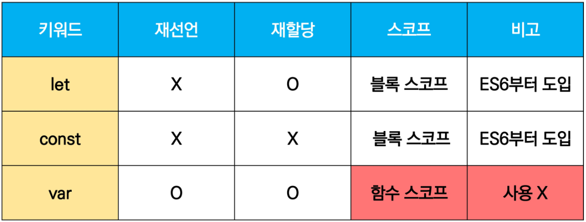

#### 1) `let`, `const`

* `let`
  * **재할당** 예정인 변수 선언 시 사용
  * 변수 재선언 불가능
  * 블록 스코프
* `const`
  * 재할당 할 예정이 없는 변수 선언시 사용 (**재할당 X**)
  * 변수 재선언 불가능
  * 블록 스코프
  * let, const 중 어느 것을 쓸지 헷갈린다면, const를 쓰자


#### 1-1) 선언, 할당, 초기화

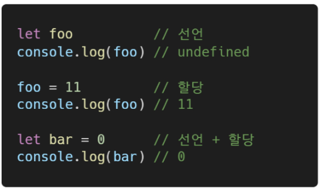

* 선언(Declaration)
  * **변수를 생성**하는 행위 또는 시점
* 할당(Assignment)
  * **선언된 변수에 값을 저장**하는 행위 또는 시점
* 초기화(Initialization)
  * 선언된 변수에 **처음으로** 값을 저장하는 행위 또는 시점


#### 2) 블록 스코프(block scope)

* if, for, 함수 등의 중괄호 내부를 가리킴

* 블록 스코프를 가지는 변수는 블록 바깥에서 접근 불가능

  ```javascript
  if (true) {
      var a = 1
      let b = 2
      const c = 3
  }
  
  // a, b, c 중 접근가능한 건 a only
  // 왜냐면 var만 함수 스코프, 나머지는 블록 스코프
  ```

  


#### 3) 변수 선언 키워드 'var'

* var

  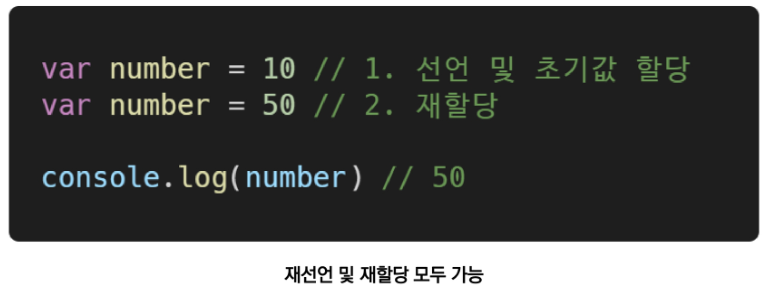

  * var로 선언한 변수는 재선언 및 재할당 모두 가능
  * ES6 이전에 변수를 선언할 때 사용되던 키워드
  * **호이스팅되는 특성**으로 인해 예기치 못한 문제 발생 가능
    * 따라서, ES6 이후부터는 var 대신 const와 let을 사용하는 것을 권장 (var 사용 지양)
  * 함수 스코프

* 함수 스코프(function scope)

  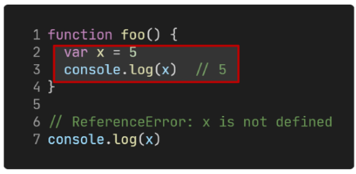

  * 함수의 중괄호 내부를 가리킴
  * 함수 스코프를 가지는 변수는 함수 바깥에서 접근 불가능

* 호이스팅(hoisting)

  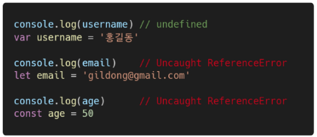

  * 변수를 선언 이전에 참조할 수 있는 현상
  * 변수 선언 이전의 위치에서 접근 시 undefined를 반환


## :four: 데이터 타입

### 1. 데이터 타입 종류

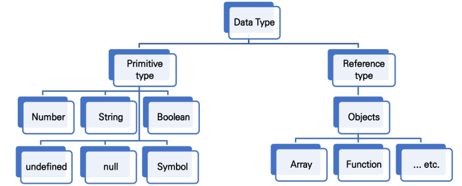

* 자바스크립트의 모든 값은 특정한 데이터 타입을 가짐

* :star: **function 도 data type이다**!

* 크게 원시 타입(Primitive type)과 참조 타입(Reference type)으로 분류됨

  * 원시 타입: call by value(깊은 복사)
  * 참조 타입: call by reference(얕은 복사)

  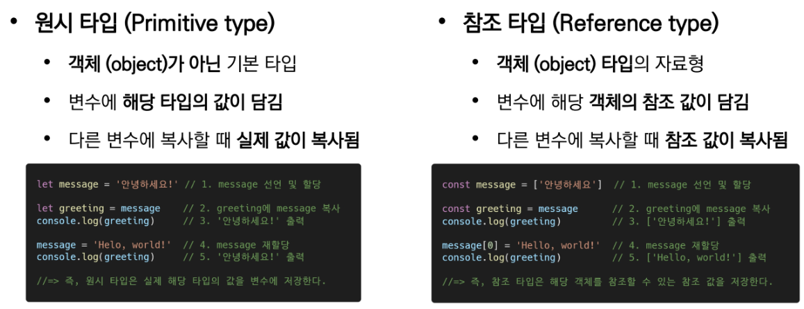


### 2. 원시 타입(Primitive type)

* **숫자(Number)타입**

  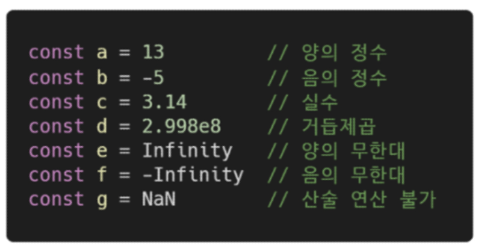

  * 정수, 실수 구분 없는 하나의 숫자 타입
  * 부동소수점 형식을 따름
  * (참고) NaN(Not-A-Number)
    * 계산 불가능한 경우 반환되는 값
    * 'Angel' / 1004 => NaN

* **문자열(String) 타입**

  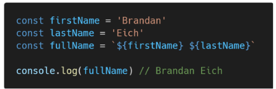

  * 텍스트 데이터를 나타내는 타입
  * 16비트 유니코드 문자의 집합
  * 작은따옴표 또는 큰따옴표 모두 가능
  * 템플릿 리터럴(Template Literal)
    * ES6부터 지원
    * 따옴표 대신 backtick(``)으로 표현
    * **`${ expression }`** 형태로 표현식 삽입 가능 (f string 생각하기)
    * 데이터를 직접 집어넣는 것을 리터럴이라고 함

* **undefined**

  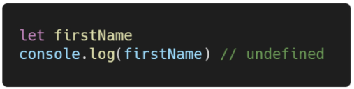

  * 변수의 값이 없음을 나타내는 데이터 타입
    * 개발자의 의도가 담기지 않음!
    * ex) return이 없는 경우
  * 변수 선언 이후 직접 값을 할당하지 않으면, 자동으로 undefined가 할당됨
  * null과 비교!!!! 차이점 중요!!! :star: (개발자의 의도 X)

* **null**

  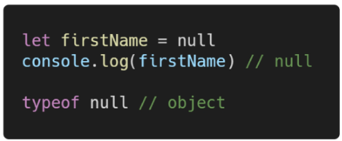

  * 변수의 값이 없음을 의도적으로 표현할 때 사용하는 데이터 타입
    * 개발자가 의도적으로 없다고 말해주는 것
    * 절대 자동 생성되지 않음!
    * 특이점: null의 경우 primitive type 이지만, object임.
  * (참고) null 타입과 typeof 연산자
    * typeof 연산자: 자료형 평가를 위한 연산자
    * null 타입은 ECMA 명세의 원시 타입의 정의에 따라 원시 타입에 속하지만,  typeof 연산자의 결과는 객체(object)로 표현됨

* **null vs undefined**

  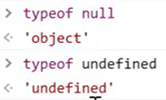

  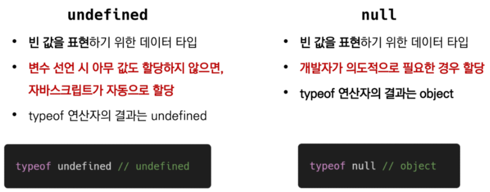

* **Boolean 타입**

  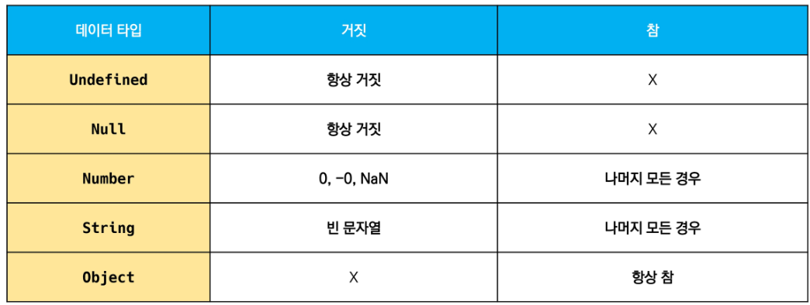

  * 논리적 참 또는 거짓을 나타내는 타입
  * true 또는 false로 표현 (truthy, falsy)
  * 조건문 또는 반복문에서 유용하게 사용
    * (참고) 조건문 또는 반복문에서 boolean이 아닌 데이터 타입은 자동 형변환 규칙에 따라 true / false로 반환됨
    * 비어있는 리스트는 자바스크립트에서 true  (python은 False임)


## :five: 연산자

### 1. 할당 연산자

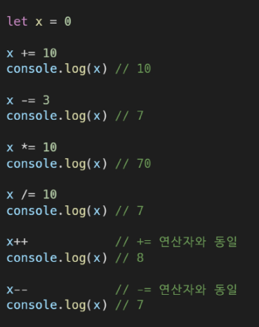

* 오른쪽에 있는 피연산자의 평가 결과를 왼쪽 피연산자에 할당하는 연산자

* 다양한 연산에 대한 단축 연산자 지원

* (참고) Increment 및 Decrement 연산자(증감연산자)

  * Increment(++): 피연산자의 값을 1 증가시키는 연산자

  * Decrement (--): 피연산자의 값을 1 감소시키는 연산자

  * Airbnb Style Guide에서는 '+=', '-=' 와 같이 더 분명한 표현으로 적을 것을 권장

  * `a++`, `++a` 는 실행되는 순서에 관련이 있다

    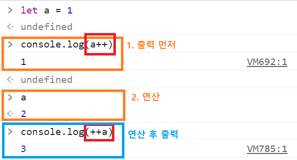

    


### 2. 비교 연산자

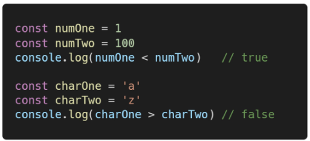

* 피연산자들(숫자, 문자, Boolean)을 비교하고 결과값을 boolean 으로 반환하는 연산자
* 문자열은 유니코드 값을 사용하며 표준 사전 순서를 기반으로 비교
  * ex) 알파벳끼리 비교할 경우
    * 알파벳 순서상 후순위가 더 크다
    * 소문자가 대문자보다 더 크다


### 3. 동등 비교 연산자 :x:

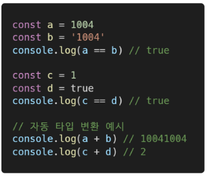

* 두 피연산자가 같은 값으로 평가되는지 비교 후 boolean 값을 변환

* 비교할 때 암묵적 타입 변환을 통해 타입을 일치시킨 후 같은 값인지 비교

* 두 피연산자가 모두 객체일 경우, 메모리의 같은 객체를 바라보는지 판별

* 예상치 못한 결과가 발생할 수 있으므로, 특별한 경우를 제외하고 **사용하지 않음**

  ```javascript
  // 예제
  > 0 == '0'
  > true
  
  > 0 == []
  > true
  
  > '0' == []
  > false
  ```

  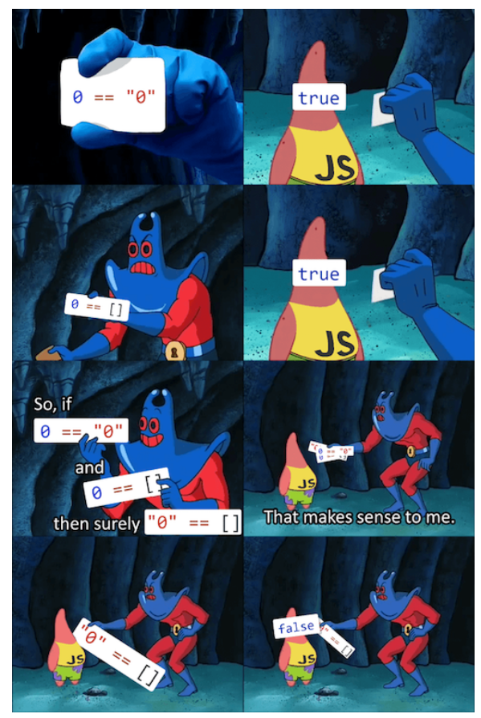


### 4. 일치 비교 연산자

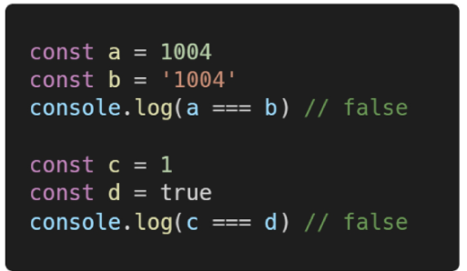

* 두 피연산자가 같은 값으로 평가되는지 비교 후 boolean 값 반환
* 엄격한 비교가 이뤄지며, 암묵적 타입 변환이 발생하지 않음
  * 엄격한 비교: 두 비교 대상의 **타입**과 **값** 모두 같은지 비교하는 방식
* 두 피연산자가 모두 객체일 경우 메모리의 같은 객체를 바라보는지 판별


### 5. 논리 연산자

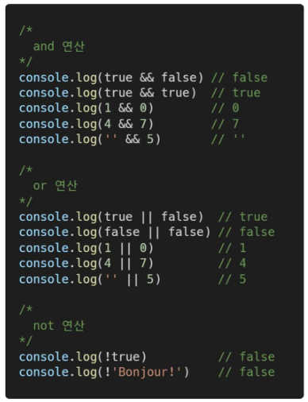

* 세 가지 논리 연산자로 구성

  * and: `&&`
  * or: `||`
  * not: `!`

* 단축 평가 지원

  * ex) false && true => false
  * ex) true || false => true

* 주의

  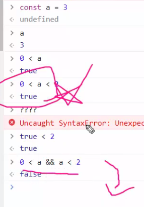


### 6. 삼항 연산자(Ternary Operator)

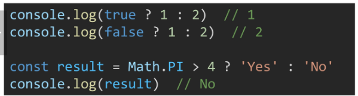

* 세 개의 피연산자를 사용하여 조건에 따라 값을 반환하는 연산자

* 가장 왼쪽의 조건식이 참이면 콜론(`:`) 앞의 값을 사용하고, 그렇지 않은 경우 콜론 뒤의 값을 사용

  ```javascript
  // 1 > 2 는 false
  // 따라서 x 는 false
  // 그러면 콜론 뒤의 값인 2 반환
  let x = 1 > 2
  x ? 1 : 2
  
  // 10>1 보다 크니? -> 응 커 -> true 
  // true니까 콜론 앞의 값인 '큽니다'를 반환
  10 > 1 ? '큽니다':'아닙니다'
  ```

  

* 삼항 연산자의 결과 값이기 때문에 변수에 할당 가능

  * 참고: 한 줄에 표기하는 것을 권장

* 연산자 종루

  * 단항 연산자 : `!`, `-`
  * 이항 연산자: `-`... ( `2` - `1`) 


## :five: 조건/반복

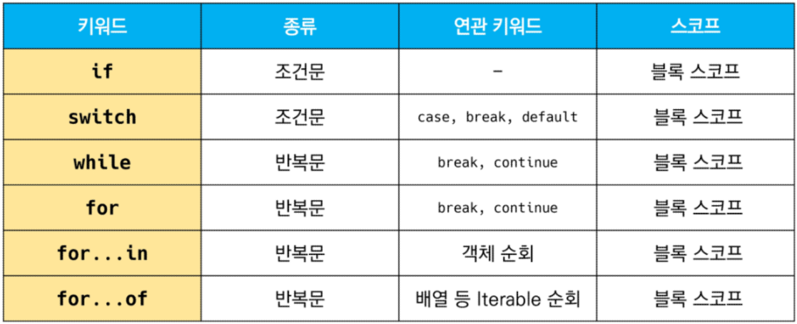


### 1. 조건문의 종류와 특징

* `if` statement
  * 조건 표현식의 결과값을 Boolean 타입으로 변환 후 참/거짓을 판단
* `switch` statement
  * 조건 표현식의 결과값이 어느 값(case)에 해당하는지 판별
  * 참고: 주로 특정 변수의 값ㅇ세 따라 조건을 분기할때 사용
    * 조건이 많아질 경우 if문보다 가독성이 나을 수 있음


### 2.  `if` statement

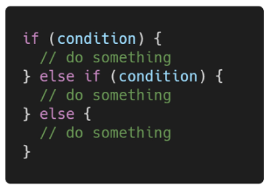

* if, else if, else

  * 조건은 소괄호(condition)안에 작성
  * 실행할 코드는 중괄호{} 안에 작성
  * 블록 스코프 생성

* 예시

  * `()`, `{}` ..  구조 눈에 익혀놓기

  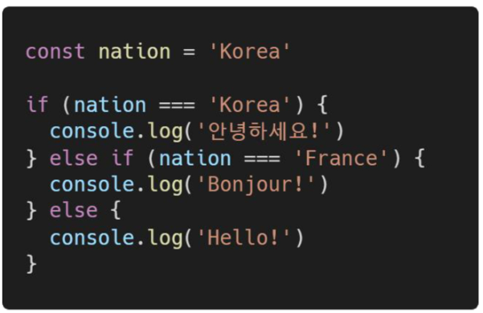

  ```javascript
  > if (2 > 1) {
      console.log('2가 더 크다')
  } else {
      console.log('1이 더 크다')
  }
  ```

  ```javascript
  > const nation = 'Korea'
  < undefined
  > switch(nation) {
      case 'Korea': {
          console.log('안녕')
      }
      {
      case 'France' {
          console.log('봉주르')
  	    }
  	}
  	{
      case 'Germany': {
          console.log('구텍탁')
      }
  }
  {
      default: {
          console.log('Hello')
      }
  }
  	
  ```

  


### 3. `switch` statement

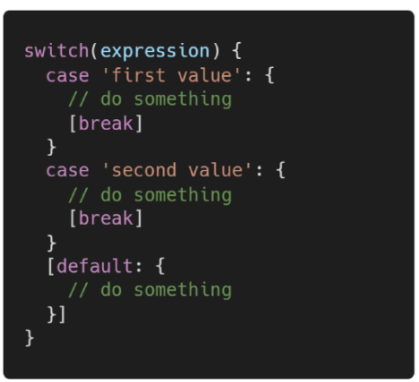

* `switch`

  * 표현식(expression)의 결과값을 이용한 조건문
  * 표현식의 결과값과 case문의 오른쪽 값을 비교
  * break 및 default 문은 [선택적]으로 사용 가능
    * 대괄호 `[]` 은 optional 을 의미
  * break 및 default문은 [선택적]으로 사용 가능
  * break문이 없는 경우 break문을 만나거나 default 문을 실행할 때까지 다음 조건문 실행
  * 블록 스코프 생성

* 예시

  * break가 있는 경우

    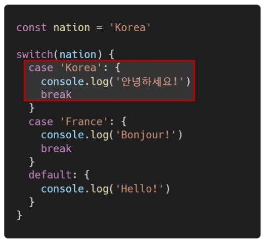

  * break가 없는 경우: fall-through

    * 조건이 만족되는 순간, 뒤에건 조건을 안봄. 그런 구조임.

    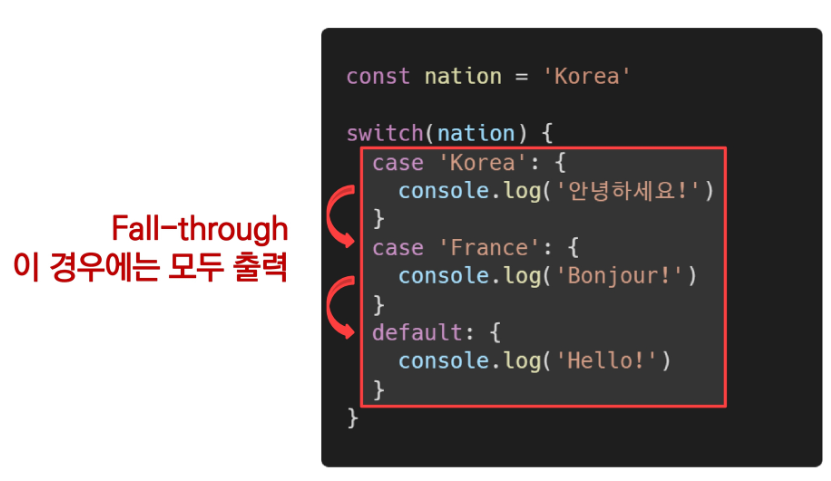

### 4. `if` vs `switch`

* 취향 차이
* if, else 만 존재할 시에는 삼항연산자를 쓰는 것이 예쁜 코드라는 것이 다수의 의견

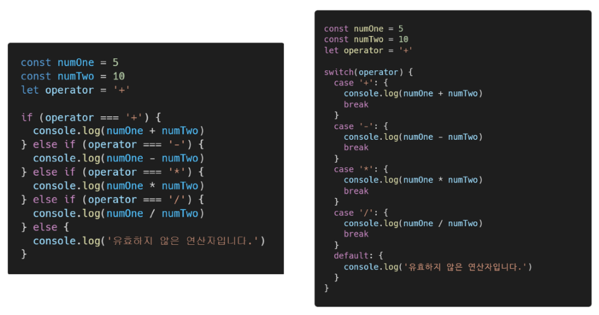


## :six: 반복문

### 1. 반복문의 종류와 특징

* **while**
* **for**
* **for ... in**
  * 주로 **객체(object)의 속성**들을 순회할 때 사용
  * 배열도 순회 가능하지만 인덱스 순으로 순회한다는 보장이 없으므로 권장하지 않음
  * 순서가 상관없는 속성 순회시
* **for ... of**
  * **반복 가능한(iterable) 객체**를 순회하며 값을 꺼낼 때 사용
    * 반복 가능한(iterable) 객체의 종류: Array, Map, Set, String 등
  * 순서를 가지고 있는 객체를 순회할때 사용


### 2. while

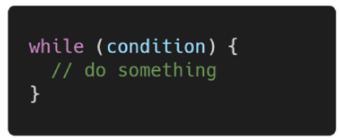

* 개념

  * 조건문이 참(true)인 동안 반복 시행
  * 조건은 소괄호 안에 작성
  * 실행할 코드는 중괄호 안에 작성
  * 블록 스코프 생성

* 예시

  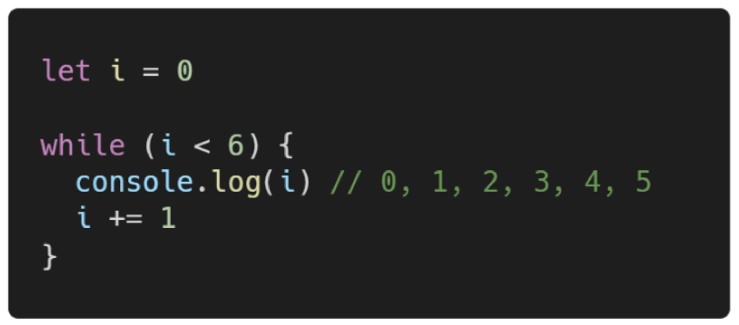

  ```javascript
  i = 0
  while (i < 3) {
      var a = 1
      let b = 2
      const c = 3
      i ++
  }
  
  // i ++ 없으면 새 탭 하나가 멈춤 - 무한루프 돔
  ```

  

   

### 3. `for`

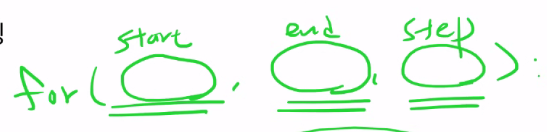

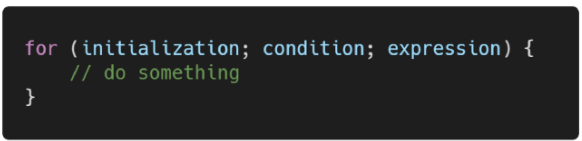

* 세미콜론(;)으로 구분되는 세 부분으로 구성

* initialization

  * 최초 반복문 진입 시 1회만 실행되는 부분

* condition

  * 매 반복 시행 전 평가되는 부분

* expression

  * 매 반복 시행 이후 평가되는 부분

* 블록 스코프 생성

* 예시

  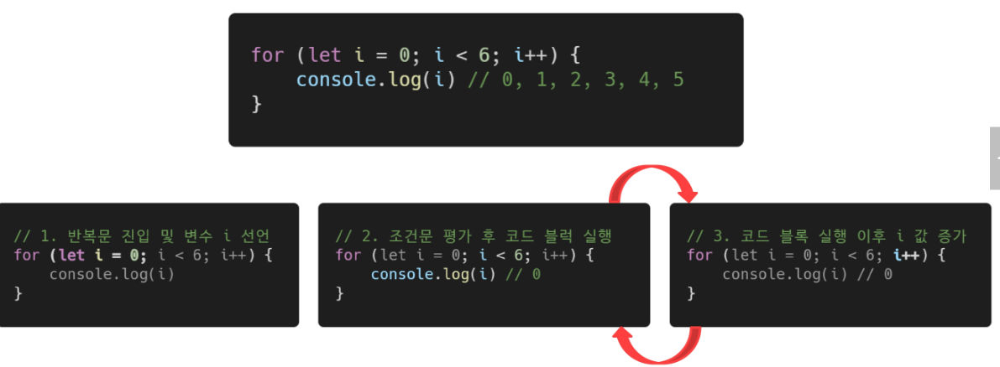

  ```javascript
  // 0부터 시작해서, i가 10보다 작은지 매번 체크, 한번의 loop이 끝날때마다 1씩 더한다 
  > for (let i=0; i < 10; i++) {}
  ```

  ```javascript
  > for (let i=0; i<arr.length; i++) {
      console.log(arr[i])
  }
  ```

  

### 4. `for ... in`

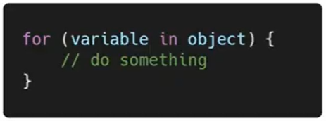

* 개념

  * 객체(object)의 속성(key)들을 순회할 때 사용
    * 객체 == dictionary!
    * 딕셔너리의 key를 순회한다 라고 읽는다
  * 배열도 순회 가능하지만 권장하지 않음
    * 인덱스 순회
  * 실행할 코드는 중괄호 안에 작성
  * 블록 스코프 생성

* 예시

  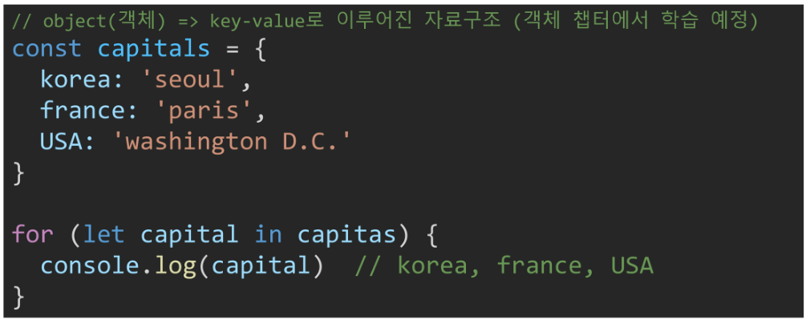

  ```javascript
  for (let nation in capitals) {
      console.log(`${nation}의 수도는 ${capitals[nation]}`)
  }
  
  > korea의 수도는 seoul
  > france의 수도는 paris
  > USA의 수도는 washington D.C.
  ```

  

### 5. `for ... of`

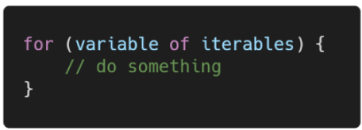

* 개념

  * 반복 가능한(iterable) 객체를 순회하며 값을 꺼낼 때 사용

  * 실행할 코드는 중괄호 안에 작성

  * 블록 스코프 생성

* 예시

  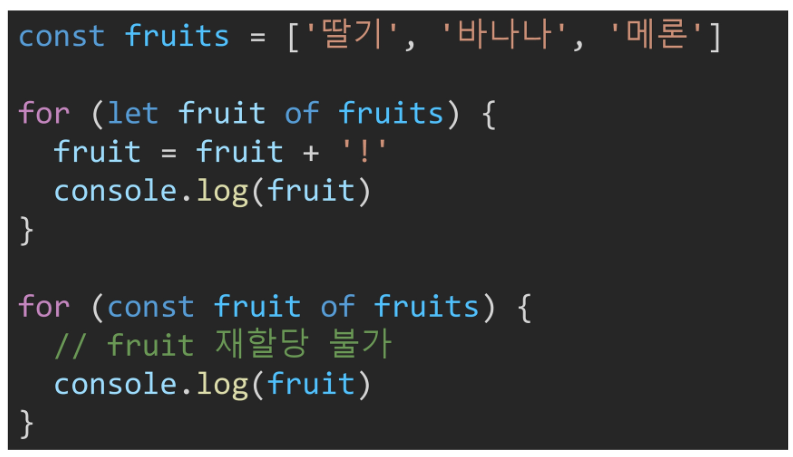

  ```javascript
  > const fruits = ['딸기', '사과', '수박', '메론',]
  > for (let fruit of fruits) {
      console.log(fruit)
  }
  
  // 딸기
  // 사과
  // 수박
  // 메론
  ```

  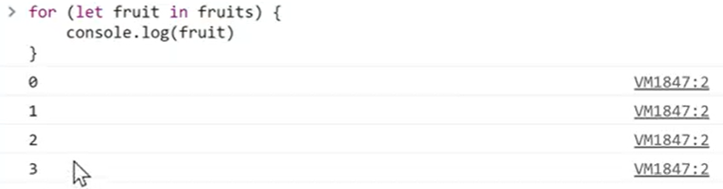


### 6. `for ... in` vs `for ... of`

* object는 of로 돌릴 수 없다
* `for...of`를 많이 쓴다! : 배열 안에서 요소 꺼내기!

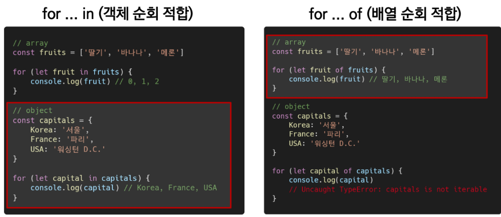

* `const` vs `let` 

  * 재할당 여부만 차이점

  ```javascript
  const fruits = ['딸기', '사과', '수박', '메론']
  for (const fruit of fruits) {
      console.log(fruit)
  }
  
  for (let fruit of fruits){
      console.log(fruit)
  }
  ```

  * let은 재할당 가능

    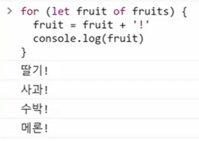

  * const는 안됨

    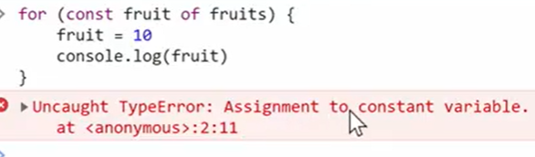

    * 근데 굳이 재할당 하는거 아니면 위에처럼 느낌표 넣는건 할 수 있음

      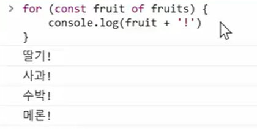

* 배열 생성

  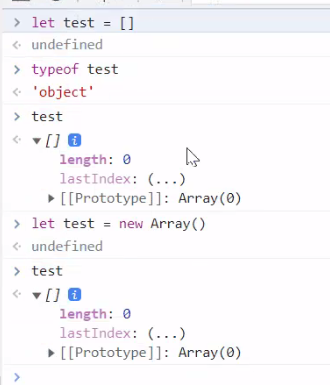


