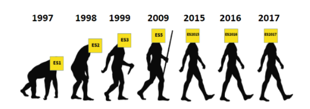
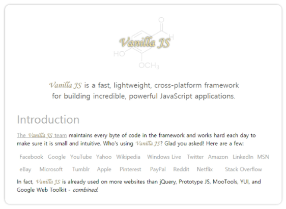
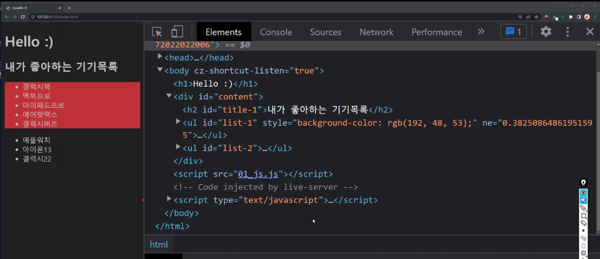

# JavaScript_DOM and Event

[TOC]

## :one: History of JavaScript

### 1. 핵심 인물

* Tim Berners-Lee
  * WWW, URL, HTTP, HTML 최초 설계자. 웹의 아버지
* :star: **Brendan Eich(브랜던 아이크)**
  * JavaScript 최초 설계자
  * 모질라 재단 공동 설립자
  * 코드네임 피닉스 프로젝트 진행
    * 파이어폭스의 전신

### 2. JavaScript의 탄생

* HTML을 동적으로 동작하기 위한 회사 내부 프로젝트를 진행 중 JS 개발(10일만에..)

### 3. 브라우저 전쟁

#### 1) 제 1차 브라우저 전쟁(Netscape vs Microsoft)

* 크로싱 브라우징(클라이언트를 생각하면 explorer, 개발자들은 firefox 선호)

#### 2) 제 2차 브라우저 전쟁(MS vs Google)

* 2008년 Chrome 
* 크롬의 승리 요인
  * 압도적의 속도
  * 강력한 개발자 도구 제공
  * 웹 표준

### 4. 파편화와 표준화

* 제 1차 브라우저 전쟁 이후 수많은 브라우저에서 자체 자바스크립트 언어를 사용하게 됨
* 결국 서로 다른 자바스크립트가 만들어지면서 크로스 브라우징 이슈가 발생하여 웹 표준의 필요성이 제기
* **크로스 브라우징(Cross Browsing)**
  * W3C에서 채택된 표준 웹 기술을 채용하여 각각의 브라우저마다 다르게 구현되는 기술을 비슷하게 만들되, 어느 한쪽에 치우치지 않도록 웹 페이지를 제작하는 방법론(동일성이 아닌 동등성
* 브라우저마다 렌더링에 사용하는 엔진이 다르기 때문
* 1996년부터 넷스케이프는 표준 제정의 필요성을 주장
  * ECMA 인터내셔널에 표준 제정 요청
* 1997년 ECMAScript 1 (ES1) 탄생
* 제1차 브라우저 전쟁 이후 제기된 언어의 파편화를 해결하기 위해 각 브라우저 회사와 재단은 표준화에 더욱 적극적으로 힘을 모으기 시작

### 5. JavaScript ES6+

* 2015년ES2015(ES6) 탄생
  * Next generation of JS
  * JavaScript의 고질적인 문제들을 해결
  * JavaScript의 다음 시대라고 불릴 정도로 많은 혁신과 변화를 맞이한 버전
  * 이때부터 버전 순서가 아닌 출시 연도를 붙이는 것이 공식 명칭이나 통상적으로 ES6라고 부름
  * 현재는 표준 대부분이 ES6+로 넘어옴

### 6. Vanilla JavaScript

* 크로스 브라우징, 간편한 활용 등을 위해 많은 라이브러리 등장(jQuery등)
* ES6 이후, 다양한 도구의 등장으로 순수 자바스크립틔 활용의 증대

### 7. 정리

* History
  * Brandon Eich
  * 브라우저 전쟁
  * 파편화와 표준화의 투쟁
* 브라우저 전쟁의 여파
  * Cross Browsing Issue
  * 표준화(통합)을 위한 노력
  * Vanilla JavaScript

## :two: DOM 조작

### 1. 개념

* Document는 문서 한 장(HTML)에 해당하고 이를 조작
* DOM 조작 순서
  * 선택(Select)
  * 변경(Manipulation)
* DOM 관련 객체의 상속 구조
  * EventTarget
    * Event Listener를 가질 수 있는 객체가 구현하는 DOM 인터페이스
  * Node
    * 여러 가지 DOM 타입들이 상속하는 인터페이스
  * HTMLElement
    * 모든 종류의 HTML 요소
    * 부모 element의 속성 상속

### 2. DOM 선택 

#### 1) 선택 관련 메서드

* `document.querySelector(selector)`
  * 제공된 선택자와 일치하는 element 하나 선택
  * 제공한 CSS selector를 만족하는 첫 번째 element 객체를 반환(없다면 null)
  * `#id`, `.class`, ` >child`

* `document.querySelectorAll(selector)`
  * 제공한 선택자와 일치하는 여러 element를 선택
  * 매칭 할 하나 이상의 셀렉터를 포함하는 유효한 CSS selector 인자(문자열)로 받음
  * 지정된 셀렉터에 일치하는 NodeList를 반환

#### 2) 선택 메서드별 반환 타입

* `getElementById(id)`

* `getElementByTagName(name)`

* `getElementByClassName(name)`

* :star: querySelector(), querySelectorAll()을 사용하는 이유

  * id, class, 그리고 tag 선택자 등을 모두 사용 가능하므로, 더 구체적이고 유연하게 선택이 가능하다
  * 단일 element 선택시: `document.querySelector('#id')`
  * NodeList 선택시: `document.querySelector('.class')`

  

#### 3) HTMLCollection & NodeList

* 공통점
  * 둘 다 배열과 같이 각 항목에 접근하기 위한 index를 제공(유사 배열)
  * 둘 다 Live Collection으로 DOM의 변경 사항을 실시간으로 반영
* 차이점
  * HTML collection 
    *  name, id, index 속성으로 각 항목에 접근 가능
  * NodeList
    * index로만 각 항목에 접근 가능. 
    * 단, HTMLCollection과 달리 배열에서 사용하는 forEach 메서드 및 다양한 메서드 사용 가능
    * `querySelectorAll()`에 의해 반환되는 NodeList는 Static Collection으로 실시간 반영이 되지 않음

#### 4) Collection

* Live Collection
  * 문서가 바뀔 때 실시간으로 업데이트 됨
  * DOM의 변경사항을 실시간으로 collection에 반영
  * ex) HTMLCollection, NodeList
* Static Collection(non-live)
  * DOM이 변경되어도 collection 내용에는 영향을 주지 않음
  * `querySelectorAll()`의 반환 NodeList만 static collection

#### 5) 실습

### 3. DOM 변경

#### 1) Creation 관련 메서드

* `document.querySelector(selector)`
* `document.querySelectorAll(selector)`

#### 2) Append 관련 메서드 (append DOM)

`ParentNode.append()`  vs `Node.appendChild()`

#### 3) 변경 관리 속성(property)

#### 4) 실습

### 5. XSS (Cross-site Scripting)

#### 1) 개념

#### 2) 예시

### 4. DOM 삭제

#### 1) 삭제 관련 메서드

#### 2) 실습

#### 3)

#### 4)

### 5. DOM 속성

#### 1) 속성 관련 메서드

#### 2) 실습

## :three: Event Listener

### 1. 개요

#### 1) 개념

* 네트워크 활동이나 사용자와의 상호작용 같은 사건의 발생을 알리기 위한 객체
* 이벤트 발생
  * 마우스를 클릭, 키보드를 누르는 등 **사용자 행동**으로 발생할 수 있음
  * 특정 메서드를 호출(`Element.click()`)하여 프로그래밍적으로도 만들어 줄 수 있음

#### 2) Event 기반 인터페이스

* AnimationEvent, ClipboardEvent, DragEvent 등

* UIEvent

  * 간단한 사용자 인터페이스 이벤트
  * Event의 상속을 받음
  * MouseEvent, KeyboardEvent, InputEvent, FocusEvent등의 부모 객체 역할을 함

* 이벤트는 왜 필요할까?

  

#### 3) 이벤트의 역할

* ~ 하면, ~ 한다
  * 특정 이벤트가 **발생하면**, 할 일을 **등록**한다
  * ex) 클릭하면, 경고창을 띄운다
* 함수 === '일(work)'의 단위
  * 함수는 하나의 동작의 단위

### 2. Event handler

#### 1) `addEventListner()`

* 지정한 이벤트가 대상에 전달될 때마다 호출할 함수를 설정

* 이벤트를 지원하는 모든 객체(Element, Document, Window 등)를 대상으로 지정 가능

* **`target.addEventListner(type, listner[, options])`**

  

  * **:green_heart: type**

    * 이벤트의 종류
    * 반응할 이벤트 유형(대소문자 구분 문자열)

  * **:blue_heart: listener**

    * 이벤트 발생시 실행할 일 혹은 동작의 명세(~~게 일할거야 하는 명세를 넣어놓는 것)
      * 여기서 실행되는 것 아님!
    * 지정된 타입의 이벤트가 발생했을 때 알림을 받는 객체
    * EventListener 인터페이스 혹은 JS function 객체(콜백 함수)여야 함

  * 예시

    

    

  

 

#### 2) `addEventListener()` 실습

* 삭제하기 전에 경고 팝업창 만들기

  * 함수 이용해서 팝업창 만들기

  

  

  * return으로 만들어주기

  

* ㅇㄹㄹ

* 

### 3. Event 취소

#### 1) `event.preventDefault()`

* 현재 이벤트의 **기본 동작을 중단**
* HTML 요소의 기본 동작을 작동하지 않게 막음
  * a 태그의 기본 동작은 클릭시 링크로 이동
  * form 태그의 기본 동작은 form 데이터 전송
* 이벤트를 취소할 수 있는 경우, 이벤트의 전파를 막지 않고 그 이벤트를 취소
* 취소할 수 없는 이벤트도 존재
  * 이벤트의 취소 가능 여부는 `event.cancelable`을 사용해 확인할 수 있음

#### 2) Event 취소 실습

### 4. Event 추가 학습

* http://developer.mozilla.org/en-US/docs/Web/Events

## :four: Event 종합 실습

### CREATE, READ 기능을 충족하는 todo app 만들기

스타일 우선순위가 높아져 버리기 때문에 좋지 않고

코드ㅂㄹ필요하게 많이 작성이 되어야 함

따라서 자바스크립트로 이러한 스타일을 적용하는 것은 지양하는게 좋음

CSS파일을 에 따로 해놓고 id와 class에 적용

* * 