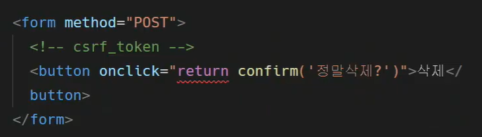

# JavaScript_DOM and Event

[TOC]

## :one: History of JavaScript

### 1. 핵심 인물

* Tim Berners-Lee
  * WWW, URL, HTTP, HTML 최초 설계자. 웹의 아버지
* Brendan Eich
  * JavaScript 최초 설계자
  * 모질라 재단 공동 설립자
  * 코드네임 피닉스 프로젝트 진행
    * 파이어폭스의 전신

### 2. JavaScript의 탄생

### 3. 브라우저 전쟁

#### 1) 제 1차 브라우저 전쟁

#### 2) 제 2차 브라우저 전쟁

### 4. 파편화와 표준화

### 5. JavaScript ES6+

## :two: DOM 조작

### 1. 개념

* Document는 문서 한 장(HTML)에 해당하고 이를 조작
* DOM 조작 순서
  * 선택(Select)
  * 변경(Manipulation)
* DOM 관련 객체의 상속 구조
  * EventTarget
    * Event Listener를 가질 수 있는 객체가 구현하는 DOM 인터페이스
  * Node
    * 여러 가지 DOM 타입들이 상속하는 인터페이스
  * HTMLElement
    * 모든 종류의 HTML 요소
    * 부모 element의 속성 상속

### 2. DOM 선택 

#### 1) 선택 관련 메서드

* `document.querySelector(selector)`
* `document.querySelectorAll(selector)`

#### 2) 선택 메서드별 반환 타입

#### 3) HTMLCollection & NodeList

#### 4) Collection

#### 5) 실습

### 3. DOM 변경

#### 1) Creation 관련 메서드

* `document.querySelector(selector)`
* `document.querySelectorAll(selector)`

#### 2) Append 관련 메서드 (append DOM)

`ParentNode.append()`  vs `Node.appendChild()`

#### 3) 변경 관리 속성(property)

#### 4) 실습

### 5. XSS (Cross-site Scripting)

#### 1) 개념

#### 2) 예시

### 4. DOM 삭제

#### 1) 삭제 관련 메서드

#### 2) 실습

#### 3)

#### 4)

### 5. DOM 속성

#### 1) 속성 관련 메서드

#### 2) 실습

## :three: Event Listener

### 1. 개요

#### 1) 개념

* 네트워크 활동이나 사용자와의 상호작용 같은 사건의 발생을 알리기 위한 객체
* 이벤트 발생
  * 마우스를 클릭, 키보드를 누르는 등 **사용자 행동**으로 발생할 수 있음
  * 특정 메서드를 호출(`Element.click()`)하여 프로그래밍적으로도 만들어 줄 수 있음

#### 2) Event 기반 인터페이스

* AnimationEvent, ClipboardEvent, DragEvent 등

* UIEvent

  * 간단한 사용자 인터페이스 이벤트
  * Event의 상속을 받음
  * MouseEvent, KeyboardEvent, InputEvent, FocusEvent등의 부모 객체 역할을 함

* 이벤트는 왜 필요할까?

  

#### 3) 이벤트의 역할

* ~ 하면, ~ 한다
  * 특정 이벤트가 **발생하면**, 할 일을 **등록**한다
  * ex) 클릭하면, 경고창을 띄운다
* 함수 === '일(work)'의 단위
  * 함수는 하나의 동작의 단위

### 2. Event handler

#### 1) `addEventListner()`

* 지정한 이벤트가 대상에 전달될 때마다 호출할 함수를 설정

* 이벤트를 지원하는 모든 객체(Element, Document, Window 등)를 대상으로 지정 가능

* **`target.addEventListner(type, listner[, options])`**

  

  * **:green_heart: type**

    * 이벤트의 종류
    * 반응할 이벤트 유형(대소문자 구분 문자열)

  * **:blue_heart: listener**

    * 이벤트 발생시 실행할 일 혹은 동작의 명세(~~게 일할거야 하는 명세를 넣어놓는 것)
      * 여기서 실행되는 것 아님!
    * 지정된 타입의 이벤트가 발생했을 때 알림을 받는 객체
    * EventListener 인터페이스 혹은 JS function 객체(콜백 함수)여야 함

  * 예시

    

    

  

 

#### 2) `addEventListener()` 실습

* 삭제하기 전에 경고 팝업창 만들기

  * 함수 이용해서 팝업창 만들기

  

  

  * return으로 만들어주기

  

* ㅇㄹㄹ

* 

### 3. Event 취소

#### 1) `event.preventDefault()`

* 현재 이벤트의 **기본 동작을 중단**
* HTML 요소의 기본 동작을 작동하지 않게 막음
  * a 태그의 기본 동작은 클릭시 링크로 이동
  * form 태그의 기본 동작은 form 데이터 전송
* 이벤트를 취소할 수 있는 경우, 이벤트의 전파를 막지 않고 그 이벤트를 취소
* 취소할 수 없는 이벤트도 존재
  * 이벤트의 취소 가능 여부는 `event.cancelable`을 사용해 확인할 수 있음

#### 2) Event 취소 실습

### 4. Event 추가 학습

* http://developer.mozilla.org/en-US/docs/Web/Events

## :four: Event 종합 실습

### CREATE, READ 기능을 충족하는 todo app 만들기

