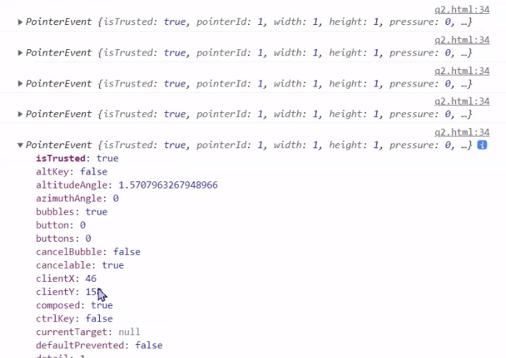
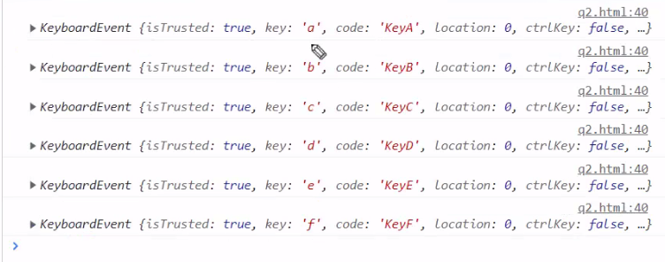
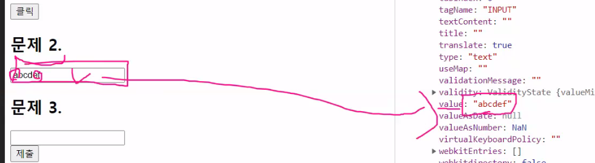
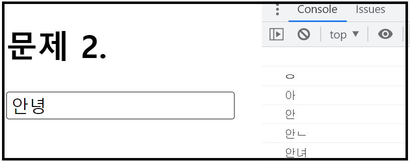
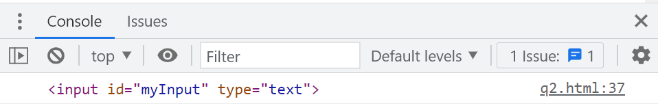
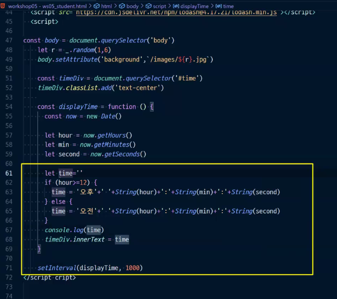

# JS 보충

[TOC]


# :one: DOM 조작 (q1.html)

### 문제 1. 

주어진 코드에서 section#practice에 **직접 HTML을 작성하지 않고** DOM 조작을 통하여 아래의 형태로 만드세요. 

* h1 태그의 내부 텍스트는 보충수업입니다.

  * 내부 텍스트는 보충수업입니다.

  * h1 태그의 스타일 색상은 빨간색(red)입니다.

* h2 태그

  * 내부 텍스트는 자바스크립트입니다.

  * h2 태그의 스타일 색상은 파란색(blue)입니다.

```
<body>
  <section id="practice">
    <h1>보충수업</h1>
    <h2>자바스크립트</h2>
  </section>
</body>
```


### 코드

* **h1 태그**

1. 먼저 잡아준다

   * querySelector

   ```javascript
     const section = document.querySelector('#practice')
   ```

   * getElementById: 어짜피 ID 가지고 오는거 아니까 # 없어도 괜찮음

   ```javascript
   const section = document.querySelector('practice')
   ```

2. h1 생성해주고

   ```javascript
   const h1 = document.createElement('h1')
   ```

3. h1에 내용 및 스타일을 추가해준다

   ```javascript
   h1.innerText = '보충수업'
   h1.style.color = 'red'
   ```

4. section 노드에 자식으로 삽입해준다

   ```javascript
   section.appendChild(h1)
   ```

5. 완성

   ```html
   <script>
       const section = document.querySelector('#practice')
   
       const h1 = document.createElement('h1')
       h1.innerText = '보충수업'
       h1.style.color = 'red' 
       section.appendChild(h1)
   
     </script>
   ```

   

* **h2 태그**

1. 위와 동일한 방법으로 생성해준다

2. 완성

   ```html
   <script>
       const h2 = document.createElement('h2')
       h2.innerText = '자바스크립트'
       h2.style.color = 'blue'
       section.appendChild(h2)
   </script>
   ```

   


# :two: 이벤트 (q2.html)

## 문제 1. 

주어진 코드에서 button#myButton을 클릭하였을 때, alert 메시지로 '클릭되었습니다.'가 나타나도록 하세요.


### 코드

* 코드

```html
<script>
  const myButton = document.querySelector('#myButton')
  btn.addEventListener('click', function (event) {
    alert('클릭되었습니다')
  })
</script>
```


* 발생되는 Event종류 알아보기

  * console에 찍히는 것 확인: click 하는 순간 PointerEvent 발생

  ```html
  <script>
    const myButton = document.querySelector('#myButton')
    btn.addEventListener('click', function (event) {
      console.log(event)
    })
  </script>
  ```

  


* 버튼 조작

  * 이거 하면 버튼 옆에 숫자가 막 올라감

  ```html
  <script>
  	const myButton = document.querySelector('#myButton')
      
      let count = 0
      myButton.addEventListener('click', function (event) {
          event.target.innerText = `클릭: ${count++}`
          console.log(event)
      })
  </script>
  ```

  

## 문제 2.

주어진 코드에서 input#myInput에 내용이 작성되면 해당 내용이 console에 출력되도록 하세요.


### 코드

* 전체

```html
<script>
  const myInput = document.querySelector('#myInput')
  myInput.addEventListener('keydown', function (event) {
    console.log(event)
    console.log(event.target)
    console.log(event.target.value)
  } )
</script>
```


* 발생되는 Event 종류 알아보기
  * KeyboardEvent 

```html
<script>
    const myInput = document.querySelector('#myInput')
    myInput.addEventListener('keydown', function (event) {
      console.log(event)
    } )
</script>
```





* value가 저장되는 위치 
  * 우리가 사용할 데이터는 키에도 있고 코드라는 부분에도 남겨져 있음
  * 토글 열어서 <target> 쭉 내려가면 value가 보일 것




* 따라서, value를 출력하라고 하면 console에 아래와 같이 나옴




* target 출력

```javascript
console.log(event.target)
```




## 문제 3. 

주어진 코드에서 form#myForm을 제출하기 버튼을 눌렀을 때 실제 제출이 되지 않도록 하세요. 


### 코드(Todo List)

```javascript
event.preventDefault
```

```html
<script>
  const myForm = document.querySelector('#myForm')
  const todoList = document.querySelector('#todo-list')

  myForm.addEventListener('submit', function (event) {
    event.preventDefault()
    const todoInput = document.querySelector('#todo-input')

    const todoItem = document.createElement('li')
    todoItem.innerText = todoInput.value
  })
</script>
```


* 발생하는 이벤트: SubmitEvent
  * 너무 순식간에 깜박 하고 화면이 전환돼서 캡쳐는 불가능

```html
<script>
  const myForm = document.querySelector('#myForm')
  myForm.addEventListener('submit', function (event) {
    console.log(event)
  })
</script>
```


## TIP: 코드짤때 주의할 점


bootstrap 버튼 복사해올때, 

type=button 이라고 되어ㅣㅆ는데, submit으로 바꾸어줘야 submit이 이루어짐


# :question:


왜 preventDefault ..??

action으로 하면 상단의 브라우저에 요청이 이러남

원하지 않게 페이지 전환이 이루어질수 있음

이를 막기 위해서 사용

왜 막아요?

여기 화면 안에서 화면을 조작하기 위해서...??????

막은 것들을 어떤 식으로 활용할 수 있을까?

TodoList~~~~





