# JavaScript TEST

**JavaScript01**

* 브라우저가 뭔지, 어떤 역할을 하는지

  * URL로 웹(WWW)을 탐색하며 서버와 통신하고, HTML 문서나 파일을 출력하는 GUI 기반의 소프트웨어
  * 크롬, 파이어폭스 등

* DOM이 무엇인지

  * HTML, XML과 같은 문서를 다루기 위한 프로그래밍 인터페이스
  * 문서를 구조화하고, 구조화된 구성 요소를 하나의 객체로 취급하여 다루는 논리적 트리 모델
  * 문서가 객체(object)로 구조화되어 있으며 key로 접근 가능
  * 단순한 속성 접근, 메서드 활용 뿐만 아니라 프로그래밍적 ㄱ언어적 특성을 활용한 조작 가능

* DOM tree가 뭔지

  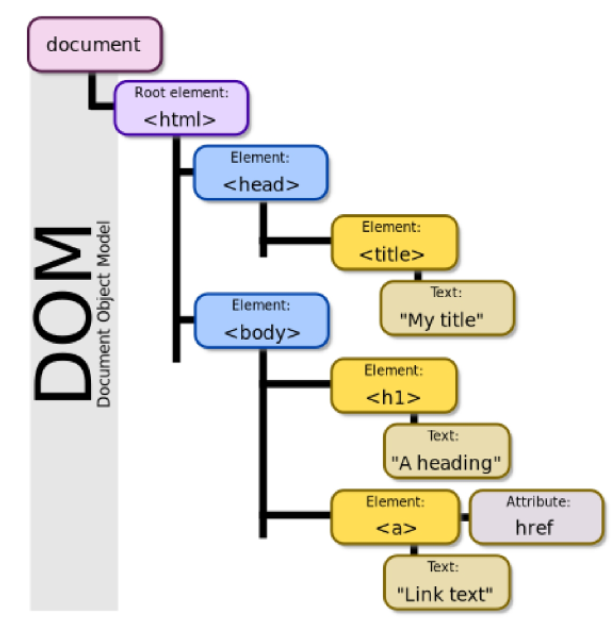

* BOM 이라는게 있구나

  * Browser Object Model
  * 자바스크립트가 브라우저와 소통하기 위한 모델
  * 브라우저의 창이나 프레임을 추상화해서 프로그래밍적으로 제어할 수 있도록 제공하는 수단
  * window객체는 모든 브라우저로부터 지원받으며 브라우저의 창(window)을 지칭

* var, let, const

  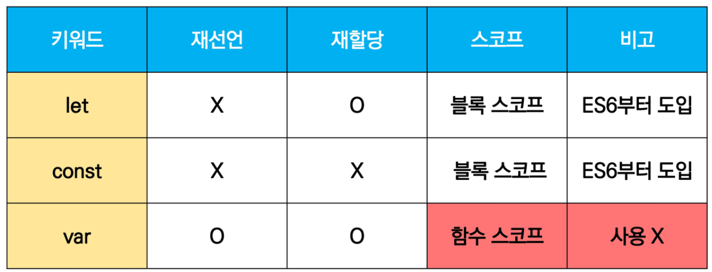

* 데이터 타입: 원시 vs 참조

  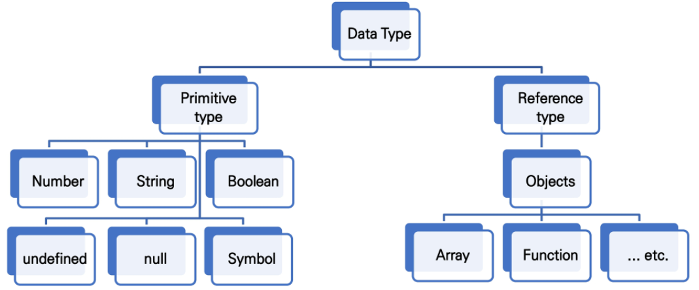

* TYPE OF null & undefined

  * null: object
  * undefined: undefined

* 연산자 파트

  * ===(일치 비교 연산자): 타입, 값을 모두 비교하는 연산자

  * ==(동등 비교 연산자)과 === 차이점이 뭔지
    * ==: 암묵적 타입 변환 O
    * ===: 암묵적 타입 변환 X (값과 타입 모두 같은지 비교)

* for문 어떻게 쓰는지(작성된 코드를 보고 어떤 값을 반환할지 알아야 함)

* for in, for of

  * 코드 나왔을때 - console.log 했을 때 출력값이 어떻게 나올 것인지

  * 코드 보고 해석할 줄 알아야 함

* 함수

  * 일급 객체(first-class-citizen)가 무엇인가?
    * 변수에 할당 가능
    * 함수의 매개변수로 전달 가능
    * 함수의 반환 값으로 사용 가능

* 선언식 vs 표현식

* hoisting은 자세히는 안나온다 함 -> 나오긴 하겠네?

  * 함수 호출 이후에 선언해도 동작함
  * 함수 선언식으로 선언한 함수에서 hoisting 발생 

* ArrowFunction :star:
  * 기본적인 함수 형태를 화살표 함수로
  * 어떤 경우에 무엇을 생략할 수 있는지 확실히 알아두기
    * function 키워드 생략 가능
    * 함수의 매개변수가 단 하나 뿐이라면, () 생략가능
    * 함수 몸통이 표현식 하나라면, {} 과 return도 생략이 가능

* 문자열 관련 주요 메서드
  * 외울 필요 없지만

  * 한번씩은 보고 지나가 주세요(?..뭐요?)

  * `push()`, `pop()` .. 배열 앞에 추가하고 뒤에 추가하고 빼고 하는 것은 알아야 함

    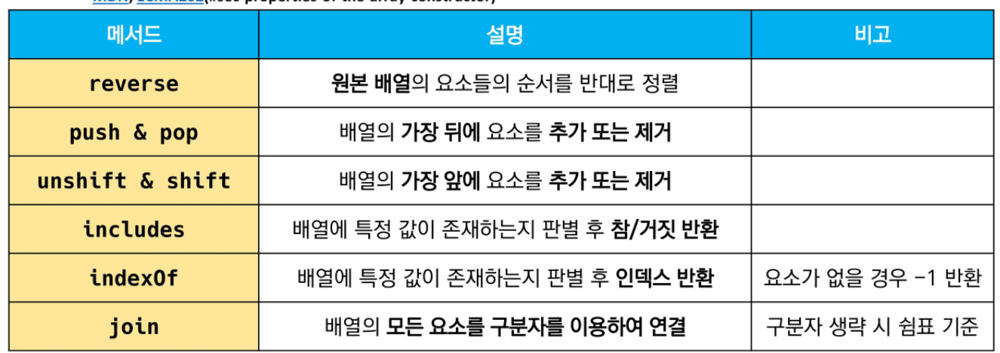

* 배열 관련 주요 메서드
  * `forEach` , for in , for of 의 어떤 차이가 있는지
  * `for Each` 어떤 메서드인지
    * element, index, array 있는데, array 많이 안쓰고
    * 각각에 대해서 뒷쪽에 들어오는 콜백함수를 한번씩 실행하는 그런 메서드

* 객체
  * key, value 중요하다 - key에는 string만, value는 모든 타입
  * JavaScript 의 객체는 JSON type

* 구조분해할당
  * 어떤 코드를 어떻게 줄여썼는지 

    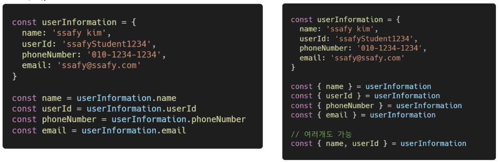

**JavaScript02**

* 브랜던 아이크가 JS 만들었어요 
* 전쟁했나보다~
* ES6라는게 있었지 여기서부터 많은 변화가 있었지 
* DOM 조작하는 거
  * `querySelector`, `querySelectorAll` 쓴다
  * 두개의 차이점 안나옴. 큰걸로 보기
  * queryselector(selector)에는 뭐가 들어가는구나, (selector) 안쪽에 뭐가 들어가는지... 
    * querySelector(), querySelector()의경우, id, class, tag 선택자 등 모두 사용 가능 
    * ('#id')('.class')
  * append하면 뒤에 붙일 수 있구나 정도만
  * appendChild 이런거 외우지 말고여
  * innerText vs innerHTML
    * innerText
    * Node 객체와 그 자손의 텍스트 컨텐츠(DOMString)를 표현(해당 요소 내부의 raw text)
    * 즉, 줄 바꿈을 인식하고 숨겨진 내용을 무시하는 등 최종적으로 스타일링이 적용된 모습으로 표현
    * innerHTML 
    * 요소(element)내에 포함된 HTML 마크업을 반환
  * remove()하면 삭제되는거다!
    * ChildNode.delete().... 이거면 틀린거
  * setAttribute, getAttribute
    * 지정된 요소의 값을 설정, 속성이 이미 존재하면 값을 갱신, 존재하지 않으면 지정된 이름과 값으로 새 속성을 추가
    * 해당 요소의 지정된 값(문자열)을 반환
    * 인자(attributeName)는 값을 얻고자 하는 속성의 이름
* Event
  * ppt에 있는 내용만 나옴
  * addEventListener
  * onClick
  * type: event trigger
  * listener: (콜백)함수
  * Event취소: preventDefault 어떤 역할을 하는지: 현재 이벤트의 기본 동작을 중단하는 것

* 처음 보는 설명이면 다 맞는거예요 

# QUIZ

### JavaScript 01

44p

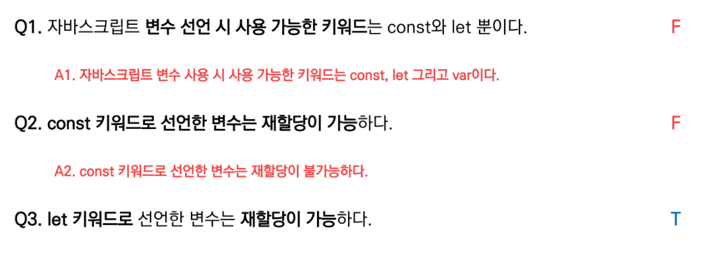

65p

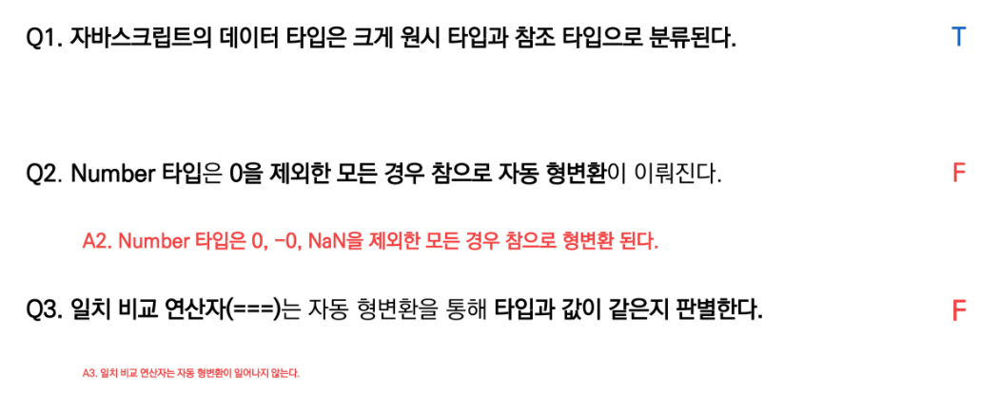

86p

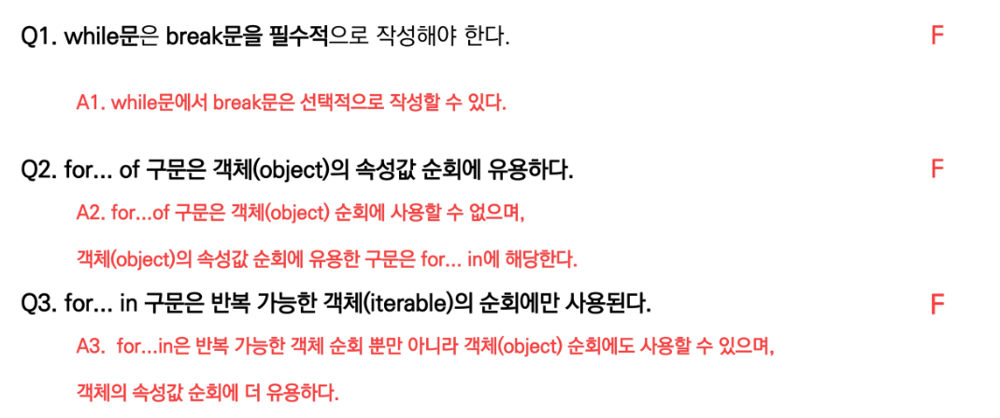

107p

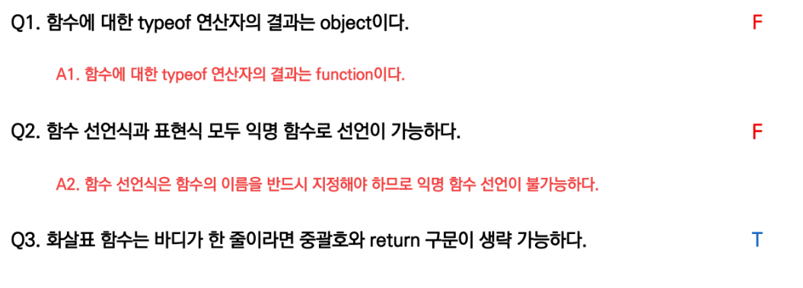

137p

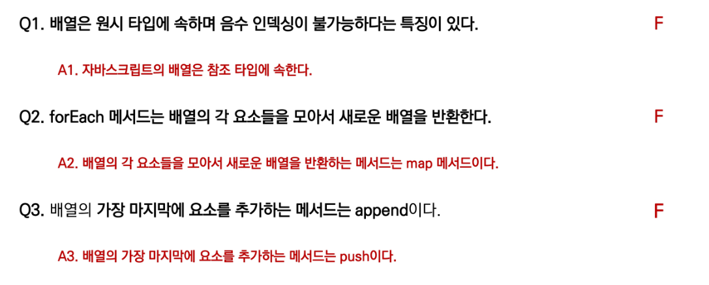

150p

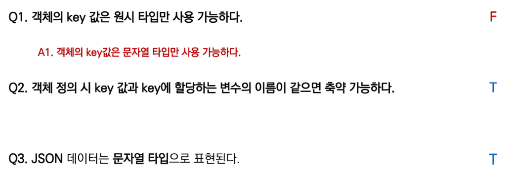

