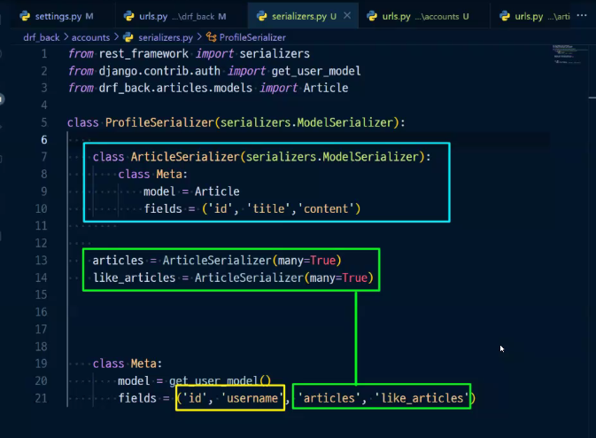
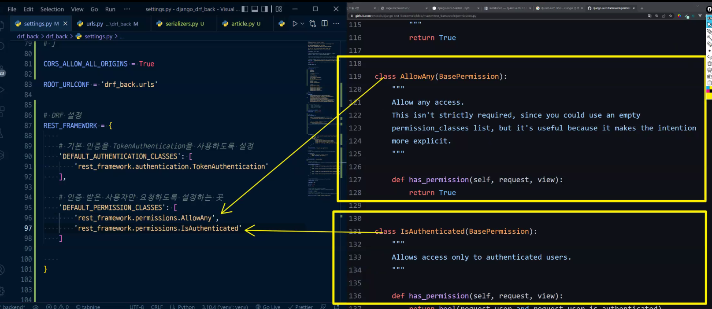
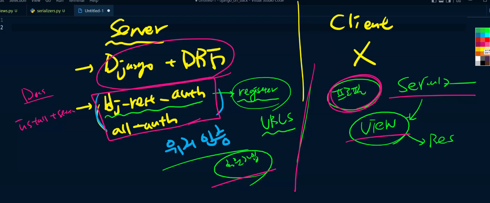
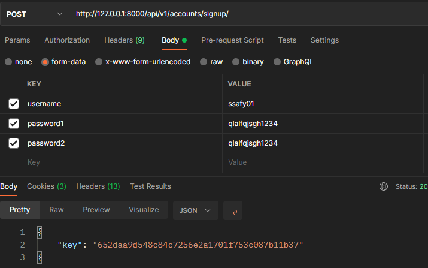
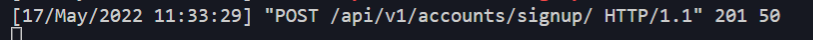
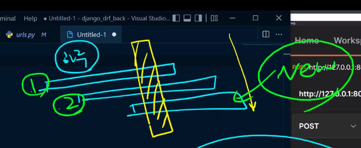

# Vue +Django

## :one: Server & Client

### 1. Server

### 2. Client


## :two: CORS

### 1. Same-origin policy(SOP)

#### 1) 기본 개념

* 동일 출처 정책
* 특정 출처(origin)에서 불러온 문서나 스크립트가 다른 출처에서 가져온 리소스와 상호작용 하는 것을 제한하는 보안 방식
* 잠재적으로 해로울 수 있는 문서를 분리함으로써 공격받을 수 있는 경로를 줄임


#### 2) Origin(출처)

* 두 URL의 Protocol, Port, Host가 모두 같아야 동일한 출처라 할 수 있음

* URL http://store.company.com/dir/page.html의 출처를 비교한 예시

  


#### 3) Same-origin 예시

* Port까지의 주소가 같을 때 same-origin


### 2. Cross-Origin Resource Sharing(CORS)

#### 1) 기본개념

* "교차 출처 리소스(자원) 공유"
* **추가 HTTP header**를 사용하여, 특정 출처에서 실행중인 웹 애플리케이션이 다른 출처의 자원에 접근할 수 있는 권한을 부여하도록 브라우저에 알려주는 체제
* 리소스가 자신의 출처(Domain, Protocol, Port)와 다를 때 교차 출처 HTTP 요청을 실행
* 보안 상의 이유로 브라우저는 교차 출처 HTTP 요청을 제한(SOP)
  * 예를 들어, XMLHttpRequest는 SOP를 따름

* **다른 출처의 리소스를 불러오려면** 그 출처에서 **올바른 CORS header를 포함한 응답**을 반환해야 함 - 응답을 반환하는 건 서버 - 서버에서 header 설정을 해 줘야 하는 것


#### 2) CORS Policy

* 교차 출처 리소스(자원) 공유 정책
* 다른 출처(origin)에서 온 리소스를 공유하는 것에 대한 정책 <-> SOP


#### 3) 교차 출처 접근 허용하기

* CORS를 사용해 교차 출처 접근을 허용하기
* CORS는 HTTP의 일부로, 어떤 호스트에서 자신의 컨텐츠를 불러갈 수 있는지 서버에 지정할 수 있는 방법


#### 4) Why CORS? 

* 브라우저 & 웹 애플리케이션 보호
  * 악의적인 사이트의 데이터를 가져오지 않도록 사전 차단
  * 응답으로 받는 자원에 대한 최소한의 검증
  * 서버는 정상적으로 응답하지만, 브라우저에서 차단
* Server의 자원관리
  * 누가 해당 리소스에 접근할 수 있는지 관리 기능


#### 5) How CORS?

* CORS 표준에 의해 추가된 HTTP Header를 통해 이를 통제
* CORS HTTP 응답 헤더 예시
  * **`Access-Control-Allow-Origin /`**
  * ` Access-Control-Allow-Credentials /` 
  * ` Access-Control-Allow-Headers /` 
  * ` Access-Control-Allow-Methods`


#### 6) Access-Control-Allow-Origin 응답 헤더

* 이 응답이 주어진 출처(origin)로부터 요청 코드와 공유될 수 있는지를 나타냄
* 예시
  * `Access-Control-Allow-Origin: *`
  * 브라우저 리소스에 접근하는 임의의 origin으로부터 요청을 허용한다고 알리는 응답에 포함
  * '*' 는 모든 도메인에서 접근할 수 있음을 의미
  * '*' 외에 특정 origin 하나를 명시할 수 있음


#### 7) CORS 시나리오 예시

* `http://localhost:8080`(Vue.js)의 웹 컨텐츠가 `https://lab.ssafy.com`(Django) 도메인의 컨텐츠를 호출하기를 원하는 상황

* 요청 헤더의 Origin을 보면, localhost:8080으로부터 요청이 왔다는 것을 알 수 있음

* 서버는 이에 대한 응답으로, Access-Control-Allow-Origin 헤더를 다시 전송

* 만약 서버 리소스 소유자가 오직 localhost:8080의 요청에 대해서만 리소스에 대한 접근을 허용하려는 경우, '*'가 아닌 Access-Control-Allow-Origin: localhost:8080을 전송해야 함

  

1. Vue.js에서 A 서버로 요청
2. A 서버는 Access-Control-Allow-Origin에 특정한 origin을 포함시켜 응답
   * 서버는 CORS Policy와 직접적인 연관이 없고, 그저 요청에 응답함
3. 브라우저는 응답에서 Access-Control-Allow-Origin을 확인 후 허용 여부를 결정
4. 프레임워크별로 이를 지원하는 라이브러리가 존재
   * django는 django-cors-headers 라이브러리를 통해 응답 헤더 및 추가 설정 가능


#### 8) django-cors-headers 라이브러리

```bash
$ pip install django-cors-headers
```

```python
# settings.py
INSTALLED_APPS = [
    ...
    'corsheaders',
    ...
]

MIDDLEWARE = [
    ...
    # CommonMiddleware보다 위에 위치
    'corsheaders.middleware.CorsMiddleware',
    ...
    'django.middleware.common.CommonMiddleware',
    ...
]

# 교차 출처 자원 공유를 허용할 도메인 등록
CORS_ALLOWED_ORIGINS = [
    'http://localhost:8080',
]
```


* 응답에 CORS header를 추가해주는 라이브러리
* 다른 출처에서 보내는 Django 애플리케이션에 대한 브라우저 내 요청을 허용함
* Django App 이 header 정보에 CORS를 설정한 상태로 응답을 줄 수 있게 도와주며, 이 설정을 통해 브라우저는 다른 origin에서 요청을 보내는 것이 가능해짐


## :three: Authentication & Authrization

### 1. Authentication

* 인증, 입증
* 자신이라고 주장하는 사용자가 누구인지 확인하는 행위
* 모든 보안 프로세스의 첫 번째 단계(가장 기본 요소)
* 즉, 내가 누구인지를 확인하는 과정
* 401 Unauthroized
  * 비록, HTTP 표준에서는 "미승인(unauthorized)"을 하고 있지만, 의미상 이 응답은 "비인증(unauthenticated)"를 의미

### 2. Authorization

* 권한 부여, 허가
* 사용자에게 특정 리소스 또는 기능에 대한 액세스 권한을 부여하는 과정(절차)
* 보안 환경에서 권한 부여는 항상 인증을 따라야 함
  * 예를 들어, 사용자는 조직에 대한 액세스 권한을 부여 받기 전에 먼저 자신의 ID가 진짜인지 먼저 확인해야 함
* 서류의 등급, 웹 페이지에서 글을 조회 & 삭제 & 수정할 수 있는 방법, 제한 구역
  * 인증에 되었어도 모든 권한을 부여 받는 것은 아님
* 403 Forbidden
  * 401과 다른 점은, 서버는 클라이언트가 누구인지 알고 있음


### 3. Authentication vs Authorization

* Authentication(인증)
  * Authentication is the process of verifying who a user is
  * 401 Unauthrized
  * 자신이라고 주장하는 유저 확인
  * Credential(비밀번호, 얼굴 인식) 검증
  * Django -> 게시판 서비스 로그인
  * 인증 이후에 획득하는 권한 (생성, 수정, 삭제)
* Authorization(권한/허가)
  * "Authorization is the process of verifying what they have access to"
  * 403 Forbidden
  * 유저가 자원에 접근할 수 있는지 여부 확인
  * 규칙/규정에 의해 접근할 수 있는지 확인
  * Django -> 일반 유저 vs 관리자 유저
  * 인증 이후에 부여되는 권한
    * 예시 - 로그인 후 글 작성 여부


### 4. Authentication and authorization work together

* 회원 가입을 하고 로그인을 하면 할 수 있는 권한 생성
  * 인증 이후에 권한이 따라오는 경우가 많음
* 단, 모든 인증을 거쳐도 권한이 동일하게 부여되는 것은 아님
  * Django에서 로그인을 했더라도, 다른 사람의 글까지 수정/삭제가 가능하진 않음
* 세션, 토큰, 제 3자를 활용하는 등의 다양한 인증 방식이 존재


## :four: DRF Authentication

### 1. 다양한 인증 방식

* Session Based
* **Token Based**
  * Basic Token
  * JWT
* Oauth
  * google
  * facebook
  * github...


### 2. Basic Token Authentication


### 3. Basic Token Based


### 4. JWT

* JSONO Web Token
* JSON 포맷을 활용하여 요소 간 안전하게 정보를 교환하기 위한 표준 포맷
* 암호화 알고리즘에 의한 디지털 서명이 되어 있기 때문에 JWT 자체로 검증 가능
* JWT 자체가 필요한 정보를 모두 갖기 때문에(self-contained), 이를 검증하기 위한 다른 검증 수단(ex. table)이 필요 없음
* 사용처
  * Authentication, Information Exchange


## :five: 실습

### 1. django 기본세팅

#### 1) 기본세팅

1. git branch
2.  startproject
3.  startapp
4.  urls.py
5.  models.py
6. 

#### 2) serializers




class 안쪽에 왜 class 정의?

ArticleSerializer는 ProfileSerializer 안에서만 쓰겠다 라는 의미

노란박스는 django에서 정의해놓은 user 에서 가져올 수 있는거고, articles와 like_articles라는 필드가 모델에 없으니까 어디서 가져와야 하는지를 정해주는 것


read_only fields는 *CRUD 할 때 R만 하고싶을 때* 사용


#### 3) CORS

djanago cors documents 보면 나옴

1. 라이브러리 설치

   ```bash
   pip install django-cors-headers
   ```

2. settings.py

   * INSTALLED_APPS

   ```python
   INSTALLED_APPS = [
       ...
       # thirdparty 니까 내가 만든 앱보다는 아래에
       'corsheaders',
       ...
   ]
   ```

   * MIDDLEWARE

   ```python
   MIDDLEWARE = [
       ...
       'corsheaders.middleware.CorsMiddleware',
       # CommonMiddleware 보다 위에 넣어주기
       ...
   ]
   ```

   * CORS_ALLOWED_ORIGINS 추가

   ```python
   # 특정 도메인만 허용
   CORS_ALLOWED_ORIGINS = [
       "https://example.com",
       "https://sub.example.com",
       "http://localhost:8080",
       "http://127.0.0.1:9000",
   ]
   
   # 모든 도메인 허용 .. 둘 중 하나 선택하면 됨.
   CORS_ALLOW_ALL_ORIGINS = True
   ```

3. 라이브러리 설치

   * dj-rest-auth documents 에도 있음
     * registration(optional) 파트 읽기

   ```bash
   $ pip install django-allauth
   $ pip install dj-rest-auth
   ```

   * settings.py

   ```python
   INSTALLED_APPS = [
       ...
   	# rest framework
       'rest_framework',
       'rest_framework.authtoken',
       'dj_rest_auth',
       # rest framework
       ...
       'dj_rest_auth.registration',
       # django
       'django.contrib.sites',
       'allauth',
       'allauth.account',
       'allauth.socialaccount',
   ]
   ```

   * SITE_ID = 1 추가

   ```python
   # 하나의 프로젝트에서 여러 개의 앱을 쓸 수 있게 multiple 앱 지원
   # 따라서 그런 경우 사용할 수 있게, mulitple site ID 옵션을 주는 것
   # 근데 지금은 그럴 일 없으니까 일단 1먼저 써놓자
   
   # INSTALLED_APPS = [] 다음에 위치
   SITE_ID = 1
   ```

4. DRF 설정코드

   

   * settings.py

   ```python
   # DRF 설정
   REST_FRAMEWORK = {
       # 기본 인증을 토큰 authentiacation 을 사용하도록 변경
       'DEFAULT_AUTHENTICATION_CLASSES': [
           'rest_framework.authentication.TokenAuthentication',
       ],
   
       # 인증받은 사용자만 요청하도록 설정하는 곳 
       'DEFAULT_PERMISSION_CLASSES': [
           'rest_framework.permissions.AllowAny',
           'rest_framework.permissions.IsAuthenticated',
       ]
   }
   ```

5. urls.py

   * dj_rest_auth documentation 검색해서 github보기
   * register 안쪽에 있는 기능들이 있길래, url로 넣어준거 

   ```python
   urlpatterns = [
       ...
       path('api/v1/accounts', include('dj_rest_auth.urls')),
       # 회원가입은 registration에 모아놓은 것 
       path('api/v1/accounts/signup/', include('dj_rest_auth.registration.urls')),
   ]
   
   ```

6. profile 처리 해주기

   * accounts/urls.py

   ```python
   from django.contrib import admin
   from django.urls import path, include
   from . import views
   
   app_name = 'accounts'
   urlpatterns = [
       path('profifle/<str:username>/', views.profile)
   ]
   
   ```

   * accounts/views.py

   ```python
   from django.shortcuts import render, get_object_or_404
   from django.contrib.auth import get_user_model
   from .serializers import ProfileSerializer
   from rest_framework.response import Response
   from rest_framework.decorators import api_view
   
   User = get_user_model()
   # Create your views here.
   @api_view(['GET'])
   def profile(request, username):
       user = get_object_or_404(User, username=username)
       serializer = ProfileSerializer(user)
       return Response(serializer.data)
   ```




지금까지 회원기능 만들고 프로필 페이지 만들었다 

7. 회원가입 잘 되는지 확인해보자

   * POSTMAN 사용해서 확인

   * POST는 body에 넣어서 보낸다 - form data(get은 params)

     

     

   * key 안에 token 값을 넣어서 내려줌

   * token은 한마디로, 토큰을 가지고 있으면 앞으로 로그인이라는게 필요가 없어짐

   * 이 토큰을 클라이언트에게 내려준거

   * FE가 토큰값 받아서 저장해둠 ->  header에 담아줌 -> 서버에게 요청을 보내면, BE는 header에(내가 가지고 있는 토큰 테이블에) 토큰값이 들어있는지 확인해서, 들어 있으면 어서오세요~

   * 이런 일련의 과정을 거치면, 로그인, 세션 등의 과정을 거칠 필요가 없다 

   * 단, 이 토큰 관리를 잘 못해서 토큰이 탈취가 되는 순간 모든 정보 유출됨

   * 토큰 관리가 아주 아주아주 중요해지고, 방법이 여러가지가 있음

     * 토큰 **만료 시간**을 설정해준다

       * 만료 시간이 있는 토큰이 여러개 생긴다면

         

       * 새로운 토큰이 발생된다면, 1, 2번 토큰은 blacklist에 넣어서 더이상 유효하지 않게 만들어줌

     * user의 id(pk) 값이 담겨있음 - 이러한 정보들을 **암호화** 한다 

       * 이게 바로 위 POSTMAN에서 받아온 key
       * BE는 이렇게 암호화된 id값을 해독하는 것

     * Access Token, Refresh Token

       * Access Token: 실제 user를 인증하는 토큰(2시간~4시간~1주일 max?)

       * Refresh Token

         * Access Token이 만료되면, refresh token을 던짐
         * 서버가 refresh token을 던져주면 access token을 다시 던져줌

       * 첨에 token 발행시

         

         * access, refresh 둘 다 던져줌
         * access(4시간) 만료 전에 refresh(한달) 하게되면
         * 평소에는 access token으로 인증함
         * 근데 만료되면, refresh token을 던져 - refresh token이 유효하니까 access token을 다시 던져줌
         * refresh token도 만료되면?
           * 새로 로그인 해야지!
           * 엄청 오래 안쓴 애들은 새로 로그인 하게 만드는 이유