# Vue.js

[TOC]


## :one: Intro

### 1. Front-End Development

* HTML, CSS, 그리고 JS를 활용해서 데이터를 볼 수 있께 만들어 줌
  * 이 작업을 통해 사용자(User)는 데이터와 상호작용(Interaction)할 수 있음
* 대표적인 프론트엔드 프레임워크
  * Vue.js, React, Angular


### 2. Vue.js

* 사용자 인터페이스를 만들기 위한 **진보적(progressive)**인 자바스크립트 프레임워크
* 어떠한 프레임워크를 동적으로 다루기 위한 
* 현대적인 tool과 다양한 라이브러리를 통해 SPA(Single Page Application)를 완벽하게 지원
* 분업이 잘 되어 있는 회사에서 많이 씀(대표적으로 삼성)
  * 단, 스타트업은 React를 많이 씀
* [참고] Evan You 에 의해 발표(2014)
  * 구글의 Angular 개발자 출신
  * 학사 미술, 미술사 전공/ 석사 디자인&테크놀로지 전공
  * 구글 Angular보다 더 가볍고, 간편하게 사용할 수 있는 프레임워크를 만들기 위해 개발


### 3. SPA(Single Page Application)

#### 1) 개념

* Single Page Application(단일 페이지 애플리케이션)
* 현재 페이지를 동적으로 렌더링함으로써 사용자와 소통하는 웹 애플리케이션
* 단일 페이지로 구성되며, 서버로부터 최초에만 페이지를 다운로드하고 이후에는 동적으로 DOM을 구성
  * 처음 페이지를 받은 이후부터는 서버로부터 새로운 전체 페이지를 불러오는 것이 아닌, 현재 페이지 중 필요한 부분만 동적으로 다시 작성함
* 연속으로 페이지 간의 사용자 경험(UX)을 향상
  * 모바일 사용량이 증가하고 있는 현재, 트래픽 감소와 속도, 사용성, 반응성의 향상은 매우 중요하기 때문
* 동작 원리의 일부가 CSR(Client Side Rendering)의 구조를 따름


#### 2) SPA 등장 배경

* 과거 웹 사이트들은 요청에 따라 매번 새로운 페이지를 응답하는 방식이었음
  * MPA(Multi Page Application)
* 스마트폰에 등장하면서 모바일 최적화의 필요성이 대두
  * 모바일 네이티브 앱과 같은 형태의 웹 페이지가 필요해짐
  * 이러한 문제를 해결하기 위해 Vue.js와 같은 프론트엔드(Front-End) 등장
    * CSR(Client Side Rendering), SPA(Single Page Application)의 등장
* 1개의 웹 페이지에서 여러 동작이 이루어지며, 모바일 앱과 비슷한 형태의 사용자 경험을 제공


### 4. CSR

#### 1) 개념

* Client Side Rendering
* 서버에서 화면을 구성하는 SSR 방식과 달리, 클라이언트에서 화면을 구성
* 최초 요청 시 HTML, CSS, JS 등 데이터를 제외한 각종 리소스를 응답받고 이후 클라이언트에서는 필요한 데이터만 요청해 JS로 DOM을 렌더링하는 방식
* 즉, 처음엔 뼈대만 받고 브라우저에서 동적으로 DOM을 그림
* SPA가 사용하는 렌더링 방식


#### 2) 장단점

* 장점
  * 서버와 클라이언트 간 트래픽 감소
    * 웹 애플리케이션에 필요한 모든 정적 리소스를 최초에 한 번 다운로드 후 필요한 데이터만 갱신
  * 사용자 경험(UX) 향상
    * 전체 페이지를 다시 렌더링하지 안하고 변경되는 부분만을 갱신하기 때문
* 단점
  * SSR에 비해 전체 페이지 최종 렌더링 시점이 느림
  * SEO(검색 엔진 최적화)에 어려움이 있음(최초 문서에 데이터 마크업이 없기 때문)


### 5. SSR

#### 1) 개념

* Server Side Rendering
* 서버에서 클라이언트에게 보여줄 페이지를 모두 구성하여 전달하는 ㅂ아식
* JS 웹 프레임워크 이전에 사용되던 전통적인 렌더링 방식

#### 2) 장단점

* 장점
  * 초기 구동 속도가 빠름
    * 클라이언트가 빠르게 컨텐츠를 볼 수 있음
  * SEO(검색 엔진 최적화)에 적합
    * DOM에 이미 모든 데이터가 작성되어있기 때문
* 단점
  * 모든 요청마다 새로운 페이지를 구성하여 전달
    * 반복되는 전체 새로고침으로 인해 사용자 경험이 떨어짐
    * 상대적으로 트래픽이 많아 서버의 부담이 클 수 있음


### 6. SSR & CSR

* 두 방식의 차이는 최종 HTML **생성 주체**가 누구인가에 따라 결정
* 즉, 실제 브라우저에 그려질(렌더링) HTML을 서버가 만든다면 SSR / 클라이언트가 만든다면 CSR
* SSR과 CSR을 단순 비교하여 어떤 것이 더 좋다가 아니라, 내 서비스 또는 프로젝트 구성에 맞는 방법을 적절하게 선택하는 것이 중요
* 예를 들어, Django에서 Axios를 활용한 좋아요/팔로우 로직의 경우 대부분은 **Server**에서 완성된 HTML을 제공하는 구조(SSR)
* 단, 특정 요소(좋아요/팔로우)만 JS(AJAX & DOM조작)를 활용(CSR)
  * AJAX를 활용해 비동기 요청으로 필요한 데이터를 클라이언트에서 서버로 직접 요청을 보내 받아오고 JS를 활용해 DOM을 조작


### 7. SEO(Search Engine Optimization)

#### 1) 개념

* Search Engine Optimization (검색 엔진 최적화)
* 웹 페이지 검색엔진이 자료를 수집하고 순위를 매기는 방식에 맞게 웹 페이지를 구성해서 검색 결과의 상위에 노출될 수 있도록 하는 작업
* 인터넷 마케팅 방법 중 하나
* 구글의 등장 이후 검색엔진들이 컨텐츠의 신뢰도를 파악하는 기초 지표로 사용됨
  * 다른 웹 사이트에서 얼마나 인용되었나를 반영
  * 결국 타 사이트에 인용되는 횟수를 늘리는 방향으로 최적화

#### 2) SEO 대응

* Vue.js 또는 React 등의 SPA 프레임워크는 SSR을 지원하는 SEO 대응 기술이 이미 존재
  * SEO 대응이 필요한 페이지에 대해서는 선별적 SEO 대응 가능
* 혹은 추가로 별도의 프레임워크를 사용하기도 함
  * Nuxt.js
    * Vue.js 응용 프로그램을 만들기 위한 프레임워크
    * SSR 지원
  * Next.js
    * React응용 프로그램을 만들기 위한 프레임워크
    * SSR 지원


### 8. Vue.js 역할

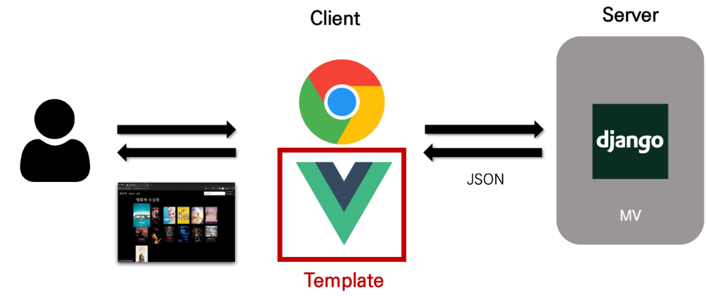

* HTML 전체를 보냈던 전과 달리, Vue가 들어옴으로써 Server에서 전달하는 데이터의 양이 적어짐
* 장고의 MTV 체계에서, T(Template)의 영역이 Vue로 전가됨
* 서버가 아닌 brower가 일을 더 많이 하게 되는 구조


## :two: Why Vue.js?

### 1. 왜 사용할까?

* 현대 웹 페이지는 페이지 규모가 계속해서 커지고 있으며, 그만큼 사용하는 데이터도 늘어나고 사용자와의 상호작용도 많이 이루어짐
* 결국 Vanilla JS만으로는 관리하기가 어려움
  * 예시) 페이스북 친구가 이름을 수정했을 경우, 화면상에서 변경되어야 하는 것들
  * 타임라인의 이름, 페이스북 메시지 상의 이름, 내 주소록에서의 친구 이름 등
    * facebook이 React를 개발한 이유

### 2. Vanilla JS vs Vue.js

* Vanilla JS 의 경우

  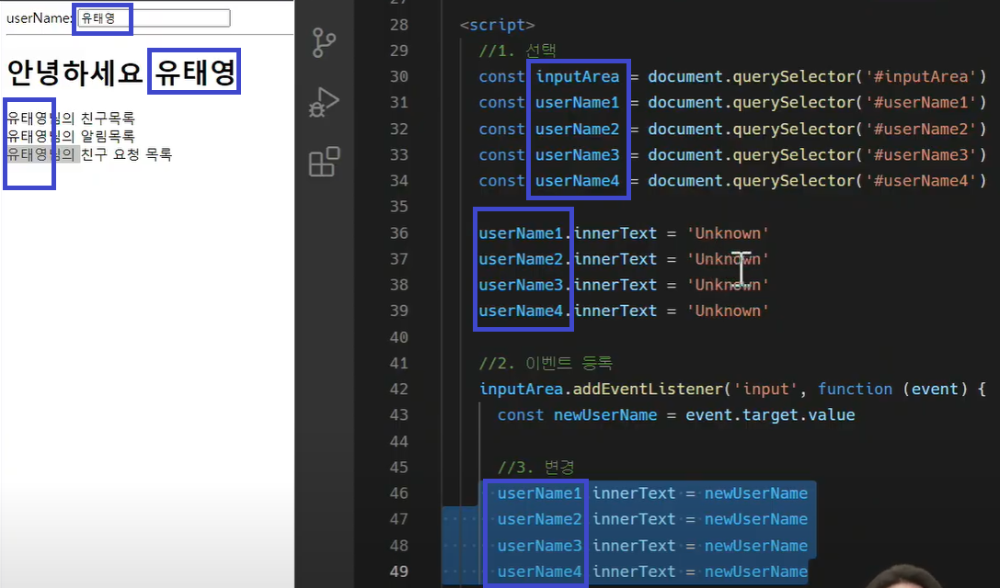

  * 세세한 것 하나하나까지 모두 명령해줘야 함

  * 기능이 많아질수록 코드가 지나치게 길어지고 복잡해짐

  * 불필요한 코드 반복
    * 한 유저가 작성한 게시글이 DOM 상에서 100개가 존재
    * 이 유저가 닉네임을 변경하면, DB의 Update와 별도로 DOM상의 100개의 작성자 이름이 모두 수정되어야 함
    * '모든 요소'를 선택해서 '이벤트'를 등록하고 값을 변경해야 함

* Vue.js의 경우

  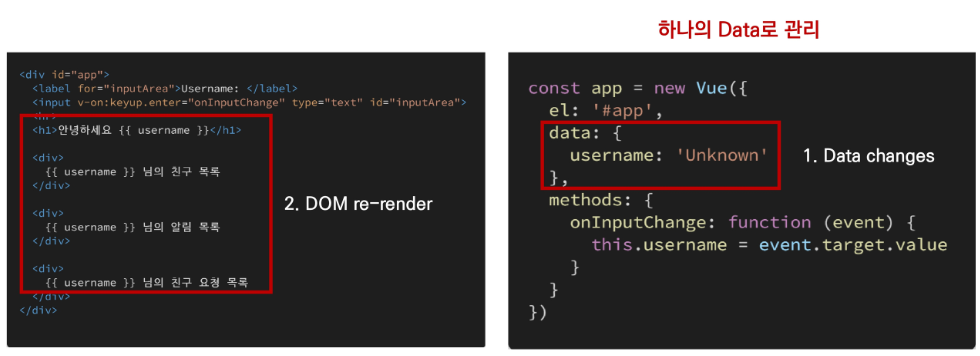

  * DOM가 Data가 연결되어 있고
  * Data를 변경하면 이에 연결된 DOM은 알아서 변경
  * 즉, 우리가 신경 써야 할 것은 오직 Data에 대한 관리(**Developer Exp 향상**)


## :three: Concepts of Vue.js

### 1. MVVM Pattern

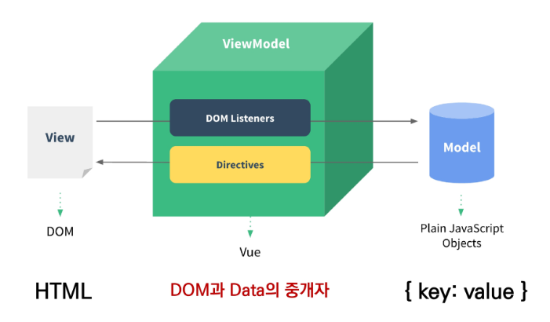

* 애플리케이션 로직을 UI로부터 분리하기 위해 설계된 디자인 패턴
* VM을 써서 View와 DOM을 연결하느 ㄴ것
* 구성 요소
  * Model
  * View
  * View Model

### 2. MVVM

#### 1) "MV"VM

* Model
  * "Vue에서 Model은 JavaScript Object이다"
  * **Object === {key: value}**
  * Model은 Vue Instance 내부에서 data라는 이름으로 존재
  * 이 data가 바뀌면 View(DOM)가 반응
* View
  * "Vue에서 View는 DOM(HTML)이다"
  * Data의 변화에 따라서 바뀌는 대상

#### 2) MV"VM"

* View Model
  * "Vue에서 ViewModel은 모든 Vue Instance이다"
  * View와 Model 사이에서 Data와 DOM에 관련된 모든 일을 처리
  * ViewModel을 활용해 Data를 얼마만큼 잘 처리해서 보여줄 것인지(DOM)를 고민하는 것


## :four: Quick Start of Vue.js

### 0. Vue version 2 vs 3 

* Vue 3
  * Official main version === Vue 3
  * 2022년 2월부터 vue 프레임워크의 기본 버전이 3.x로 전환
  * CDN or npm을 통한 설치시 자동으로 Vue3로 설정
* Vue 2
  * 실무에서는 여전히 Vue2가 많이 사용됨(legacy code)
  * Vue2의 생태계(문서, 튜토리얼, 자료, QnA 등)가 더 성숙함
  * 코어/커뮤니티 라이브러리의 호환 역시 Vue2가 더 안정적
  * 참고자료가 많은 Vue2로 학습 후, Vue3로 이전(migration) 하는게 가장 효과적


### 1. Django & Vue.js 코드 작성 순서

* Django

  * 데이터의 흐름
    * url -> views -> template 

* Vue.js

  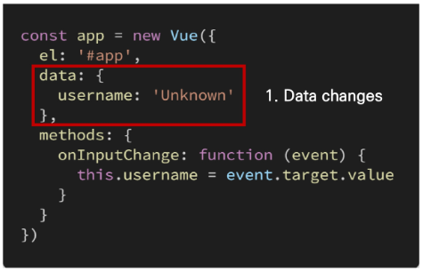

  ​																												* Vue의 기본 형태 *

  * Data가 변화하면 DOM이 변경
    * Data 로직 작성
    * DOM 작성


### 2. 시작하기 [문서 바로가기](https://vuejs.org/guide/quick-start.html)

* 확장 프로그램 설치
  * Vetur(VS code내부)
  * Vue.js devtools chrome extension
    * 확장 프로그램 관리 > vue.js dvetools 세부정보 > url에 대한 액세스 허용 enable하기

* CDN 작성

  * <body> 내부에 작성

  ```html
  <!-- 개발버전, 도움되는 콘솔 경고를 포함. -->
  <script src="https://cdn.jsdelivr.net/npm/vue/dist/vue.js"></script>
  ```

* 시작하기

  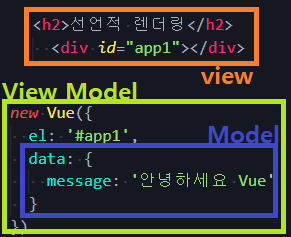

  1. **선언적 렌더링**

     

     * html

       ```html
       <h2>선언적 렌더링</h2>
       <div id="app1">
           {{ message }}
       </div>
       ```

     * script

       * `el`: element의 약자

       ```html
       <script>
           const app1 = new Vue({
             el: '#app1',
             data: {
               message: '안녕하세요 Vue'
             }
           })
       </script>
       ```

  2. **엘리먼트 속성 바인딩**

     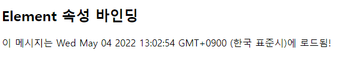

     * html

       ```html
       <h2>Element 속성 바인딩</h2>
       <div id="app2">
           {{ message }}
       </div>
       ```

     * script

       ```html
       <script>
           const app2 = new Vue({
             el: '#app2',
             data: {
               message: `이 메시지는 ${new Date()}에 로드됨!`
             }
           })
       </script>
       ```

  3. **조건문**

     

     * html

       * `v-`: directive

       ```html
       <h2>조건</h2>
       <div id="app3">
           <p v-if="seen">보인다</p>
       </div>
       ```

     * script

       ```html
       <script>
           const app3 = new Vue({
             el: '#app3',
             data: {
               seen: true,
             }
           })
       </script>
       ```

  4. **반복문**

     * html

       ```html
       <h2>반복</h2>
       <div id="app4">
           <ol>
               <li v-for="todo in todos">
                   {{ todo.text }}
               </li>
           </ol>
       </div>
       ```

     * script

       ```html
       <script>
           const app4 = new Vue({
             el: '#app4',
             data: {
               todos: [
                 { text: 'js 복습' },
                 { text: 'vue 배우기' },
                 { text: '멋진거 만들기' }
               ]
             }
           })
       </script>
       ```

  5. **사용자 입력 핸들링**

     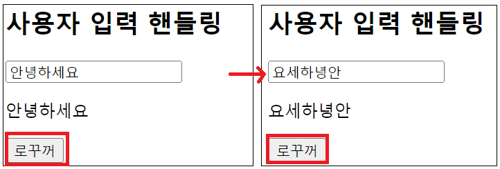

     * html

       ```html
       <h2>사용자 입력 핸들링</h2>
       <h2>사용자 입력 핸들링</h2>
       <div id="app5">
           <input v-model="message" type="text">
           <p>{{ message }}</p>
           <button v-on:click="reversedMessage">로꾸꺼</button>
       </div>
       </div>
       ```

     * script

       ```html
       <script>
           const app5 = new Vue({
             el: '#app5',
             data: {
               message: '안녕하세요'
             },
             methods: {
               reversedMessage: function() {
                 this.message = this.message.split('').reverse().join('')
               }
             }
           })
       </script>
       ```

     * `this` 사용시

       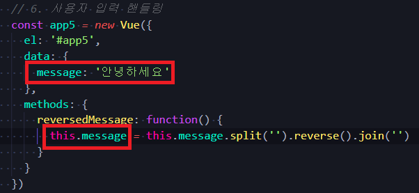

     * `input` tag 넣어주면

       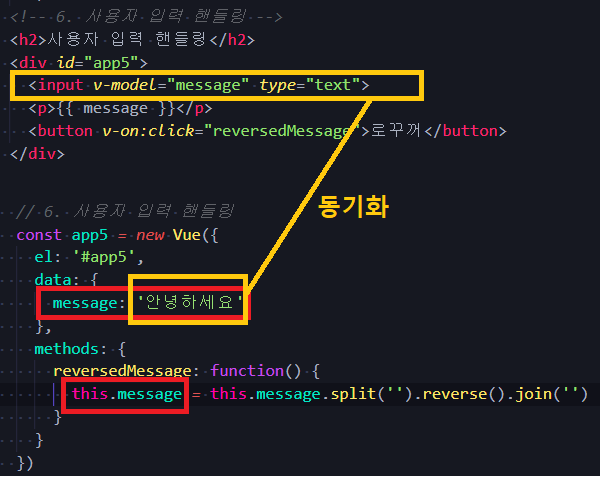

       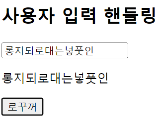

* 주의할 점!

  *  methods 안의 함수들에는 절대 화살표 함수 쓰면 안됨! (아예 반영이 안됨)

    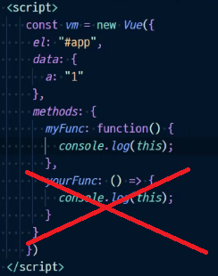

  * 따라서 위와 같이 function 키워드를 쓰거나, 아래와 같이 축약형으로 쓸 것

    ```html
    methods: {
        myFunc () {
            console.log(this)
        }
    }
    ```

    

  

## :five: Basic syntax of Vue.js

### 1. Vue instance 

* 모든 Vue 앱은 Vue 함수로 새 인스턴스를 만드는 것부터 시작

* Vue 인스턴스를 생성할 때는 Options 객체를 전달해야 함 

* 여러 Options들을 사용하여 원하는 동작을 구현

* Vue Instance === Vue Component

  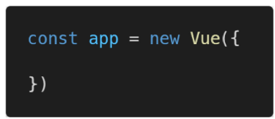


### 2. Options

#### 1) DOM - `el`

* `el`
  * Vue 인스턴스에 연결(마운트)할 기존 DOM 요소가 필요
  * CSS 선택자 문자열 혹은 HTML Element로 작성
  * new를 이용한 인스턴스 생성 때만 작성

#### 2) Data - `data`, `methods`

* **`data`**
  * Vue 인스턴스의 데이터 객체
  * Vue 인스턴스의 상태 데이터를 정의하는 곳
  * Vue template에서 interpolation을 통해 접근 가능
  * v-bind, v-on과 같은 directive에서도 사용 가능
  * Vue 객체 내 다른 함수에서 this 키워드를 통해 접근 가능
* **`methods`**
  * Vue 인스턴스에 추가할 메서드
  * Vue template에서 interpolation을 통해 접근 가능
  * v-on과 같은 directive에서도 사용 가능
  * Vue 객체 내 다른 함수에서 this 키퉈드를 통해 접근 가능
  * 주의
    * 화살표 함수를 메서드를 정의하는데 사용하면 안됨
    * 화살표 함수가 부모 컨텍스트를 바인딩하기 때문에, `this`는 Vue 인스턴스가 아님


### 3. `this` keyword in Vue.js

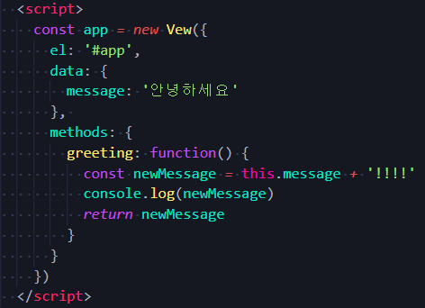

* Vue 함수 객체 내에서 vue 인스턴스를 가리킴
* 화살표 함수를 사용하면 안 되는 경우
  * `data`
  * `method`정의


## :six: Template Syntax

* 렌더링 된 DOM을 기본 Vue 인스턴스의 데이터에 선언적으로 바인딩할 수 있는 HTML 기반 템플릿 구문 사용

### 1. Interpolation(보간법)

* Text
  * `<span>메시지: {{ msg }}</span>`
* Raw HTML
  * `<span v-html="rawHtml"></span>`
* Attributes
  * `<div v-bind:id="dynamicId"></div>`
* JS 표현식
  * `{{ number + 1 }}`
  * `{{ message.split('').reverse().join('') }}`


### 2. Directive

* `v-` 접두사가 있는 특수 속성
* 속성 값은 단일 JS 표현식이 됨(v-for은 예외)
* 표현식의 값이 변경될 때 반응적으로 DOM에 적용하는 역할을 함
* 전달인자(Arguments)
  * 콜론(`:`)을 통해 전달인자를 받을 수도 있음

* 수식어(Modifiers)
  * 점(`.`)으로 표시되는 특수 접미사 
  * directive를 특별한 방법으로 바인딩을 해야 함을 나타냄


#### 1) `v-text`

* 엘리먼트의 textContent를 업데이트
* 내부적으로 interpolation 문법이 v-text로 컴파일 됨
* `{{ }}` 와 동일


#### 2) `v-html` -- 잘 안씀

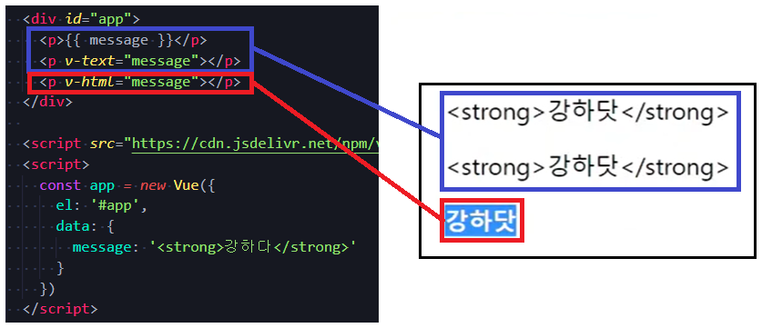

* 엘리먼트의 innerHTML을 업데이트
  * XSS 공격에 취약할 수 있음
* 임의의 사용자로부터 입력 받은 내용은 v-html에 '절대' 사용금지


#### 3) `v-show`

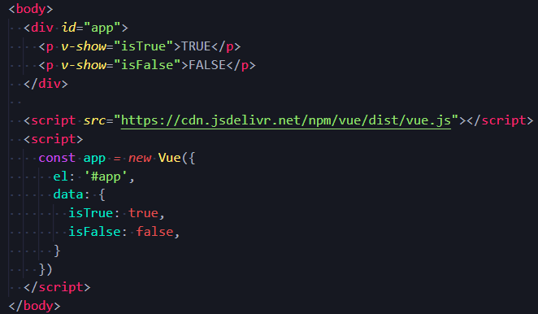

* 조건부 렌더링 중 하나

* 요소는 항상 렌더링 되고 DOM에 남아있음. 즉, 화면에는 안 보여도 문서에 남아있다! (`v-if`와의 차이점)

  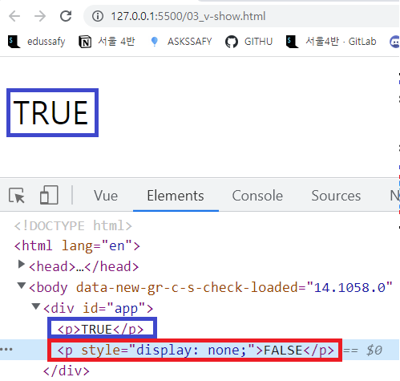

* 단순히 엘리먼트에 display CSS 속성을 토글하는 것(display:none)

* 아주 짧은 순간에는 히든 하기 전 다 렌더링 하기 때문에 첫 순간엔 모든 값이 보일수도


#### 4) `v-if`, `v-else-if`, `v-else`

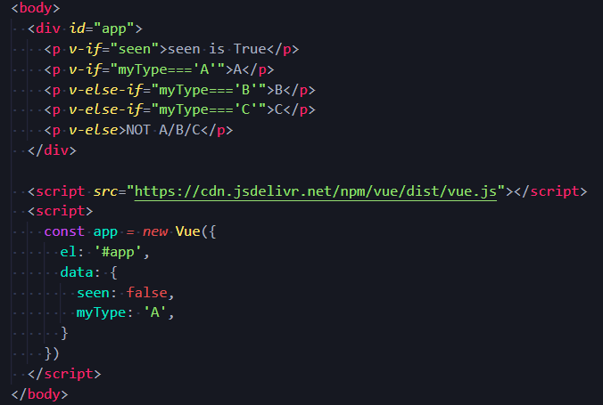

* 조건부 렌더링 중 하나

* 조건에 따라 요소를 렌더링 - 조건에 맞지 않는 요소는 렌더링되지 않음

  * A만 나오고 `B`, `C`, `NOT A/B/C` 전부 안나옴

  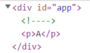

* directive의 표현식이 true일 때만 렌더링

  * `seen: flase` 이므로 주석으로만 나타남

* 엘리먼트 및 포함된 directive는 토글하는 동안 삭제되고 다시 작성됨


#### 5) `v-show`와 `v-if` 

* `v-show`: Expensive initial load, cheap toggle
  * CSS display 속성을 hidden으로 만들어 토글
  * 실제로 렌더링은 되지만 눈에서 보이지 않는 것이기 때문에 딱 한번만 렌더링이 되는 경우라면 v-if에 비해 상대적으로 렌더링 비용이 높음
  * 하지만, 자주 변경되는 요소라면 한 번 렌더링 된 이후부터는 보여주는지에 대한 여부만 판단하면 되기 때문에 토글 비용이 적음
* `v-if`: Cheap initial load, expensive toggle
  * 전달인자가 false인 경우 렌더링 되지 않음
  * 화면에서 보이지 않을 뿐만 아니라 렌더링 자체가 되지 않기 때문에 렌더링 비용이 적음
  * 하지만 자주 변경되는 요소의 경우 다시 렌더링 해야 하므로 비용이 증가할 수 있음


#### 6) `v-for`

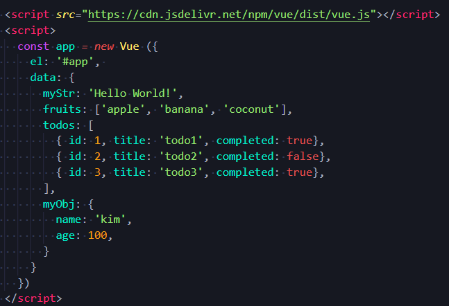

* 원래 위처럼 쓸 수 있었던 걸 아래처럼 표현할 수 있다

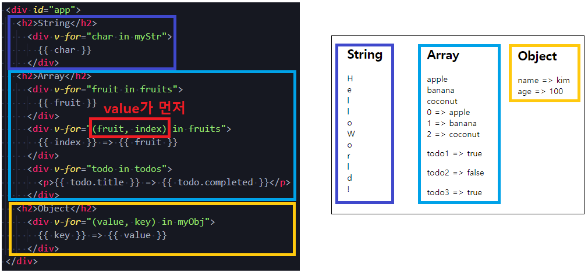

* 원본 데이터를 기반으로 엘리먼트 또는 템플릿 블록을 여러 번 렌더링

* `item in items` 구문 사용

* item 위치의 변수를 각 요소에서 사용할 수 있음
  * 객체의 경우는 key
  
* `v-for` 사용 시 반드시 key 속성을 각 요소에 작성

  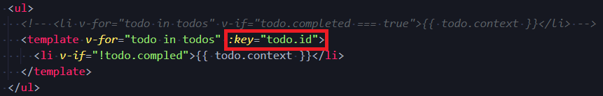

  * key를 사용하지 않는다고 에러가 나지는 않음(but 쓰는 것이 권장사항)

  * key는 중복되면 안 되고, 고유의 값이어야 함

    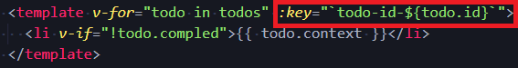

  * 만약 없을 시, index 사용해서 키를 만들어 주면 된다

* `v-if`와 함께 사용하는 경우, `v-for`가 우선순위가 더 높음(2.x 버전)

  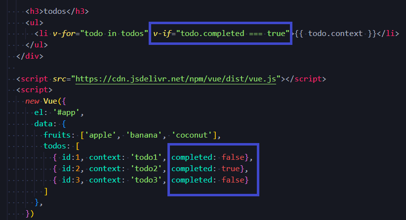

  * 단, 가능하면 v-if와 v-for를 동시에 사용하지 말 것

    * 공식문서에서도 따로 쓰는 것을 권장하고 있다

      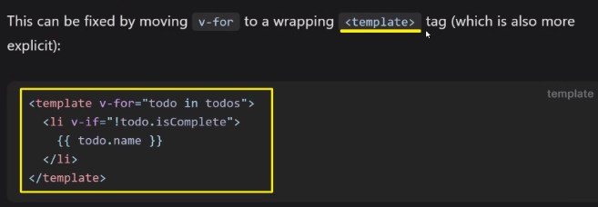

      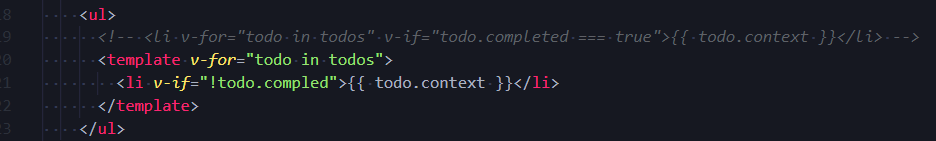


#### 7) `v-on`

* 엘리먼트에 이벤트 리스너를 연결
* 이벤트 유형은 전달인자로 표시함
* 특정 이벤트가 발생했을 때, 주어진 코드가 실행됨
* 약어(Shorthand)
  * @
  * `v-on:click` :arrow_right: `@click` 


#### 8) `v-bind`

* HTML 요소의 속성에 Vue의 상태 데이터를 값으로 할당

* Object 형태로 사용하면 value가 true인 key가 class 바인딩 값으로 할당

* 약어(Shorthand)

  * 콜론 (`:`)
  * `v-bind:href` :arrow_right: `:href` 

* 속성 바인딩

  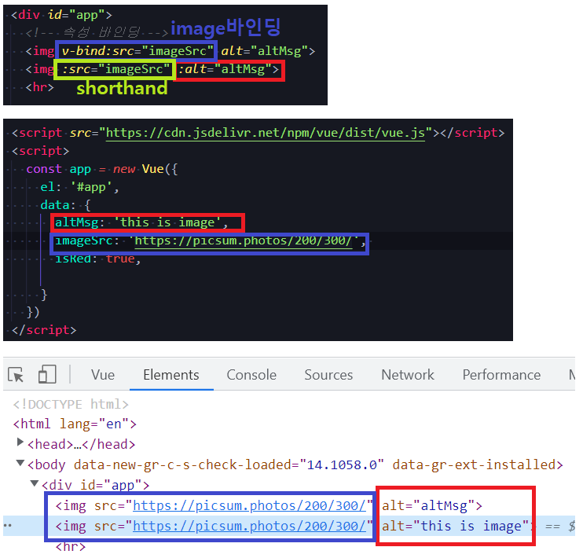

* 클래스 바인딩

  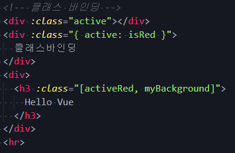

  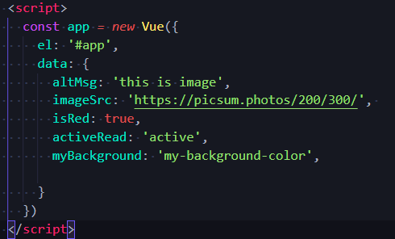

  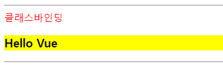

  

  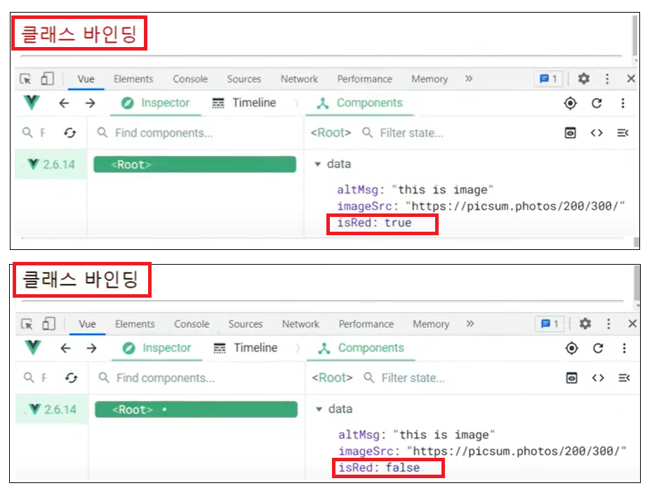

* 스타일 바인딩

  * font-size
    * font-size는 number, px은 string... 더해지는건 JS기 때문에 가능

  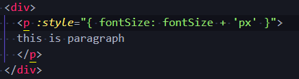

  


#### 9) `v-model`

* HTML form 요소의 값과 data를 양방향 바인딩

  * input tag안에 값을 변경시켜도 모든 값이 바뀌고,
  * data안의 message를 vue에서 변경시켜도, 전부 값이 동일하게 바뀐다

  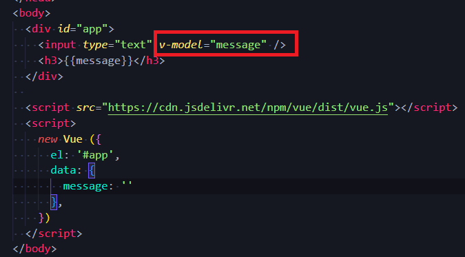

  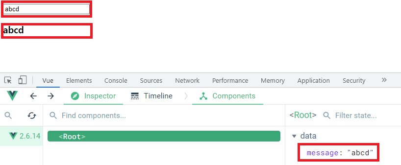

  

* 수식어
  * `.lazy`
    * input 대신 change 이벤트 이후에 동기화
  * `.number`
    * 문자열을 숫자로 변경
  * `.trim`
    * 입력에 대한 trim을 진행


### 3. Options/Data

#### 1) `computed`

* 데이터를 기반으로 하는 계산된 속성
* 함수의 형태로 정의하지만 함수가 아닌 함수의 반환 값이 바인딩 됨
* 종속된 데이터에 따라 저장(캐싱)됨
* 종속된 데이터가 변경될 때만 함수를 실행
* 즉, 어떤 데이터에도 의존하지 않는 computed 속성의 경우 절대로 업데이트되지 않음
* 반드시 반환 값이 있어야 함


#### 2) `methods`

* computed 속성 대신 methods에 함수를 정의할 수도 있음
  * 최종 결과에 대해 두 가지 접근 방식은 서로 동일
* 차이점은 computed 속성은 종속 대상을 따라 저장(캐싱)됨
* 즉, computed는 종속된 대상이 변경되지 않는 한 computed에 작성된 함수를 여러번 호출해도 계산을 다시 하지 않고 계산되어 있던 결과를 반환
* 이에 비해 methods를 호출하면 렌더링을 다시 할 때마다 항상 함수를 실행


#### 3) `watch`

* 데이터를 감시

* 데이터에 **변화가 일어났을 때** 실행되는 함수

* `computed` & `watch`

  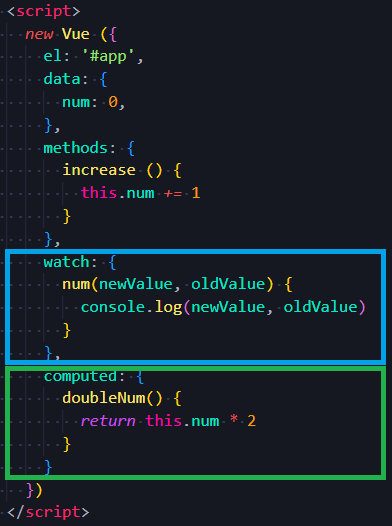

  * `computed`
    * 특정 데이터를 직접적으로 사용/가공하여 다른 값으로 만들 때 사용
    * 속성은 계산해야 하는 목표 데이터를 정의하는 방식으로 소프트웨어공학에서 이야기하는 '선언형 프로그래밍'방식
    * "특정 값이 변동하면 해당 값을 다시 계산해서 보여줌"
    * return 필요함
    * 공식문서 피셜 개발자들은 혼용해서 쓴다고 함 - 웬만한 상황에서는 computed를 쓰는 것이 더 적합
  * `watch`
    * 특정 데이터의 변화 상황에 맞춰 다른 data 등이 바뀌어야 할 때 주로 사용
    * 무거운 작업을 할 때 용이하게 사용
    * 감시할 데이터를 지정하고, 그 데이터가 바뀌면 특정 함수를 실행하는 방식
    * 소프트웨어 공학에서 이야기하는 '명령형 프로그래밍' 방식
    * "특정 값이 변동하면 다른 작업을 한다"
    * 특정 대상이 변경되었을 때 콜백함수를 실행시키기 위한 트리거
    * return 필요없음
  * computed와 watch는 어떤 것이 더 우수한것이 아닌, 사용하는 목적과 상황이 다름


#### 4) 선언형 & 명령형

* 선언형 프로그래밍
  * 계산해야 하는 목표 데이터를 정의(`computed`)
* 명령형 프로그래밍
  * 데이터가 바뀌면 특정 함수를 실행해!(`watch`)


### 4. Options/Assets 

#### 1) `filter`

* 텍스트 형식화를 적용할 수 있는 필터
* interpolation 혹은 v-bind를 이용할 때 사용 가능
* 필터는 자바스크립트 표현식 마지막에 "|" (파이프)와 함께 추가되어야 함
* 이어서 사용(chaining) 가능 


## :seven: Vue Life Cycle Hook

### 1. Lifecycle Hooks 개념

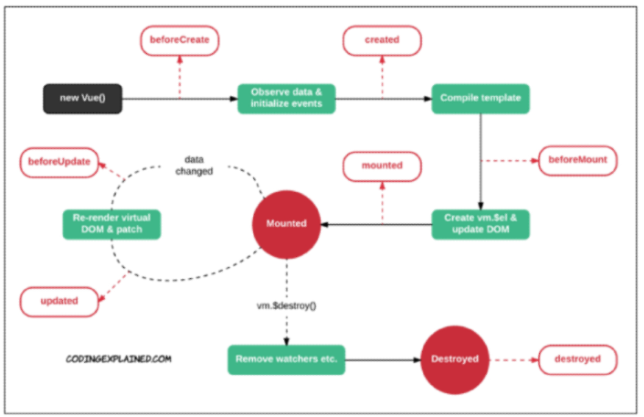

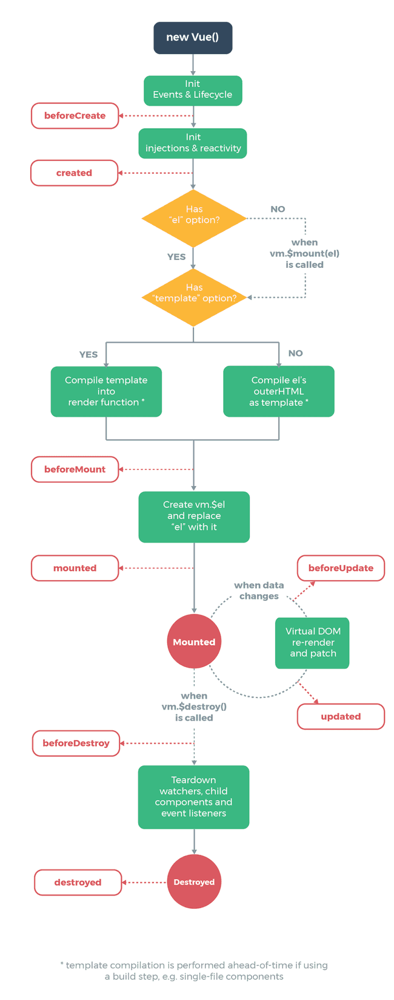

* 각 Vue 인스턴스는 생성될 때 일련의 초기화 단계를 거침
  * 예를 들어, 데이터 관찰 설정이 필요한 경우, 인스턴스를 DOM에 마운트 하는 경우, 데이터가 변경되어 DOM을 업데이트 하는 경우 등
* 그 과정에서 사용자 정의 로직을 실행할 수 있는 Lifecycle Hooks도 호출됨
* 공식문서를 통해 라이플사이클 훅의 상세 동작 참고


### 2. 예시

* `created hook`은 vue 인스턴스가 생성된 후에 호출됨
* `created`를 사용해 애플리케이션의 초기 데이터를 API 요청을 통해 불러올 수 있음