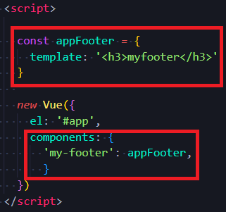

# Vue Basic2

[TOC]


## :one: SFC (Single File Component)

### 1. Component(컴포넌트)

#### 1) 개념


*  기본 HTML 엘리먼트를 확장하여 재사용 가능한 코드를 캡슐화 하는데 도움을 줌
* CS에서는 다시 사용할 수 있는 범용성을 위해 개발된 소프트웨어 구성 요소를 의미
* 즉, 컴포넌트는 유지보수를 쉽게 만들어 줄 뿐만 아니라, 재사용성의 측면에서도 매우 강력한 기능을 제공
* 다시 쓸 수 있는 부품
* Vue 컴포넌트 === Vue 인스턴스

#### 2) 예시

* 전역 컴포넌트

  

  

  

  결국 동일함

  

* 지역 컴포넌트

  1. 첫번째 방법

     

  2. 두번째 방법

     

     

### 2. SFC(Single File Component)

* Vue의 컴포넌트 기반 개발을 핵심 특징
* 하나의 컴포넌트는 `.vue` 확장자를 가진 하나의 파일 안에서 작성되는 코드의 결과물
* 화면의 특정 영역에 대한 HTML, CSS, JavaScript 코드를 하나의 파일(.vue)에서 관리
* Vue 컴포넌트 === Vue 인스턴스 === `.vue` 파일


### 3. Component 예시 

#### 1) 단일 파일 관리

* 단일 파일에서의 개발
  * 처음 개발을 시작할 때는 크게 신경 쓸 것이 없기 때문에 쉽게 개발 가능
  * 하지만 코드의 양이 많아지면 변수 관리가 힘들어지고 유지보수에 많은 비용 발생

#### 2) 한 화면을 구성하는 여러 컴포넌트

* 각 기능 별로 파일을 나눠서 개발
  * 처음 개발을 준비하는 단계에서 시간 소요가 증가
  * 하지만 이후 변수 관리가 용이하며 기능 별로 유지 & 보수 비용 감소


### 4. Vue Component 구조 예시


* 한 화면 안에서도 기능 별로 각기 다른 컴포넌트가 존재
  * 하나의 컴포넌트는 여러 개의 하위 컴포넌트를 가질 수 있음
  * Vue 컴포넌트 기반의 개발 환경 제공
* Vue 컴포넌트는 `const app = new Vue({...})`의 app을 의미하며, 이는 Vue 인스턴스
  * 여기서 오해하면 안 되는 것은, 컴포넌트 기반의 개발이 반드시 팡리 단위로 구분되어야 하는 것은 아님
  * 단일 `.html`파일 안에서도 여러 개의 컴포넌트를 만들어 개발 가능
* 정리
  * Vue 컴포넌트는 Vue 인스턴스(`new Vue({})`) 이기도 함
  * Vue 인스턴스는 .vue 파일 안에 작성된 코드의 집합
  * HTML, CSS, 그리고 JavaScript를 .vue라는 확장자를 가진 파일 안에서 관리하며 개발


## :two: Vue CLI

### 1. Vue CLI

* Vue.js 개발을 위한 표준 도구
* 프로젝트의 구성을 도와주는 역할을 하며, Vue 개발 생태계에서 표준 tool 기준을 목표로 함
* 확장 플러극인, GUI, Babel 등 다양한 tool 제공


### 2. Node.js

* 자바스크립트를 브라우저가 아닌 환경에서도 구동할 수 있게 하는 자바스크립트 런타임 환경
  * 브라우저 밖을 벗어날 수 없던 자바스크립트 언어의 태생적 한계를 해결
* Chrome V8 엔진을 제공하여 여러 OS 환경에서 실행할 수 있는 환경을 제공
* 즉, 단순히 브라우저만 조작할 수 있던 자바스크립트를 SSR 아키텍처에서도 사용할 수 있도록 함
* 2009년 Ryan Dahl 에 의해 발표


### 3. NPM(Node Package Manage)

* 자바스크립트 언어를 위한 패키지 관리자
  * Python 에 pip가 있다면, Node.js에서는 npm
  * pip 와 마찬가지로 다양한 의존성 패키지를 관리
* Node.js의 기본 패키지 관리자
* Node.js 설치 시 함께 설치됨


### 4. Vue CLI Quick Start

* 설치(git bash)

  ```bash
  # 설치
  $ npm install -g @vue/cli
  # 버전 확인
  $ vue -- version
  ```

* 프로젝트 기본구조(vscode terminal)

  ```bash
  # 프로젝트 생성
  $ vue create my-first-app
  # Vue 버전 선택(Vue2)
  ? Please pick a preset: (Use arrow keys)
  > Default ([Vue 3] babel, eslint)
  > Default ([Vue 2] babel, eslint)  # ---> 얘 선택
  Manually select features
  # 프로젝트 생성 성공
  Successfully created project my-first-app.
  Get started with the following commands:
  
  $ cd my-first-app
  $ npm run serve
  ```


* 참고

  

  Local 주소: 내 컴퓨터에서만 사용 가능한 주소

  Network 주소: 같은 LAN, wifi 사용하는 컴퓨터에서 사용가능한 주소 

### 5. CLI와 컴포넌트 비교


## :three: Babel & Webpack

### 1. Vue 프로젝트 구조

### 


* 하위 컴포넌트 이름 주의
  * 파스칼 케이스 사용
  * 두 단어 이상! 
    * html 기본 태그와 헷갈리는 것을 방지하기 위해서 
  * ex) AppHead.vue


### 2. Babel

#### 1) 개념

* "JavaScript compiler"
* 자바스크립트의 ECMAScript 2015+ 코드를 이전 버전으로 번역/변환 해 주는 도구
* 과거 자바스크립트의 파편화와 표준화의 영향으로 코드의 스펙트럼이 매우 다양
  * 이 때문에 최신 문법을 사용해도 이전 브라우저 혹은 환경에서 동작하지 않는 상황이 발생
* 원시 코드(최신 버전)를 목적 코드(구 버전)로 옮기는 번역기가 등장하면서 개발자는 더 이상 내 코드가 특정 브라우저에서 동작하지 않는 상황에 대해 크게 고민하지 않을 수 있게 됨

#### 2) Babel 동작 예시


### 3. Webpack


* "static module bundler"
* 모듈 간의 의존성 문제를 해결하기 위한 도구
* 프로젝트에 필요한 모든 모듈을 매핑하고 내부적으로 종속성 그래프를 빌드함


### 4. Static Module Bundler

* 모듈은 단지 파일 하나를 의미(ex. js파일 하나 === 모듈 하나)
* 배경
  * 브라우저만 조작할 수 있었던 시기의 JS는 모듈 관련 문법 없이 사용됨
  * 하지만 JS와 애플리케이션이 복잡해지고 크기가 커지자 전역 scope를 공유하는 형태의 기존 개발 방식의 한계점이 드러남
  * 그래서 라이브러리를 만들어 필요한 모듈을 언제든지 불러오거나 코드를 모듈 단위로 작성하는 등의 다양한 시도가 이루어짐
* 모듈 의존성 문제
  * Module 의존성 문제를 해결해 주는 작업을 Bundling이라고 함
  * 이러한 이를 해주는 도구가 Bundler이고, Webpack은 다양한 Bundler 중 하나
  * 여러 모듈을 하나로 묶어주고, 묶인 파일은 하나(혹은 여러 개)로 합쳐짐
  * Bundling된 결과물은 더 이상 순서에 영향을 받지 않고 동작하게 됨
  * snowpack, parcel, rollup.js등의 webpack 이외에도 다양한 모듈 번들러 존재
  * Vue CLI는 이러한 Babel, Webpack 에 대한 초기 설정이 자동으로 되어있음
* 여러 모듈 시스템
  * :star: **현재 표준: ESM(ECMA Script Module)** :star:
  * AMD(Asynchronous Module Definition)
  * Common JS
  * UMD(Univeral Module Definition)


### 5. Module 의존성 문제


* 모듈의 수가 많아지고 라이브러리 혹은 모듈 간의 의존성(연결성)이 깊어지면서 특정한 곳에서 발생한 문제가 어떤 모듈 간의 문제인지 파악하기 어려움
* 즉, Webpack은 이 모듈 간의 의존성 문제를 해결하기 위해 등장


### 6. 정리

* Node.js
  * JavaScript Runtime Environment
  * JavaScript를 브라우저 밖에서 실행할 수 있는 새로운 환경
* Babel
  * Compiler
  * ES2015+ JavaScript 코드를 구 버전의 JavaScript로 바꿔주는 도구
* Webpack
  * Module Bundler
  * 모듈 간의 의존성 문제를 해결하기 위한 도구


## :four: Pass props

### 1. 컴포넌트 작성

* Vue app 은 자연스럽게 중첩된 컴포넌트 트리로 구성

* 컴포넌트간 부모-자식 관계가 구성되며 이들 사이에 필연적으로 의사 소통이 필요함

* 부모는 자식에게 데이터를 전달(Pass props)하며, 자식은 자신에게 일어난 일을 부모에게 알림(Emit event)

  * 부모와 자식이 명확하게 정의된 인터페이스를 통해 격리된 상태를 유지할 수 있음

    

* **"props는 아래로, events는 위로"**

* 부모는 props를 통해 자식에게 '데이터'를 전달하고, 자식은 events를 통해 부모에게 '메시지'를 보냄


### 2. 컴포넌트 구조


#### 1) 템플릿(HTML)

* HTML의 body 부분
* 각 컴포넌트를 작성

#### 2) 스크립트(JavaScript)

* JavaScript가 작성되는 곳
* 컴포넌트 정보, 데이터, 메서드 등 vue 인스턴스를 구정하는 대부분이 작성됨

#### 3) 스타일(CSS)

* CSS가 작성되며, 컴포넌트의 스타일을 담당

#### 4) 작성

```vue
vue
// 라는 단축키 있음
// vetur라는 extension 깔았기 때문
```


### 3. 컴포넌트 등록 3단계(부모-자식 관계 설정)


* 부모 자식 관계가 설정된 것을 뷰 화면에서 확인할 수 있다
* name: 'TheAbout'은 안의 구분을 위한 것으로, 어떤 이름으로 설정해도 상관없다
* 불러오기, 등록하기, 보여주기 안의 TheAbout의 이름은 어떤 것으로 써도 괜찮지만, 편의상 자식 vue 이름으로 통일해준다

#### 1) 불러오기(import)

#### 2) 등록하기(register)

* 컴포넌트의 'data'는 반드시 함수여야 함

  * 이유.. :question: 각각의 컴포넌트가 같은 data를 참조함.. 각각 격리된 scope를 가져야 함 :question:
  * 기본적으로 각 인스턴스는 모두 같은 data 객체를 공유하므로, 새로운 data 객체를 반환(return)해야 함
  * 따라서 전과 같이 data 자체가 객체일 수 없음

* 예시

  * 잘못된 예시

    

  * 잘된 예시

    

    

#### 3) 보여주기(print)

* 케밥 케이스 VS 카멜 케이스: 둘 다 사용 가능. 대신 하나 선택했으면 선택한 것 하나만 쓰기

  * 케밥 케이스가 범용성이 있음

  ```VUE
  <!-- camel case -->
  <TheAbout></TheAbout>
  <!-- kebab case - 싸피에서는 이거 쓸 것 -->
  <the-about></the-about>  
  ```

* template 내에는 반드시 하나의 Element만 있어야 한다

  ```html
  <!-- 잘못된 예시 - h1, p 두개의 element가 존재하기 때문 -- ERROR! -->
  <template>
  	<h1></h1>
  	<p></p>
  </template>
  ```

  ```html
  <!-- 2개 이상의 element를 사용하고 싶을 때는 <div>로 하나로 묶어 사용! -->
  <!-- 그래서 그냥 일단 div로 묶고 시작하는게 편함 -->
  <template>
      <div>
          <h1></h1>
  		<p></p>
      </div>
  </template>
  ```

  

### 4. Props

* props는 부모(상위) 컴포넌트의 정보를 전달하기 위한 사용자 지정 특성
* 자식(하위) 컴포넌트는 props 옵션을 사용하여 수신하는 props를 명시적으로 선언해야 함
* 즉, 데이터는 props 옵션을 사용하여 자식 컴포넌트로 전달됨
* 주의
  * 모든 컴포넌트 인스턴스에는 자체 격리된 범위가 있음
  * 즉, 자식 컴포넌트의 템플릿에서 상위 데이터를 직접 참조할 수 없음


### 5. Static Props 작성

* `App.vue`(부모 컴포넌트)

  

  * 자식 컴포넌트(About.vue)에 보낼 prop 데이터 선언

  * 작성법

    * prop-data-name = "value"
    * 상기 예제에서는 `my-message`

  * 출력

    

* `About.vue`(자식 컴포넌트)

  

  * 수신할 prop 데이터를 명시적으로 선언 후 사용 ( 위의 캡쳐본에서 string -> String으로 수정)

    * kebab-case로 들어갔을 때 my-message를 변수명으로 쓸 수 없기 때문에, 자식 컴포넌트에서 props를 받을 때는 무조건 camelCase를 써준다

  * 출력

    

    * 이렇게 되면, 위에서는 `$attrs`로 받던 데이터를 prop 데이터로 받아올 수 있다 

    * 이 경우, data에 등록할 필요 없이 props상태 그대로 사용가능하다

      * `myMessage`는 부모로부터 받아왔지만, About.vue의 스코프 내로 들어온 것이므로

      

      

### 6. Dynamic Props 작성

* v-bind directive를 사용해 부모의 데이터를 props를 동적으로 바인딩

  

  

* 부모에서 데이터가 업데이트 될 때 마다 자식 데이터로도 전달 됨

* 마찬가지로 수신할 prop 데이터를 명시적으로 선언 후 사용

* 예시

  * 웹엑스

    
  
  * ppt내용
  
    
  


### 7. Props 시 자주하는 실수

* Static 구문을 사용하여 숫자를 전달하려고 시도하는 것

* 실제 JavaScript 숫자를 전달하려면 값이 JavaScript 표현식으로 평가되도록 v-bind를 사용해야 함

  


### 8. 단방향 데이터 흐름

* 모든 props는 하위 속성과 상위 속성 사이의 단방향 바인딩을 형성
* 부모의 속성이 변경되면 자식 속성에게 전달되지만, 반대 방향으로는 안 됨
  * 자식 요소가 의도치 않게 부모 요소의 상태를 변경하여 앱의 데이터 흐름을 이해하기 어렵게 만드는 일을 방지
* 부모 컴포넌트가 업데이트될 때마다 자식 요소의 모든 prop들이 최신 값으로 업데이트 됨


## :five: Emit event

### 1. Emit event

* Listening to Child Components Events
* `$emit(eventName)`
  * 현재 인스턴스에서 이벤트를 트리거
    * props와 달리, 데이터를 보낼 때 언제 보낼지 **트리거**가 필요함 
    * 해당 트리거를 상위 컴포넌트가 받아주면, 데이터가 전송됨
  * 추가 인자는 리스너의 콜백 함수로 전달
* 부모 컴포넌트는 자식 컴포넌트가 사용되는 템플릿에서 v-on을 사용하여 자식 컴포넌트가 보낸 이벤트를 청취(v-on을 이용한 사용사 지정 이벤트)


### 2. Emit event 작성

* 자식 컴포넌트에서 어떤 이벤트 발생시키기

  * 현재 부모 컴포넌트에서 props이 내려오고 있지만, 자식 컴포넌트에서 일어나는 이벤트가 부모 컴포넌트로 전달되지는 않고 있는 상황

  

  

  

*  현재 인스턴스에서 `$emit` 인스턴스 메서드를 사용해 child-input-change 이벤트를 트리거

* 부모 컴포넌트(App.vue)는 자식 컴포넌트(About.vue)가 사용되는 템플릿에서 v-on directive를 사용하여 자식 컴포넌트가 보낸 이벤트(child-input-change)를 청취

  

  

  * CLI 말고 일반 html

    

* 인자 전달하기(2개 이상씩 전달도 가능하지만, 권장하지는 않음)

  


### 3. event 이름 컨벤션


* 컴포넌트 및 props와는 달리, 이벤트는 자동 대소문자 변환을 제공하지 않음

* HTML의 대소문자 구분을 위해 DOM 템플릿의 `v-on` 이벤트 리스너는 항상 자동으로 소문자 변환되기 때문에 `v-on:myEvent`는 자동으로 `v-on:myevent`로 변환

* 이러한 이유로, 이벤트 이름에는 항상 kebab-case를 사용하는 것을 권장

  

### 4. props & emit 둘 다 연습


* emit

1. appContent 변수 내 버튼에다가 v-on directive 달아줘야함
2. emit해준다
3. div 내 content 반영하는곳에다가 @emit받을 준비 (@getNum="getNum")
4. 상위루트에 methods 작성해주고, data도 작성해주기

* props

1.  props로 받을 속성 .. div내 header 반영하는 곳에다가 v-bind해주기

   


## :six: Vue Router

### 1. Vue Router

* "Vue.js 공식 라우터"

  * router
    * 위치에 대한 최적의 경로를 지정하며, 이 경로를 따라 데이터를 다음 장치로 전향시키는 장치[위키]

* 라우트(route)에 컴포넌트를 매핑한 후, 어떤 주소에서 렌더링할 지 알려줌

  * url을 통한 하이퍼링크 이동이 아니지만, 그러한 효과를 주는 것

* SPA상에서 라우팅을 쉽게 개발할 수 있는 기능을 제공

  

### 2. Vue Router **시작하기**

* 기본설정

  ```bash
  # 프로젝트 생성 및 이동
  $ vue create my-router-app
  $ cd my-router-app
  
  # Vue Router plugin 설치(Vue CLI 환경)
  $ vue add router
  
  # commit 여부(YES)
  WARN There are uncommitted changes in the current repository, it's recommended to commit or stash them first.
  ? Still proceed? Yes
  # History mode 사용 여부 (Yes)
  ? Use history mode for router? (Requires proper server setup for index fallback in production) (Y/n) Yes
  ```


### 3. Vue Router로 인한 변화

* App.vue 코드

  

* router/index.js 생성

  

* views 디렉토리 생성

  


### 4. Vue Router 

#### 1) `index.js`

* route에 관련된 정보 및 설정이 작성되는 곳

#### 2) `<router-link>`

* 사용자 네비게이션을 가능하게 하는 컴포넌트
* router-link가 a 태그를 대신
* 목표 경로는 `to` prop으로 지정됨
* HTML5 히스토리모드에서 router-link는 클릭이벤트를 차단해 브라우저가 페이지를 다시 로드하지 않도록 함
* a 태그지만 우리가 알고 있는 GET 요청을 보내는 a 태그와 조금 다르게, 기본 GET 요청을 보내는 이벤트를 제거한 형태로 구성됨

#### 3) `<router-view>`

* 주어진 라우트에 대해 일치하는 컴포넌트를 렌더링하는 컴포넌트
* router-view 자리 = 컴포넌트로 대체되는 자리
* 실제 component가 DOM에 부착되어 보이는 자리를 의미
* router-link 를 클릭하면, 해당 경로와 연결되어 있는 `index.js`에 정의한 컴포넌트가 위치


### 5. History mode

* HTML History API를 사용해서 router를 구현한 것
  * [참고] History API - 브라우저 전반에 대한 이야기이므로 따로 찾아볼 것
  * DOM의 Window 객체는 history 객체를 통해 브라우저의 세션 기록에 접근할 수 있는 방법을 제공
  * history 객체는 사용자를 자신의 방문 기록 앞과 뒤로 보내거나, 기록의 특정 지점으로 이동하느 ㄴ등 유용한 메서드와 속성을 가짐
* 브라우저의 히스토리는 남기지만 실제 페이지는 이동하지 않는 기능을 지원
* 즉, 페이지를 다시 로드하지 않고 URL을 탐색할 수 있음
  * SPA의 단점 중 하나인 URL이 변경되지 않는다를 해결


### 6. LottoView.vue

#### 1) Named Routes

* 이름을 가지는 랑루트
* 명명된 경로로 이동하려면 객체를 vue-router 컴포넌트 요소의 prop에 전달


* 라우터: 실제 화면 전환이 일어난 것 아님

  * `index.js`

    

  * `App.vue`

    

    * router-link가 a 태그를 대신
    * router-view 자리 = 컴포넌트로 대체되는 자리
    * 바인드(`:`)가 있어야지만 `{ name: 'home' }` 과같은 부분이 객체로 동작한다

  * `LottoView.vue`

  

#### 2) 프로그래밍 방식 네비게이션

* <router-like>를 사용하여 선언적 탐색을 위한 a 태그를 만드는 것 외에도, router의 인스턴스 메서드를 사용하여 프로그래밍 방식으로 같은 작업을 수행할 수 있음

  * 선언적 방식

    ```html
    <router-link to="...">
    ```

  * 프로그래밍 방식

    ```bash
    $ router.push(...)
    ```

    

* Vue  인스턴스 내부에서 라우터 인스턴스에 $router로 접근할 수 있음

* 따라서 다른 URL로 이동하려면, this.$router.push를 호출할 수 있음

  * 이 메서드는 새로운 항목을 히스토리 스택에 넣기 때문에 사용자가 브라우저의 뒤로 가기 버튼을 클릭하면 이전 URL로 이동하게 됨

* <router-link>를 클릭할 때 내부적으로 호출되는 메서드이므로 <router-link :to="..."> 를 클릭하면, `router.push(...)` 를 호출하는 것과 같음

* 작성할 수 있는 인자 예시

  

  

* About 에서 Home으로 이동하는 로직 작성

  

  

  

#### 3) 동적 인자 전달(Dynamic Route Matching)

* 동적 인자 전달

* 주어진 패턴을 가진 라우트를 동일한 컴포넌트에 매핑해야 하는 경우

* 예를 들어 모든 User에 대해 동일한 레이아웃을 가지지만, 다른 User ID로 렌더링 되어야하는 User 컴포넌트 예시

  

  

* 동적 인자는 `:`(colon)으로 시작

* 컴포넌트에서 `this.$route.params`로 사용가능

  * 1 이라는 숫자가, this.$route.params 안에 있음. 해당 route.params에서 원하는 Id도 추출할 수 있음

  

  

  * 여러개도 가능

    

    

    

  | pattern                              | matched path            | $route.params                       |
  | ------------------------------------ | ----------------------- | ----------------------------------- |
  | `/user/:userName`                    | `/user/john`            | `{ username: 'john' }`              |
  | `/user/:userName/article/:articleId` | `/user/john/article/12` | `{username: 'john', articleId: 12}` |

* `LottoView.vue`예시

  

  

  

### 7. components 와 views

* 기본적으로 작성된 구조에서 components 폴더와 views 폴더 내부에 각기 다른 컴포넌트가 존재하게 됨. 
* 컴포넌트를 작성해 갈 때 정해진 구조가 있는 것은 아니며, 주로 아래와 같이 구조화하여 활용함
* App.vue
  * 최상위 컴포넌트
* views/
  * router(index.js)에 매핑되는 컴포넌트를 모아두는 폴더
  * ex) App 컴포넌트 내부에 AboutView & HomeView 컴포넌트 등록
* components/
  * router에 매핑된 컴포넌트 내부에 작성하는 컴포넌트를 모아두는 폴더
  * ex) Home 컴포넌트 내부에 HelloWorld 컴포넌트 등록


### 8. Vue Router가 필요한 이유

* SPA 등장 이전
  * 서버가 모든 라우팅을 통제
  * 요청 경로에 맞는 HTML을 제공
* SPA 등장 이후
  * 서버는 `index.html` 하나만 제공
  * 이후 모든 처리는 HTML 위에서 JS 코드를 활용해 진행
  * 즉, 요청에 대한 처리를 더 이상 서버가 하지 않음(할 필요가 없어짐)
  * 더이상 추가 서버를 요청하지 않는다
* 라우팅 처리 차리
  * SSR
    * 라우팅에 대한 결정권을 서버가 가짐
  * CSR
    * 클라이언트는 더 이상 서버로 요청을 보내지 않고 응답받은 HTML 문서 안에서 주소가 변경되는 특정 주소에 맞는 컴포넌트를 렌더링
    * 라우팅에 대한 결정권을 클라이언트가 가짐
  * 결국, Vue Router는 라우팅의 결정권을 가진 Vue.js에서 라우팅을 편리하게 할 수 있는 Tool을 제공해주는 라이브러리


## :seven: Router CDN으로 설정

#### 1) 기본 구조


#### 2) Router 설정


#### 3) 주소 내에 `#` 지우기

* 주소: `http://localhost:5050/21_router.html#/hello`

  

  * mode: 'history' 추가해주기

    


## :eight: CLI 실습(web-ex)


