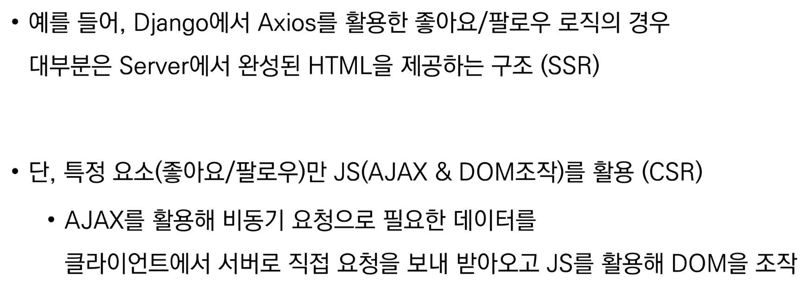
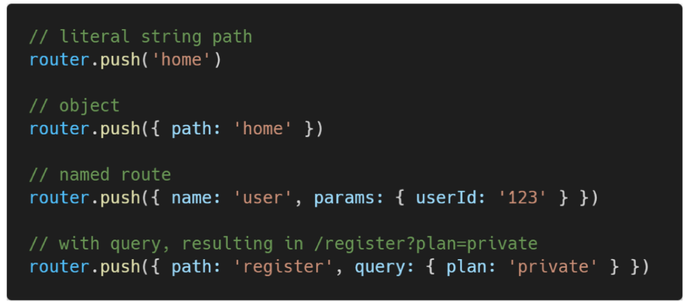
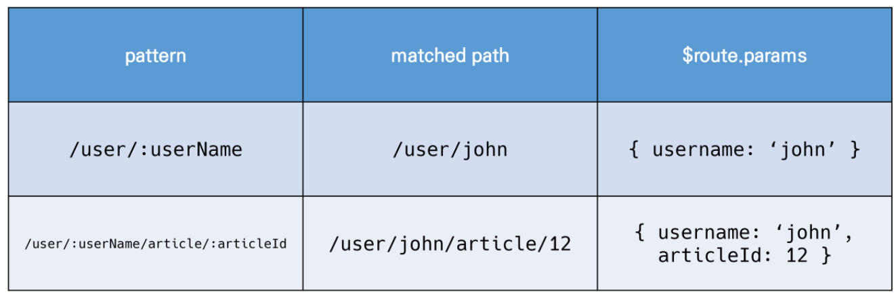

# Vue TEST


## 1. directives

* v-text

* v-html

* v-show and v-if

  * v-show
    * expensive initial load, cheap toggle
    * 자주 변경되는 요소라면, 한 번 렌더링 된 이후부터는 보여주는지에 대한 여부만 판단하면 되기 때문에 토글 비용이 적다
  * v-if
    * cheap initial load, expensive toggle
    * 자주 변경되는 요소의 경우 계속 다시 렌더링을 해야하므로 토글비용이 높다

* v-for

  * item in items 구문 상용

  * v-for 사용 시 반드시 key 속성을 각 요소에 작성한다

    ```html
    <div v-for="todo in todos" :key="todo.id">
        {{ todo.title }} : {{ todo.completed }}
    </div>
    ```

    ```html
    <div v-for"(fruit, index) in fruits" :key="`fruit-${index}`">
        {{ fruit }}
    </div>
    ```

  * v-if와 함께 사용시, v-for가 우선순위가 높다

* v-on

  * 엘리먼트에 이벤트 리스너 @

* v-bind

  * HTML 요소의 속성에 Vue의 상태 데이터를 값으로 할당

  * Object 형태로 사용하면 value가 true인 key인 class 바인딩 값으로 할당

    ```html
    
    <div :class="{active: isRed}"></div>
    <div :class="{active: isRed}"></div>
    <div :class="[activeRed, myBackground]"></div>
    <div :style="{ fontSize: fontSize + 'px' }"></div>
    ```

* v-model

  * HTML form 요소의 값과 data를 양방향 바인딩
  * .lazy
    * input 대신 change 이벤트 이후에 동기화
  * .number
  * .trim

* computed
  * 데이터를 기반으로 하는 계산된 속성
  * 함수의 형태로 정의하지만, 함수의 반환 값이 바인딩 됨
  * 종속된 데이터에 따라 저장
  * 종속된 데이터가 변경될 때만 함수를 실행
* computed vs methods
  * computed 속성은 종속 대상을 따라 저장(캐싱)됨
  * methods는 호출하면 렌더링을 다시 할 때맘다 항상 함수를 실행
* computed vs watch
  * watch
    * 데이터에 변화가 일어났을 때 실행되는 함수
    * 특정 데이터의 변화 상황에 맞춰 다른 data등이 바뀌어야 할 때 
    * 명령형 프로그래밍
      * 데이터가 바뀌면 특정 함수를 실행해(watch)
    * 특정 값이 변동하면 다른 작업을 한다
    * 콜백 함수 실행을 위한 트리거
  * computed
    * 특정 데이터를 직접적으로 사용/가공하여 다른 값으로 만듦
    * 선언형 프로그래밍
      * 계산해야 하는 목표 데이터를 정의
    * 특정 값이 변동하면 해당 값을 다시 계산해서 보여준다
* filter
  * 파이프 `|`
  * chaining 가능


## 2. Lifecycle Hooks

* created
  * vue 인스턴스가 생성된 후에 호출됨
* mount
* update
* destroy


## 3. Vue.js

* SPA: Single Page Applilcation
  * 서버로부터 최초에만 페이지를 다운로드하고, 이후에는 동적으로 DOM 구성
* SSR _Server Side Rendering
  * 장점
    * 초기 구동 속도가 빠름
    * SEO에 적합(DOM에 모든 데이터가 작성되어 있으므로)
  * 단점
    * 반복되는 전체 새로고침 - UX 떨어짐
    * 트래픽이 많아 서버 부담 가중
* CSR - Client Side Rendering
  * 클라이언트에서 화면 구성
  * 최초 요청 시 HTML, CSS, JS 등 데이터를 제외한 각종 리소스를 응답받고, 이후 클라이언트에서는 필요한 데이터만 요청해 JS로 DOM을 렌더링하는 방식
  * 장점
    * 서버-클라이언트 간 트래픽 감소
    * UX 향상
  * 단점
    * 전체 페이지 최종 렌더링 시점이 느림
    * SEO(검색 엔진 최적화)에 어려움이 있음(최초 문서에 데이터 마크업이 없기 때문)



* Evan You

* SEO

* MVVM

  * Model

    * Object
    * data

  * View

    * DOM(HTML)

  * ViewModel

    * Vue instance === Vue component

  * el

    ```javascript
    const app = new Vue({
    	el: '#app'
    })
    ```

  * methods

    * 화살표 함수를 메서드를 정의하는데 사용하면 안됨
    * 화살표 함수가 부모 컨텍스트를 바인딩하기 때문에


* 화살표 함수
  * 메서드 정의하는데 사용하면 안됨
  * data에도 사용하면 안됨


* SFC(Single File Component)
* Babel
  * JavaScript compiler
  * ECMAScript2015 코드를 이전 버전으로 번역/변환해 주는 도구
* Webpack
  * static module bundler
  * 모듈 간의 의존성 문제를 해결하기 위한 도구
  * Bundling 된 결과물ㅇ른 더이상 순서에 영향을 받지 않고 동작하기 됨
  * 


## 4. Pass Props & Emit Events

1. 자식 컴포넌트에 보낼 prop 데이터 선언

   ```vue
   # App.vue
   <about my-message="this is prop data"></about>
   ```

   

2. 수신할 prop 데이터를 명시적으로 선언 후 사용

   ```html
   # About.vue
   <template>
       <div>
           <h2>
               {{ myMessage }}
           </h2>
       </div>
   </template>
   
   <script>
   export default {
       name: 'About',
       props: {
           myMessage: String, 
       }
   }
   </script>
   ```


* Props 시 자주하는 실수

  * Static 구문을 사용하면 숫자 전달 안됨

* event 이름 컨벤션

  * 이벤트 이름에는 항상 kebab

* VueRouter

  * <router-link to="/">

  * <router-view/>

  * History mode

    * 브라우저의 히스토리는 남기지만, 실제 페이지는 이동하지 않는 기능 지원

  * Named Routes

    * <router-link :to="{name:'home'}">

  * 프로그래밍 방식 네비게이션

    * $router.push(...)

      

      

