# Vue Vuex

[TOC]


## :one: Vuex Intro

### 1. Vuex

*  "Statement management pattern + Library" for vue.js
  * **상태 관리** 패턴 + 라이브러리
* 상태(state)를 전역 저장소로 관리할 수 있도록 지원하는 라이브러리
  * 상태가 예측 가능한 방식으로만 변경될 수 있도록 보장하는 규칙 설정
  * 애플리케이션의 모든 컴포넌트에 대한 **중앙 집중식 저장소** 역할
* Vue의 공식 devtools와 통합되어 기타 고급 기능을 제공

### 2. State

* state는 곧 **data**이며, 해당 애플리케이션의 핵심이 되는 요소

  * 어플리케이션 전반이 공유하고 있는 데이터를 정의한 것

* 중앙에서 관리하는 모든 상태 정보

  

### 3. 상태 관리 패턴

* 컴포넌트의 공유된 상태를 추출하고 이를 **전역에서 관리**하도록 함
* 컴포넌트는 커다란 view가 되며, 모든 컴포넌트는 트리에 상관없이 상태에 액세스 하거나 동작을 트리거 할 수 있음
  * 트리거: 특정한 동작에 반응해 자동으로 필요한 동작을 실행하는 것
* 상태 관리 및 특정 규칙 적용과 관련된 개념을 정의하고 분리함으로써 코드의 구조와 유지 관리 기능 향상


### 4. 기존 Pass props & Emit event

* 단방향 데이터 흐름

  * data가 바뀌면 화면(View)가 바뀌고, 화면에서 행동(action)을 함

  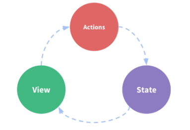

  * state는 앱을 작동하는 원본 소스(data): **state == data**
  * view는 state의 선언적 매핑: **view == templates(html화면)**
  * action은 view에서 사용자 입력에 대해 반응적으로 state를 바꾸는 방법(methods): **action == methods**

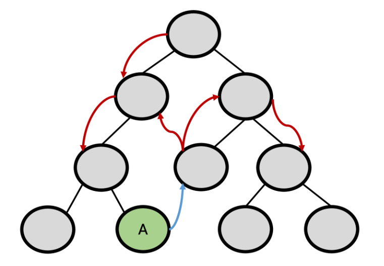

* 각 컴포넌트는 독립적으로 데이터를 관리
* 데이터는 단반향 흐름으로, 부모-> 자식 간의 전달만 가능하며 반대의 경우 이벤트를 트리거
* 장점
  * 데이터의 흐름을 직관적으로 파악 가능
* 단점
  * 컴포넌트 중첩이 깊어지는 경우 동위 관계의 컴포넌트로의 데이터 전달이 불편해짐
  * 공통의 상태를 공유하는 여러 컴포넌트가 있는 경우, 데이터 전달 구조가 매우 복잡해짐
    * 지나치게 중첩된 컴포넌트를 통과하는 prop이 그 예시

### 5. Vuex management pattern

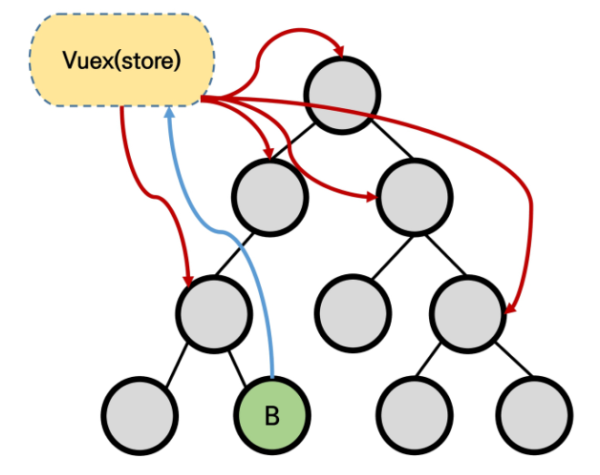

* 중앙 저장소(store)에 state를 모아놓고 관리
* 규모가 큰 (컴포넌트 중첩이 깊은) 프로젝트에서 매우 효율적
* 각 컴포넌트에서는 중앙 집중 저장소의 state만 신경 쓰면 됨
  * 동일한 state를 공유하는 다른 컴포넌트들도 동기화 됨


### 6. 단방향 흐름 vs Vuex

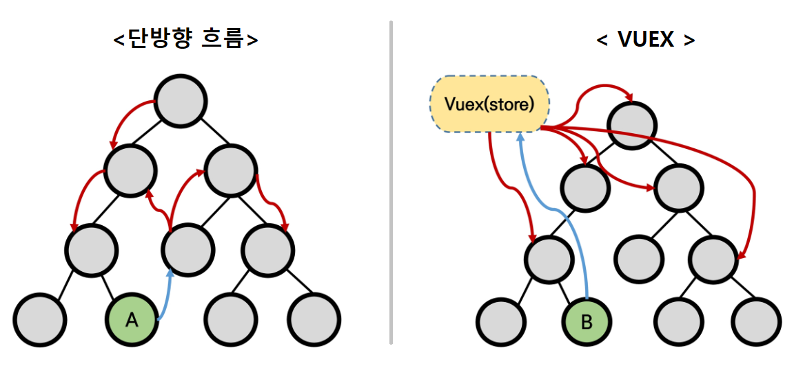

#### 1) 단방향 흐름에 의존한 state(상태) 관리

* 부모 자식 간의 컴포넌트 관계가 단순하거나 depth가 깊지 않은 경우에는 문제 없음
  * 몇 단계만 거치면 데이터를 쉽게 이동 시킬 수 있으며, 훨씬 직관적으로 데이터 흐름을 파악할 수 있음
* 하지만 규모가 커졌을 경우의 상태 관리가 어려워짐
  * 상태를 공유하는 컴포넌트의 상태 동기화 관리가 어려움
  * 상태를 전달할 때 상 -> 하로만 가능
* A 컴포넌트의 상태를 공유하는 다른 컴포넌트에 pass props & emit event를 통해 동기화해야 함

#### 2) Vuex를 활용한 state(상태) 관리

* 상태의 변화에 따른 여러 흐름을 모두 관리해야 하는 불편함을 해소할 필요가 있음
  * 상태는 데이터를 주고 받는 컴포넌트 사이의 관계도 충분히 고려해야 하기 때문에 상태 흐름 관리가 매우 중요해짐
* 결국 이러한 상태를 올바르게 관리하는 저장소의 필요성을 느끼게 됨
  * 상태를 한 곳(store)에 모두 모아 놓고 관리하자
  * 상태의 변화는 모든 컴포넌트에서 공유
  * 상태의 변화는 오로지 Vuex가 관리하여 해당 상태를 공유하고 있는 모든 컴포넌트는 변화에 '반응'
* A 컴포넌트와 같은 상태를 공유하는 다른 컴포넌트는 신경쓰지 않고, 오로지 상태의 변화를 Vuex에 알림


## :two: Vuex Core Concepts

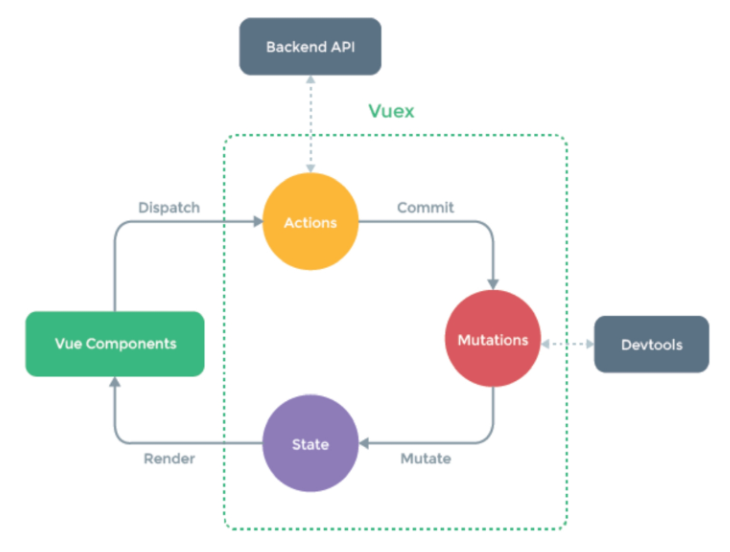

### 1. State

* 중앙에서 관리하는 모든 상태 정보, 즉 **Data**!
  * Vuex는 single state tree를 사용
  * 즉, 이 단일 객체는 모든 어플리케이션상태를 포함하는 **원본 소스(single source of truth)**의 역할을 함
  * 이는 각 애플리케이션마다 하나의 저장소만 갖게 된다는 것을 의미함
* 여러 컴포넌트 내부에 있는 특정 state를 중앙에서 관리하게 됨
  * 이전의 방식은 state를 찾기 위해 각 컴포넌트를 직접 확인해야 했음
  * Vuex를 활용하는 방식은 Vuex Store에서 각 컴포넌트에서 사용하는 state를 한 눈에 파악 가능
* State가 변화하면 해당 state를 공유하는 여러 컴포넌트의 DOM은 (알아서) 렌더링
* 각 컴포넌트는 이제 Vuex Store에서 state정보를 가져와 사용


### 2. Mutations

* 실제로 **state**를 **변경**하는 유일한 방법
* mutation의 handler(핸들러 함수)는 반드시 동기적이어야 함
  * 비동기적 로직(ex. 콜백함수)은 state가 변화하는 시점이 의도한 것과 달라질 수 있으며, 콜백이 실제로 호출될 시기를 알 수 있는 방법이 없음(추적할 수 없음)
* 첫번째 인자로 항상 **state**를 받음
* Actions에서 **`commit()`** 메서드에 의해 호출됨


### 3. Actions

* Mutations와 유사하지만 다음과 같은 차이점이 있음
  * state를 변경하는 대신, mutations를 `commit()` 메서드로 호출해서 실행
  * mutations와 달리 비동기 작업이 포함될 수 있음 (Backend API와 통신하여, Data Fetching등의 작업 수행)
* **context 객체 인자를 받음**
  * context 객체를 통해 store/index.js 파일 내에 있는 모든 요소의 속성 접근 & 메서드 호출이 가능
  * 단, (가능하긴 하지만) state를 직접 변경하지 않음
* 컴포넌트에서 **`dispatch()`** 메서드에 의해 호출됨
* Actions를 통해 state를 조작할 수 있지만, state는 오로지 Mutations를 통해서만 조작해야 함
  * **명확한 역할 분담**을 통해 서비스 규모가 커져도 state를 올바르게 관리하기 위함


### 4. Getters

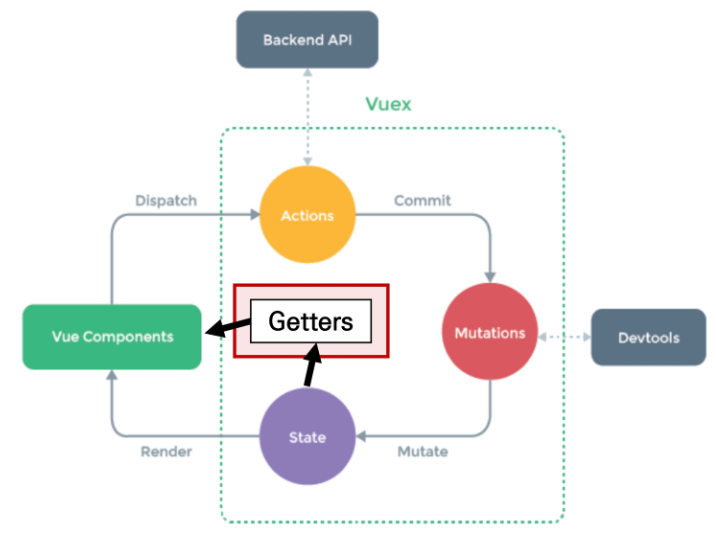

* state를 변경하지 않고 활용하여 계산을 수행(computed 속성과 유사)
  * compute를 사용하는 것처럼 getters는 저장소의 상태(state)를 기준으로 계산
  * 예를 들어, state에 todoList라는 해야 할 일의 목록의 경우, 완료된 todo 목록만을 필터링해서 출력해야 하는 경우가 있음
* computed 속성과 마찬가지로, getters의 결과는 state의 종속성에 따라 캐시(cached)되고, 종속성이 변경된 경우에만 다시 재계산 됨
* getters 자체가 state를 변경하지는 않음
  * state를 특정한 조건에 따라 구분(계산)만 함
  * 즉, 계산된 값을 가져옴


### 5. 정리

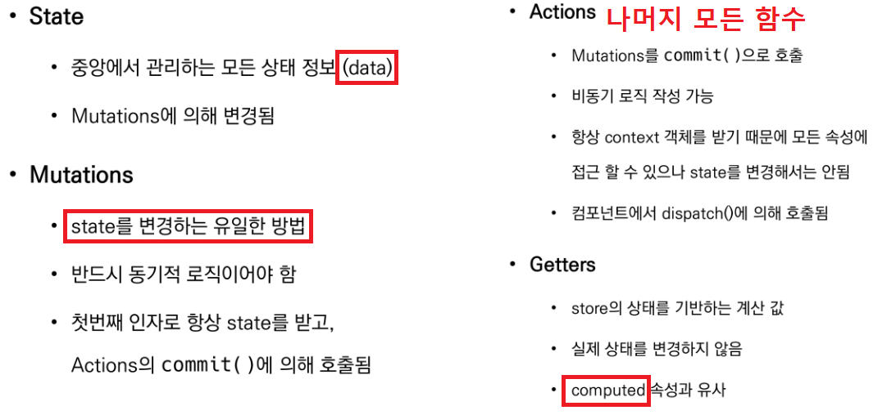


## :three: Todo app with Vuex

### 1. Vuex Todo App

* 완성 화면

  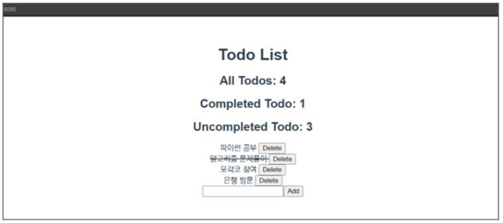

* 컴포넌트 구성

  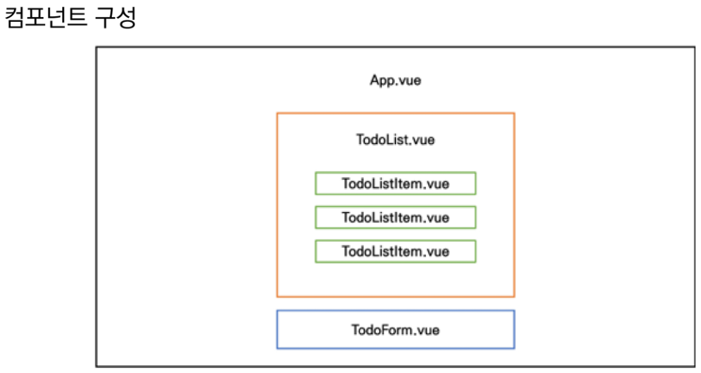


### 2. Set project & components

#### 1) 기본 설정

* 기본 구조 세팅

  ```bash
  # Create Project
  $ vue create todo-vuex-app
  $ cd todo-vuex-app
  # Add Vuex plugin in Vue CLI
  $ vue add vuex
  
  # Yes 선택
  WARN There are uncommitted changes in the current repository, it's recommented to commit or stash them first.? Still proceed? Yes
  ```

* 필요없는 vue파일 정리해주기

  * `HelloWorld.vue` 삭제

* `App.vue` 정리

  * <style> 만 빼고 다 기본으로 정리

  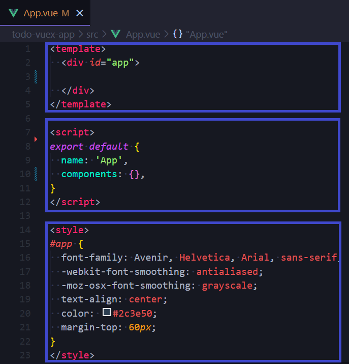

  


#### 2) Vuex로 인한 변화

* store/ 디렉토리 생성

* `index.js` 생성

  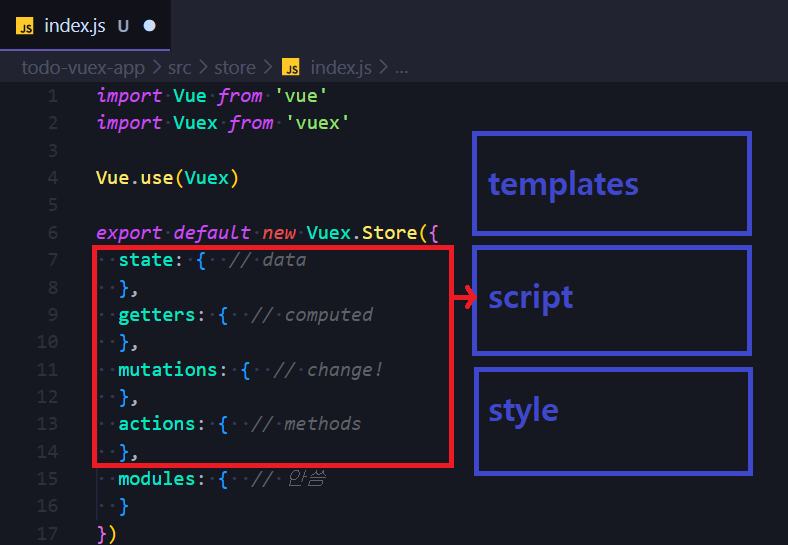

  

#### 3) 컴포넌트 작성

* `TodoListItem.vue` 작성

  * 개별 todo 컴포넌트
  * `TodoList` 컴포넌트의 자식 컴포넌트

  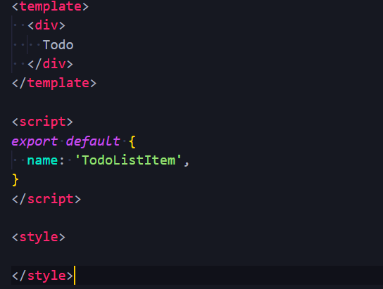

* `TodoList.vue` 작성

  * todo 목록 컴포넌트
  * `TodoListItem`컴포넌트의 부모 컴포넌트
    * *[참고] @ 는 src 폴더를 의미하는 것으로, 절대경로 지정시 사용한다.* 

  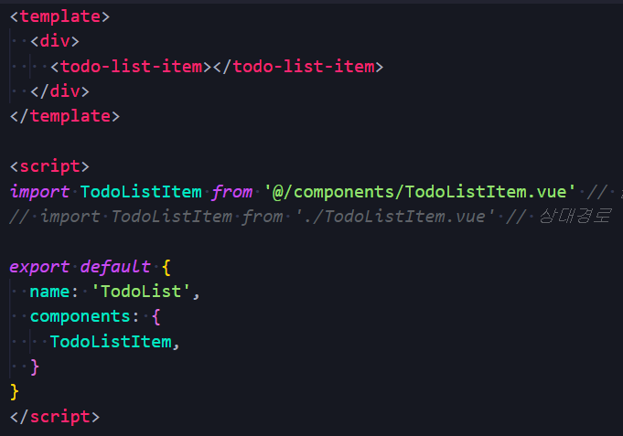

* `TodoForm.vue` 작성

  * todo 데이터를 입력 받는 컴포넌트

  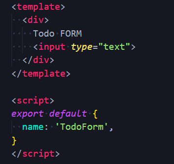

* `App.vue`작성

  * 최상위 컴포넌트
  * `TodoList`, `TodoForm` 컴포넌트의 부모 컴포넌트

  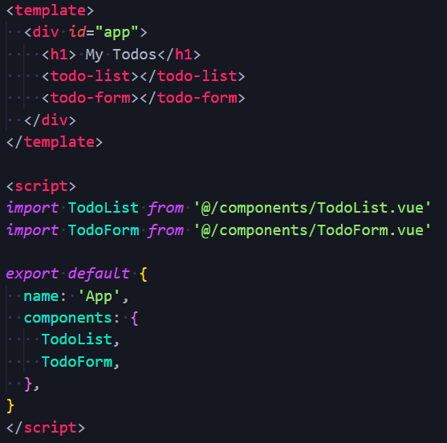


### 3. Create Todo

#### 1) State 작성

* state에 2개의 todo 작성

  * Vuex 복습하기에 `+1` 넣어준 것은 두 개의 todo가 동시에 작성되었다고 에러가 뜨기 때문

  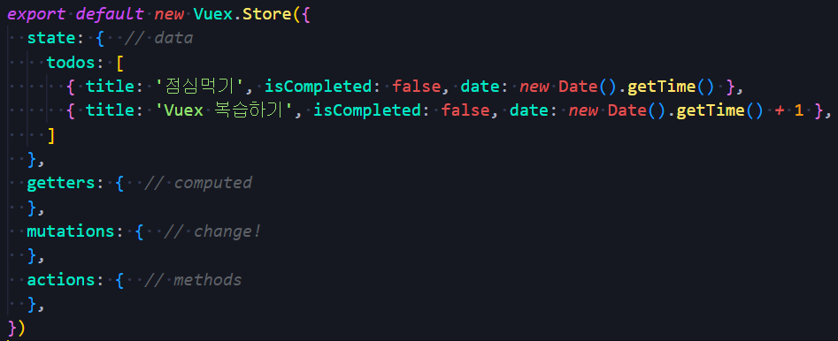

* [주의] Vuex를 사용한다고 해서 Vuex Store에 모든 상태를 넣어야 하는건 아님


#### 2) TodoList 데이터 가져오기

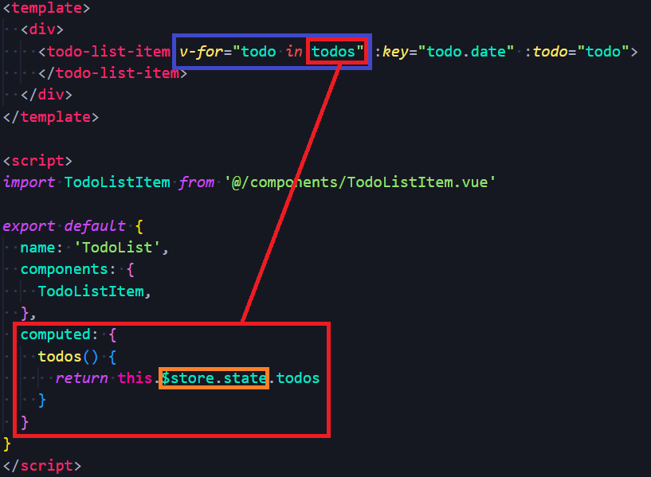

* 컴포넌트에서 **Vuex Store**의 state에 접근 (`index.js`)

  * `$store.state`

*  Computed로 변경

  * 현재 state의 todo는 값이 변화하는 것이 아님

  * store에 저장된 todo 목록을 가져오는 것이기 때문에, 매번 새로 호출하는 것은 비효율적

  * 대신 todo가 추가되는 등의 변경사항이 있을때만 새로 계산한 값을 반환하는 방향으로 변경(computed)

  * `this`(Vue instance)로 접근


#### 3) Pass Props (TodoList -> Todo)

* todos를 state에서 가져온다고 해도 todo를 TodoListItem에 내려보낼때는 중앙에서 바로 보낼 수 없음

  * 웬만하면 다 state에서 가져올 수 있지만,

  * **`v-for`** 사용시에는 따로 props 내려줘야 한다는 것 기억! ( 몇 안되는 케이스 중 하나 )

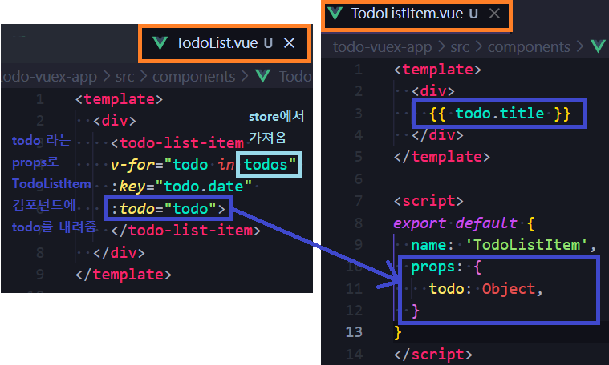

#### 5) Actions & Mutations

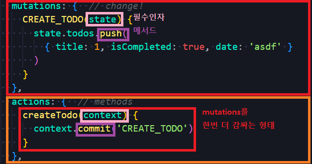

* `TodoForm.vue`에서 `createTodo()` 메서드를 통해 `createTodo` Action 함수 호출(`dispatch()`)

  * todoForm 인스턴스가 생성되자마자, dispatch() 통해서 `createTodo` 함수 실행

  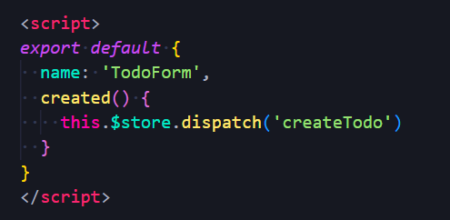

  * 사용자가 어떤 행위를 했을 때, 지금의 경우 input에 enter를 쳤을 때 createTodo 함수를 호출하고 싶다면

    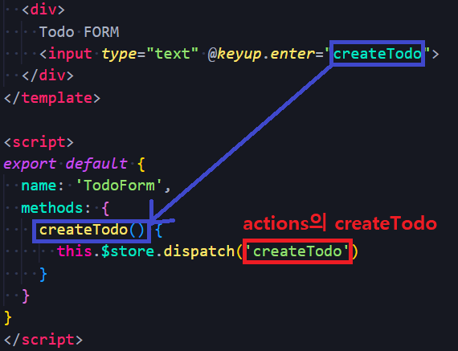

  * 사용자가 입력한 값으로 push(즉,  CREATE_TODO)를 하고 싶다면

    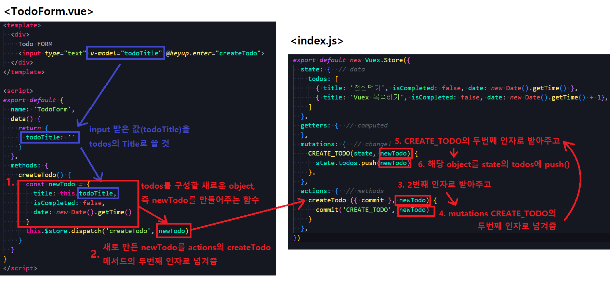

    * 함수 실행 후에도 input안에 남아 있는 값이 보기 싫다면, 함수 실행 이후 다시 비워주면 됨 

      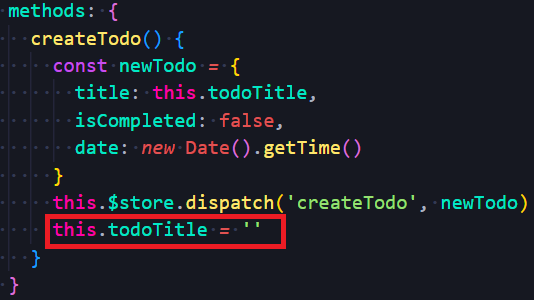

    * 혹시 앞뒤로 쓸모없는 빈칸이 존재한다면, 날려주기

      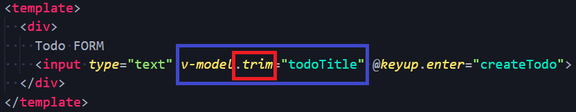

* **Actions**

  * `createTodo`함수

  * `CREATE_TODO mutation`함수 호출

  * Actions의 **context** 객체

    * vue store의 전반적인 맥락 속성을 모두 포함
    * context로 state 내의 모든 것에 접근 가능함. 따라서 context 내 commit() 메서드를 이용해 CREATE_TODO 라는 mutations에 접근할 수 있는 것
    * action은 context를 인자로 받음
    * 그래서 context.commit을 호출하여 mutation을 호출하거나, context.state와 context.getters를 통해 state와 getterse에 접근가능
      * dispatch()로 다른 actions도 호출 가능
    * 할 수 있지만, **actions에서 state를 조작하지 말 것**! :star:

  * actions 쓰는 법 3가지( 1 -> 2 -> 3 순으로 줄여짐. 다 같은 뜻)

    ```javascript
    // 1
    actions: {
        createTodo(context) {
            const commit = context.commit
            commit('CREATE_TODO')
        }
    }
    ```

    ```javascript
    // 2 
    actions: {
        createTodo(context) {
            const { commit } = context
            commit('CREATE_TODO')
        }
    }
    ```

    ```javascript
    // 3
    actions: {
        createTodo({commit}){
            commit('CREATE_TODO')
        }
    }
    ```

* **Mutations**

  * `CREATE_TODO`함수 ( 다 대문자인 이유: Mutation 이 중요하므로 강조하기 위함 )
    * 모든 mutation은 첫번째 인자로 state을 받는 콜백함수!

  * State의 todo 데이터 조작

    * 새로운 todo를 생성하는 어떠한 함수를 만들 것

    * 즉, `{ title: 1, isCompleted: true, date: 'asdf' }`라는 todo를 todos에 push 할 것

  * Mutations handler name

    * Mutation 함수(=핸들러 함수)의 이름은 상수로 작성하는 것을 권장
      * linter와 같은 tool에서 디버깅하기에 유용하며, 전체 애플리케이션에서 어떤 것이 mutation 인지 한눈에 파악가능


#### 6) Vuex 상태 관리 흐름

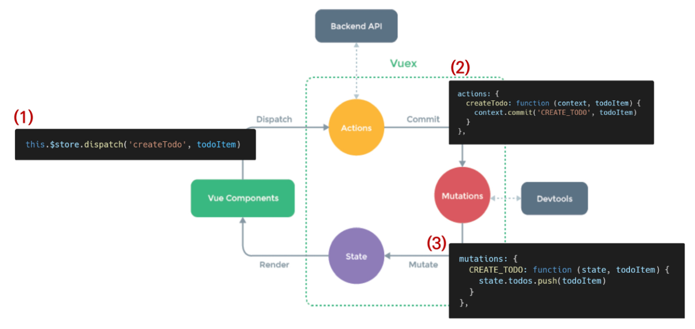

(1) component에서 actions을 호출

(2) createTodo라는 action이 실행 > 해당 action 내의 mutation 실행

(3) mutations의 CREATE_TODO 실행 > state에 새로운 내용 추가


#### 7) JavaScript Destructing assignment

* 배열의 값이나 객체의 속성을 고유한 변수로 압축 해재(unpack)할 수 있는 JavaScript 표현식

  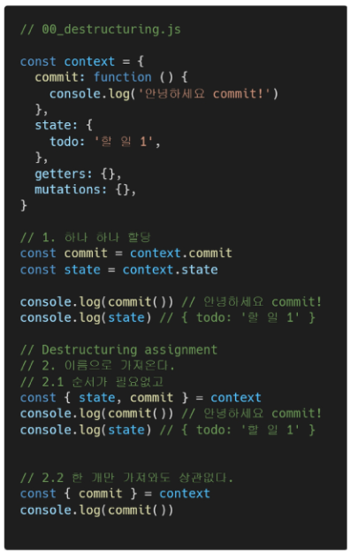

* actions변경

  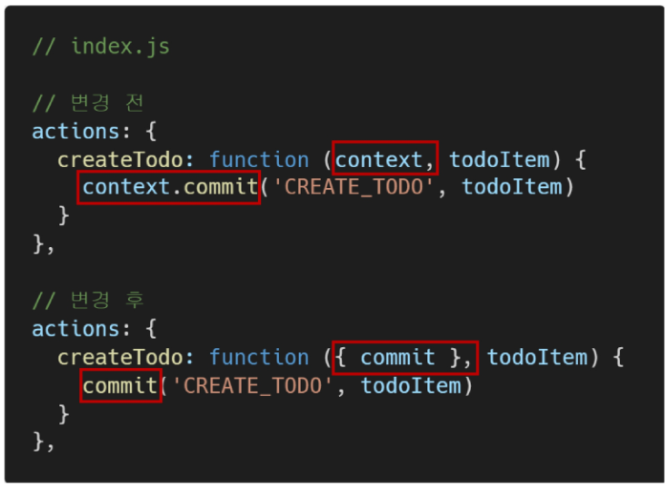


### 4. Delete Todo

#### 1) `TodoListItem` 컴포넌트

* `deleteTodo` action 함수 호출

  


#### 2) Actions & Mutations

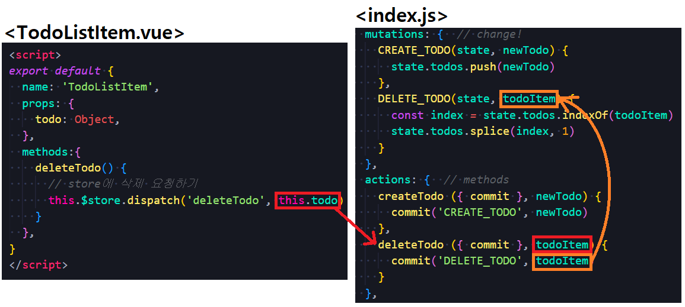

* splice

  * `arr.splice(0, 1)`: 0번째 인덱스의 값을 하나만 지워

  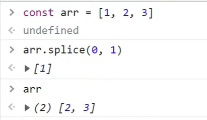

  * 내가 지정한 (클릭한) todo의 인덱스를 가져와서, 그 인덱스의 값을 하나만 지워

    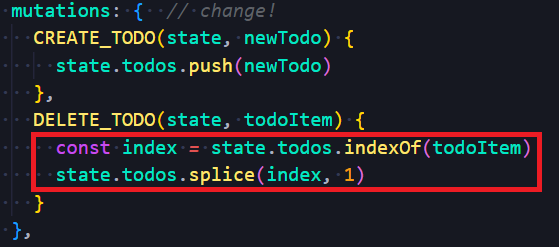

### 5. Update Todo

#### 1) `TodoListItem` 컴포넌트

* `updateTodoStatus` action 함수 호출

#### 2)  Actions & Mutations

#### 3) JavaScript Spread Syntax

#### 4)  취소선 긋기


//


## :four: Getters

### 1. 

### 2.

### 3.


## :five: Component Binding Helper


